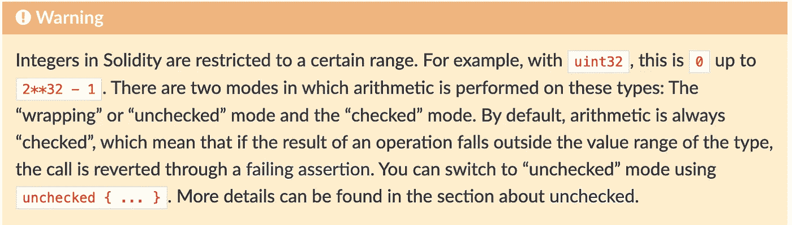

# ❗️Capture 以太❗️—代币销售[难度=中低]

> 原文：<https://infosecwriteups.com/%EF%B8%8Fcapture-the-ether-%EF%B8%8F-token-sale-difficulty-low-medium-adc2928bbcc9?source=collection_archive---------5----------------------->

[注意] —如果你直接阅读这篇博客，而没有实际参与这个挑战，它对你没有帮助。我请求你尽最大努力，如果你面临任何困难，就回来。

> **简介**:

你好，Hackers🥰，欢迎回到我们的 Web3 安全世界。今天我们将讨论“数学部分”的第一个挑战——代币销售。在我看来，这个挑战属于中低级别。但是，可能因人而异。


> **在尝试这个挑战之前，你需要知道些什么？**

我的第一个也是最重要的建议是浏览“智能合同程序员”的视频，他详细解释了“溢出和下溢”漏洞。

> **现在让我们开始我们的挑战:**

问题说，“这个代币合约允许你以每以太 1 代币的平均汇率买卖代币。

合同开始时余额为 1 以太。看看你能不能带走一些。"

简单来说，**这是一份交换合同，我们可以按照某种特定的比例(1:1)** 买卖代币。

*   比如**如果我想买 10 个代币，我需要向交易所缴纳 10 个 ETH。同样的，如果我持有 100 枚代币，卖掉后，我的账户里会有 100 枚代币。**
*   最初合同持有 1 ETH，我们的目标是使合同余额少于 1 ETH。



**实利^0.8.0 文件**

“如果你清楚地观察第一行，它说，对于 uint32，它能容纳的最大值是 2-1。”

*   如果我们把这个值增加 1 呢？很简单，它归零。

> **合同评审:**

```
pragma solidity ^0.4.21;

contract TokenSaleChallenge {
    mapping(address => uint256) public balanceOf;
    uint256 constant PRICE_PER_TOKEN = 1 ether;

    function TokenSaleChallenge(address _player) public payable {
        require(msg.value == 1 ether);
    }

    function isComplete() public view returns (bool) {
        return address(this).balance < 1 ether;
    }

    function buy(uint256 numTokens) public payable {
        require(msg.value == numTokens * PRICE_PER_TOKEN);

        balanceOf[msg.sender] += numTokens;
    }

    function sell(uint256 numTokens) public {
        require(balanceOf[msg.sender] >= numTokens);

        balanceOf[msg.sender] -= numTokens;
        msg.sender.transfer(numTokens * PRICE_PER_TOKEN);
    }
}
```

*   首先，有 3 个函数(不包括构造函数)，即“isComplete()、buy()、sell()”。如果查看状态变量，会发现有一个映射，其中存储了每个地址持有的令牌数。和设置为 1 的常量变量。
*   如果你擅长稳健，你也可以看到“没有可重入性漏洞的痕迹”。**你应该记住“0.8.0 之前的所有版本都容易出现上溢/下溢问题，除非它们使用数学库。”**
*   在 buy()函数中，它的输入是“uint256 ”,这意味着它能容纳的最大值是(2 ⁵⁶ — 1)。如你所知，合同是 1:1 的比例，我们不能送那么多乙醚。

[注意] — EVM(以太坊虚拟机)将任何值转换为其低级值，这意味着“1 eth 转换为 10 ⁸的低级值”

*   现在让我们回到我们的声明。然而，我们不能发送 uint256 值，但是如果我们发送这个呢？**【解释到底】**

**:2⁵⁶—1/10⁸**:t0】

在 buy()函数上传递这个值时，它再次乘以 10 ⁸，这导致溢出问题。但是在这里，我们需要在 wei 中发送确切的 eth 数量，以使这个操作成功，也就是`415992086870360064 wei(0.4 eth)`

> **利用时间:**

*   调用 buy()函数，取值为`**115792089237316195423570985008687907853269984665640564039459**` ，发送 msg.value 为`415992086870360064 wei`。
*   现在，如果您检查您的余额，结果是最大的数字(uint256 值)。
*   要完成本部分，卖出 1 个 ETH，最终使合约持有量少于 1 个 ETH。

> **有什么具体原因吗？**

你可能会问为什么我们要传递精确的值。你是怎么得到这个特定值的？为什么即使你给出一个小于 1 的数也不起作用？—这是答案

> "**一个 *uint256* 变量的最大值为 2 * * 256–1。所以为了让 *msg.value* 溢出，我们需要确保 *numTokens* 乘以 10**18 大于 2 * * 256–1。为了得到该值，我们将 2 * * 256–1 除以 10**18，得到:11579208923731619542357098500868790785326998465640564039458(舍入值)**
> 
> “我们需要计算出 *msg.value* 溢出的量，这样我们就可以在呼叫中发送正确的乙醚量。要计算溢出的数量，从我们刚刚计算出的巨大数字中减去 2 * * 256–1。这样我们就剩下 415992086870360064 魏，这是我们调用 *buy()* 时需要发送的魏数。

> 我什么时候能再见到你？

嗯，最有可能的是我会努力保持一致，但我不能保证，因为我的董事会考试真的很近。我会等待你的爱和支持，让我们一起学习和成长:)

***【随时联系我】~***

*   insta gram—[gow tham _ pon nana](https://instagram.com/Gowtham_Ponnana)
*   Twitter—[gow tham _ pon nana](https://twitter.com/Gowtham_Ponnana)
*   LinkedIn—[gow tham-Ponnana](https://www.linkedin.com/in/gowtham-ponnana/)
*   邮件—gowtham.official45@gmail.com


## 来自 Infosec 的报道:Infosec 每天都有很多内容，很难跟上。[加入我们的每周简讯](https://weekly.infosecwriteups.com/)以 5 篇文章、4 条线索、3 个视频、2 个 GitHub Repos 和工具以及 1 个工作提醒的形式免费获取所有最新的 Infosec 趋势！