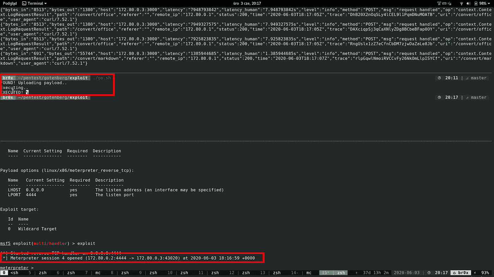

# 零日漏洞打破数百万美元的系统

> 原文：<https://infosecwriteups.com/0-day-bug-breaks-multi-million-dollar-system-38c9e31b27e9?source=collection_archive---------1----------------------->



前几天，我们从一个全国性组织那里得到了一份黑盒测试的订单。该组织在全国范围内提供数十甚至数百种服务，其用户数以百万计。老实说，从影响的角度来看，这是迄今为止我们做过的最大的黑客攻击之一。但这不是我决定发表这篇文章的主要原因..

真正的原因是黑客本身，在我看来，**真的很有趣**！这是你可以引以为豪的黑客类型。它花了令人难以置信的时间和许多不同的方法才获得成功。由于我的固执，我没有太快放弃，最后，我发现了四个新的漏洞，它们共同导致了组织内部的未授权、远程和任意代码执行**。**

说到细节。简而言之，目标是一组专门构建的 web 应用程序，用于填充、处理和发送许多不同类型的表单。由于测试是黑盒测试，我们没有得到任何关于系统的信息，除了最终用户能看到的，什么也没有。这很重要，因为在专门构建的后端中找到并充分利用漏洞显然不太容易。

与 pentests 一样，我们从列出所有服务器和端点开始，查看流程流和前端代码。在黑盒测试中，这是一个非常重要的阶段，因为您可能会了解到系统正在使用的一些**库或组件**，它们是典型的现成产品。这可以告诉您有关架构和技术的更多信息，还可以让您识别系统是否包含众所周知的易受攻击的组件版本。不幸的是，通过查看收集的列表，我们没有发现任何易受攻击的产品版本，但是有一个组件——尤其是它的使用方式——在其他组件中非常突出。

这个可疑的组件从浏览器接收 html 文件**(用户输入),并将 html 文件转换成 PDF。从 pentester 的角度来看，这种服务似乎非常有趣，因为(1)有一些文件上传；(2)一些处理(解析器等。)并且我们也(3)取回一些结果。所有的步骤都可能是脆弱的，事实上，情况就是如此。**

还有一个信息——组件通过它在 url 路径中的名字被公开**。路径以: *https://……结尾../API/****gotenberg***。我本人并不知道这个组件，但它的名字非常容易辨认，以至于快速搜索“gotenberg pdf”会出现一个 github 页面，其中有一个开源的 pdf 转换组件— [Gotenberg，](https://github.com/thecodingmachine/gotenberg/)作者称之为:**

> Docker 支持的无状态 API，用于将 HTML、Markdown 和 Office 文档转换为 PDF。

**附注**:本文中描述的漏洞(CVE-2020–13449、CVE-2020–13450、CVE-2020–13451 和 CVE-2020–1345)已报告给作者，并很快被修复。我要感谢朱利安·纽哈特的快速反应和修复。作者同意并声明，Gotenberg 在这个主要版本(6)中应该只由不对外公开的可信应用程序在内部使用。

事实上，整个系统都是使用微服务架构构建的，其中有一个 Gotenberg 组件完全暴露在外部世界中。

事实上，该系统仅使用 HTML 转换 API，但其公开的方式允许所有未经认证的互联网用户使用**整体 API** — HTML、markdown 和 office，包括 */url* /端点，该端点允许将组件指向互联网上的外部 web url 以生成 PDF 文件。这本身就是一个漏洞，因为允许匿名代理 web 流量，甚至使用它来执行使用我们的客户端基础设施的 DoS 攻击。

因为该组件是开源的，可以在 Docker hub 中获得，所以很容易对其进行非常基本的攻击测试。因此，在使用以下命令启动 Docker 容器后(我特意在这里启动易受攻击的版本 6.2.0，因为这个问题已经在 6.3.0 中得到解决):

```
$ docker run --rm -p 3000:3000 --name gotenberg thecodingmachine/gotenberg:6.2.0
```

我们可以玩玩，试着找一些有趣的攻击。

前两个漏洞**是**微不足道的**，并且很快被发现。但是开发它们的方式更具挑战性。**

# 第一个漏洞—上传任意文件

如果组件接受文件(上传),那么 pentester 首先进行的测试之一就是尝试路径遍历攻击。因此查看[文档](https://thecodingmachine.github.io/gotenberg/)我们可以这样调用 */markdown/* 端点(注意**加粗的**部分):

```
$ curl 'http://$URL_GOTENBERG/convert/markdown' --form files=@index.html --form "files=@test;filename=**../../../tmp/test**" -o res.pdf --header 'Content-Type: multipart/form-data'
```

令人惊讶的是——因为在大多数 web 框架中，这种攻击不会起作用，因为文件名参数输入在框架级别被转义——Gotenberg**实际上**易受攻击,因为它是用 Go lang 编写的，并且使用 net/http 包来处理 http 请求，它在将文件名传递给应用程序之前不会对文件名进行转义，后者也不会对其进行转义。因此，上面的 curl 将文件 *test* 写入 Docker 容器的路径 */tmp/test* 中。这可以通过运行以下命令来验证:

```
$ docker exec -it gotenberg bash -c "ls -la /tmp/"
total 16
drwxrwxrwt 1 root      root      4096 Dec 29 19:10 .
drwxr-xr-x 1 root      root      4096 Dec 29 19:10 ..
drwxr-xr-x 2 root      root      4096 May  1  2020 hsperfdata_root
**-rw------- 1 gotenberg gotenberg   60 Dec 29 19:10 test**
```

# 第二个漏洞—任意文件下载

更棘手的是第二个漏洞。根据 Gotenberg 的文档，Gotenberg 允许转换 markdown 文件——但是转换的方式是通过一个呈现模板的 HTML 文件。模板可以调用一个助手函数 *toHTML* ，该函数实际上读取文件系统中的任何文件，并将 markdown 呈现为 HTML。

正如您可能猜到的那样，这可能导致容器内的任意文件泄漏。就其本身而言，这并不是一个非常严重的漏洞，因为没有多少东西可以利用它，但是正如您稍后将看到的，这个漏洞可以用来造成更多的破坏！

因此，为了了解它是如何工作的，让我们创建一个 HTML(让我们命名为 index.html)文件:

```
<!doctype html>
<html lang="en">
  <head>
    <meta charset="utf-8">
    <title>My PDF</title>
  </head>
  <body>
    <pre style="white-space: pre-wrap;">
      Path:
      {{ .DirPath }}  
      PASSWD:
      {{ toHTML .DirPath "../../../../etc/passwd" }}
      IP:
      {{ toHTML .DirPath "../../../../proc/net/fib_trie" }}
      TCP:
      {{ toHTML .DirPath "../../../../proc/net/tcp" }}
      env:
      {{ toHTML .DirPath "../../../../proc/self/environ" }}
    </pre>
  </body>
</html>
```

这样称呼戈登堡:

```
$ curl '[http://$URL_GOTENBERG/convert/markdown'](http://$URL_GOTENBERG/convert/markdown') --form files=[@index](http://twitter.com/index).html -o result.pdf --header 'Content-Type: multipart/form-data'
```

在 result.pdf 中，您会得到一个漂亮的 pdf 文件，其中包含一些有用的信息，如容器的 passwd 文件、IP 地址、TCP 连接和环境变量。这可能很有趣，但不是很关键(现在还不是！).

# 有趣的部分—代码执行

好吧，我们有上传和下载漏洞，但我们需要更多..首先，让我们谈一点关于 Gotenberg 内部。它是一个 Go lang http 服务器，运行在 Docker 容器中，使用不同的现成组件将不同的格式转换为 PDF。

对于转换 HTML，markdown 和外部网址，它使用谷歌浏览器运行在无头模式。这个引擎是由 Gotenberg 进程使用 [Chrome DevTools 协议](https://chromedevtools.github.io/devtools-protocol/)控制的(与在一些自动化测试框架中所做的一样)，该进程将无头 Chrome 浏览器重定向到适当的文件/URL，并最终将呈现的 HTML 打印为 PDF。

**重要提示:**由于有可能将内置 Chrome 重定向到任何 URL，攻击者从一开始就可以轻微访问容器的本地主机(以及 DevTools 侦听的端口 9222)以及内部网络中的其他机器(docker 容器或客户端系统的内部 IP)。这证明了 Gotenberg 是一个内部接口，应该隐藏在系统的内部，如果它的 API 应该向外界公开，它应该被剥离成非常有限的功能。

对于 office 文档，它使用的是 [unoconv Linux 包](https://github.com/unoconv/unoconv)，它在下面运行 libreoffice，呈现 office 文档，并像以前一样将其打印为 PDF。

## 尝试# 1—不成功

有了文件上传漏洞，我首先想到的是容器中是否有一个文件可以被覆盖，从而导致代码执行。

跳到容器中并在文件系统中查找可写文件后:

```
$ docker exec -it gotenberg find / -writable
/dev/core
/dev/stderr
/dev/stdout
/dev/stdin
..
/gotenberg/.bash_history
/gotenberg/tmp
/**tini**
```

我在根目录下看到一个可写的文件，名为/tini，仔细查看后发现它是一个可执行文件，它是 Docker 容器在开始时主要调用的文件(所谓的 *entrypoint —* 见[来源](https://github.com/thecodingmachine/gotenberg/blob/4e7f5401eca18970df840429563a569f5298c627/build/package/Dockerfile#L43-L47))。 [tini](https://github.com/krallin/tini/) 是一个微小的程序，可以在 Docker 容器中使用，通过处理信号、僵尸进程等来正确处理实际运行的进程。由于发生在 gotenberg 中，该文件可由用户“Gotenberg”写入。对于最终的代码执行人员来说，这似乎是一个可行的方法。

**想法**:我们可以利用文件上传漏洞覆盖 */tini* 可执行文件，下次启动容器时，它将运行我们的可执行文件。

即便如此，还有一个相当重要的问题:Gotenberg 作者建议以“临时运行”方式运行容器(注意上面的 *docker run* 命令中的 *- rm* 开关)。如果容器以这种方式启动，这意味着它将永远不会停止和重新启动，所以不幸的是，这种攻击的应用非常有限。

在尝试了上述想法后，Gotenberg 在上传文件时将其权限更改为 644，这使得 */tini* 可执行文件缺少+x 权限，因此即使容器停止并重新启动，它也不会运行，因为缺少执行权限。

不错的尝试，但运气不好..

## 尝试 2——不成功

在列出可写文件时，我发现有两个用户配置文件也可以被覆盖，而且看起来非常有趣，它们是:

```
/gotenberg/.local/share/applications
/gotenberg/.local/share/applications/mimeapps.list
```

还记得戈滕伯格运行谷歌 Chrome 吗？如果您正在使用 Linux，您可能知道上面的 applications 文件夹和 mimeapps.list 文件负责处理不同内容的默认应用程序。

**想法**:如果我们在 applications 文件夹中创建一个应用程序 x.desktop 文件来运行我们的有效负载，例如:

```
[Desktop Entry]
TryExec=bash
Exec=bash -c "echo asd>/tmp/hacked"
```

然后，我们使用 mimeapps.list 将该应用程序挂钩，以处理自定义 URL 方案:

```
..
x-scheme-handler/mailto=x.desktop
..
```

mimeapps.list 中的上面一行用 *mailto:* URL 方案注册了我们的 x.desktop 应用程序，因此每次浏览器调用 *mailto:* 链接时，它都会启动我们的 x.desktop 应用程序。

在我的非 headless chrome 上尝试这个想法效果很好，进入 mailto:test 链接实际上会执行适当的 x.desktop，它甚至可以通过远程 DevTools 协议调试工作。

不幸的是，这种攻击在 Gotenberg 运行时不起作用。看起来这可能是因为 chrome 在无头模式下初始化的方式，自定义 URI 方案(使用 Linux xdg)没有被正确调用。事实上，在我的本地机器上用 headless 参数访问 mailto: scheme 也不能调用正确的应用程序。

又一次，没有运气..

## 尝试 3——成功！

离放弃只有一步之遥，我决定再试最后一次。我开始关注拼图的最后一块——即 unoconv 和 LibreOffice。首先，我查看了 unoconv 被调用的方式，以及是否有任何注入代码的方式等等。不幸的是，我在那里找不到任何有用的东西。

然后我想到了以前的好宏。也许我们可以在文件中注入一个宏，然后神奇地让它运行起来。不幸的是，所有的快速尝试都失败了(不出所料)，因为 LibreOffice 不允许运行宏，除非它们是从一个可信的位置运行的，而这个位置当然不是。

但是等等..LibreOffice 将可信位置保存在哪里？它在用户主目录的某个地方吗？我快速检查了一下我的本地机器，确实可信的宏路径被添加到了 *~/中。config/libre office/4/user/registry modifications . xcu*文件作为类似于以下内容的行:

```
<item oor:path="/org.openoffice.Office.Common/Security/Scripting"><prop oor:name="SecureURL" oor:op="fuse"><value><it>**PATH**</it></value></prop></item>
```

嗯，在戈登堡的家里我没有看到。配置目录..但后来我提醒自己，在查看 Gotenberg 调用 unoconv 的参数时，我看到了一些关于用户目录的东西。

又看了一遍之后，我意识到 Gotenberg 使用一个新的临时用户目录(在 */tmp/* 路径中)运行每个转换；用 *-用户目录*参数)。真有趣..

更重要的是，在运行 Gotenberg 一段时间并尝试不同的 office 转换后，我意识到这些临时文件夹的名字都很短，并且在请求后它们**不会被删除** **！**

查看临时文件夹名称，所有名称都在标准 TCP 临时端口范围(~30000 到~65000)之间，这似乎很容易预测。

事实上，查看代码，我们看到 Gotenberg 调用 freeport golang 包，这是进一步调用 net 包，它创建一个新的套接字并使用 [bind](https://man7.org/linux/man-pages/man2/bind.2.html) syscall 绑定它，而没有指定端口号——根据 [Linux 文档](https://man7.org/linux/man-pages/man7/ip.7.html)的说法，这导致 Linux 内核从在*/proc/sys/net/IP v4/IP _ local _ port _ range*中定义的短暂端口范围中选择一个随机端口。这是内核在创建新套接字时随机选择的临时端口。分析[内核代码](https://github.com/torvalds/linux/blob/master/net/ipv4/inet_connection_sock.c#L182)我们可以看到函数 *inet_csk_find_open_port* 负责从短暂范围中选择一个端口。默认的 Linux 内核范围是 32768 — 60999，syscall 绑定只接受奇数。因此，我们只有大约 14115 个可能的端口号。

所以，我们知道文件夹的名字是可以预测的，最重要的部分不会在最后被删除。

**想法**:想法是在不运行宏的情况下首先创建一个配置文件(我们不知道配置文件编号是多少，所以我们必须“泛洪”并检查，直到我们找到一个具有我们想要的编号的配置文件..这可能需要一些时间)。然后上传一个新的 LibreOffice 配置文件，该文件以某种方式运行宏，同时加载一个带有该配置文件的文件。最后，请求再次“淹没”服务器，直到它再次重用同一个端口号，导致准备好的概要文件被重用。

我发现我们可以很容易地设置全局宏，在 LibreOffice 打开文档后运行，而不是使用可信路径。这是一个更好的方法，因为它不依赖于上传的文件。例如，我们可以让普通用户为我们“淹没”服务器。

的确这个想法**奏效了**！该漏洞执行相当长的时间之前，但它相当稳定。

# 下一步是什么？

最后，有了 code exec，我们可以开始将攻击转移到客户的内部基础设施，这使我们能够连接到内部重要服务，如 orchestrators 和其他关键管理服务(如配置服务器)以及数据库引擎和其他微服务。

在内部，客户端**在服务之间没有防火墙**,此外，监控**在大约两周的时间里没有注意到我们的反向抄表会话**,直到我们关闭了它！

这使我们得出一个结论:

1.  不要向外界暴露太多的端点。
2.  根据需求分离服务(例如使用防火墙)。
3.  仅允许批准的入站和出站连接到您的基础架构。
4.  监控流量中一些不寻常的长期连接。

**跑分视频**:

**原漏洞报告及披露**:
https://sploit.tech/2020/12/29/Gotenberg.html

**漏洞利用代码**:
[https://github.com/br0xpl/gotenberg_hack](https://github.com/br0xpl/gotenberg_hack)