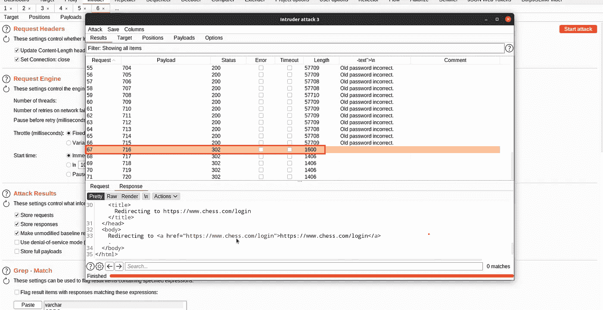
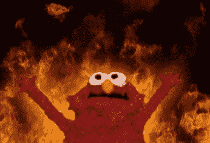

# 接管 Chess.com 账户的 10 分钟黄金时间

> 原文：<https://infosecwriteups.com/10-golden-minutes-for-taking-over-a-chess-com-account-56e73f7c5f0d?source=collection_archive---------1----------------------->

Chess.com 标志

大家好，这是第二篇关于在 Chess.com 发现漏洞的文章。你可以在这里找到第一个[。【Chess.com】是最著名的玩&学棋网站。](/finding-bugs-on-chess-com-739a71fbdb31)

你可以通过两个参数登录网站，第一个是你的电子邮件，第二个是你的用户名。这个故事让我们学会检查所有特征，并在每个特征上寻找异常。
我发现，如果您更改密码，只会更改一个参数(电子邮件),更改密码后，您将无法使用您的用户名和新密码登录。事实上，这些更改只适用于电子邮件和用户名 10 分钟后的新密码更改。所以如果你的密码泄露，你改了密码，有你密码的人可以用用户名和旧密码改了密码后登录。更改密码的更新查询过程如下图所示:

为了更好地理解，这是示意性的和想象的。

将这个错误发送到 Chess.com 后，他们说这种延迟是为了复制，是暂时的。明天检查了一下，bug 是存在的！
最后，根据 [CVSS](https://www.first.org/cvss/calculator/3.1#CVSS:3.1/AV:N/AC:L/PR:L/UI:R/S:U/C:L/I:N/A:N) ，该报告得分为 3.5

在更多的调查中，我发现 10 分钟后会话不会过期！检查更改密码的形式，并没有任何利率限制！嘣！！！

通过使用打嗝入侵者运行暴力攻击，并找到了新的密码。我把错误升级为完全接管账户。

打嗝闯入者

基于 [CVSS](https://www.first.org/cvss/calculator/3.1#CVSS:3.1/AV:N/AC:H/PR:H/UI:N/S:U/C:H/I:N/A:N) 报告得分为 4.4，他们将奖金提高到 400 美元。

你可以通过以下链接在 Twitter 上找到我:

[https://twitter.com/seqrity9](https://twitter.com/seqrity9)