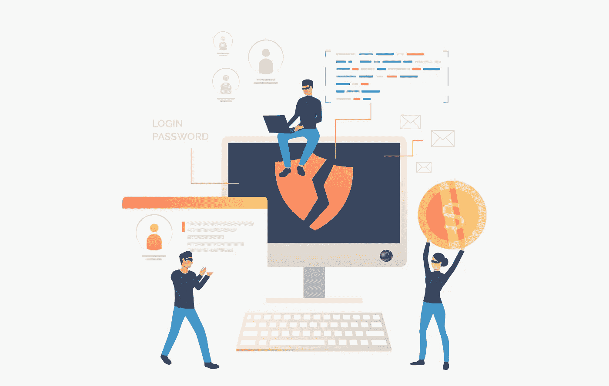
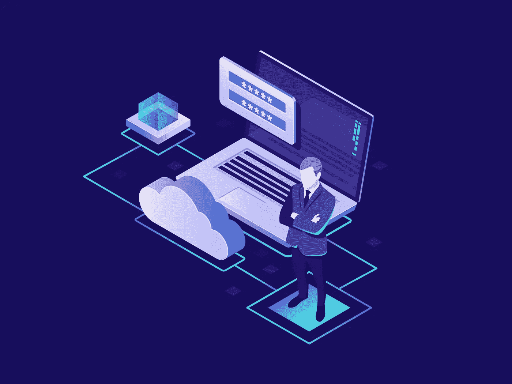
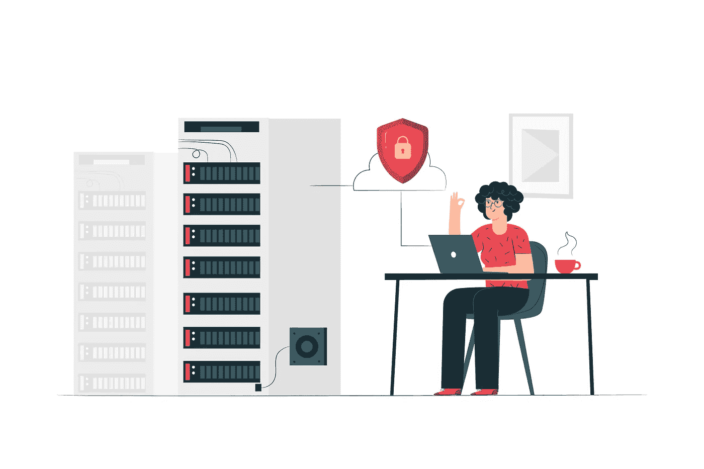

# 网络安全的 10 个步骤

> 原文：<https://infosecwriteups.com/10-steps-to-cybersecurity-78774d50fe1e?source=collection_archive---------1----------------------->

> 谈到网络安全的实际问题，我们必须了解我们在防范什么。人们普遍认为，采取专门针对特定情况的安全措施，同时遵循本文提到的 10 个步骤，将有助于保护组织免受网络攻击。

# 一.导言

这是在网络空间保护组织自身的一个关键因素。本文解释了帮助组织在网络空间保护自己的指南。该指南将保护网络、系统和信息的任务分解为基本组成部分，就如何在上述各个领域实现最佳安全提供建议。

网络安全的 10 个步骤最初由英国政府在 2012 年发布，现在被大多数人使用。

# A.目标

了解我们到底在防范什么。

帮助组织在网络空间保护自己。

实现最佳的网络攻击安全性。

# B.研究问题

如何实现组织在网络空间防御网络攻击的最佳安全措施。

# 二。网络安全的 10 个步骤

在接下来的部分中，我们将解释每个步骤，并提供如何开始的建议。

# A.风险管理制度

组织应该在实施安全措施之前了解他们面临的风险。这使他们能够确定威胁的优先级，并保证他们的响应是适用的。

风险管理制度有助于让董事会关注您的网络安全工作，并允许您根据威胁形势的变化来调整您的方法。例如，您可能会要求更改或增加您的网络安全政策或员工意识计划。

# B.网络安全性

从您的网络到 web 的连接包含可能暴露的漏洞。

你不会准备好根除所有这些漏洞；然而，您必须记住它们，并尽可能多地消除架构变更带来的风险。同样，您必须实施策略和技术措施来降低它们被利用的可能性。

# C.用户教育和意识

员工在其组织的安全实践中扮演着重要的角色，因此应该对他们进行责任教育，并向他们展示如何预防数据泄露。

培训有多种形式，从入门电子学习到基于课堂的认证课程。由你来决定你的员工可以接受的培训水平。

# D.恶意软件防范

恶意软件会通过多种方式感染组织的系统。它可能通过电子邮件附件发送，通过漏洞传播，或者通过可移动设备插入工作场所的 pc。

为了降低这些风险，组织应该实施反恶意软件系统和策略，以帮助和防止员工成为受害者。

# E.可移动媒体控件

USB 和不同的可移动设备是许多安全问题的根源。它们不仅通常被用于注入恶意软件，而且还与几起内部事件有关联。员工面临丢失可移动设备的风险，或者将这些设备插在未经授权的人可能接触到的计算机上。

因此，组织应该制定政策，强调将可移动设备随身携带或放在非常安全的地方的必要性。

# F.安全配置

数据泄露最常见的原因之一是错误配置的控制，如数据库未得到适当保护或软件系统更新未安装。

强调配置的重要性将确保您从系统中删除或禁用不必要的功能，并迅速解决常见的漏洞。

# G.管理用户权限

组织应该制定访问控制，以确保员工只能访问与其工作相关的信息。

这可以防止敏感信息被暴露，以防有人未经授权访问员工的帐户，并使员工窃取敏感信息的可能性降低。

# H.事故管理

无论你的防御措施有多强，你都可能在某个时候经历一次安全事故。

您必须通过建立策略和程序来帮助减轻损害并尽快恢复运行，从而使自己坚强起来。

# 一.监测

系统观察允许您有效地观察或尝试攻击。这在两个重要方面帮助了你。首先，您可能能够迅速识别事件并启动响应工作。

第二，您将获得犯罪分子锁定您的方式的第一手证据，让您有机会在骗子发现漏洞之前加强防御并搜索漏洞。

# J.家庭和移动办公

许多组织为员工提供在家或外出工作的可能性，但是，这也带来了安全风险。远程员工无法获得与工作场所同等的物理和网络安全性；因此，各组织应该作出相应的反应。

这应该包括限制对敏感系统的访问，并制定保护工作场所以外的笔记本电脑、可移动设备和物理信息的政策。

# 三。结论

本指南旨在为希望在网络空间保护自己的组织提供帮助。《网络安全十步曲》最初发布于 2012 年，目前被大多数富时 350 指数成份股公司采用。

《常见网络攻击:降低影响》一文对 10 步指南进行了补充。本文阐述了典型的网络攻击听起来像什么，以及攻击者通常采取的方式。我们倾向于认为，了解网络环境并采用与十个步骤一致的方法是帮助保护您的组织免受攻击的有效手段。

*关注* [*Infosec 报道*](https://medium.com/bugbountywriteup) *获取更多此类精彩报道。*

 [## 信息安全报道

### 收集了世界上最好的黑客的文章，主题从 bug 奖金和 CTF 到 vulnhub…

medium.com](https://medium.com/bugbountywriteup)