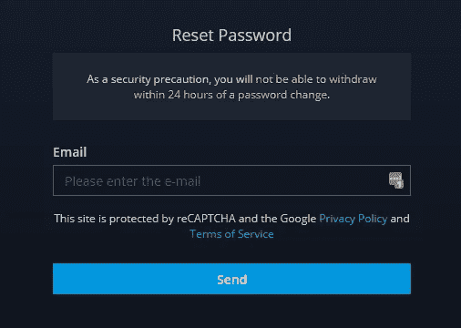
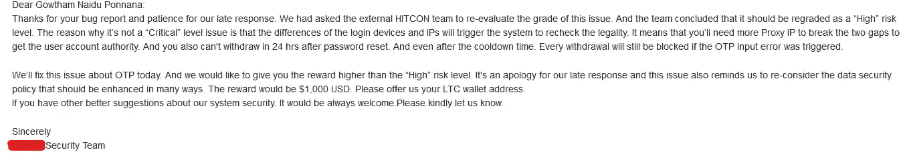

# 1000 美元:我如何黑掉任何账户，一夜之间成为亿万富翁👑顶级密码交易平台

> 原文：<https://infosecwriteups.com/1000-how-i-could-have-hack-any-account-and-become-a-billionaire-overnight-top-crypto-trading-ff0e25b6013c?source=collection_archive---------0----------------------->

在与安全团队(也包括抑郁和消极)和 HITCON 团队发了几封电子邮件后，该公司奖励了我 1000 美元的奖金，这通常高于他们的 Bug-Bounty 页面上提到的奖金。

***简介***

大家好，我是 Gowtham，来自印度的 17 岁安全研究员，一直喜欢深入研究技术😁😅。从我的博客中，你也知道我写博客并不一致🙃但是让我告诉你😙这个博客让你坚持到最后。

谈到这个平台，它是一个顶级的加密交易平台，我们可以在这里购买、出售或转让加密货币。根据保密政策，我不能泄露任何私人信息，所以，让我们说域名是“编校. com”。

> ***这像往常一样抓住了我的注意力😅***

如果你读过我以前的博客，我通常会研究登录/注册功能，我在这里也做了同样的事情。我打开我的 BurpSuite 来捕捉所有的请求和响应，并在网站上注册，浏览了每一个功能。在花了一些时间了解这个平台之后，我穿上了我的黑客服[开个玩笑]🙃].我开始寻找 IDOR 漏洞，但运气不佳:(，在用户名字段上尝试 XSS，但结果还是一样，现在，我实际上开始寻找我最喜欢的地方。

> **书签会帮到你，相信我:**

我注销了我的帐户，并开始寻找忘记密码的端点。我关注 JS 文件，它有时可以揭示一些重要的信息，但此时没有什么有趣的东西。所以我在忘记密码栏输入了我的注册电子邮件，然后点击发送，你猜怎么着？它要求 6 位数的动态口令😙。

我首先想到的是“暴力，暴力，暴力……”。😂".我在浏览器中输入了一个错误的动态口令，并在 Burp 中捕获了该请求，查看响应，显示“还剩 4 次尝试”😶。我喜欢~

然后我向 Repeater 发送请求，并多次发送，最终得到的回应是，“您的帐户被阻止，请等待 2 小时”。

在这里，我尝试了多种方法，如 X-Forwarded-For: <ip>和许多其他方法，但都没有用！。然后我从浏览器上的书签中想起，有人通过改变 IP 地址绕过了限速。我打开了我的免费 VPN 服务，所谓的“质子 VPN”😙连接到免费服务器，我发出请求，得到的回应是“还剩 4 次尝试”。下一刻，</ip>

我想在这里报告，但我停下来了😶。但是有什么影响呢？仅仅绕过速率限制并不是一件好事，为了获得正确的动态口令，我们需要 2，000，000 个 IP，这要花很多钱😂所以我放弃了。

> 谷歌一下，直到你找到它🔥

当我在大学的时候，我在数学课上记住了“种族条件”的弱点😅所以到家后，我立即重新访问了这个程序，并用“modified race.py”脚本(Burp 中 Turbo-intrusor 的默认脚本)测试了这个请求。

W 什么是比赛条件？*竞态条件是一种缺陷，当一个动作的时间影响到其他动作时，它会产生一个意想不到的结果。例如，在多线程应用程序中，对相同的数据执行操作。”简单地说，在很短的时间内发送多个请求来欺骗服务器。*

现在，在查看了涡轮入侵者的所有回复后，我是当时最开心的人，同时也很兴奋。我能够发送近 200 个请求，而没有达到速率限制🔥。

> **写报告有回报**

通过利用这一漏洞，攻击者可以通过拥有 5000 个 IP(大约花费 150-250 美元)来暴力破解任何 6 位数的 OTP，并可以进入任何用户帐户，并能够将资金转移到他自己的钱包地址。这是一个严重的分级漏洞，Instagram 和微软等一些顶级公司分别支付了 3 万美元和 5 万美元。

[注意]:完整的概念验证是不可能的，因为它需要大量的计算资源和 IP 来显示实际的漏洞，这是严重性从严重变为高的唯一原因。

我立即记录了 POC[概念验证]，并开始写下报告。我花了一个小时写了一份附有证据的详细报告。然后故事在时间线上继续:

*   报告发送日期:2022 年 3 月 11 日
*   第一次回应:2022 年 3 月 16 日【他们的支持团队说，安全团队正在验证我上报的漏洞。]
*   第二次回应:2022 年 3 月 23 日【还是说同样的话但是他们这么值得信赖。]
*   伤检分类:2022 年 3 月 29 日[团队验证了漏洞，并奖励我 50 美元😶我真的很震惊，我期待更多。]
*   与安全和 HITCON 团队的讨论:2022 年 3 月 29 日–2022 年 3 月 31 日[他们非常积极，解释了根本原因和影响。]
*   第三次回应:2022 年 3 月 31 日【我获得了 1000 美元的赏金，比他们的 Bug-Bounty 页面上显示的赏金还要高，我的努力和耐心得到了赞赏。]
*   修复漏洞并休息:2022 年 4 月 1 日[我确认漏洞不再存在，并给出了一些安全措施又名提示。]
*   收到赏金:2022 年 4 月 6 日[我通过 LTC 收到了赏金，我很高兴得到第二笔加密赏金😁😭。]

***安全团队关于漏洞的详细回复***

> **全在于你怎么结束！又名感恩🙂**

我知道，这个程序花了更多的时间来修复漏洞和支付奖金，但我仍然喜欢他们的支持和安全团队一直保持联系。我真的很感谢他们的安全团队的努力和快速修复，并特别感谢参与此事的高级官员。

我的第三篇博客到此为止😁，我希望你喜欢它，并仍然期待你的建议，以提高我的写作技巧。反馈总是 accepted🥰

请继续关注我:[这些是我的官方账号]

推特:[https://twitter.com/gowtham_ponnana](https://twitter.com/gowtham_ponnana)

领英:【https://www.linkedin.com/in/gowtham-ponnana/ 

insta gram:【https://www.instagram.com/gowtham_ponnana/ 

不和谐:MountXLover#3269

邮件:gowtham.official45@gmail.com