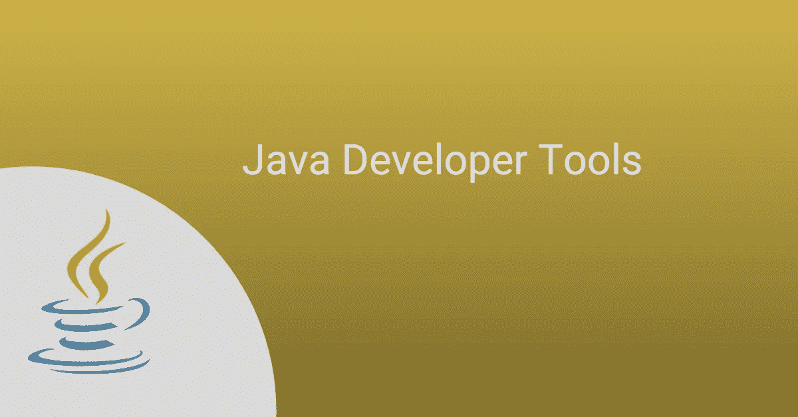
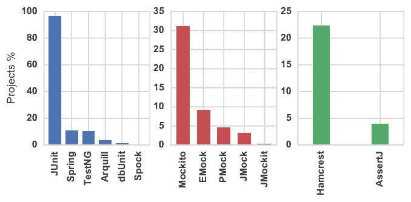

# Java 开发人员的 11 个必备工具

> 原文：<https://infosecwriteups.com/11-essential-tools-for-java-developers-725228f41234?source=collection_archive---------0----------------------->

Java 问世至今已经有二十六年了，而且还在强劲发展。当然，自从甲骨文公司接管太阳微系统公司以来，情况已经发生了变化。但是，对 Java 的大肆宣传似乎不会很快消失(让它的反对者感到沮丧)。

多年来，Java 开发人员和用户的数量有了相当大的增长，用 Java 编程也变得越来越容易。

在 Java 的早期，文本编辑器是 Java 开发人员最好的朋友。但是今天，人们可以看到许多免费和付费的工具，用来减轻过去程序员的负担。

从强大的代码编辑器、调试器和分析器到性能评估工具、版本控制工具等等，现代开发人员不惜一切代价来创建健壮、安全和强大的 Java 应用程序。这也只是古代 Java 开发人员所用时间的一小部分。

现在，有这么多工具可供选择，对今天的开发者来说是一种福气，但也是一种诅咒。一种工具或技术变得过时，而在几个月内又有十种新工具出现来替代它，这种情况并不罕见。

在这种情况下，决定学习和掌握哪种 Java 编码工具可能很困难，特别是对于业余开发人员。

为了帮助缓解这种困境，我们积累并列出了十个 Java 工具，每个 Java 开发人员都应该将它们添加到自己的工具包中。

所以，勇敢的战士(程序员)前进吧，亲自看看你需要什么工具来提高 Java 编程水平。

# Java 工具:一些见解

在我们进入 Java 工具列表之前，让我们先快速停下来，简单介绍一下什么是 Java 工具。

从技术上来说，java 工具是为创建、维护、调试、测试、排除故障和监控 Java 应用程序而构建的任何软件工具。

正如您所猜测的，Java 工具的主要功能(在某些情况下是唯一的功能)是帮助程序员大规模开发和发布 Java 应用程序。

这些工具是对 Java 语言的补充，提供了它缺少的现成特性。例如，SonarLint 是一个 IDE 扩展，可以帮助程序员编写干净安全的代码，这是 Java 语言默认不具备的功能。

Java 工具曾经是一种新奇的事物，现在已经成为所有 Java 开发人员，不管有没有经验，都经常使用的基本组件。

# Java 开发人员充分利用编程技能的 11 种工具

## 1.NetBeans IDE

Netbeans IDE，简称 Netbeans，是 Java IDE(集成开发环境)，是 Java 程序员用来开发移动应用、桌面应用、web 应用等的软件工具。可以把它想象成一个 Java 文本编辑器，但它使用了类固醇。

Netbeans(以前称为 Xelfi)从学生 Java IDE 项目开始，于 1997 年进入商业市场。在 Java 语言的赞助者 Sun Microsystems 于 1999 年收购 Netbeans 之前，Netbeans 的几个版本一直在生产和销售。

从那以后，Netbeans 经历了几次革新和增强，成为使用最广泛的 Java IDEs 之一。它是一个开源 IDE，由模块和 GUI 组成，模块是 java 类的集合，这些类与 Netbeans APIs 进行交互，以便为 Java 应用程序添加特定的功能。

Netbeans 是一个广泛的 Java 开发工具，为所有最新版本的 Java SE、JavaFX 和 Java EE 提供现成的支持。这种支持进一步扩展到诸如 Maven(一种 Java 构建自动化工具)和 Git 版本控制等技术。它也是 Java 8 的官方 IDE。

Netbeans 适用于所有主要的操作系统— Windows、Mac OS、Linux 和 Solaris。它还支持 Java 以外的语言，包括 HTML5、PHP 和 C++(尽管是通过扩展)。

如果您刚刚开始使用 Java，并且需要一个初学者友好且功能强大的 IDE，那么请选择 NetBeans。

## 2.Eclipse IDE

另一个超级流行的 Java IDE，Eclipse IDE 以其对插件的广泛支持而在竞争中脱颖而出。

这个开源的集成开发环境附带了一个 PDE(插件开发环境),方便用户轻松创建和使用大量插件。

PDE 包括一组工具，用于创建、开发、测试、构建和部署 Eclipse 插件、插件片段、应用程序特性等。

Eclipse IDE 的另一个亮点是它的富客户端平台(RCP)。RCP 使开发人员能够使用一组插件和一个补充框架构建独立的、功能丰富的客户端应用程序。使用 RCP 构建的应用程序像本机桌面应用程序一样运行。

Eclipse 和 NetBeans 一样，主要用于 Java 开发。但是，它也支持其他几种编程语言的应用程序开发，如 C、C++、C#、COBOL、D、JavaScript、Perl、PHP、Python、R、Ruby 等。，通过插件。

Eclipse 的支持者引用了它的 PDE 和相对容易地处理大型项目的能力作为它的一些优点。但是，Eclipse 对初学者不太友好，经常被描述为不稳定、复杂和运行缓慢。

因此，如果您计划将您当前的 IDE 切换到一个更具扩展性、功能更丰富且可伸缩的 IDE，请查看 Eclipse。

## 3.索纳库贝

既然我们已经正确设置了 Java IDE 的优先级，那么是时候继续提高 Java 代码的质量了。

互联网上充斥着提供代码质量保证的工具，但很少有人能达到 SonarQube 的效果。

SonarQube 是一个开源的持续代码检查平台，主要用于静态代码分析。SonarSource 开发的 SonarQube 可以执行自动化的代码分析，以检测 bug、代码漏洞、代码气味、技术债务等。

它还可以作为插件(SonarLint)与 Eclipse 和 IntelliJ 等 ide 无缝集成，并构建 Maven、Gradle 等自动化工具。

SonarQube 生成的报告强调代码安全性、代码复杂性、测试覆盖率、代码风格等，以帮助程序员编写安全、干净和可读的代码。

作为一个业界认可的平台，SonarQube 支持多达 29 种编程语言，Java 就是其中之一。

## 4.春天

Spring 是一个流行的、广泛的、开源的 Java 应用程序框架，开发人员主要使用它来构建 Java 企业和 web 应用程序。

Spring 是一个轻量级、灵活的框架，它让程序员能够更快地编写安全、健壮和可伸缩的应用程序。

它的优势主要在于它坚持面向方面编程(AOP)和依赖注入(DI)编程范例。

Spring 是一个元框架，由 Spring Web Flow、Spring MVC、Spring ORM 和更多子框架组成。

与其他应用程序框架相比，使用 Spring 的一个优势是它的 IoC(控制反转)容器。

IoC 是一种编程原则，要求对象定义它们的依赖关系。容器然后将定义的依赖注入到各自的对象中，因此命名为依赖注入。

IoC 容器负责配置和管理对象生命周期，包括创建对象、调用对象的初始化方法以及将对象连接在一起。

Spring 于 2002 年成立，拥有一个庞大的开发者社区。这些方面使它成为一个成熟且维护良好的框架，是所有 Java 开发人员的必备知识。

## 5.朱尼特

单元测试是软件开发不可或缺的一部分，它确保应用程序在发布前满足所需的质量标准。它是一种测试技术，包括在代码模块(称为单元)上运行测试，并验证它们的完整性。

由于单元测试的重要性，手头有一个可靠的单元测试工具是恰当的。这就是 JUnit 的用武之地。

JUnit 是一个开源测试框架，用于用 Java 编写单元测试。作为 TDD(测试驱动开发)的重要组成部分，JUnit 是 xUnit(单元测试框架家族)的一部分。

JUnit 是 Java 开发人员广泛使用的单元测试框架，几乎成为行业标准。事实上，2017 年[的一篇论文](https://www.researchgate.net/profile/Ahmed-Zerouali-2/publication/315637686_Analyzing_the_evolution_of_testing_library_usage_in_open_source_Java_projects/links/5c1a41d6458515a4c7e9c100/Analyzing-the-evolution-of-testing-library-usage-in-open-source-Java-projects.pdf)指出，GitHub 上使用 Maven 的所有项目中，大约 97%在其生命周期中至少使用过一次 JUnit 库。

[*来源*](https://www.researchgate.net/figure/Percentage-of-projects-in-which-a-given-library-is-used-at-least-once-during-its_fig1_315637686)

JUnit 的核心优势在于其相当简单的本质和编写有效测试的简易性。它还提供注释——定义测试目的的元数据，从而增加代码的可读性。

测试套件是 JUnit 的另一个亮点。这些套件基本上是开发人员可以并发运行的测试用例(甚至其他测试套件)的捆绑包。

开发人员更喜欢 JUnit 的另一个原因是它对自动化测试的亲和力。JUnit 可以自动执行测试，收集结果并提供及时的反馈。

总而言之，JUnit 是一个可靠的测试工具，所有 Java 开发人员都应该将它添加到自己的清单中。

## 6.安卓工作室

有几个不错的 ide，比如 NetBeans、Eclipse、IntelliJ IDEA 等等。，您可以使用它来为 Android 操作系统构建应用程序。但是，如果你真的想加强你的 android 应用程序开发游戏，Android Studio 是你最好的选择。

Android Studio 基于 JetBrains 的 IntelliJ IDEA IDE，是官方的 Android 开发 IDE。它是 Eclipse 的更快、更高效和更稳定的替代品，Eclipse 是以前开发 Android 应用程序的流行选择。

Android Studio 是一个全面的软件工具，允许您为几乎所有 Android 设备创建应用程序。它还具有一个成熟的 Android 模拟器，可以测试各种 Android 设备配置的应用程序。

Android Studio 有大量的功能，如代码模板、示例应用程序、智能代码编辑器、各种测试工具和框架，以及与 Flutter、Git 版本控制等的轻松集成。，以促进快速有效的编程。

它还具有“应用更改”功能，允许开发人员在不重启正在运行的应用程序的情况下，对应用程序代码进行更改。

由谷歌和 JetBrains 支持的 Android Studio 充满了噱头和功能，使 Android 应用程序开发更快、更无缝。您没有理由不利用它们来增强您的移动应用程序开发工作。

## 7.阿帕奇 Maven

Maven 由 Apache Software Foundation 开发和维护，是一个开源的“项目管理工具和理解工具”，正如 Maven 的[官方网站](https://maven.apache.org/)所宣称的那样。简而言之，它是一个构建自动化工具，为开发人员的所有项目提供了一个成熟的构建生命周期框架。

程序员使用 Maven 构建、发布和部署用 Java、C#、Ruby、Scala 等语言编写的项目。

Maven 围绕 POM(项目对象模型)进行操作。它本质上是一个. xml 文件，包含项目、依赖项、目录、插件和项目所需的所有外部组件的信息。

POM 模型简化了大量与项目管理相关的复杂性，只需要开发人员指定项目的例外情况。

Maven 也有一个统一的构建系统，包括一个标准的目录和操作方式。一旦熟悉了一个项目的构建过程，用户就可以相对容易地浏览其他项目。

此外，Apache Maven 项目网站提供了大量细微差别的特性和开发最佳实践的信息，以便用户更快地适应该工具。

## 8.格拉德勒

Gradle 是一个通用的、开源的、多语言的构建自动化工具，它比同类工具有更快的性能和更好的可伸缩性。

对于构建自动化领域来说，Gradle 相对较新，它直接针对 Maven 和 Apache Ant，甚至使用前者来进行性能比较。网站上的统计数据显示，在任何给定的时间点，Gradle 至少比 Maven 快两倍。

Gradle 需要一个 JVM 来运行，这使得 Java 开发人员可以在他们的构建逻辑中使用标准的 Java APIs，比如定制任务和插件。它对 JVM 的依赖也允许 Gradle 在大多数平台上运行，因为人们只需要在他们的机器上安装 JDK。

Gradle 更适合多项目构建，并且有扩展的可能性。它是一个很好的工具，可以集成到几个 ide 中——NetBeans、Eclipse、IntelliJ IDEA、Android Studio 等。

此外，Gradle 是 Android Studio 的官方构建自动化工具包，由 Google 于 2013 年发布。

与 Maven 相比，Gradle 的用户友好性稍差，难以适应。它还受到 IDE 集成问题的困扰。但是，其网站声称，开发团队正在不断努力改善其各个方面，使其更有利于开发人员。

## 9.詹金斯

Jenkins 是一个开源的基于服务器的 DevOps 自动化工具，它运行在一个像 Apache Tomcat 这样的 servlet 容器中。

Jenkins 用 Java 语言编写，通过自动化与软件产品的构建、测试和部署相关的部分开发过程，帮助简化软件开发。

在实现 CI/CD(持续集成和持续部署)软件开发范例时，Jenkins 是一个受欢迎的选择。它允许开发人员不断构建和测试他们的软件项目，并轻松地将更改集成到源代码中。

使用 Jenkins 的主要优势之一是它支持 1000 多个插件。这些插件使用户能够利用 Jenkins 跨多个平台进行自动化软件开发。

此外，由于其免费和开源的性质，Jenkins 有一个强大的开发社区，这是您加入 Jenkins 潮流的另一个原因。

## 10.Java VisualVM

Java VisualVM 让您详细了解 Java 应用程序在 JVM 上运行时的情况。它是一个 Java profiler——一个性能工具，允许用户使用可视化界面查看在 JVM 上运行的 Java 应用程序的详细信息。

VisualVM 同样适用于本地和远程应用程序，以有组织的方式显示多个 Java 应用程序的数据。它通过向用户显示由 JDK (Java 开发工具包)捕获的 JVM 数据来做到这一点。

使用 VisualVM，开发人员可以检测内存泄漏、监视垃圾收集器、执行 CPU 分析等。

开发人员可以进一步使用从该工具获得的数据来排除 Java 应用程序的故障，并提高它们的性能。

Java VisualVM 作为可选工具与 JDK 捆绑在一起。因此，您不需要额外的努力，在您的系统上单独安装它。

## 11.在线 Java 编译器

除了上面提到的工具，如果你需要快速编译你的 java 代码，你也可以使用 Interviewbit 提供的 [**Interviewbit**](https://www.interviewbit.com/online-java-compiler/) 在线 Java 编译器。这个编译器对所有开发者都是免费的。如果您是一个初学者，想要测试、调试或运行 Java 代码而不需要安装，那么您可以立即开始使用这个平台。

你所需要做的就是登录，它就可以使用了。编译器非常强大，只需点击一个按钮，你就可以保存、分叉甚至共享你的代码片段。

# 结论

给你，11 个重要的 Java 工具将帮助你更好更快地编写 Java 代码。

这个列表并不详尽，甚至在我写这篇博文的时候，新的、更好的工具的开发也在进行中。

为什么不呢？Java 的范围和适用性与日俱增。能够降低 Java 编程复杂性同时增强 Java 应用程序整体性能的新工具总是受欢迎的。

所以参考这个列表，掌握这里提到的 Java 工具，并留意利用任何即将到来的工具。干杯！