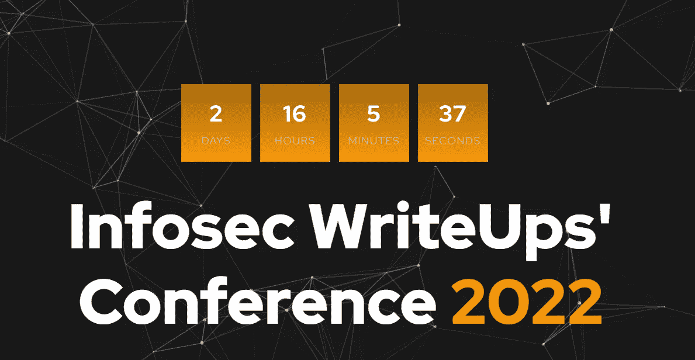
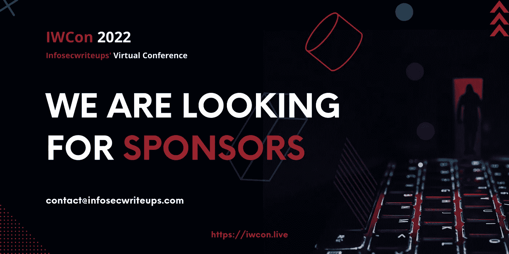

# IWCON 2022 虚拟信息安全会议和网络活动还剩 2 天

> 原文：<https://infosecwriteups.com/2-days-left-for-iwcon-2022-virtual-infosec-conference-networking-event-407715243eaa?source=collection_archive---------3----------------------->

## 以前从未参加过虚拟网络活动？你的常见问题回答+检查我们的现场演示在这里。

你好！

作为我们不断努力与更多人分享 IWCON 2022 的一部分，Infosec Writeups 的编辑团队一起向您展示了两个有趣的视频。

点击这里查看，如果您还没有预订 的座位，请不要忘记预订。

# IWCON 2022 的虚拟网络是什么样子的

很多人问我们 IWCON 2022 的虚拟网络会议是什么样的。

[这是一个现场演示](https://www.youtube.com/watch?v=fqJ7T1fW3zU)。

你可以期待像这样的 25 人容量的房间，在那里你可以-

*   四处逛逛，和人们聊聊天
*   将您的个人资料图片添加到带有您姓名首字母的小圆圈中
*   添加一行简历、你的 Twitter 个人资料链接等。

这将会是一个很酷的认识新朋友的方式，扩大你的关系网，找到强大的关系，以及潜在的工作或实习机会。

[***看视频这里***](https://www.youtube.com/watch?v=fqJ7T1fW3zU) 。

# 如何在网上交黑客朋友？

在 IWCON 2022 上，我们聚集了来自世界各地的数百名网络安全专业人士、学生和 bug 赏金猎人。我们提供 2 个多小时的有趣的网络会议，在这里你可以成群结队地闲逛，结交新朋友，结识很酷的人——就像你在现实生活中的会议一样。

现在，坐在你舒适熟悉的房间里，你可以和取得有趣成就的了不起的人交朋友——只需 5 美元。

此外，您将听到我们 16 位出色的演讲者讲述他们在 Infosec 中面临的挑战以及他们是如何克服这些挑战的。

简而言之，如果你对学习网络安全有一丁点兴趣，你就不能错过 IWCON 2022。发生在 2 月 26 日和 27 日，从 IST 晚上 7 点到 IST 晚上 11 点。

[**在这里看视频。**](https://youtu.be/_aIZnLzseOs)

# 不要错过所有的乐趣！

激动吗？

点击 查看我们的发言人名单和会议日程 [**。**](https://iwcon.live/)

在这里预订您的**。**

**如需批量购买门票并在您的社区中分发，请发送电子邮件至 contact@infosecwriteups.com 或在 Twitter 上发送 DM 至@InfosecComm。**

**在这些视频中:**

*   **anang sha Alammyan(Twitter:@ anang sha _)，信息安全报道编辑**
*   **Sravani Kothapalli，后端向导，编辑团队成员，Infosec 报道**
*   **swaroop(Twitter:@ swaroopmerks)OG 设计师，编辑团队成员，Infosec 报道**

**如有任何疑问，请发送电子邮件至**contact@infosecwriteups.com**或在 Twitter 上发送 DM 至@InfosecComm。**

***！***

# ***我们在寻找赞助商***

******

***我们正在为 IWCon 2022 寻找更多的赞助商。***

***把这个分享给你认为可以赞助我们的你喜欢的公司。🔥***

***最佳，
编辑团队
Infosec 报道***