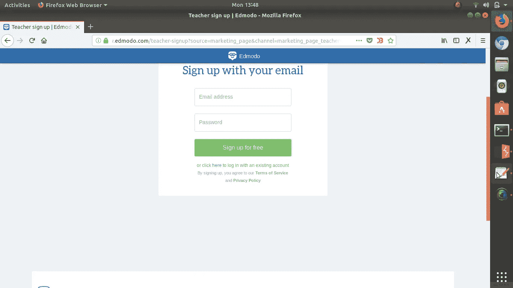
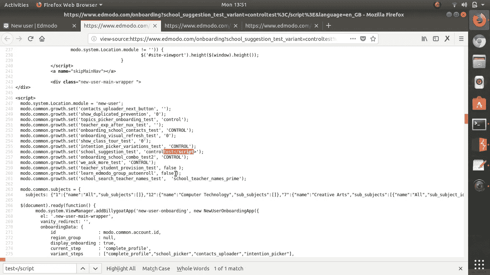
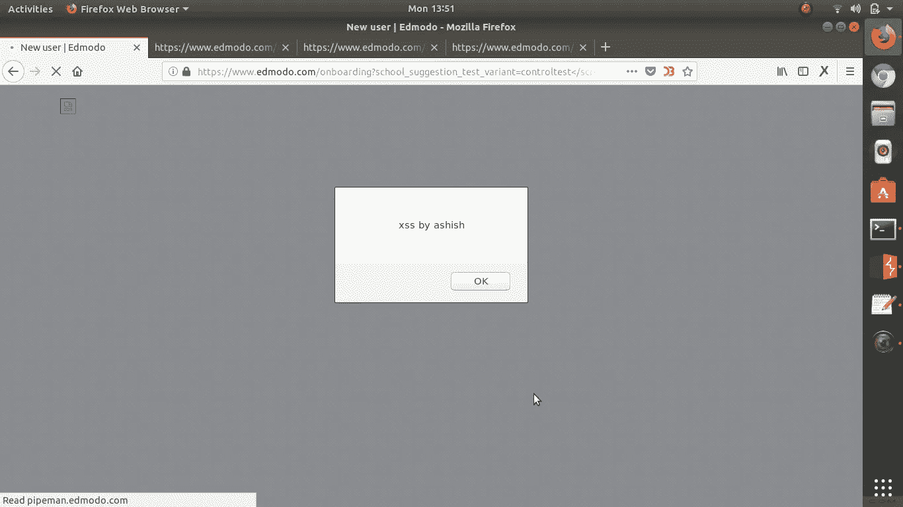

# 三分钟& XSS！

> 原文：<https://infosecwriteups.com/3-minutes-xss-71e3340ad66b?source=collection_archive---------0----------------------->

你好 wonderfull 读者，我自己 Ashish Jha 带着我的另一篇文章回来，是的，你没听错，这是一篇“3 分钟和 xss”，现在作为一名黑客，我总是试图尽可能地高效，总是试图快速找到 bug(这只是我的好奇心)，每当我开始测试任何东西时，我都会粗略记录我找到 bug 所花的时间。

让我告诉你这个:

所以我测试的网站是 edmodo.com(我要求他们公开披露)，只是在那天早上我想测试 edmodo，中午我就开始了，跟着做。

第一步:

我用 knockpy 做了一个简单的侦察，发现了一个子域 go.edmodo.com，

我进入他们的网站，点击注册，然后重定向到:

[https://www.edmodo.com/onboarding?school _ suggestion _ test _ variant = controlass&language = en _ GB](https://www.edmodo.com/onboarding?school_suggestion_test_variant=controlass&language=en_GB)

重定向图像

第二步:

我只是在第一个参数中添加了一些<>—[[school _ suggestion _ test _ variant = controlass](https://www.edmodo.com/onboarding?school_suggestion_test_variant=controlass&language=en_GB)<>]，看看它们是否被嵌入到源代码中，然后我发现这些括号被嵌入到了<脚本>标签之间，还需要什么！！！！！！！

第三步:

，BOOOOOM XSS

这是我的 3 分钟侦察和 xss，希望你会发现它有帮助。

然后我向我的邮箱发送了报告，几天后他们回复了奖励奖品，他们真的很棒！

我在 edmodo 安全团队的总体体验非常棒(10/10)。

马克杯、贴纸、徽章、t 恤

谢谢大家的阅读，一会儿给你们写！