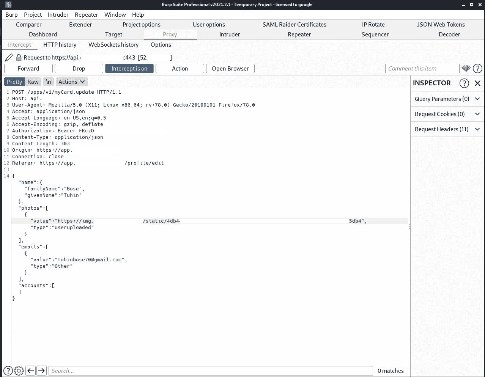
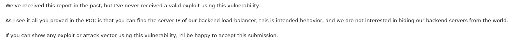
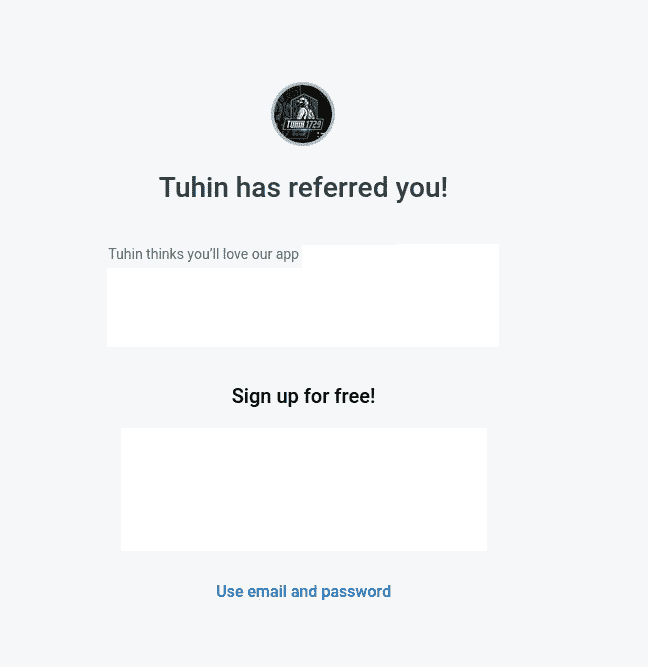
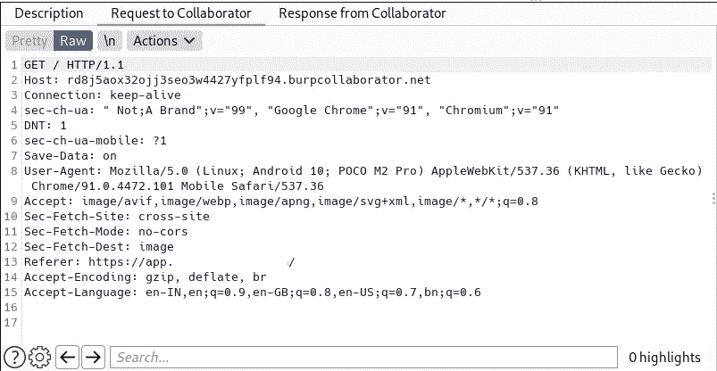
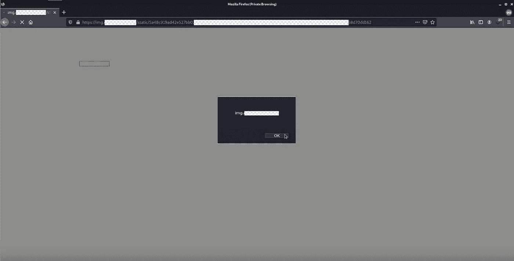

# 价值$$$的 3 个漏洞

> 原文：<https://infosecwriteups.com/3-vulnerabilities-worth-e2851059dfc2?source=collection_archive---------0----------------------->

大家好。我叫图欣·博斯( [@tuhin1729](https://instagram.com/tuhin1729) )。我目前在[虚拟网络实验室](https://virtualcyberlabs.com)担任首席技术官。在这篇文章中，我将分享我是如何从一个漏洞奖励计划中获得 3 个漏洞的。所以不浪费时间，让我们开始吧:


tuhin1729

# 简介:

该应用程序是联系信息管理网站，用户可以登录到他们的谷歌帐户，它会从谷歌帐户获取他们的联系信息，以便他们可以随时随地访问它，即使他们失去了他们的手机。他们还有一个高级功能，你可以获得一些额外的功能，如从多个谷歌账户同步联系人，扫描和保存名片为联系人等。他们还有一个推荐功能，通过它你可以推荐你的朋友，并免费获得一些高级功能。

# **我的方法:**

我在那里开了一个账户。在测试了几个漏洞(来自我的清单)后，我开始测试个人资料图片上传部分。所以个人资料图片上传的流程大概是这样的:

1.  用户将从他的设备上传图片:


tuhin1729

2.上传图片后，图片将被上传到 img.redacted.com。当用户点击保存按钮时，图像和其他细节将被保存:



tuhin1729

所以在测试了 IDOR、SQLi、DoS 和其他一些攻击后，我在那里尝试了 SSRF。我很快用我的打嗝合作者的有效载荷替换了 URL，你猜怎么着！


tuhin1729

我赶紧查了一下 ip，发现这个 ip 是他们后端负载均衡器的。我试图进一步利用它，但没有办法这样做。后来我只举报了这种行为，他们的回复是:



tuhin1729

于是，我就把它忘了，开始测试其他端点。

# 悲剧:

在测试推荐功能时，我注意到一个有趣的现象。在推荐网址(https://app . redated . com/refer/YOUR _ REFERRAL _ CODE)中，显示用户的个人资料图片:



tuhin1729

我记得以前的发现，我们可以用任何第三方网站替换我们的个人资料图片 URL。

我迅速更改了我的个人资料图片，用我的 burp 合作者替换了个人资料图片链接，并从另一个设备访问了推荐页面，嘣！我向我的 burp 合作者发出了一个 HTTP 请求，请求中包含设备的 ip 地址、浏览器信息和设备型号:



tuhin1729

那么攻击场景是什么？

# 攻击场景:

1.  攻击者从他的 burp collaborator URL 保存他的个人资料图片。
2.  攻击者向受害者发送他的推荐链接。
3.  受害者打开推荐网址(由于推荐链接属于 redacted.com 的其中一个子域，所以受害者肯定会打开)嘣！受害者的私人信息将被发送给攻击者。

# 第二个漏洞:

我在我的 ngrok 服务器上托管了一个 poc.svg 文件，该文件包含以下内容:

```
<?xml version="1.0" standalone="no"?>
<!DOCTYPE svg PUBLIC "-//W3C//DTD SVG 1.1//EN" "[http://www.w3.org/Graphics/SVG/1.1/DTD/svg11.dtd](http://www.w3.org/Graphics/SVG/1.1/DTD/svg11.dtd)"><svg version="1.1" baseProfile="full" ae kl" href="http://www.w3.org/2000/svg" rel="noopener ugc nofollow" target="_blank">http://www.w3.org/2000/svg">
<polygon id="triangle" points="0,0 0,50 50,0" fill="#009900" stroke="#004400"/>
<script type="text/javascript">
alert(document.domain);
</script>
</svg>
```

而且我把我的个人资料图片网址换成了 poc.svg 文件的网址(https://xyz.ngrok.io/poc.svg)。然后，我只需右键单击个人资料图片，并复制网址。我注意到是[https://img . redated](https://img.redacted)。这意味着他们从我的服务器上获取了 poc.svg 文件。我迅速将链接粘贴到我的浏览器上，然后嘣！



tuhin1729

我赶紧做了一个 poc，向他们汇报。

# 第三个漏洞:

在检查了一些特性之后，我转到了更改密码部分。该请求看起来像是:

```
POST /api/oauth.updatePassword HTTP/1.1
Host: app.redacted.com
User-Agent: Mozilla/5.0 (X11; Linux x86_64; rv:78.0) Gecko/20100101 Firefox/78.0
Accept: application/json
Accept-Language: en-US,en;q=0.5
Accept-Encoding: gzip, deflate
Authorization: Bearer D5FC5XXXX
x-csrf-token: uXvbmXXXX
Content-Type: application/json
Content-Length: 56
Origin: [https://app.redacted.com](https://app.redacted.com)
Connection: close
Referer: [https://app.redacted.com/account](https://app.redacted.com/account)
Cookie: XYZ=ABC; PQR=DSPH{"password":"NewPassword","revokeSessions":true,"client":"ABWeb"}
```

在尝试了一些漏洞后，我试图将密码改为 null，我看到了一些有趣的事情:


tuhin1729

看响应时间；504 网关超时为 30，460 毫秒！！！发生了一些事情。

我很快向他们报告了这三个问题，几天后，我得到了他们的回复，并得到了一笔$美元的奖金。

## 时间线:

2021 年 6 月 6 日—报告第一个漏洞
2021 年 6 月 6 日—请求影响
2021 年 6 月 8 日—发现并报告漏洞利用
2021 年 6 月 8 日—报告第二个漏洞
2021 年 6 月 11 日—报告第三个漏洞
2021 年 6 月 13 日—审判
2021 年 6 月 15 日—回复赏金邮件

在 Twitter 上关注我:@ [tuhin1729](https://twitter.com/tuhin1729_) _

感谢阅读。我希望你喜欢这个博客。