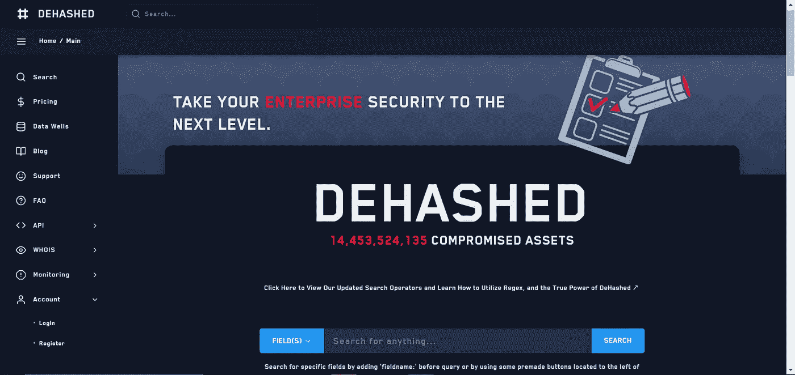
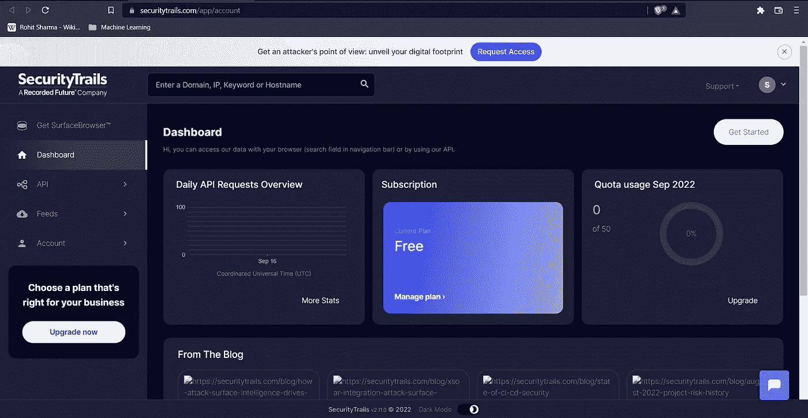
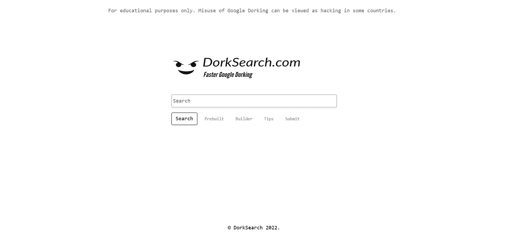
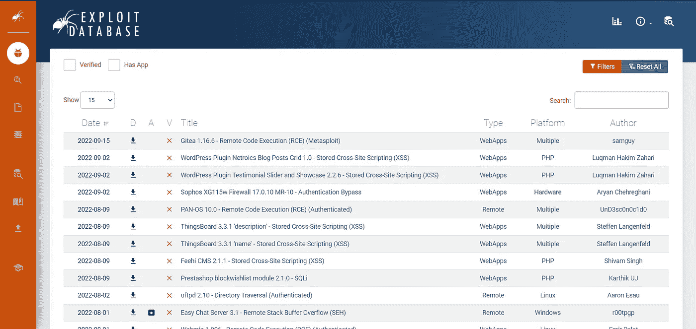
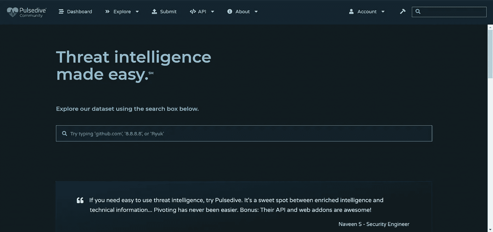
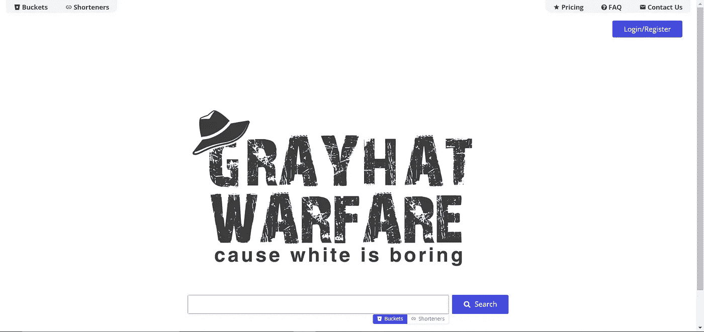
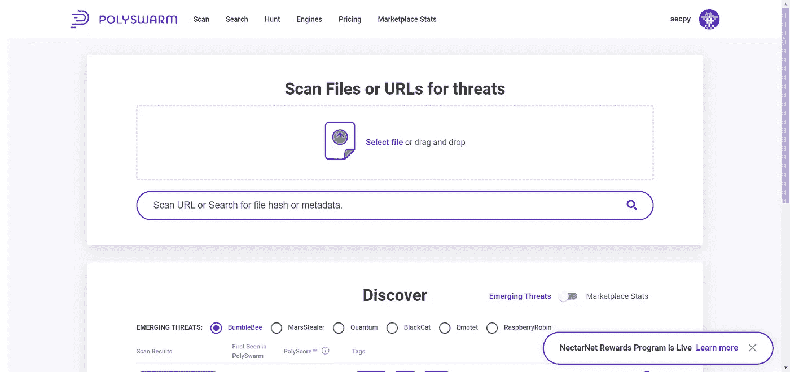
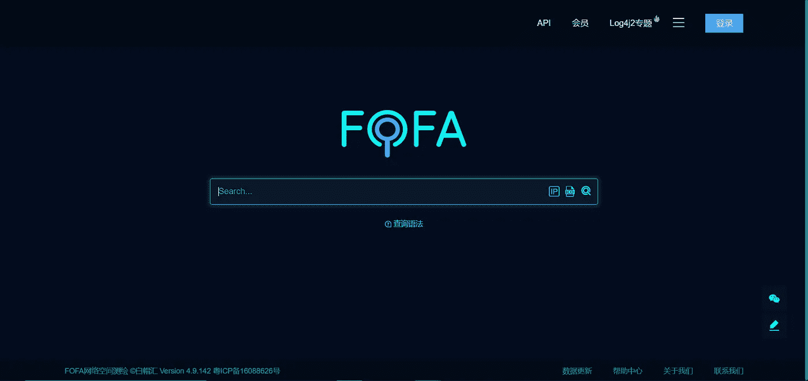
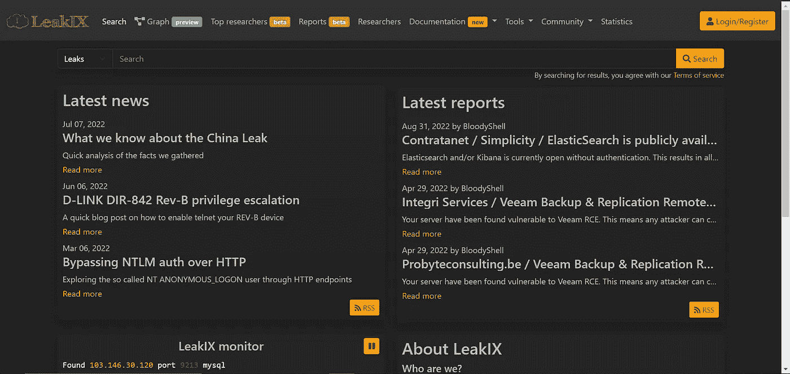

# 网络安全研究人员的 30 个搜索引擎(第 1 部分，共 3 部分)

> 原文：<https://infosecwriteups.com/30-search-engines-for-cybersecurity-researchers-part-1-of-3-faf68bfc6be8?source=collection_archive---------1----------------------->

作者:anshul vyas

本杰明·达达在 [Unsplash](https://unsplash.com?utm_source=medium&utm_medium=referral) 上拍摄的照片

这是安全研究人员使用的搜索引擎的三个部分中的第一部分。

# 1.DeHashed:查看泄漏的凭据

【https://www.dehashed.com/ 

在最流行和先进的在线安全和反欺诈工具中，DeHashed 是最先进和最受欢迎的工具之一。通过去哈希平台，用户可以从被黑客攻击的数据库中搜索和检索信息。利用各种黑客数据库，去散列平台让用户搜索黑客发布或泄露的信息。

这个平台使用户能够快速检索他们泄露的信息，并防止这些信息被黑客或网络上的其他有害分子滥用。这是最快和最重要的数据泄露搜索引擎之一。它简单明了的界面和易用性使得它很受那些想要快速方便地定位他们泄露的信息的用户的欢迎。

# 2.安全线索:大量的 DNS 数据

[https://securitytrails.com/](https://securitytrails.com/)

借助 SecurityTrails，组织可以通过收集和维护大量当前和历史互联网记录(如域名、注册数据和 DNS 信息)来了解他们的威胁攻击面(从更广泛的互联网可访问的网络和服务器)。

# 3.多克搜索:真的很快谷歌多克

[https://dorksearch.com/](https://dorksearch.com/)

您可以使用 DorkSearch 为不同类型的 Google 呆子寻找预构建的模板。

# 4.ExploitDB:各种漏洞的存档

[https://www.exploit-db.com/](https://www.exploit-db.com/)

漏洞数据库是为漏洞研究人员和渗透测试人员开发的软件中公开可用的漏洞和漏洞的档案。通过直接提交、邮件列表和其他公共来源，它收集了最全面的漏洞、外壳代码和论文，并以易于导航和免费访问的格式呈现。

# 5.收集关于目标的信息

[https://www.zoomeye.org/](https://www.zoomeye.org/)

由中国公司 Knownsec Inc .开发的搜索引擎 Zoomeye 使用地图收集数据，并分析来自开放设备和网络服务的指纹。它的第一个版本于 2013 年发布。当前版本是版本 3。

# 6.脉冲驱动:搜索威胁情报

[https://pulsedive.com/](https://pulsedive.com/)

在 pulsedive.com，您可以找到超过 3500 万个免费的可搜索 IOC，这些 IOC 是通过用户提交和威胁情报源生成的。Pulsedive 是一个以分析师为中心的威胁情报平台。使用 Pulsedive 的免费威胁情报数据集，突出显示任何网站上的 IP、域和 URL，以丰富它们。

# 7.GrayHatWarefare:搜索公共 S3 存储桶

https://grayhatwarfare.com/

grayhatwaring 的免费工具中目前有 48623 个开放的 S3 桶，这是一个由软件工程师 grayhatwaring 创建的可搜索数据库。作为一种流行的缓存内容的方式，亚马逊的 S3 云存储，或简单的存储服务，被公共和私营部门使用。默认情况下，为文件分配的存储桶是安全的和私有的，但是用户可以很容易地将其设置为公共的。

# 8.PolySwarm:扫描文件和 URL 中的威胁

[https://polyswarm . network/](https://polyswarm.network/)

作为新技术和创新威胁检测方法的发射台，PolySwarm 致力于实时保护您的安全。威胁检测引擎网络为 PolySwarm 提供支持。结合商业引擎与专业解决方案，它提供了广泛的覆盖面。

# 9.Fofa:搜索各种威胁情报

[https://fofa.so/](https://fofa.so/)

通过 FOFA，用户可以轻松找到 IP 资产，快速匹配网络资产，加快后续流程。这个网络空间搜索引擎是由白毛会开发的。有很多例子，包括漏洞范围分析、应用分布统计、流行度排名统计等等。

# 10.LeakIX:搜索公开索引信息

[https://leakix.net/](https://leakix.net/)

LeakIX 和 Shodan 有一些不同的功能，无论是视觉上还是基于使用的查询，但基于网络的平台提供了与 Shodan 非常相似的视觉体验。我认为该平台的价值在于它能够洞察互联网上被入侵的设备、服务器和数据库模式，现在，是的，Shodan 以大致相同的方式标记“被入侵”的服务器，但它没有那么全面。

## 来自 Infosec 的报道:Infosec 每天都有很多内容，很难跟上。[加入我们的每周简讯](https://weekly.infosecwriteups.com/)以 5 篇文章、4 条线索、3 个视频、2 个 Github Repos 和工具以及 1 个工作提醒的形式免费获取所有最新的 Infosec 趋势！