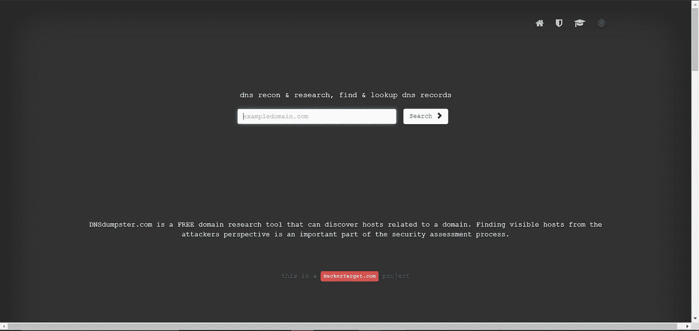
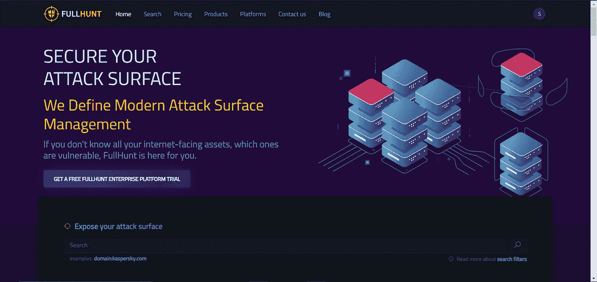
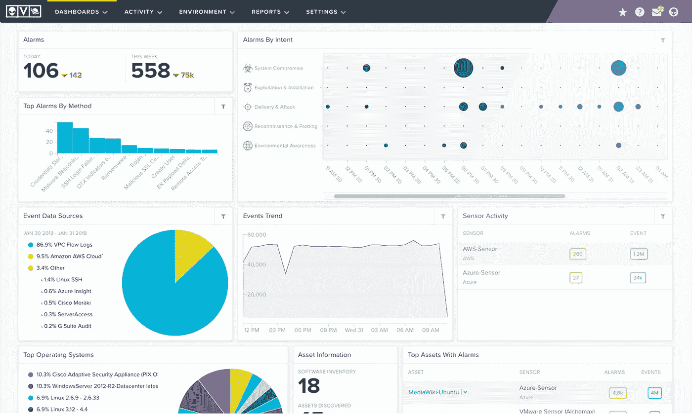
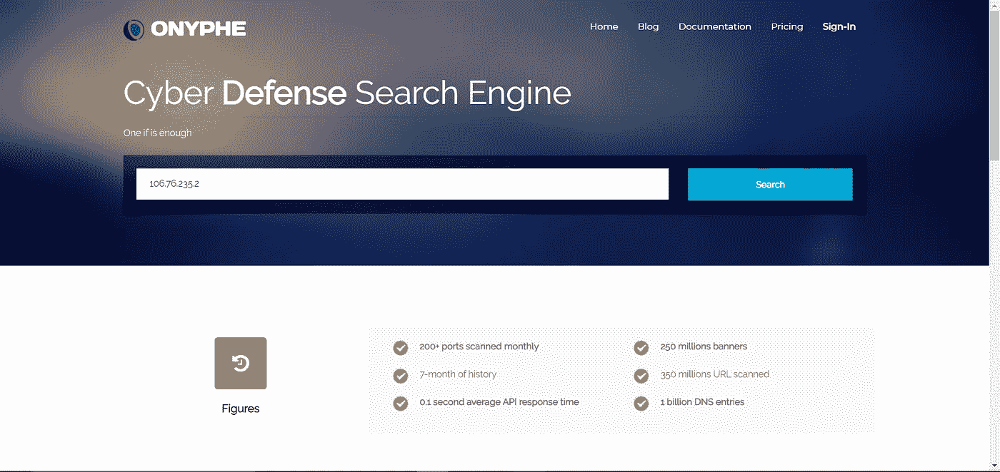
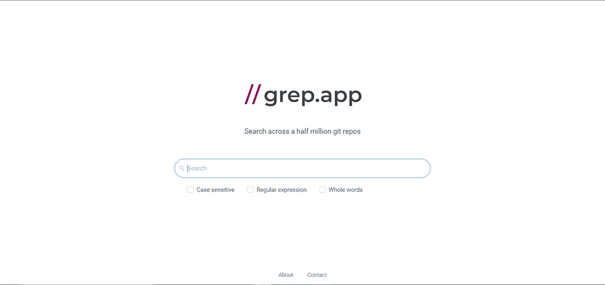
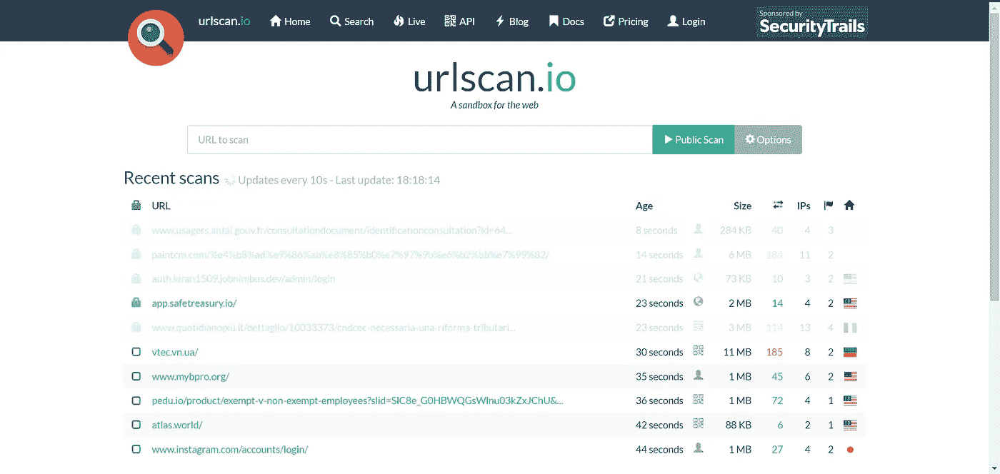
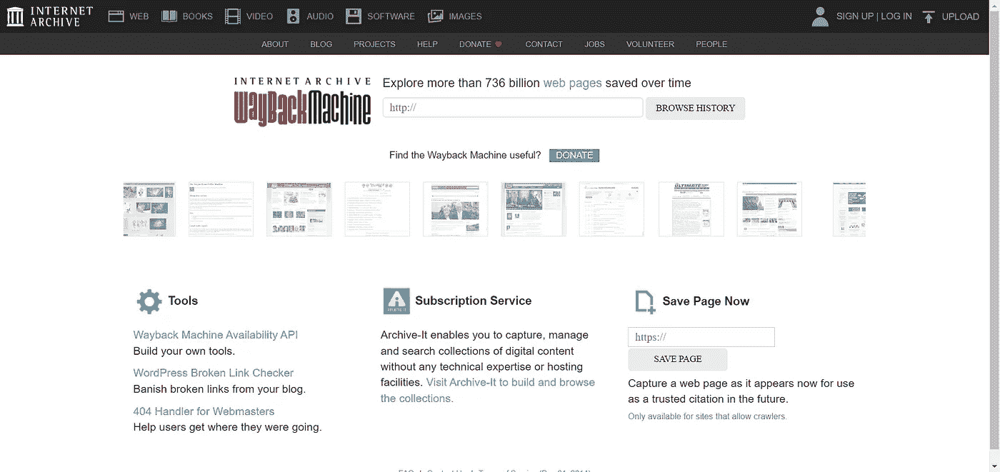
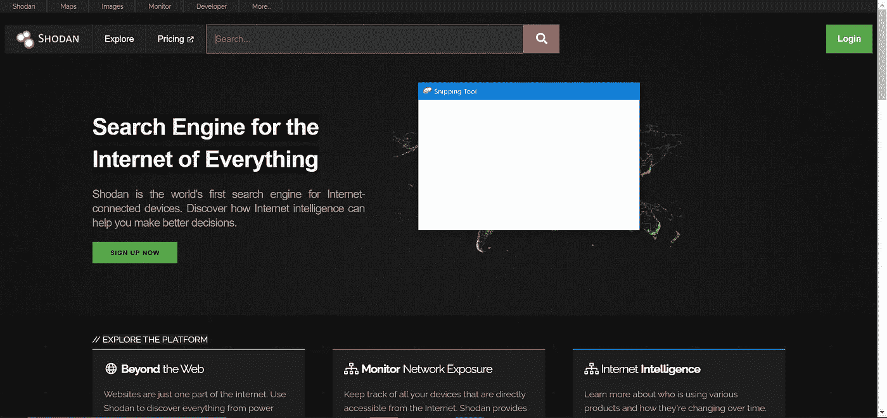
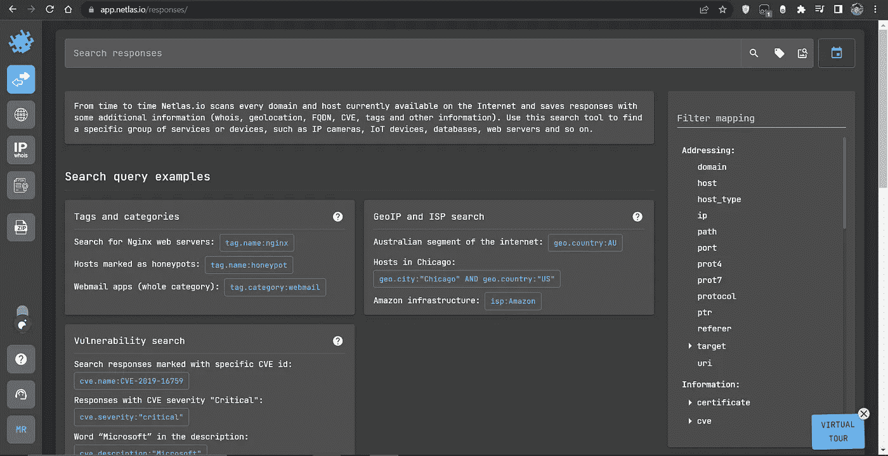

# 网络安全研究人员的 30 个搜索引擎(第 2 部分，共 3 部分)

> 原文：<https://infosecwriteups.com/30-search-engines-for-cybersecurity-researchers-part-2-of-3-3412d6a35118?source=collection_archive---------3----------------------->

> 由 [anshul vyas](https://www.instagram.com/_ansh_vyas/) 撰写

由[本杰明达达](https://unsplash.com/es/@dadaben_?utm_source=medium&utm_medium=referral)在 [Unsplash](https://unsplash.com?utm_source=medium&utm_medium=referral) 上拍摄的照片

这是安全研究人员使用的搜索引擎的三个部分中的第二部分。

> 链接到第一部分:[https://secpy . medium . com/30-search-engines-for-cyber security-researchers-part-1-of-3-faf 68 bfc 6 be 8](https://secpy.medium.com/30-search-engines-for-cybersecurity-researchers-part-1-of-3-faf68bfc6be8)

# 11.DNSDumpster:快速搜索 DNS 记录

[https://dnsdumpster.com/](https://dnsdumpster.com/)

在目标网络上执行 DNS 侦察的应用程序。它为用户提供地理数据、主机详细信息、电子邮件地址和格式等信息，这些信息可用于了解目标网络的更多信息。

# 12.FullHunt:搜索和发现攻击面

[https://fullhunt.io/](https://fullhunt.io/)

它是一个包含互联网上所有攻击面的数据库，这意味着它能够识别网络上的所有攻击面，监控它们的感染，并持续扫描它们的漏洞。

# 13.AlienVault:大量威胁情报

[https://otx.alienvault.com/](https://otx.alienvault.com/)

您可以通过 AlienVault OSSIM、开源安全信息和事件管理(SIEM)获得功能丰富的开源 SIEM。为了应对开源安全解决方案的缺乏，安全工程师开发了 AlienVault OSSIM，以解决许多安全专业人员面临的问题:如果没有基本的安全控制，SIEM 对于安全可见性几乎毫无用处，无论它是开源的还是商用的。

# 14.ONYPHE:收集网络威胁情报数据

[https://www.onyphe.io/](https://www.onyphe.io/)

通过抓取各种互联网资源或收听背景噪音，Onyphe 为他们的网络防御搜索引擎收集开源和网络威胁情报数据。

# 15.Grep 应用程序:搜索 50 万 git repos

[https://grep.app/](https://grep.app/)

Grep.app 将显示与搜索相对应的存储库列表。现在你可以相当有效地在 GitHub 上找到那些难以捉摸的编码者。

# 16.URL 扫描:扫描和分析网站的免费服务

[https://urlscan.io/](https://urlscan.io/)

**URL 扫描**是一款免费工具，通过扫描和分析包括恶意软件、诈骗和钓鱼链接在内的网站来检测恶意 URL。

# 17.漏洞:在大型数据库中搜索漏洞

【https://vulners.com/ 

你可以找到非常大的连续可更新的安全内容数据库。漏洞，利用，补丁，bugbounty 可与谷歌风格的搜索。

# 18.WayBackMachine:查看已删除网站的内容

[https://archive.org/web/](https://archive.org/web/)

总部设在加州旧金山的非盈利组织互联网档案馆创建了万维网的数字档案馆 Wayback Machine。在这项服务的帮助下，用户可以“回到过去”，看看网站在过去是什么样子。它创建于 1996 年，于 2001 年向公众推出。

# 19.Shodan:搜索连接到互联网的设备

[https://www.shodan.io/](https://www.shodan.io/)

一些人将 Shodan 描述为服务横幅的搜索引擎，服务横幅是服务器传输回客户端的元数据。Shodan 允许用户使用各种过滤器找到连接到互联网的服务器。

# 20.Netlas:搜索和监控互联网连接的资产

[https://app.netlas.io/responses/](https://app.netlas.io/responses/)

Netlas.io 是一款互联网扫描仪和搜索引擎，使用 HTTP、FTP、SMTP、POP3、IMAP、SMB/CIFS、SSH、Telnet、SQL 等协议扫描 IPv4 地址和域名。Netlas.io 数据库的几个部分可供下载。收集到的数据还包含更多信息，可在 Netlas.io 搜索引擎中找到。

## 来自 Infosec 的报道:Infosec 每天都有很多内容，很难跟上。[加入我们的每周简讯](https://weekly.infosecwriteups.com/)以 5 篇文章、4 个线程、3 个视频、2 个 Github Repos 和工具以及 1 个工作提醒的形式免费获取所有最新的 Infosec 趋势！