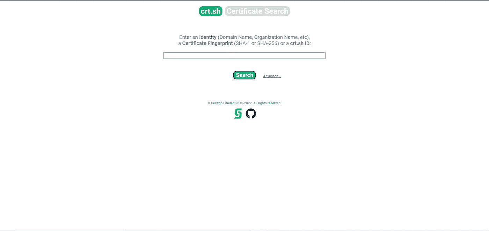
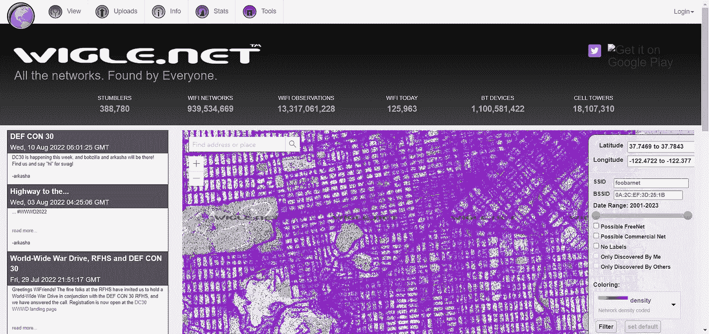
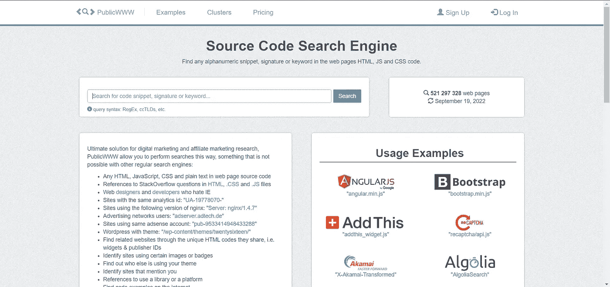
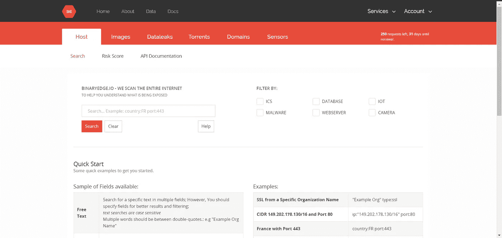
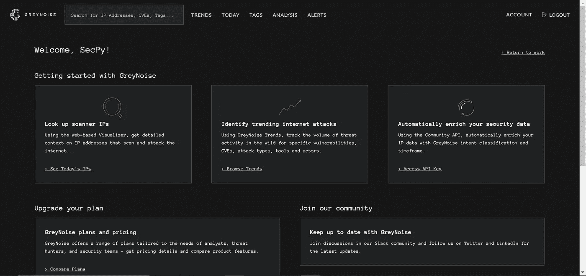
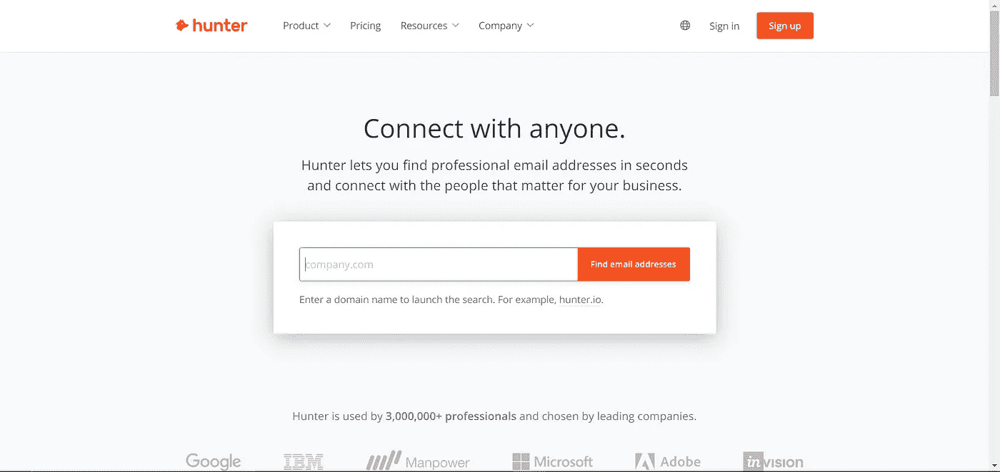
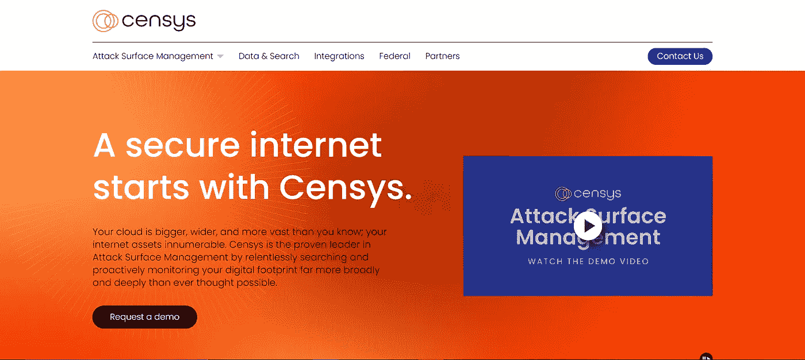
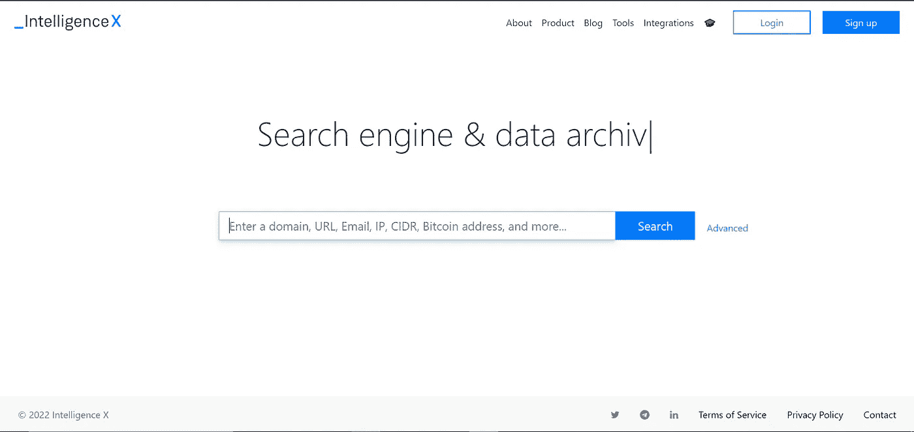
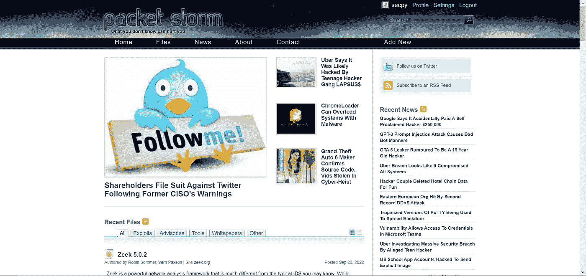
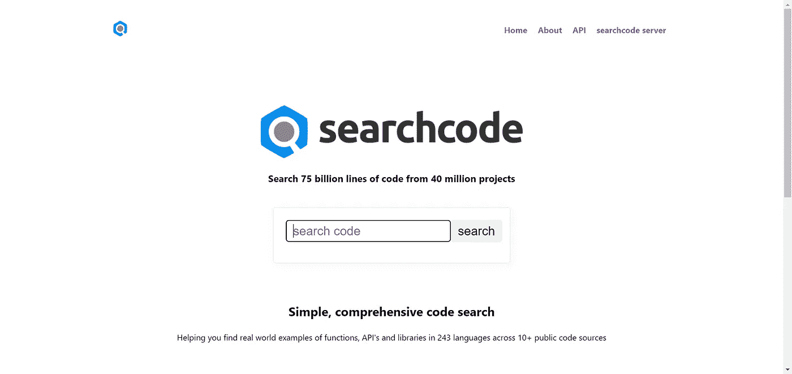

# 网络安全研究人员的 30 个搜索引擎(第 3 部分，共 3 部分)

> 原文：<https://infosecwriteups.com/30-search-engines-for-cybersecurity-researchers-part-3-of-3-aa6cae94db0d?source=collection_archive---------3----------------------->

由 [anshul vyas](https://www.instagram.com/_ansh_vyas/) 撰写

这是安全研究人员使用的搜索引擎的三个部分中的第三个。

> **链接第一部分:**[**https://secpy . medium . com/30-search-engines-for-cyber security-researchers-part-1-of-3-faf 68 bfc 6 be 8**](https://secpy.medium.com/30-search-engines-for-cybersecurity-researchers-part-1-of-3-faf68bfc6be8)
> 
> **链接到第二部分:**[**https://secpy . medium . com/30-search-engines-for-cyber security-researchers-part-2-of-3-3412 d6a 35118**](https://secpy.medium.com/30-search-engines-for-cybersecurity-researchers-part-2-of-3-3412d6a35118)

# 21.CRT.sh:搜索由 CT 记录的证书

[https://crt.sh/](https://crt.sh/)

有一个名为 crt.sh 的站点，您可以在其中找到特定域的所有 SSL 或 TLS 证书。这个网站是开源的。使用站点的 GUI 格式，收集信息非常容易，目的是保持证书日志非常透明。也可以找到密文格式的证书算法。crt.sh 名称代表“证书”。圣赫勒拿”。

# 22.Wigle:无线网络数据库，带有统计数据

[https://www.wigle.net/](https://www.wigle.net/)

该网站使用 WiFiGLE(无线地理日志引擎)收集世界各地无线热点的信息。在该网站上，用户可以注册并上传有关发现的热点的信息，如 GPS 坐标、SSIDs、MAC 地址和加密方法。该网站还显示手机信号塔的数据。WiGLE 试图通过收集不同热点的加密信息来创造一种安全意识

# 23.公共网站:营销和联盟营销研究

[https://publicwww.com/](https://publicwww.com/)

研究联盟营销和数字营销变得更加容易。搜索引擎允许用户以其他搜索引擎无法提供的方式进行搜索。在网页源代码中，他们可以搜索 HTML、JavaScript、CSS 和明文，并下载包含这些内容的网站列表。在 HTML 代码或网页中，PublicWWW 可以找到任何字母数字片段、签名或关键字。

使用它，你可以在网页的源代码中找到任何 HTML、JavaScript、CSS 或纯文本，找到共享相同分析 ID 的站点，找到使用电子商务引擎的站点，找到使用 NGINX 的站点，找到广告网络和 adsense 用户，找到带有主题的 Wordpress 站点，等等。每个搜索请求可以返回多达 200，000 个结果，并且结果可以作为 CSV 文件下载。

# 24.二进制边缘—扫描互联网中的威胁情报

[https://app.binaryedge.io/services/query](https://app.binaryedge.io/services/query)

除了关注重要的数据指标，BinaryEdge 还开发了帮助公司提高信息安全性的产品。

# 25.GreyNoise:搜索连接到互联网的设备

https://viz.greynoise.io/

为了将威胁从背景噪音中分离出来，GreyNoise 分析了互联网扫描流量。

# 26.亨特:搜索属于一个网站的电子邮件地址

【https://hunter.io/ 

通过使用 Hunter 在几秒钟内找到专业的电子邮件地址，与对您的业务至关重要的人联系。

# 27.Censys:评估互联网连接设备的攻击面

[https://censys.io/](https://censys.io/)

借助 Censys 攻击面管理，您可以更有效地评估资产的外部安全性，并提高可操作性。

# 28.IntelligenceX 搜索 Tor、I2P、数据泄露、域名和电子邮件。

[https://intelx.io/](https://intelx.io/)

它通过选择搜索词，如电子邮件地址、域、URL、IP 地址、CIDRs、比特币地址、IPFS 哈希等，在暗网、文档共享平台、whois 数据、公共数据泄露和其他地方进行搜索。Archive.org 通过其 Wayback 机器服务存储网站的历史副本。

# 29.数据包风暴安全:浏览最新的漏洞和利用

[https://packetstormsecurity.com/](https://packetstormsecurity.com/)

包风暴安全提供安全工具，利用和咨询。公司使用网站网络向安全网络提供信息。Packet Storm Security 服务于安全专业人员、研究人员和公众。

# 30.搜索代码:从 4000 万个项目中搜索 750 亿行代码

[https://searchcode.com/](https://searchcode.com/)

对源代码和文档进行索引和搜索的搜索引擎是 searchcode。

## 来自 Infosec 的报道:Infosec 每天都有很多内容，很难跟上。[加入我们的每周简讯](https://weekly.infosecwriteups.com/)以 5 篇文章、4 条线索、3 个视频、2 个 Github Repos 和工具以及 1 个工作提醒的形式免费获取所有最新的 Infosec 趋势！