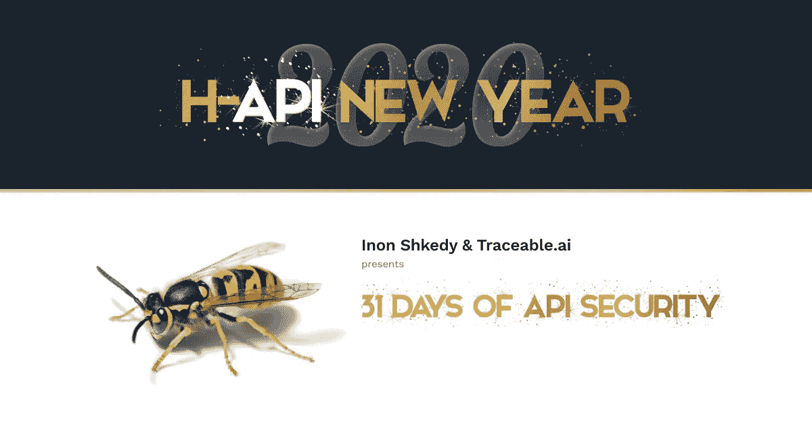

# 31 个技巧— API 安全性和测试

> 原文：<https://infosecwriteups.com/31-tips-api-security-pentesting-480b5998b765?source=collection_archive---------0----------------------->

为了迎接新的一年，我们在 2020 年 1 月发布了关于 API 安全性的每日提示。

我们启动这个项目是因为我们想帮助开发人员、安全工程师和测试人员了解 API 安全性和 API 测试。

我们意识到在这些领域找到资源并不容易，所以这只是众多项目中的一个:)

别忘了在推特上关注我们( [@InonShkedy](https://twitter.com/InonShkedy) 和 [@Traceable.ai](https://twitter.com/traceableai) )！

# 31 API 提示-时间顺序，原始格式

我们的一个追随者， [Smodnix](https://twitter.com/smodnix) ，将所有的提示汇编成一个 GitHub 知识库:

 [## smodnix/31 天 API 安全提示

### 旧版本的 API 更容易受到攻击，并且缺乏安全机制。利用…的可预测性

github.com](https://github.com/smodnix/31-days-of-API-Security-Tips) 

谢谢你 Smodnix😊！

# 31 API 提示+类别和统计

我创建了一个详细的电子表格，包括统计数据(赞数/转发数)，并将提示分为以下几类:

> 授权(6 个技巧)|认证(1 个技巧)| CSRF (1 个技巧)|数据暴露(1 个技巧)|拒绝服务(1 个技巧)|注入(4 个技巧)|批量分配(2 个技巧)|如果在测试中遇到问题该怎么办(12 个技巧)|工具(1 个技巧)

你可以使用过滤器，找到哪些技巧让**获得了最多的关注**:

 [## 31 天 API 安全-公开

### 大规模分配是一件真实的事情。现代环境鼓励开发人员使用“批量分配”，而不…

docs.google.com](https://docs.google.com/spreadsheets/d/1jn3JnWzQFZW41gKo5Fhxwf2ke2w-pvrpCGhBmKhyIBE/edit?usp=sharing) 

# 给五旬节派的最好建议

作为一名圣灵降临者，我能给你的最好建议是:
如果你在一个项目中停滞不前，不知道还能做什么，那就休息一下，去海滩，带着新的想法回来。

为了激励你，这里有一张我的好朋友小火龙在圣莫尼卡 OWASP 会议上的照片:

保护应用程序免受 Team Rocket 攻击

*关注* [*Infosec 报道*](https://medium.com/bugbountywriteup) *获取更多此类精彩报道。*

 [## 信息安全报道

### 收集了世界上最好的黑客的文章，主题从 bug 奖金和 CTF 到 vulnhub…

medium.com](https://medium.com/bugbountywriteup)