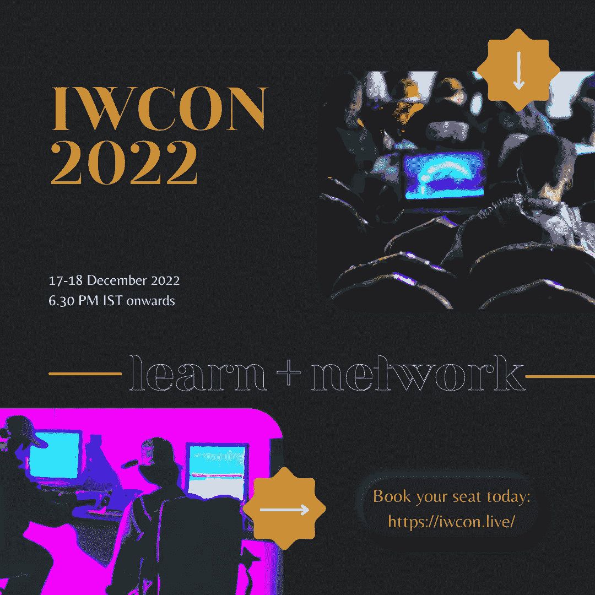

# 3 个关于 Web3 黑客攻击的视频，加速您的网络安全之旅

> 原文：<https://infosecwriteups.com/4-videos-about-web3-hacking-to-fast-forward-your-cybersecurity-journey-6e14b9b7d722?source=collection_archive---------2----------------------->

## 向我们的专家学习。

亲爱的朋友们，你们好

在这篇文章中，我们收集了 infosec 中的中坚分子关于如何开始 Web3 黑客攻击的各个方面的专家意见。

所有这些视频都是由 Infosec Writeups 组织的虚拟网络安全会议和网络活动 IWCON 2022 的片段。

观看、欣赏、学习，如果你想现场见证这样的精彩，[今天](https://iwcon.live/)就注册参加 2022 年 12 月 17 日至 18 日举行的 IWCON 20222.0 版本的 [**。**](https://iwcon.live/)

# 为什么昆虫奖金在 DeFi 中是一件大事？😲💵

观看 Immunefi 的 CTO Duncan Townsend 详细解释严重性。

这是我们之前#IWCON2022 的一个片段。下一版正在发生！！

[**立即注册，保留您的座位。**](https://iwcon.live/)

# 如果有人在区块链上删除#contract，还能恢复吗？🤔

观看 Zseano，创作者 BugBountyHunt3r，详细解释可能性。

在#IWCON2022 大会上，您可以向 16 位出色的安全专家提出您的紧迫问题！

🔥 [**立即注册:iwcon.live**](https://iwcon.live/)

# 你知道找到智能合约的自毁漏洞可以让你赚钱吗？😲💵

观看@immunefi 的 CTO Duncan Townsend 详细解释严重性。

这是我们之前# IWCON2022The 的一个片段，下一个版本正在发生！！

🔥 [**立即注册:iwcon.live**](https://iwcon.live/)

# 有什么问题吗？我们是来解决这些问题的。

如果您有任何问题、疑虑或阻碍您参加 IWCON 2022 的障碍，我们很乐意回答。

请回复此邮件(或在下方留下评论)，我们将尽快回复您。

期待在 IWCON 2022 上与您见面。

[***今天预定座位*** 。](https://razorpay.com/payment-button/pl_K8cxPtmUyBH2PC/view)

最佳，
编辑团队
Infosec 报道。