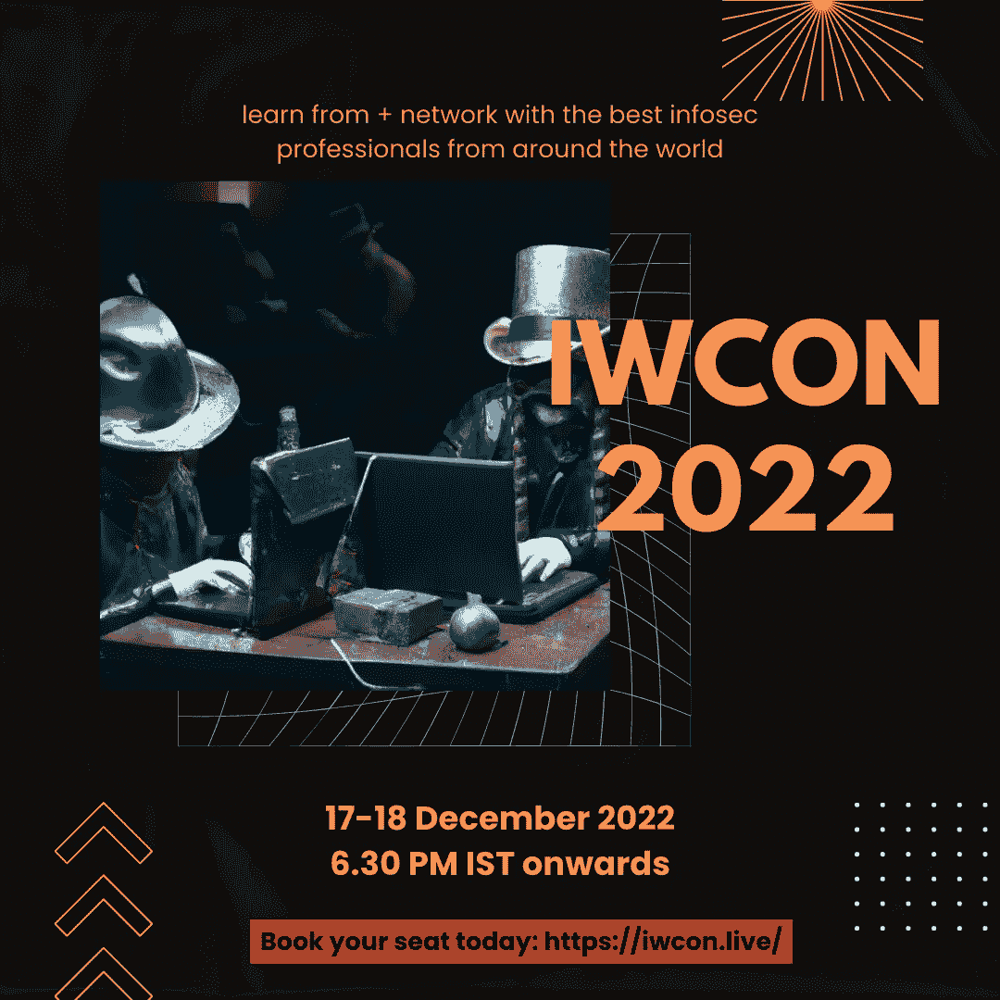

# 4 个视频帮助你开始信息安全/黑客生涯

> 原文：<https://infosecwriteups.com/4-videos-to-help-you-at-the-start-of-your-infosec-hacking-career-2a5bae0bbe5a?source=collection_archive---------1----------------------->

## 向专家学习，提升您的技术敏锐度。

亲爱的朋友们，你们好

在本帖中，我们收集了 infosec 中坚力量关于如何开始 infosec 之旅的专家意见。

所有这些视频都是由 Infosec Writeups 组织的虚拟网络安全会议和网络活动 IWCON 2022 的片段。

观看、欣赏、学习，如果你想现场见证这样的精彩，[今天](https://iwcon.live/)就注册参加 2022 年 12 月 17 日至 18 日举行的 IWCON 20222.0 版本的 [**。**](https://iwcon.live/)

# 在职业生涯的开始阶段，你应该在 bug 上花多长时间？

WebImmunify 的联合首席执行官侯赛因·达赫尔(Hussein Daher)回答了观众的一个问题。

在 [#IWCON2022](https://twitter.com/hashtag/IWCON2022?src=hashtag_click) ，你可以足不出户地向安全专家询问你的燃眉之急。

[**在这里注册**](http://iwcon.live) 。

# 如果你不是开发人员，你怎么知道代码是易受攻击的呢？😥

观看之前#IWCON2022 的视频片段，其中 [Harsh Bothra](https://medium.com/u/54fa249211d2?source=post_page-----2a5bae0bbe5a--------------------------------) 解释了策略🙌

下一版正在发生！😍

[**在这里预订您的座位向专家提问**](http://iwcon.live) 。

# 你知道如何用 APK 工具反编译吗？🤔

观看[Aseem Shrey(@ Aseem Shrey)](https://medium.com/u/ba2018ecf508?source=post_page-----2a5bae0bbe5a--------------------------------)，安全工程师@荡漾，详细讲解过程😍🔥

这是我们之前#IWCON2022 的一个片段。

下一版正在发生！！ [**现在注册学习酷炫#infosec 的东西。**](http://iwcon.live)

# 有一个不好的榜样会如何影响你的#黑客之旅？🤔

@PentesterLab 首席执行官 Louis Nyffenegger 在他过去的#IWCON2022 演讲中解释了这种严重性🔥

新版一个月后就要出了！😍

[**现在注册你的虚拟座位。**](http://iwcon.live)

# 有什么问题吗？我们是来解决这些问题的。

如果您有任何问题、疑虑或阻碍您参加 IWCON 2022 的障碍，我们很乐意回答。

请回复此邮件(或在下方留下评论)，我们将尽快回复您。

期待在 IWCON 2022 上与您见面。

[***今天就预订座位*** 。](https://razorpay.com/payment-button/pl_K8cxPtmUyBH2PC/view)

最佳，
编辑团队
Infosec 报道。