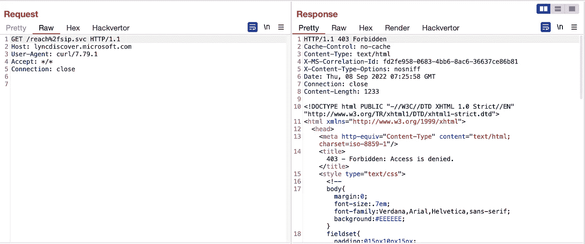
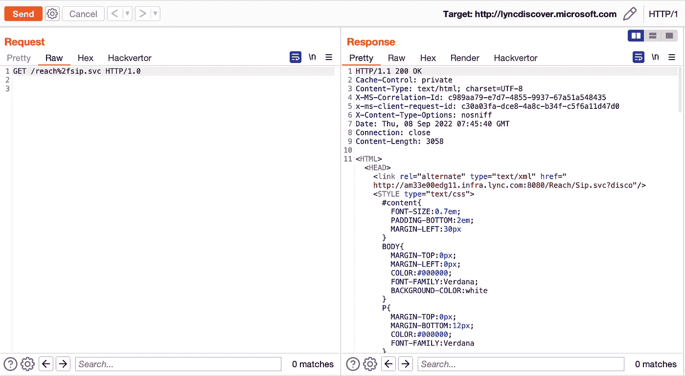
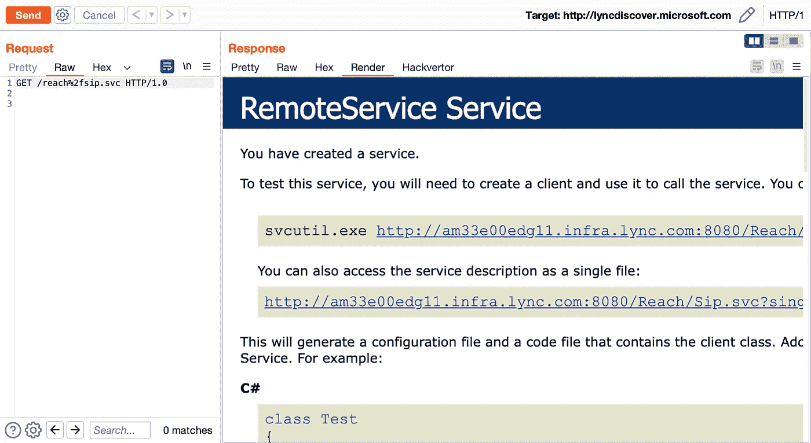
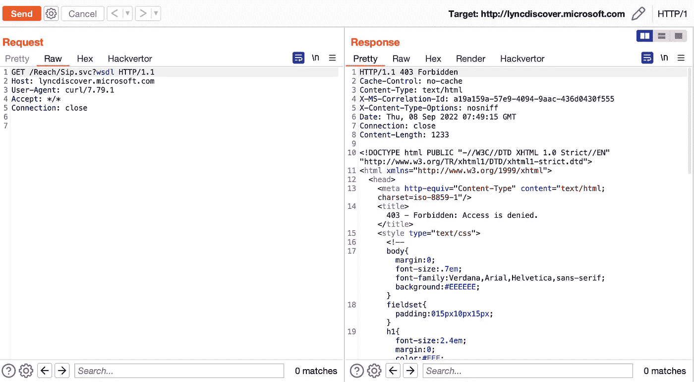
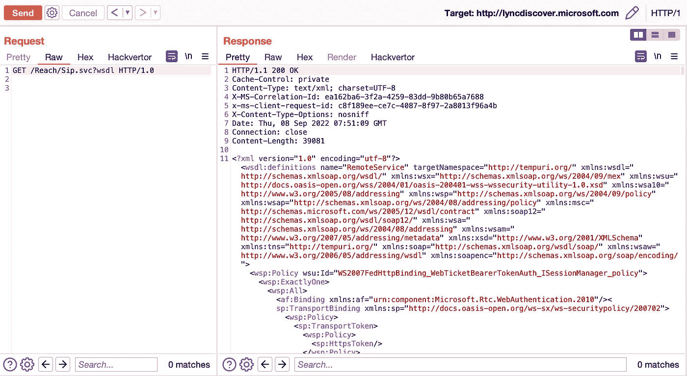
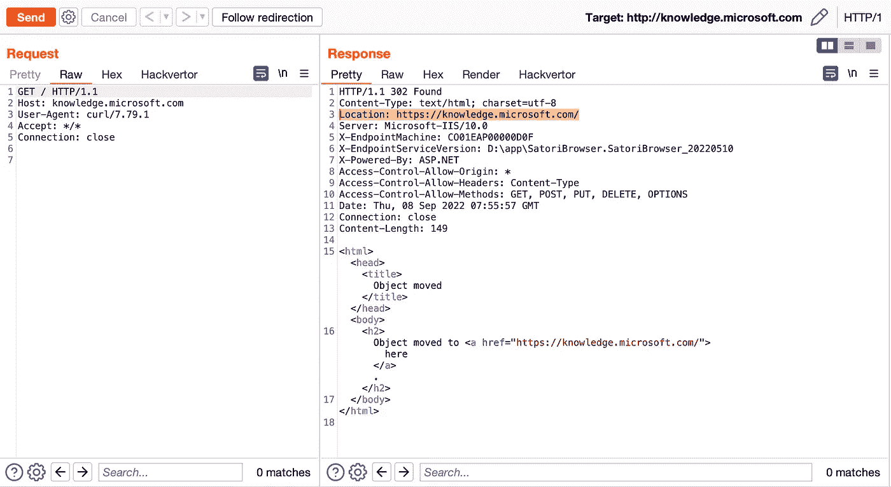
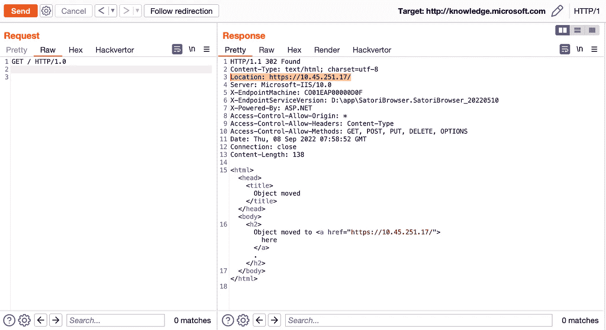

# 新技术 403 绕过 lyncdiscover.microsoft.com

> 原文：<https://infosecwriteups.com/403-bypass-lyncdiscover-microsoft-com-db2778458c33?source=collection_archive---------0----------------------->

你好

我发现了一种绕过 403 的新技术，想和你分享一下。我研究 HTTP 协议已经有一段时间了。经过检查和研究，我发现 HTTP 协议的 1.0 版本可以用来绕过 403。我一直对写评论的人有意见。他们添加了许多解释，人们厌倦了阅读书面报道，所以我直接解释漏洞:)

我开始在 lyncdiscover.microsoft.com 域名上做模糊处理，发现了几个 403 禁止的文件。

403 禁止“到达%2fsip.svc”

经过检查，我得出的结论是，当我清除所有的头值时，服务器对主机作出反应。
我已经对 HTTP 协议进行了研究，并在这里使用了相同的研究
**提示:
将 HTTP 协议版本更改为 1.0。** 而我没有在表头设置任何值。
**Tip2 :
如果服务器和任何其他安全机制没有以正确的方式配置，我们不会将 Host 放在报头中。它将目的地址本身放在报头中，这使我们被称为本地地址。**

200 成功“到达%2fsip.svc”

我用同样的方法尝试了另一个文件，它再次被绕过。

403 禁止“Reach/Sip.svc？wsdl "

200 成功“Reach/Sip.svc？wsdl "

我想在这个补写上再补充一点…
你也可以用这个方法绕过(CDN)获得服务器 IP。我给你看一个。

位置标题响应

正如你所看到的，在 Location 中，它向我们显示了返回的域名本身的地址。
我们再次使用相同的方法并发送请求，这一次它将显示服务器的主地址。

位置响应

我希望这篇文章对你有用。
感谢 Gil Nothmann 和 portswigger 将这项技术添加到了打嗝工具中。
[https://portswigger . net/bapp store/444407 b 96d 9 C4 de 0 ADB 7 aed 89 e 826122](https://portswigger.net/bappstore/444407b96d9c4de0adb7aed89e826122)

最诚挚的问候，
阿巴斯·海巴蒂。

[https://twitter.com/abbas_heybati](https://twitter.com/abbas_heybati)https://www.linkedin.com/in/abbas-heybati-76432220b

## 来自 Infosec 的报道:Infosec 每天都有很多内容，很难跟上。[加入我们的每周简讯](https://weekly.infosecwriteups.com/)以 5 篇文章、4 个线程、3 个视频、2 个 Github Repos 和工具以及 1 个工作提醒的形式免费获取所有最新的 Infosec 趋势！