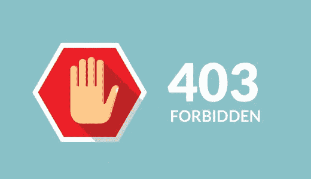
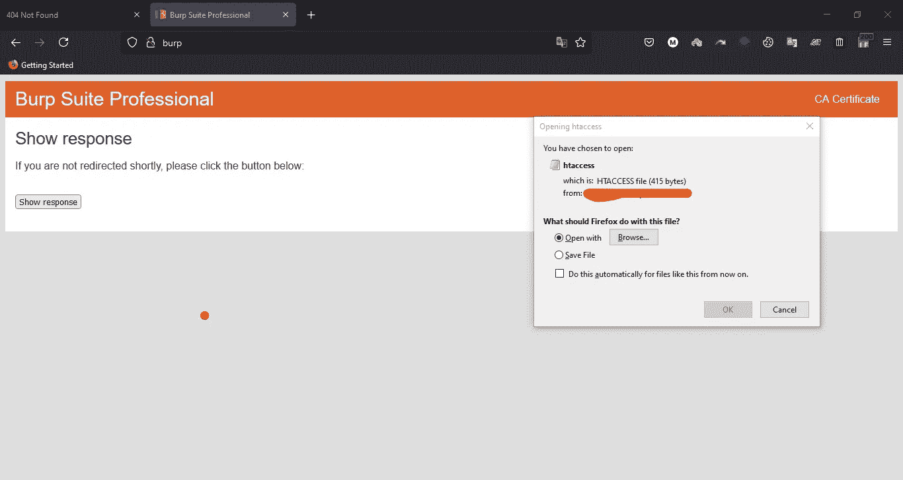
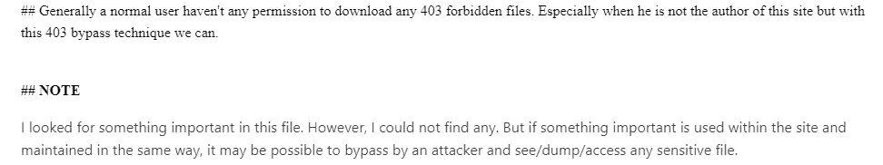
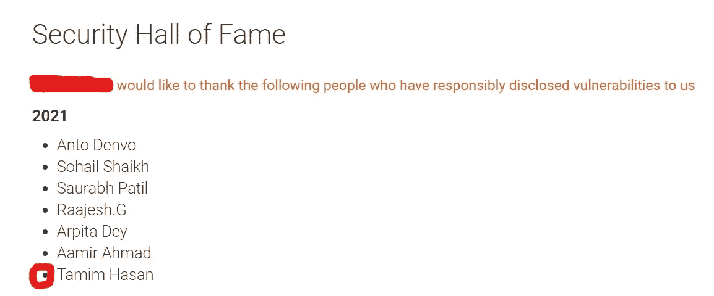
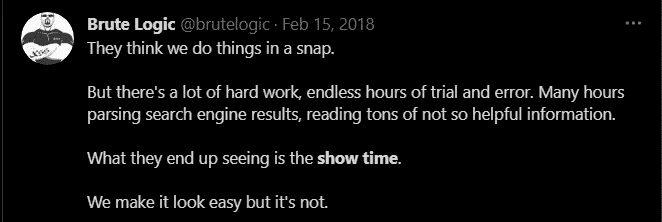

# 403 禁止绕行通向名人堂

> 原文：<https://infosecwriteups.com/403-forbidden-bypass-leads-to-hall-of-fame-ff61ccd0a71e?source=collection_archive---------0----------------------->

## 愿你平安

你好黑客们。我希望你一切都好。我是塔米姆·哈桑，来自孟加拉国🇧🇩.的安全研究员和臭虫赏金猎人

今天我们要讨论的是 403 禁止绕道。我试图用一种简单的方式来解释它，然后，我会谈谈一些 403 旁路技术。所以，让我们毫不迟疑地开始吧。

## 那么什么是 403 禁止绕道呢？

***绕过 403 禁止错误表示客户端能够与服务器通信，但服务器不允许客户端访问所请求的内容。***

几天前，我选择了一个程序来寻找 bug。像往常一样，我开始在网站上侦察，发现 400+子域。同时查看他们的截图。我看到一些 403 状态代码，通常我不会太关注这个。但我不知道为什么那天我会想让我们试着绕过 403。所以我来到了一个类似于[**https://subs . XYZ .**](https://subs.xyz.it)**com**的子域。

为了检查它的 403 禁止机制，我写了一些基本的关键字，比如 hello 等等。我只是想检查它是如何工作的。是限制我任何类型的目录还是只限制我敏感的目录？所以当我搜索的时候

[**https://subs.xyz.it/hello**](https://subs.xyz.it/hello)它给我的是“没有找到”，但是当我搜索[**https://subs.xyz.it/.htaccess**](https://subs.xyz.it/.htaccess)它给我的是 403。

这意味着这个目录存在于这个子域中。现在是时候绕过它了。我用了一些 403 禁止绕过的基本技术，比如 dir 蛮力，use /(斜线)等等，但是没有运气。然后，我启动我的打嗝套件并拦截请求，一如既往，我改变了请求方法 **GET → POST** 再次不起作用，仍然显示 403。然后我把它改成 **GET → TRACE** 💥它给了我 200 个回复，然后我点击“**在浏览器中显示回复**”，并将其粘贴到浏览器上，猜猜会发生什么！的。htaccess 文件弹出，给我下载权限。

我感到高兴，并认为可能有一些东西。但是当我看到目录中没有任何内容时，我感到很疑惑。这让我很担心。但是过了一会儿，我想等等🤔尽管我一无所获，但我还是绕过了他们的 403 机制。那么我为什么不应该举报他们呢？

让我们试着翻转一下场景

我从[哈拉比](https://ahmdhalabi.medium.com/)先生那里学到的翻转方法。谢谢哈拉比先生与我们分享技术。

猜猜几天后他们把我加进了他们的名人堂。

现在是时候谈谈(简短地)一些 403 禁止技术了

**## Dir brute:**

403 禁 dir 后蛮力。选择正确的单词表。比如你的目标网站运行在一个 apache 服务器上，你选择了一个包含 IIS，NIGIX 服务器单词列表等的单词列表。

这意味着两件事

1|它在网站上制造不必要的噪音。为此，你可能会被公司列入黑名单。

2 |如果你的词汇表包含了所有与你的目标无关的东西，那就意味着你没有做好侦察工作。

别傻了，你是个黑客😉😉。

**你可以查看** [**这个**](https://github.com/tamimhasan404/Wordlist404) **和** [**这个**](https://github.com/tamimhasan404/Chart-Of-Wordlist) **回购，帮助你创建自己的自定义词表。**

**##变更请求方式:**

更改请求的方法，如 GET → POST，GET — > TRACE 等。

##尝试使用 curl 命令绕过 403

如果添加 **Content-Length:0** 成功绕过 403，那么您可以使用这个命令利用它

**curl-X POST-H " Content-Length:0 "【https://www.xyz.com】**

**运筹学**

**如果您看到添加 X-rewrite-url 能够绕过 403，那么您的漏洞利用命令将**

**curl-I-s-k-X $ ' GET '-H $ ' Host:sub . XYZ . com '-H $ ' X-rewrite-URL:。https://sub.xyz.com/'**

****##常见的一种:****

**喜欢**

****xyz.com/secret/*****

****xyz.com/secret/./****

****xyz.com/secret/****

****xyz.com/%2f/secret.txt/****

****##使用自动化:****

**另一方面，您可以使用自动化工具来简化您的工作**

** [## lobuhi/byp4xx

### 使用# bugbountytips 中讨论的众所周知的方法绕过“403 禁止”消息的简单 bash 脚本…

github.com](https://github.com/lobuhi/byp4xx)  [## iamj0ker/bypass-403

### 一个简单的脚本，仅供自己使用，用于绕过 403。它也可以用来比较各种条件下的响应…

github.com](https://github.com/iamj0ker/bypass-403) 

【https://github.com/gotr00t0day/forbiddenpass 

比如，如果工具给你结果 **X-rewrite-url = 200** ，那么你可以尝试用**curl-I-s-k-X $ ' GET '-H $ ' Host:sub . XYZ . com '-H $ ' X-rewrite-URL:手动利用它。htaccess ' $ '**[**【https://sub.xyz.com/'】**](https://account.mackeeper.com/')**这个命令，检查它给你一些敏感信息还是只显示默认的 200 页。**

****动机部分:****

****

**他的话激励了我很多。这就是为什么我与你分享这个。因为在这个领域，这类词汇对我们帮助很大。这意味着没有什么是容易的，但我们必须努力工作来实现我们的目标。**

**今天就到这里吧，伙计们。如果我犯了任何错误，请原谅我，如果你有任何建议，让我知道。祝您愉快:)**

****可以关注我的**[**Youtube**](https://www.youtube.com/c/HackoMedia404)**|**[**Github**](https://github.com/tamimhasan404)**|**[**Twitter**](https://twitter.com/tamimhasan404)**|**[**Linkedin**](https://www.linkedin.com/in/tamimhasan404/)|[**脸书**](https://www.facebook.com/tamimhasan404)****