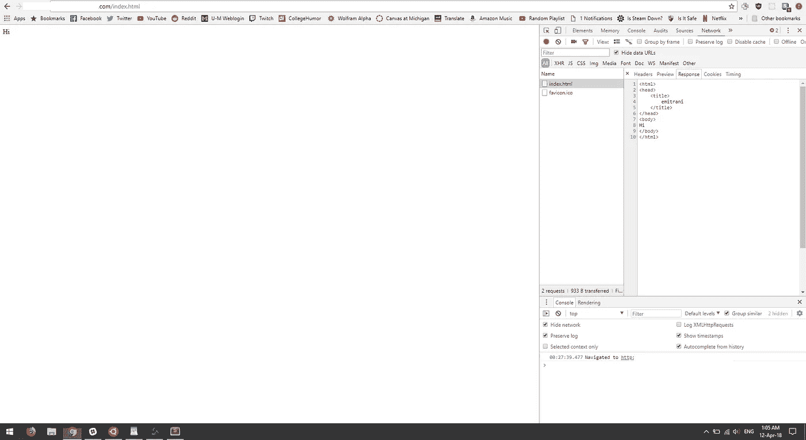
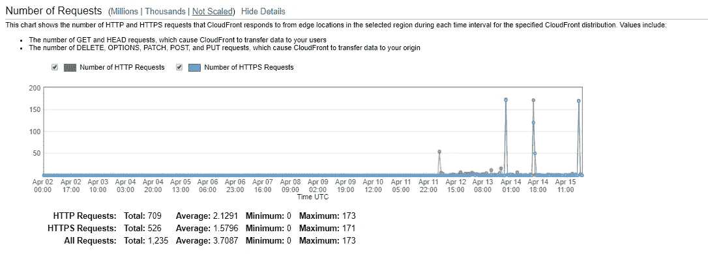
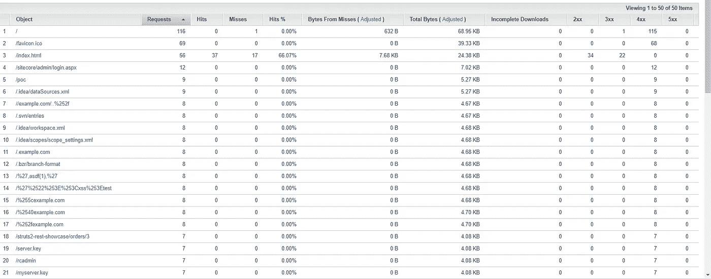

# 4500 美元的赏金——我是如何幸运的

> 原文：<https://infosecwriteups.com/4500-bounty-how-i-got-lucky-99d8bc933f75?source=collection_archive---------0----------------------->

这是一个简短的解释，我是如何通过在正确的时间做侦察接管了一个子域，以及我在 bug bounty 社区了解到的竞争情况。

首先，我用来识别易受攻击的子域的工具是迈克尔·亨利克森的 Aquatone。这个工具非常适合侦察，每个黑客都应该考虑用它来侦察目标。幸运的是，我在克隆 Aquatone repo 的第一天就遇到了这个易受攻击的域名，但你可能没有那么幸运。

在运行`aquatone-takeover — domain {{target}}.com`之后，我在 AWS Cloudfront 上看到一个容易被接管的域名。起初，我并不兴奋，因为大多数时候你会得到一个 CNAME 已经在使用错误试图要求一个子域。然而，令我非常惊讶的是，该公司忘记删除 CNAME，我可以要求它。

这就是易受攻击的 Cloudfront 域的样子

这些当然是优步在使用，不可能索赔。顺便提一下，检查结果是否错误的一个快速方法是同时使用 http 和 https 导航到主机。如果两者都返回相同的错误页面，您可能会接管该域并登录 AWS。

如果您也能够申请一个子域，那么最好的做法是将您的内容托管在其他路径中，以避免损害公司的声誉。我在我的 AWS bucket 上托管了一个简单的 HTML 文件，并将域指向该文件。

一个简单的标题加上你的用户名就足够了

我的报告很快得到了 HackerOne 员工的认可，并在 4 天内得到了修复。然而，最有趣的部分是我在持有域名期间收集的所有数据。

收到 1235 个请求

你可以看到，周末大约有 1200 个请求被发送到这个子域，通过分析，我意识到大多数流量是黑客在进行 dirsearch 或寻找漏洞。在那一刻，我开始意识到公共昆虫奖励项目中存在着多么激烈的竞争。老实说，我很幸运被邀请参加私人聚会，那里的竞争似乎没那么激烈。

发送到网站的各种请求

正如你所看到的，大多数人都在对目标进行基本的侦察，寻找反射的 XSS、打开的重定向或暴露的目录。你需要非常幸运才能找到那种唾手可得的水果，但试试也无妨。

就这个发现而言，我获得了 4500 美元，因为这个子域可以用来在整个域上设置有效的 cookies。老实说，我不知道我是如何击败弗兰斯·罗森的剧本的，但我会接受的。

时间线:

2018 年 4 月 12 日:提交报告并分类

2018 年 4 月 16 日:报告已解决

2018 年 5 月 3 日:奖励 4500 美元