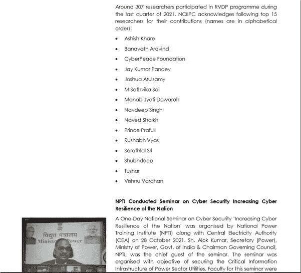
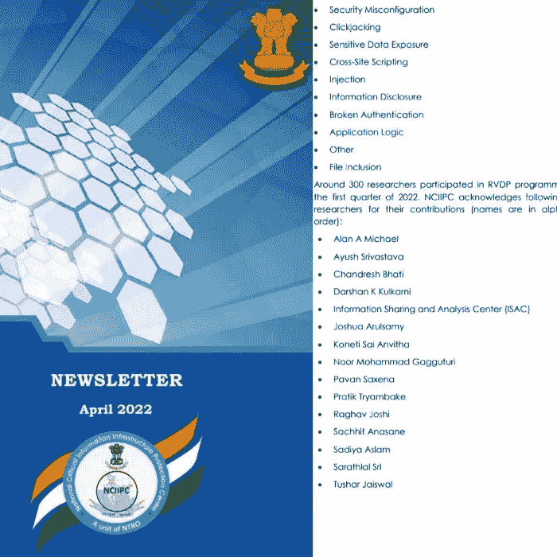
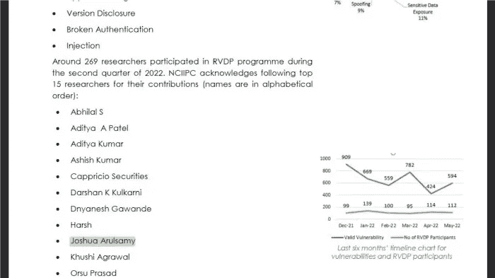
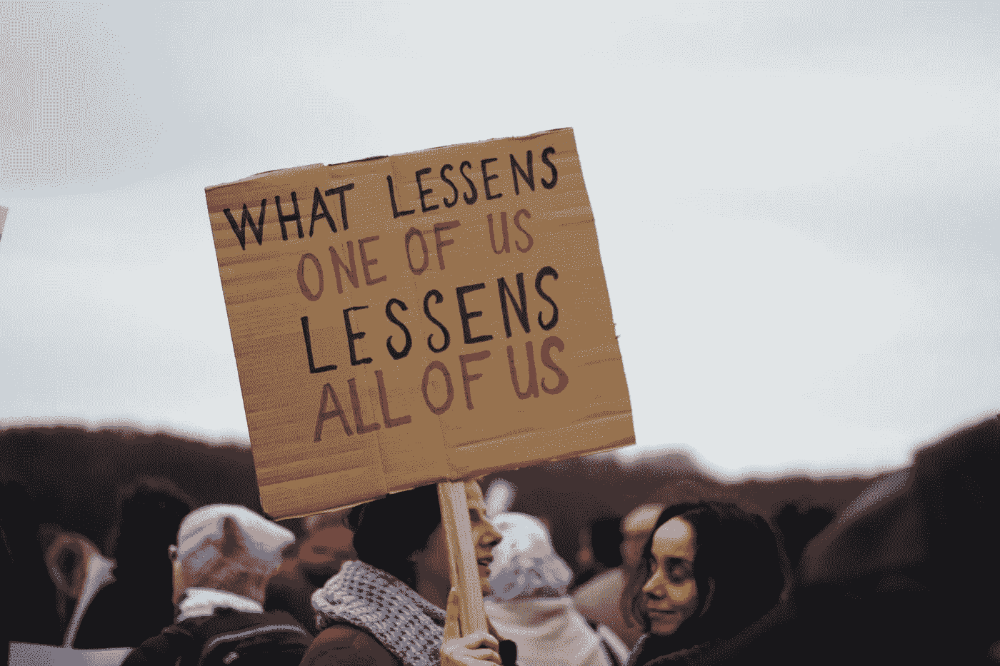
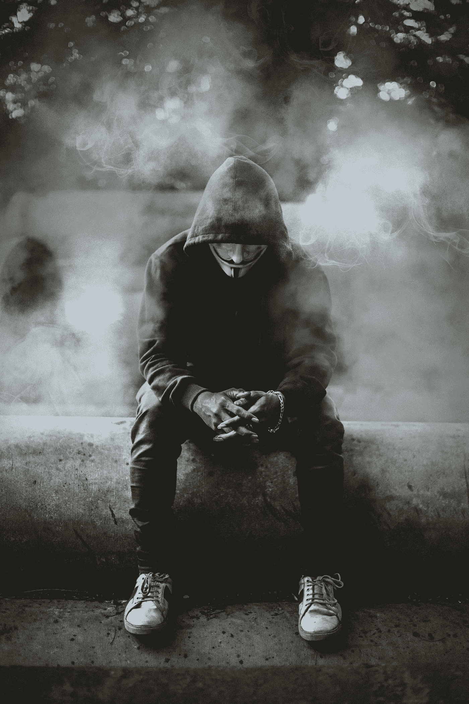
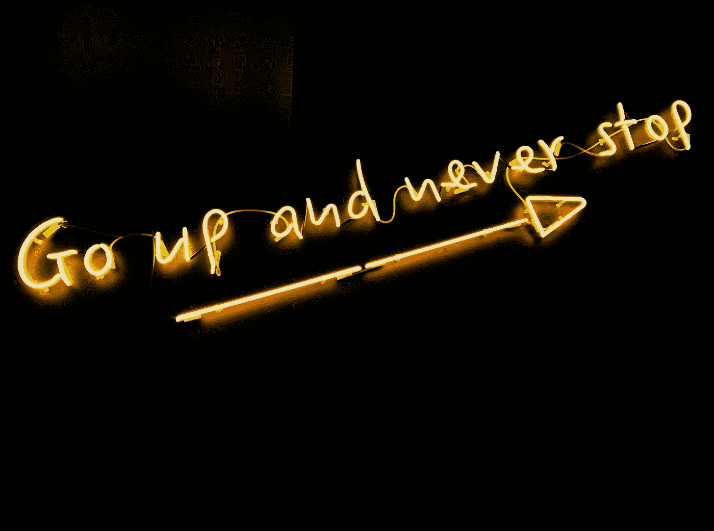

# 使我成为印度前 15 名安全研究人员之一的 5 个大脑黑客！

> 原文：<https://infosecwriteups.com/5-brain-hacks-that-made-me-one-among-the-top-15-security-researchers-779db47b3fc9?source=collection_archive---------0----------------------->

嘿大家好，

这篇博客完全是非技术性的，它是关于每个人在职业发展中需要获得的心态，不管他们目前在哪个领域。

对于那些想知道我是谁的人来说，我是 Joshua Arulsamy，**第一个连续三次作为印度前 15 名安全研究人员出现在 NCIIPC 简讯中的人**。

[**2021 年第四季度**](https://nciipc.gov.in/documents/NCIIPC_Newsletter_Jan22.pdf)

[**2022 年第一季度**](https://nciipc.gov.in/documents/NCIIPC_Newsletter_Apr22.pdf)

[**2022 年第二季度**](https://nciipc.gov.in/documents/NCIIPC_Newsletter_Jul22.pdf)

声明:这不是一个生活建议，所以不要误解我，这些只是我希望我以前知道的一些事情，我不会浪费时间过度思考和沮丧。

为了简单起见，我把它记为点:

1.  **没有人太聪明，也没有人笨**

这个世界上到处都是把自己描绘成超级聪明的人，有时会有意无意地让你感到自卑，但事实上，事情并非如此，如果有人试图让你感到自卑，他们只是害怕如果你在现实中比他们优秀，会对他们虚幻的优越感构成威胁。

只是微笑着接受他们说的话，从不过多争辩。你不会从争论中得到任何东西，但是你的微笑会让他们发疯。简而言之，接受你是哑巴，时间会让他们明白现实。

照片由 [micheile dot com](https://unsplash.com/@micheile?utm_source=unsplash&utm_medium=referral&utm_content=creditCopyText) 在 [Unsplash](https://unsplash.com/s/photos/equality?utm_source=unsplash&utm_medium=referral&utm_content=creditCopyText) 上拍摄

没有人太聪明，也没有人笨

2.**失去亲密的朋友圈没关系**

让你的优先级更高，要么通过自我发展和追逐梦想来寻找幸福，要么与你爱的人共度时光，无论哪种方式，选择一个并享受生活的每一天都是完美的，但选择一个并抱怨失去另一个并不是一个好主意。

照片由 [Ahmed Zayan](https://unsplash.com/@zayyerrn?utm_source=unsplash&utm_medium=referral&utm_content=creditCopyText) 在 [Unsplash](https://unsplash.com/s/photos/alone?utm_source=unsplash&utm_medium=referral&utm_content=creditCopyText) 上拍摄

孤独是强大的

**3。永远不要满足于你所拥有的**

第一次品尝成功会让你疯狂，当你看到人们支持你时，你会变得超级自信，但把它作为燃料燃烧得更亮，而不是作为水，让你内心燃烧的火平静下来，这是很常见的。

照片由 [Fab Lentz](https://unsplash.com/@fossy?utm_source=unsplash&utm_medium=referral&utm_content=creditCopyText) 在 [Unsplash](https://unsplash.com/s/photos/never-settle?utm_source=unsplash&utm_medium=referral&utm_content=creditCopyText) 上拍摄

**4。感谢每一个帮助你走到今天的人**

永远不要忘记一些事情！！

你今天的成就只是你努力的 50 %- 60 %,其中 40 %是因为那些帮助过你、推动过你、无私地为你的成功而努力的人，永远不要忘记他们！

照片由[王思然·哈德森](https://unsplash.com/@hudsoncrafted?utm_source=unsplash&utm_medium=referral&utm_content=creditCopyText)在 [Unsplash](https://unsplash.com/s/photos/be-grateful?utm_source=unsplash&utm_medium=referral&utm_content=creditCopyText) 上拍摄

感激的

**5。接受失败**

生而为人，每个人都容易犯错误，但接受这一点会让你变得更好，并让你的成功率提高两倍！'

我们最大的荣耀不在于从不跌倒，而在于每次跌倒后都能爬起来

照片由[杰森·霍根](https://unsplash.com/@jasonhogan?utm_source=unsplash&utm_medium=referral&utm_content=creditCopyText)在 [Unsplash](https://unsplash.com/s/photos/person?utm_source=unsplash&utm_medium=referral&utm_content=creditCopyText) 上拍摄

失败的荣耀！

非常感谢你阅读这个博客！希望这篇博客对你有一些轻微的影响。

结束，

约书亚·阿鲁萨米

非常感谢您的阅读，请在 medium 和 LinkedIn 上关注我，了解更多精彩内容！