# 5 步预建恶意软件分析实验室

> 原文：<https://infosecwriteups.com/5-step-pre-built-malware-analysis-lab-f70e59521e31?source=collection_archive---------1----------------------->

在 Hyper-V 中建立自己的基于预建 Windows10 的恶意软件分析实验室

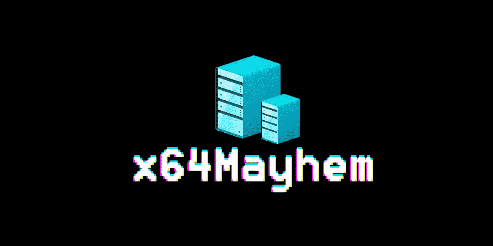

C 创建自己的恶意软件分析实验室既耗时又忙乱，对于初学者来说，安装所有需要的工具可能需要 2-3 天，甚至一整个星期。

我花了两周时间开发了一个稳定的恶意软件分析实验室，当我开始时，找到所有的工具、自动化脚本甚至设置虚拟机都是一个挑战。

因此，我创建了一个完整的虚拟机，预装了所有需要的工具和一个激活的 windows10 开发副本，为期 90 天，您只需点击一下鼠标，就可以将其导入到您的计算机中。

# 安装前要求

1.  您需要稳定的互联网连接来下载约 16.2GB 的数据。
2.  Windows 10 专业版/企业版/教育版(只有他们安装了虚拟机管理程序)
3.  具有二级地址转换(SLAT)的 64 位处理器。
4.  虚拟机监控模式扩展的 CPU 支持(英特尔 CPU 上的 VT-c / VT-x)。
5.  最低 4 GB 内存
6.  约 100GB 的可用存储空间。
7.  7zip 存档管理器来提取. 7z 文件，您可以从以下网站免费下载

 [## 7-Zip

### 7-Zip 是一个高压缩比的文件归档程序。为 Windows 下载 7-Zip 19.00 (2019-02-21):下载 7-Zip…

www.7-zip.org](https://www.7-zip.org/) 

# 激活超级遮阳板

在你的 windows 搜索中搜索 Hyper-V 管理器，你会得到类似这样的结果

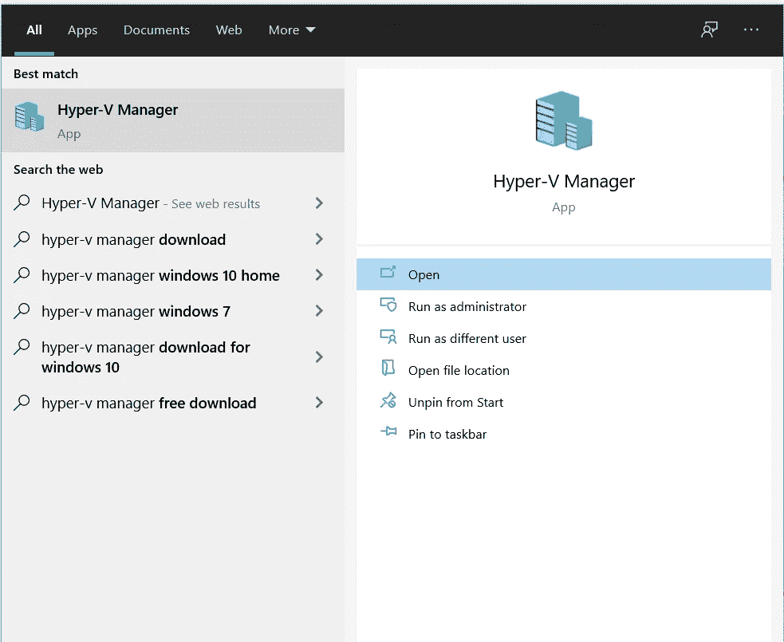

图:Hyper-V 管理器搜索结果

如果你*没有*看到它，你可能需要启用它。请遵循下面的官方指南-

 [## 在 Windows 10 上启用 Hyper-V

### 启用 Hyper-V 在 Windows 10 上创建虚拟机。Hyper-V 可以通过多种方式启用，包括使用…

docs.microsoft.com](https://docs.microsoft.com/en-us/virtualization/hyper-v-on-windows/quick-start/enable-hyper-v) 

一旦完成，我们就可以开始我们的主要努力。

# 下载虚拟机包

这是**唯一的**部分，你需要互联网数据来下载一个大文件(16GiB)，这是我自己设置的压缩导出文件。

进入下面给出的 GitHub 库，点击下载链接，如果我改变了我的文件位置，它将会在这里更新，这样无论你什么时候读这篇文章，你都可以得到它。

 [## saket-Upadhyay/hyper-malware analysis-VM

### 最近更新时间:2021 年 5 月 1 日该 VM 捆绑包由 x64Mayhem 提供。这包含所有需要的工具，这是…

github.com](https://github.com/Saket-Upadhyay/HyperV-malwareanalysis-VM) 

# 装置

## 步骤 1:提取归档文件

使用 7z 归档管理器在您选择的位置提取下载的文件。

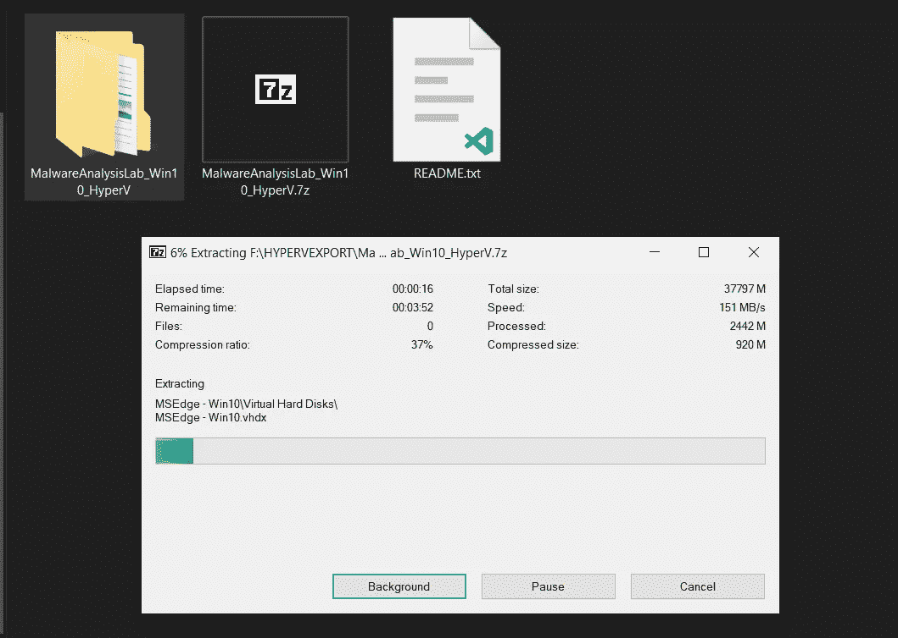

截图:提取 MalwareAnalysisLab _ win 10 _ hyper v . 7z

## 步骤 2:启动 Hyper-V 管理器

在 windows 搜索中搜索“Hyper-V Manager”并运行它。

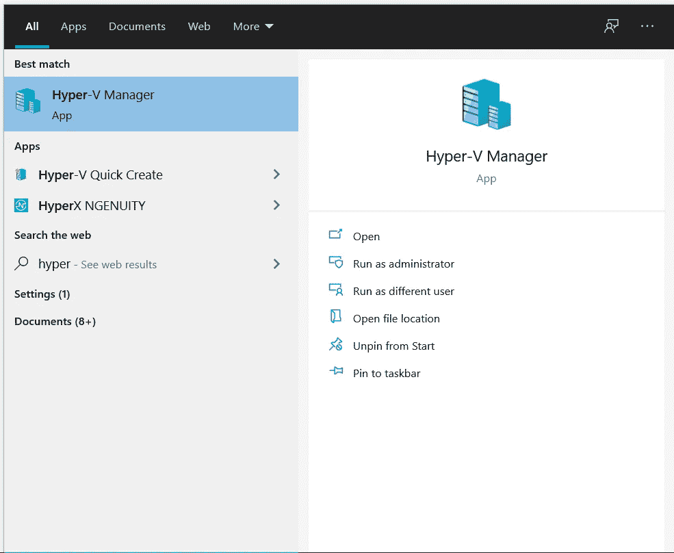

截图:Hyper-V 管理器搜索结果

## 步骤 3:导入虚拟机

点击**导入虚拟机**选项。

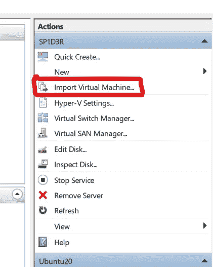

Hyper-V 管理器中的导入虚拟机选项

然后，您需要选择要从中导入虚拟机的文件夹，并从提取的文件夹中选择`MSEdge — Win10`。

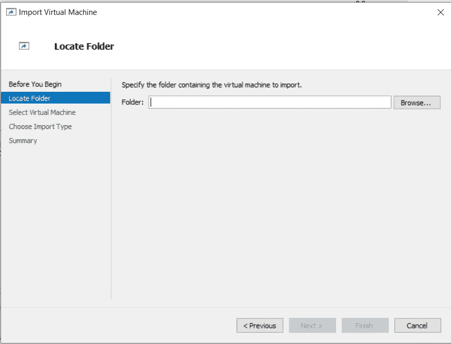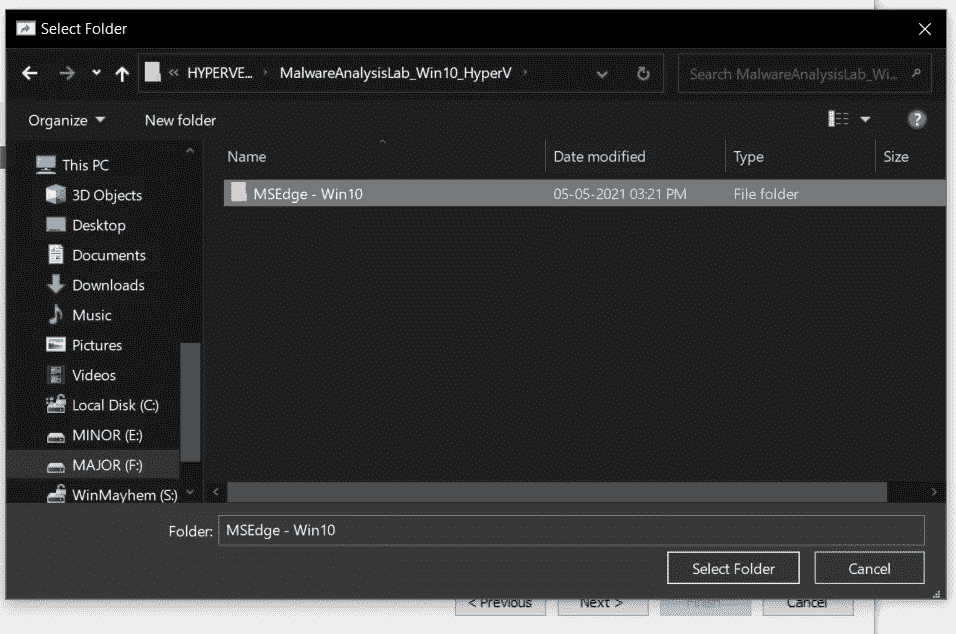

选择“全新安装(带 Flare，90 天激活)”，然后单击“下一步”

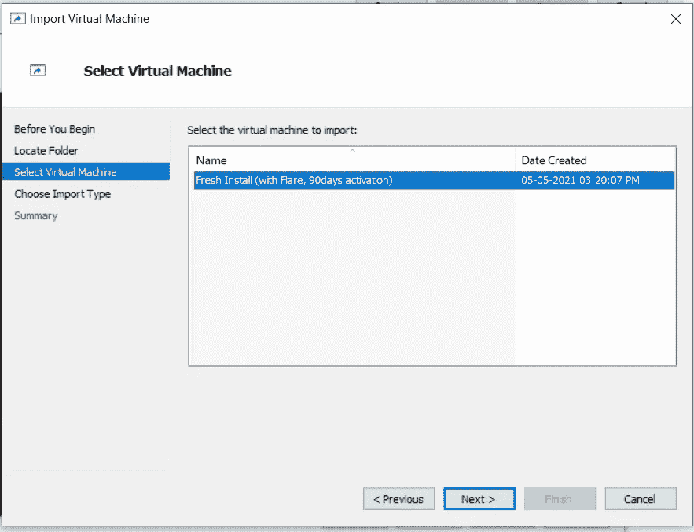

选择“就地注册虚拟机”,然后单击下一步

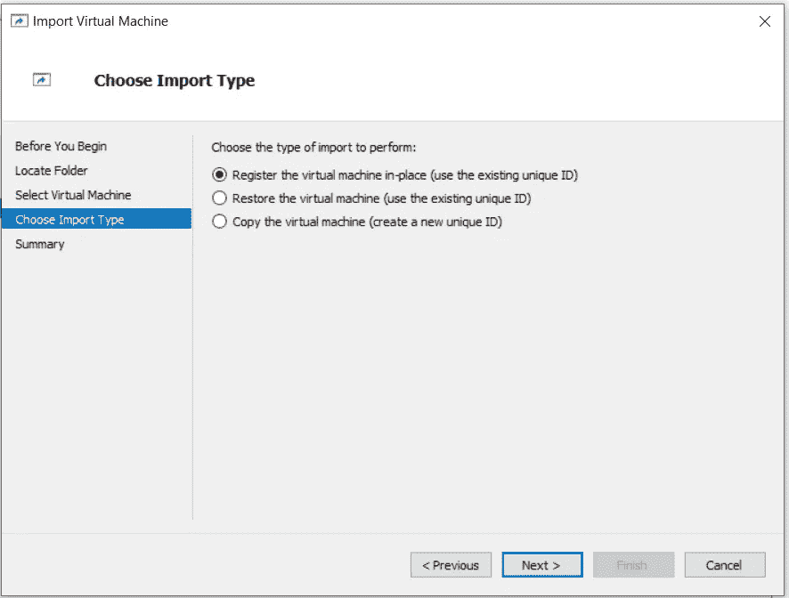

单击完成。

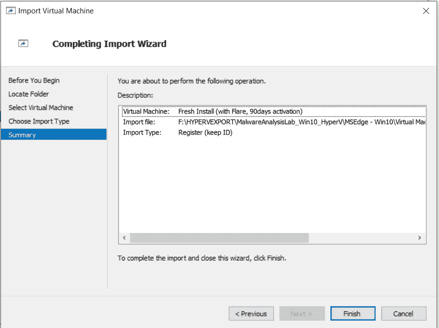

等待导入完成。

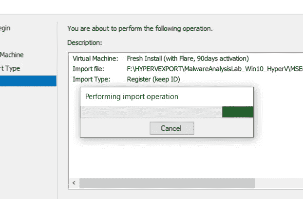

## 步骤 4:创建检查点

为了能够恢复到您激活的窗口创建一个检查点，以扭转一切将全新安装。

右键单击新虚拟机，然后单击“检查点”

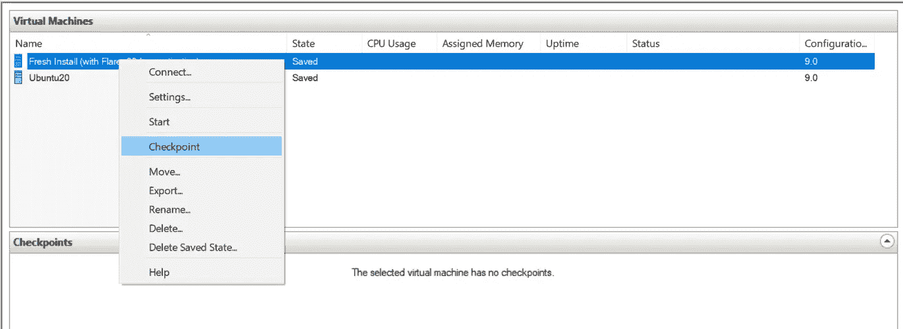

等待它完成，您将在“检查点”部分看到新的检查点。

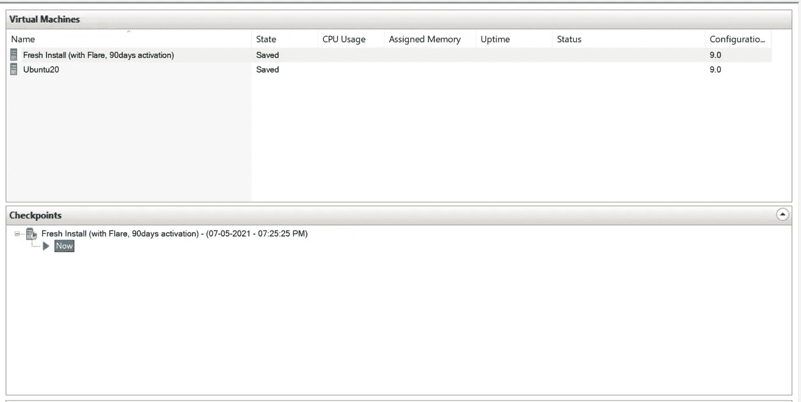

搞定了。您已经成功地在 PC 上安装了虚拟机。

# 步骤 5:启动您的虚拟机

要启动虚拟机，请从侧面板单击“启动”,或者右键单击虚拟机并选择“启动”

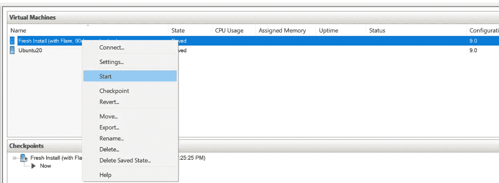

一旦它开始运行，再次右击虚拟机并选择"连接"来连接你的显示器到虚拟机。

选择你喜欢的分辨率，我建议“全屏”。单击连接。

## 用户口令

您将被要求输入密码以登录 IEUser，**密码为:** `**Passw0rd!**`

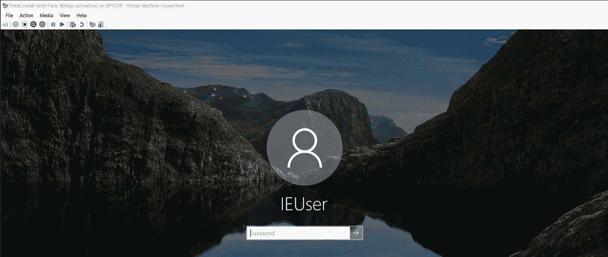

之后，您将看到您的操作系统屏幕，为您服务。

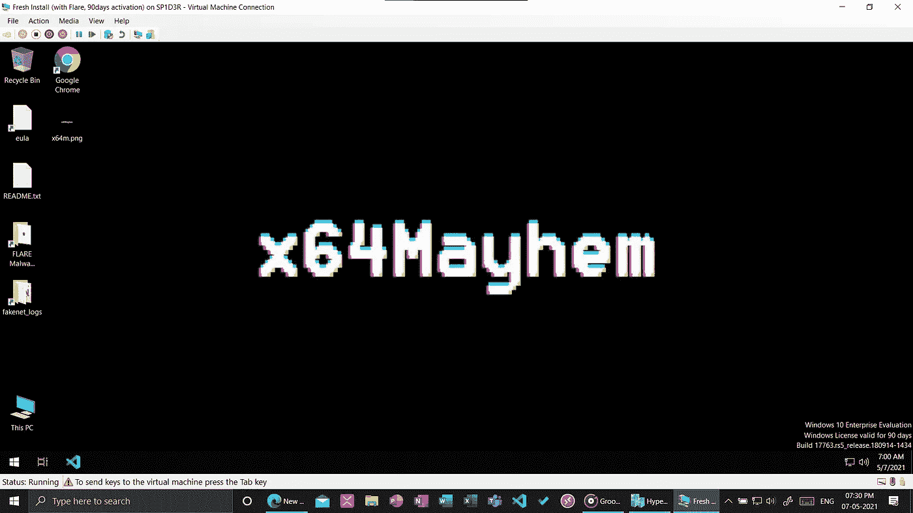

# 结论

所有工具都安装在 Flare 文件夹中。

我希望这将使您的实验室设置过程更容易，并且您将准备好投入到恶意软件分析的巨大世界中。

## 复制的资源—

 [## 火眼/火焰-虚拟机

### _ _____ ______ __ ____ __ | ____| | /\ | __ \| ____| \ \ / / \/ | | |__ | | / \ | |__) | |__ _____\ \ / /| \ / | | __|…

github.com](https://github.com/fireeye/flare-vm)  [## 使用 Windows、Hyper-V 和 FLARE 虚拟机建立恶意软件分析实验室

### 大量针对 Windows 操作系统的恶意软件分析软件和工具的出现，使得建立一个…

cybersecnotes.com](https://cybersecnotes.com/set-up-a-malware-analysis-lab-with-windows-hyper-v-and-flare-vm.html)  [## 虚拟机

### 使用您下载并在本地管理的免费 Windows 10 虚拟机测试 IE11 和 Microsoft Edge 传统虚拟…

developer.microsoft.com](https://developer.microsoft.com/en-us/microsoft-edge/tools/vms/)