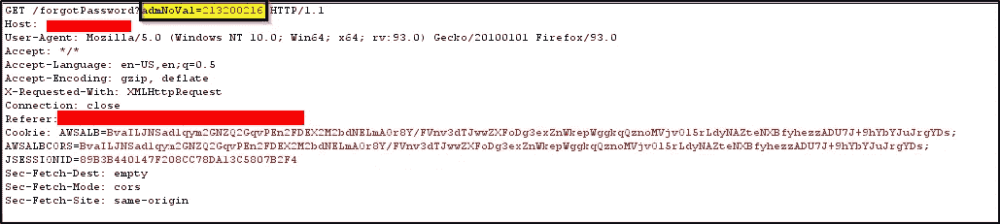
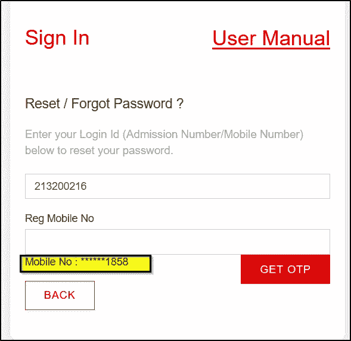
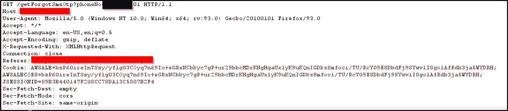

# 500 美元的错误:敏感数据暴露于破碎的访问控制线索，我如何能够接管印度有史以来最大的学院的任何帐户。👨‍💻

> 原文：<https://infosecwriteups.com/500-bug-sensitive-data-exposure-to-broken-access-control-leads-how-i-able-to-take-over-any-33658f16e265?source=collection_archive---------0----------------------->

# *导言*

你好，黑客们，我是 Gowtham，一个有道德的黑客和渗透测试者，喜欢研究漏洞😅。这是我在互联网上的第一个博客，所以如果有任何错误，请原谅我。所以今天，我要告诉你“我如何能在 3 分钟内接管印度最受欢迎和最大的大学的任何用户帐户”。没有任何延迟，让我们开始我们的 Learning❤️[Note:之旅由于某些原因，我不想透露学院的名字，我们就叫它<example.com></example.com>

> ***敏感数据曝光又名信息泄露:***

这所大学有两个域名，即“example.com ”,学生可以在那里参加考试并检查他们的成绩，所以它没有太多的功能。另一个域是“target.com ”,这是一个主域，它有许多很棒的功能，如支付系统、创建学生证和所有学生的数据以及他们的信用卡，等等。

所以通常，每个人都会从一个有很多功能的领域开始，甚至我也是这样😁但是我不能登录到这个域，因为我没有这样做的凭证。然后我切换到下一个域(**example.com**)，开始查看 Javascript 文件，捕捉所有请求并查看它们的响应。我在**忘记密码**中看到了一些东西，请求看起来像这样

在这里，我提供了我自己的准入号码，然后当我看到回应时，**注册的手机号码**被披露。你可能会想这里有什么问题，但即使我给另一个用户一个准入号码，我也能得到他/她的手机号码。现在网站要求我们输入手机号码来发送动态口令以重置密码。

> **破坏访问控制又名账户接管:**

所以当我输入错误的号码而不是注册号码时，它会弹出一条信息要求我输入注册号码。这意味着它只是在客户端验证电话号码，所以此时我输入了我们之前发现的其他用户的注册手机号码。万岁！！！，已经成功绕过了，现在我可以把手机号码字段篡改成我自己的号码，这样我就可以获得 OTP，而不是去注册的手机号码。

当我输入注册的手机号码并将电话号码值更改为我的号码时。

是的，我们做到了。现在，我们获得了用户的 OTP 并输入了它，现在我可以在不认识任何用户的情况下重置他/她的密码。这会导致第二个域上的任何人的帐户被接管。

我立即向域名管理员报告了这个错误，并获得了 500 美元的奖金。

> 最终触摸:

这是我们的故事通常应该结束的地方，但不是我们的情况。

在我的下一篇博客中，我会告诉你我利用这些漏洞绕过了支付系统，可以只花 1 美元支付给每个学生。这对新来的人和其他人来说是非常有趣和有帮助的。

感谢您花费宝贵的时间。很快会在我的第二个博客里见到你。更多提示和建议，请在 Twitter 和 Instagram 上关注我。

insta gram:https://www.instagram.com/gowtham_ponnana/

【https://www.twitter.com/gowtham_ponnana/】推特:T2

问候，

戈塔姆·奈杜·蓬纳纳

