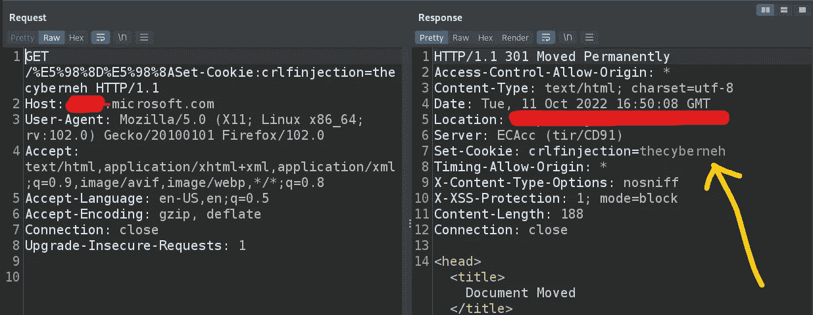
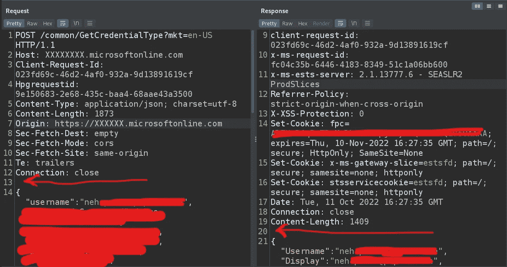
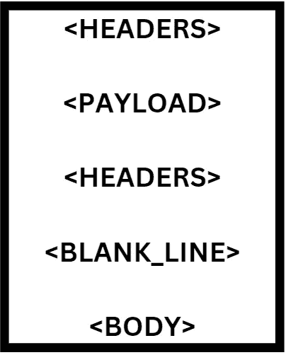
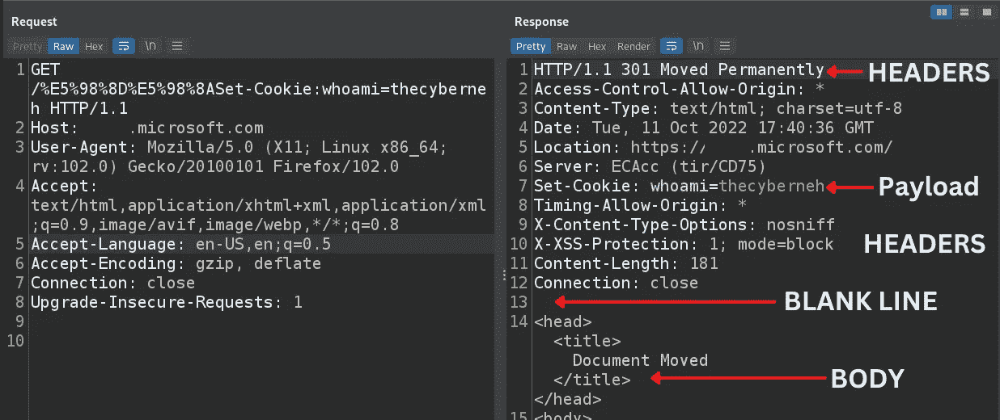
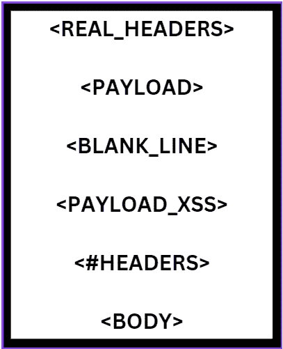
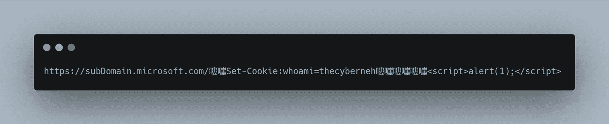
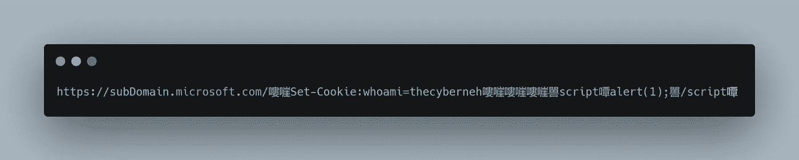
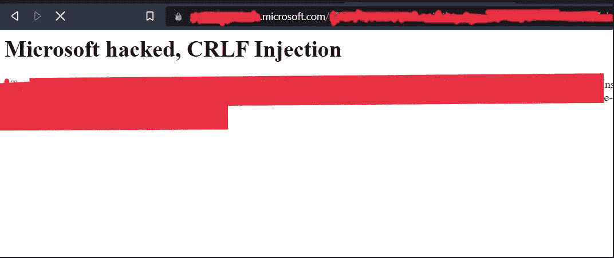

# 微软名人堂 6000 美元|绕过微软防火墙|从 CRLF 到 XSS |微软 Bug 赏金

> 原文：<https://infosecwriteups.com/6000-with-microsoft-hall-of-fame-microsoft-firewall-bypass-crlf-to-xss-microsoft-bug-bounty-8f6615c47922?source=collection_archive---------0----------------------->

Microsoft 防火墙旁路

你好黑客，希望你做得很好。我是奈·帕特尔，又名 [**赛博内**](https://www.linkedin.com/in/thecyberneh/) ，我是一名来自印度的安全研究员。今天我要分享的是我从我们最喜欢的“#微软”和每个 bug 猎人的梦想“#微软名人堂”获得第一笔 4 位数赏金的经历为 **P2 漏洞****S**everity:****重要****

******Bug:——CRLF 到 XSS，进一步剥削(你知道怎么处理它)******

****让我们开始旅程吧****

****所以我花了两三周时间在微软上寻找有效的 bug，但只找到了一些 P4 和 P5。****

****我的主要方法是手动检查所有子域，所以我测试了所有子域和每个子域上的大部分功能。****

****在测试了 50 到 70 个子域名后，我得到了一种不同的子域(据我所知，这个子域只包括高级客户的功能)。****

> ******我想“让我们把重点放在这个子域上，因为它的功能大多是付费的，所以其他安全团队很少探索这些功能”******

****我主要检查了所有不付费的功能(测试不需要任何额外费用)，但没有得到任何东西。****

****一番提神之后，我想“还是从非功能测试或者服务器端测试开始吧”。我从最流行的“主机头注入”和其他一些非功能性测试开始。****

****在花了一些时间在网络应用上之后，我就像“ ***让我们测试一下最容易被忽视的漏洞 CRLF 注入*”******

# ****什么是 CRLF？****

****CRLF 引用了特殊字符元素“CR:回车”和“LF:换行”这些元素嵌入在 HTTP 报头中，以表示行尾(EOL)标记。****

****因此，每当服务器获得 CRLF，它就认为这是一个特性，而不是一个错误。****

# ****什么是 CRLF 注射液？****

****当 web 服务器直接呈现这些特殊字符而不对它们进行编码，并将它们传递给 Location、Set-Cookie 等响应头时，就会发生 CRLF 注入。****

****因此，基本上，当 web 应用程序易受 CRLF 注入攻击时，我们可以将这些特殊字符作为有效载荷发送，服务器会将其解析为行尾，****

****在此之后，CRLF，如果我们发送任何文本，服务器会将它们设置为**响应头******

****设置任意标题，就像我们可以在受害者的浏览器中设置一个 cookie，或者我们可以设置“位置:”标题来迫使受害者重定向到恶意站点等等。****

# ****回到故事…****

****所以带着 CRLF 的意图，我发射了我的第一个有效载荷如下****

```
**/%0D%0A%20Set-Cookie:whoami=thecybernehso main URL :-  [https://](https://subD.microsoft.com/%0D%0A%20Set-Cookie:whoami=thecyberneh)[subDomain](https://subDomain.microsoft.com/%E5%98%8D%E5%98%8ASet-Cookie:crlfinjection=thecyberneh)[.microsoft.com/%0D%0A%20Set-Cookie:whoami=thecyberneh](https://subD.microsoft.com/%0D%0A%20Set-Cookie:whoami=thecyberneh)**
```

****但是我没有注射任何 CRLF。****

****但是回应是**“400 错误请求”**，HTML 是**“HTTP 错误 400。请求的 URL 无效。******

****在这里，我观察到一些不同的情况，主要是当 CRLF 是不可能的或者当服务器受到很好的保护时，web 服务器应该返回**“404 Not Found”**，因为如果服务器受到很好的保护并且我们输入 CRLF 有效负载，服务器会将该有效负载解析为 URL 的一部分，在这种情况下，服务器实际上会将**" % 0D % 0A % 20 set-Cookie:whoami = the cyberneh "**解析为与有效负载不同的路径。****

****而如果没有类似**" % 0D % 0A % 20 set-Cookie:whoami = the cyberneh "**的路径或目录，服务器应该返回**“404 Not Found”**而不是**“400 Bad Request”******

****所以我认为服务器没有得到很好的保护，或者防火墙很弱。****

****为了确认，我尝试了这样的随机网址****

```
**https://[subDomain](https://subDomain.microsoft.com/%E5%98%8D%E5%98%8ASet-Cookie:crlfinjection=thecyberneh).microsoft.com/abcxyzabcxyz**
```

****按照服务器之前预期的行为，服务器返回了**“404 Not Found”**和 HTML 响应**“很抱歉，找不到您请求的页面。URL 可能拼写错误，或者您要查找的页面不再可用"******

****所以从整体情况来看****

> ****如果路径不存在，服务器返回“ **404 未找到”******
> 
> ****当我尝试使用有效负载时，服务器返回“ **400 错误请求******

****在这之后，我确信服务器没有受到保护或者防火墙很弱。所以我必须绕过防火墙或者发射正确的载荷****

****我尝试了一些不同的有效载荷，比如:****

```
**%0D%0A%20Set-Cookie:whoami=thecyberneh
%20%0D%0ASet-Cookie:whoami=thecyberneh
%0A%20Set-Cookie:whoami=thecyberneh
%2F%2E%2E%0D%0ASet-Cookie:whoami=thecyberneh**
```

****在尝试了这个有效负载后，我只得到**“400 错误请求”**所以我想我需要一些不同的东西，因为大多数防火墙会阻止正常和基本的有效负载。****

****我做了一些研究，得到了一些独特的编码，叫做“GBK 编码”。****

# ****了解编码和#防火墙旁路****

```
**Payload responsible for CRLF injection is :- 嘍嘊**
```

****所以在得到这个有效载荷后，我为 CRLF 注入制作了一个新的有效载荷和新的 URL，这次是用**“防火墙旁路”******

****我还使用了 **URL 编码**来避免类似的进一步错误****

```
****BeforeURL Encoding**Main Payload:- 嘍嘊**After URL Encoding**嘍 :- %E5%98%8D嘊 :- %E5%98%8A**
```

****所以在 URL 编码之后，我制作了一个新的有效载荷，就像这样****

```
**[https://subDomain.microsoft.com/%E5%98%8D%E5%98%8ASet-Cookie:crlfinjection=thecyberneh](https://subDomain.microsoft.com/%E5%98%8D%E5%98%8ASet-Cookie:crlfinjection=thecyberneh)**
```

****我用这个网址试了试，然后嘣！！！****

****我得到了一个响应，标题是:**Set-Cookie:crlfinject = the cyberneh******

********

****在那个特别的时刻，我非常开心****

****但是我知道我可以用这个 CRLF 注射做很多事情，所以我没有报告，并试图与其他一些错误联系起来。****

# ****绕过防火墙从 CRLF 到 XSS****

****如您所知，在请求和响应标头的末尾有一个空行，如下所示:-(请求中的第 13 行和响应中的第 20 行)****

********

****因此，在那个时候，服务器正在发送这样的响应:-(默认情况下，作为功能)****

******我得到的回应的结构:-******

********

******真实影像:-******

********

> ****所以现在，如果我想要 XSS，我必须在响应的主体部分插入一个 Javascript 有效载荷，因为 Javascript 可以在主体中呈现，为此，**我必须强制服务器发送这样的响应******

********

****这里，****

1.  ******#HEADERS** 意味着我们必须精心制作有效载荷，迫使服务器在有效载荷结束后发送一个空行，这样有效载荷后面的头将被解析为垃圾或忽略它们****
2.  ****#有效载荷 _XSS 是指我们在 XSS 的有效载荷****

****我处于其中一个困难的部分，因为我必须手动强制服务器发送这样的恶意响应，****

****I inserted a single CRLF payload like “嘍嘊” ( with URL encoding [%E5%98%8D%E5%98%8A](https://subDomain.microsoft.com/%E5%98%8D%E5%98%8ASet-Cookie:crlfinjection=thecyberneh) ), but did not get the single blank line as expected,****

****所以我插入了这个有效载荷两次，之后，我成功地迫使服务器发送一个空行作为响应。****

****我立即制作了一个有效载荷(绕过防火墙)，用它来获得 XSS 和 HTML 注入。****

******我想要的响应结构:-******

********

******真实图像:-******

********

****我要和你分享这些有效载荷。****

# ****通过防火墙旁路了解新的有效负载****

****我创建了以下有效载荷来获取 XSS****

********

****现在，我将正常的有效载荷编码如下，以绕过防火墙****

```
**“<” as 嘼“>” as 嘾**
```

********

****所以我从 CRLF 到 XSS 的有效载荷是****

****此外，我执行了 URL 编码以避免错误，我的最终有效负载是:-****

```
**#ENCODING“<” --> 嘼 --> %E5%98%BC“>” --> 嘾 --> %E5%98%BE[https://subDomain.microsoft.com/%E5%98%8D%E5%98%8ASet-Cookie:whoami=thecyberneh%E5%98%8D%E5%98%8A%E5%98%8D%E5%98%8A%E5%98%8D%E5%98%8A%E5%98%BCscript%E5%98%BEalert(1);%E5%98%BC/script%E5%98%BE](https://subDomain.microsoft.com/%E5%98%8D%E5%98%8ASet-Cookie:whoami=thecyberneh%E5%98%8D%E5%98%8A%E5%98%8D%E5%98%8A%E5%98%8D%E5%98%8A%E5%98%BCscript%E5%98%BEalert(1);%E5%98%BC/script%E5%98%BE)**
```

****插入有效载荷后，我得到了最漂亮的结果****

****我正在分享一些美丽的截图****

****************

****我提交了这个 bug，然后我用 shell 脚本创建了一个自动化工具来检查子域列表中的 CRLF，****

****运行该工具后，我从微软获得了另一个领域的另一个 CRLF。****

> ****注意:-我没有提到 CRLF 的进一步开发，因为这已经是一篇很长的文章了，现在很容易与一些更有影响的错误联系起来****

# ****影响:-****

*   ****任意头部注射****
*   ****任意 Cookie 注入****
*   ****Javascript 注入(XSS)****
*   ****HTML 注入****
*   ****HTTP 请求拆分****
*   ****绕过基于 Cookie 的 CSRF 保护****
*   ****使用过长 Cookies 的应用程序拒绝服务****
*   ****攻击者可以设置新的报头****

****我报告了他们两个，并在 3 周内得到了关于赏金的回复。****

> ******优先:P2******
> 
> ******严重性:重要******

****就这样，我得到了总共 6000 美元的奖金和微软名人堂。****

## ****给读者的信息:-****

****如果你喜欢这篇文章，你可以在 Twitter、Instagram 和 Linkedin 上联系我，获取我所有的文章。****

****如果我错过了什么，请告诉我****

## ****让我们连接…****

****推特:-[https://twitter.com/thecyberneh](https://twitter.com/thecyberneh)[[the cyberneh](https://twitter.com/thecyberneh)****

****LinkedIn:-[https://www.linkedin.com/in/thecyberneh](https://www.linkedin.com/in/thecyberneh)[[the cybernet](https://www.linkedin.com/in/thecyberneh)****

****insta gram:-【https://www.instagram.com/thecyberneh/】T4[[the cyberneh](https://www.instagram.com/thecyberneh/)]****

****感谢阅读…****

## ****来自 Infosec 的报道:Infosec 每天都有很多内容，很难跟上。[加入我们的每周简讯](https://weekly.infosecwriteups.com/)以 5 篇文章、4 个线程、3 个视频、2 个 GitHub Repos 和工具以及 1 个工作提醒的形式免费获取所有最新的 Infosec 趋势！****