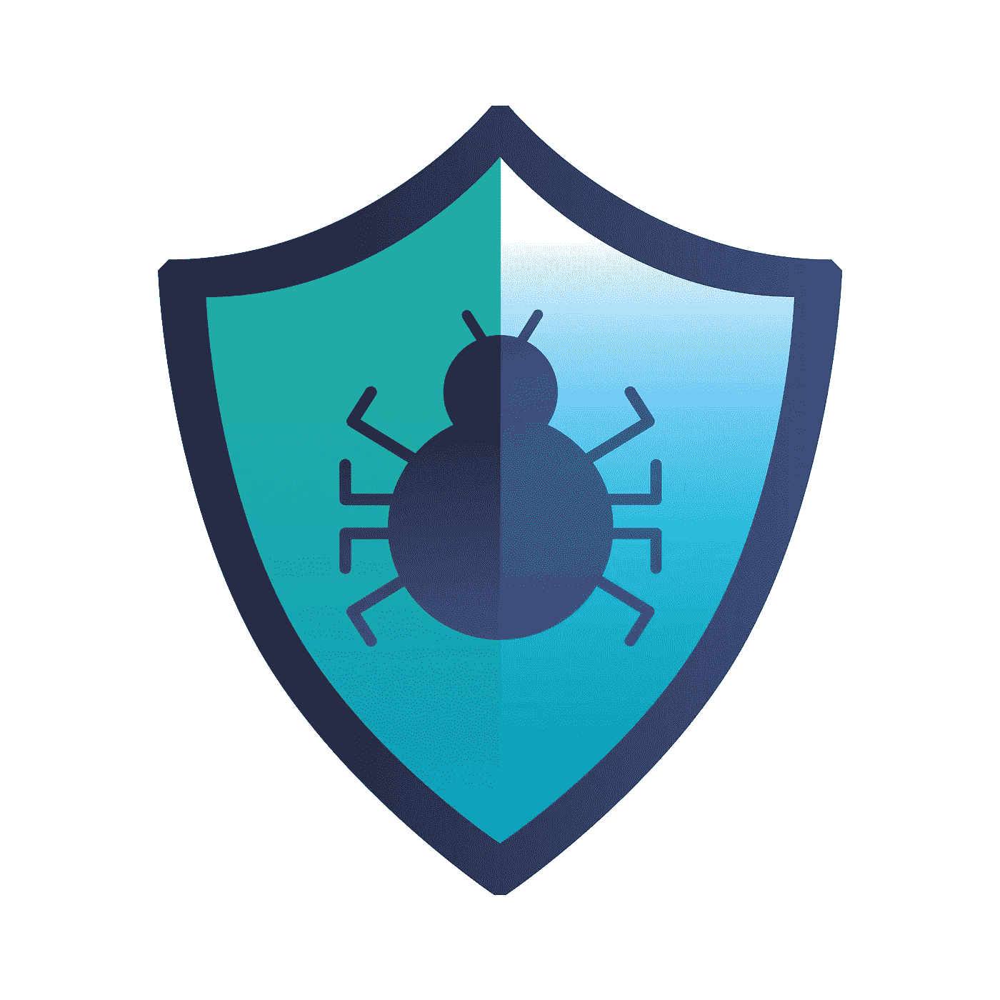

# 👩‍💻60 万美元奖金，码头功能，响应队列中毒，绕过 SSRF 保护，XSS 有效载荷，等等…

> 原文：<https://infosecwriteups.com/600k-bounty-jetty-features-response-queue-poisoning-bypass-ssrf-protections-xss-9b7644077829?source=collection_archive---------3----------------------->

**这个简单的** [**商业逻辑的漏洞**](https://youtu.be/7BTPf55CHiw) **在智能合约中导致了 60 万美元的赏金。**

嘿👋

欢迎来到#IWWeekly26，这是一份每周一期的时事通讯，将信息安全的精华直接发送到您的收件箱。

在我们开始之前，我们很想知道您是否查看了全球最大的虚拟网络安全会议和网络活动 [**IWCON**](https://iwcon.live/) 的发言人阵容😍🙌

日期是 2022 年 12 月 17 日至 18 日，这次会比上一次更大🔥

[**点击此处**](https://iwcon.live/) 查看活动详情，并在活动结束前预订座位！(你真的不想错过)

回到今天的 NL，这里是我们本周的首选:7 篇文章，6 个线程，5 个视频，2 个 Github repos 和工具，1 个工作提醒，帮助你最大限度地从这份简讯中受益，并在你的职业生涯中向前迈出一大步。

激动吗？让我们跳进来吧👇

# 📝7 篇 Infosec 文章(5+ 2 初学者友好型)

**#1** [**山姆库里**](https://twitter.com/samwcyo) **从** [**审计 Next.js 生态系统**](https://samcurry.net/universal-xss-on-netlifys-next-js-library/) **中详细介绍了他的一些惊人发现。**

**#2 学习如何使用** [**jetty 特性实现 RCE**](https://swarm.ptsecurity.com/jetty-features-for-hacking-web-apps/) **上的 web 应用** [**米哈伊尔·克柳尼科夫**](https://twitter.com/m1ke_n1) **。**

**#3 阅读这篇关于** [**测试思科网络**](https://medium.com/@in9uz/cisco-nightmare-pentesting-cisco-networks-like-a-devil-f4032eb437b9) **的不同技术的深入文章，如果它们没有设置完善，由**[**Magama bazar ov**](https://twitter.com/in9uz?t=4Ufief5keDb7p6tWm2ZFwg&s=09)**。**

**#4 弗朗西斯科·马里亚尼和他的朋友** [**雅格布·泰迪奥西**](https://twitter.com/jacopotediosi?t=rFxhc0Hq1Dol1r-Vmb6jBg&s=09) **对一个阿卡迈人的错误配置做了一个** [**有趣的发现，让他们赚了超过 46000 美元**](https://blog.hacktivesecurity.com/index.php/2022/09/17/http/) **。**

**#5 查找如何**[**James kettle**](https://twitter.com/albinowax?t=pTe_JKa7GEU0jRt3khMErw&s=09)**转** [**HTTP 头注入被响应队列中毒**](https://portswigger.net/research/making-http-header-injection-critical-via-response-queue-poisoning) **。**

# 初学者友好的-

**#1** [**卢克·史蒂芬斯**](https://twitter.com/hakluke) **概述**[**SSRF 漏洞是什么，它们最常见的地方，以及如何绕过 SSRF 的保护**](https://labs.detectify.com/2022/09/23/ssrf-vulns-and-where-to-find-them/) **。**

**#2** [**你了解 DNS 接管吗？阅读这篇来自**](https://blog.projectdiscovery.io/guide-to-dns-takeovers/)[**project discovery . io**](https://twitter.com/pdiscoveryio)**的惊人文章** **一探究竟。**

# 🧵6 趋势线程(4 + 2 初学者友好型)

**#1** [**查看本 API 安全与黑客技巧**](https://twitter.com/Steiner254/status/1573161923784462337?t=69FdLU2VpOWDMeD4cSnesw&s=19) **由**[**@ Steiner 254**](https://twitter.com/Steiner254)**。**

**# 2**[**@穆斯塔法·坎·i̇pekçi̇**](https://twitter.com/mcipekci)**分享了他在 Bugcrowd 举办的** [**直播黑客事件中的经历，他总共获得了 6 位数的奖金**](https://twitter.com/mcipekci/status/1573025695890038788?t=7XEeDYJmZQA9OWFwjryyzA&s=19) **。**

**# 3**[**daman preet Singh**](https://twitter.com/MrDamanSingh)**分享了关于** [**如何绕过管理面板**](https://twitter.com/MrDamanSingh/status/1572603612949250050?t=UcK0t2suyL0segUgOht2cQ&s=19) **的有趣技巧和策略。**

**#4 阅读这篇内容丰富的** [**SSRF 故事**](https://twitter.com/zetc0de/status/1572220962745253891?s=20&t=wYMBNiqbV84Dnwa8b3Fopw) **由**[**zerc 0 de**](https://twitter.com/zetc0de)**分享。**

# 初学者友好的-

**# 1**[**sec _ r0**](https://twitter.com/sec_r0)**分享了一个** [**精选的不含括号**](https://twitter.com/sec_r0/status/1572634517067943937?t=RgJhTV8881u3syWHTNubuQ&s=19) **的 XSS 有效载荷列表。**

**#2** [**查看此列表中用于 OSINT**](https://twitter.com/AllForOsint/status/1571484212129308675?t=kwbUj2OMtHKApvUu6r56rw&s=19)**by**[**OSINT for all**](https://twitter.com/AllForOsint/)**。**

# 📽️ 5 个有见地的视频(3 + 2 初学者友好)

**#1 观看所有** [**黑帽亚洲大会 2022 会谈在此**](https://www.youtube.com/playlist?list=PLH15HpR5qRsW2vrD-6pHklASq8T_CPZBv) **。**

**# 2**[**@ stokfredrik**](https://twitter.com/stokfredrik)**讲述**[**@ detectify**](https://twitter.com/detectify)**的众包如何帮你** [**把你的 bug 变成被动收入**](https://youtu.be/oHhofSj9lEM) **。**

**# 3**[**@ Nahamsec**](https://twitter.com/NahamSec)**与**[**@ HalbornSecurity**](https://twitter.com/HalbornSecurity)**合作，在那里他们讨论了** [**智能合同中的借贷、借款和抵押，以及一个商业逻辑缺陷**](https://youtu.be/7BTPf55CHiw) **如何导致 60 万美元的赏金。**

# 初学者友好的-

**# 1**[**@ Jhaddix**](https://twitter.com/Jhaddix)**关于他的** [**长时间运行的 Bug 猎人方法论**](https://youtu.be/FqnSAa2KmBI) **的更新版本的演讲。**

**#2 上** [**看这个惊艳的谈话 fuzzing XSS 洗手液**](https://youtu.be/gJGbS8UELGw) **为了好玩和利益由**[**@ TomAnthonySEO**](https://twitter.com/TomAnthonySEO)**。**

# 新⚒️协议 Github 库和工具

**#1 看看**[**@ c 0 D3 Cr 4 zy**](https://twitter.com/C0d3Cr4zy)**的 github 资源库** [**组成的各种攻击云的资源**](https://github.com/CyberSecurityUP/Cloud-Security-Attacks) **。**

**#2** [**PE-bear 是由**](https://github.com/hasherezade/pe-bear)[**@ hasherezade**](https://twitter.com/hasherezade)**针对可移植可执行文件的多平台反转工具** **。**

# 💰1 个工作警报

**#1** [**辜有安全角色**](https://www.linkedin.com/posts/srikanththurumalla_hiring-for-security-roles-responsibilities-activity-6978954321270841344-5-e5?utm_source=share&utm_medium=member_android) 的空缺职位。

需要 1-3 年的经验。

[**此处适用**](https://www.linkedin.com/posts/srikanththurumalla_hiring-for-security-roles-responsibilities-activity-6978954321270841344-5-e5?utm_source=share&utm_medium=member_android) **。**

# 💸和我们一起做广告💸

我们希望与来自世界各地的出色的 infosec、pen testing 和道德黑客团队、品牌和公司合作。如果这听起来像你， [**点击这里**](https://docs.google.com/forms/d/e/1FAIpQLSfb_v6aVoJUpKBcrEV7HgoZ8FL20QWUFDTWTkxZjQHp5UEhiA/viewform) **与我们合作。**

**——————**

这星期就这些了。希望你喜欢这些令人难以置信的发现，并从今天的时事通讯中学到一些新东西。

在我们说再见之前…

如果你觉得这篇时事通讯很有趣，并且知道其他人也会感兴趣，如果你能把它转发给他们，我们将不胜感激📨

如果您有问题、评论或反馈，请回复此邮件或在 Twitter [@InfoSecComm](https://twitter.com/InfoSecComm) 上告诉我们。

下周再见。

很多爱

编辑团队，

[信息安全报道](https://infosecwriteups.com/)

*这份简讯是我们与“神奇大使”合作制作的。*

*资源贡献者:* [*阿尤什·辛格*](https://twitter.com/AyushSingh1098) *，* [*比马尔·k·萨胡*](https://twitter.com/srb1mal) *，* [*维奈·库马尔*](https://twitter.com/R007_BR34K3R) *，* [*马尼凯什·辛格*](https://twitter.com/X71n0?t=WYKqmnE22AY_ZAq73FeCOA&s=09) *，* [*尼基尔·梅马尼*](https://twitter.com/NikhilMemane09)

**通迅格式由:* [*哈迪克辛格*](https://twitter.com/Kxddah?t=_Ghby7u5rNBfUxzzjEZUUw&s=09) *，* [*维奈库马尔*](https://twitter.com/R007_BR34K3R) *，* [*西达尔特*](https://twitter.com/illucist_) *，* [*阿尤什辛格*](https://twitter.com/AyushSingh1098) *。**

## *来自 Infosec 的报道:Infosec 每天都有很多内容，很难跟上。[加入我们的每周简讯](https://weekly.infosecwriteups.com/)以 5 篇文章、4 个线程、3 个视频、2 个 GitHub Repos 和工具以及 1 个工作提醒的形式免费获取所有最新的 Infosec 趋势！*