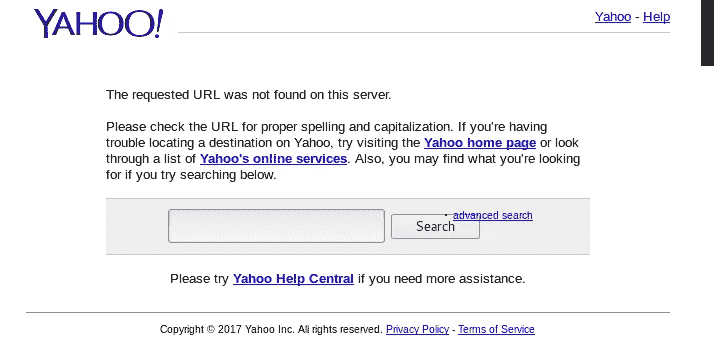
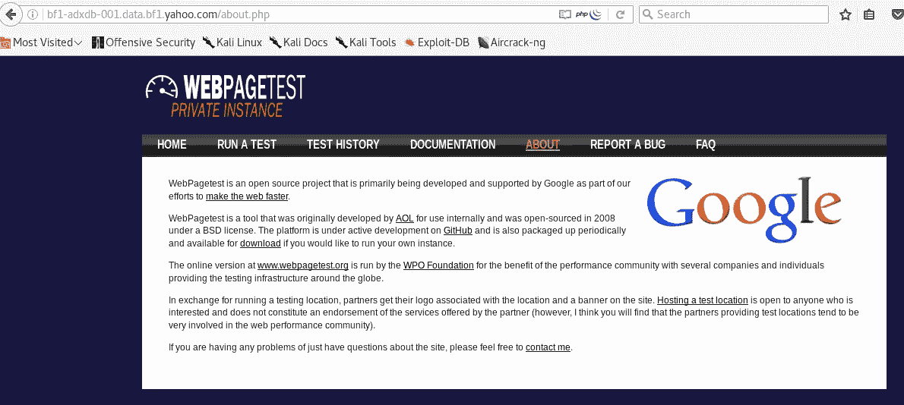
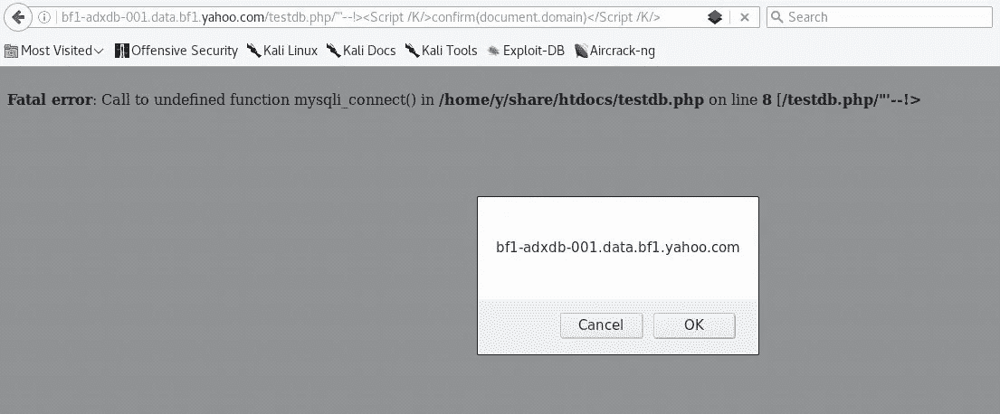

# 900 美元 XSS 在雅虎(侦察获胜)

> 原文：<https://infosecwriteups.com/900-xss-in-yahoo-recon-wins-65ee6d4bfcbd?source=collection_archive---------1----------------------->

嗨伙计们，

对于那些期待特殊旁路或 xss 相关的东西，这不是关于我发现的容易被击中的 xss，这是关于我做的侦察和我从 Knoxss 得到的帮助，向雅虎报告这个漏洞。

一般来说，由于我的工作，我没有时间寻找漏洞，但当我这样做时，我倾向于只关注雅虎，因为它是一个资产的海洋，他们有一个伟大的团队，加上我对他们的子域是如何组织的有适当的知识，所以在我通常为雅虎侦察时，我遇到了这个目标:[http://bf1-adxdb-001.data.bf1.yahoo.com](https://hackerone.com/redirect?signature=2f263572ca50d9e361ff2741d10357919fa07178&url=http%3A%2F%2Fbf1-adxdb-001.data.bf1.yahoo.com%2Fabout.php)和响应是“请求的 URL 在这个服务器上没有找到”，如下所示，这是大多数雅虎 BB 猎人通常看到的。



在 subject target 上运行快速目录搜索，我找到了 about.php 文件【http://bf1-adxdb-001.data.bf1.yahoo.com/about.php】和令人惊讶的响应，有一个 web page test([https://www.webpagetest.org/](https://hackerone.com/redirect?signature=e69be8c0c8ed6f6c373be8a602791984c1de7929&url=https%3A%2F%2Fwww.webpagetest.org%2F))的私有实例运行在该服务器上，如下所示:



好的，这很有趣..开始在应用程序中挖掘漏洞，但我找不到，尽管我也找到了这个默认的 nginx 安装端点，它暴露了服务器中的大多数 php 端点:
[http://bf1-adxdb-001.data.bf1.yahoo.com/nginx.conf](https://hackerone.com/redirect?signature=050e78dd622b962a2142a081657d3b3c8cb446df&url=http%3A%2F%2Fbf1-adxdb-001.data.bf1.yahoo.com%2Fnginx.conf)

所以我用另一个单词表在服务器上再次运行 dirsearch，寻找 PHP 端点，找到了易受攻击的端点:
[http://bf1-adxdb-001.data.bf1.yahoo.com/testdb.php](https://hackerone.com/redirect?signature=54a17be025f93de3a0131948d97c1fc641eab773&url=http%3A%2F%2Fbf1-adxdb-001.data.bf1.yahoo.com%2Ftestdb.php)，得到的回应是:

```
Fatal error: Call to undefined function mysqli_connect() in /home/y/share/htdocs/testdb.php on line 8 [/testdb.php/]
```

当你达到这一点时，你会意识到你必须从中获得一些东西，我有很多端点，我正在测试它们，但幸运的是，我有我的 knoxss 插件运行在*.yahoo.com 上，对于那些不知道 knoxss 的人来说，这是一个由 xss god [Brute](https://medium.com/u/505eb7eb0765?source=post_page-----65ee6d4bfcbd--------------------------------) 创建的 xss 发现服务，你可以在这里阅读它【https://knoxss.me/?page_id=2[，我推荐使用它，因为我成功地使用了它。](https://knoxss.me/?page_id=2)

因此，当我测试所有端点时，knoxss 触发了主题域中的 xss，这是最终的有效负载:



这里学到的经验教训:

1-当您在测试的目标上看到禁止/未找到响应时，不要停止，运行 dirsearch 或任何您喜欢的工具来查找端点。

2- Recon wins:在雅虎的 Recon 不是一个容易的过程，计划一个独立的博客来描述它，它需要专注和耐心，我每天都在 shodan.io 监控雅虎资产，每当我使用 aquatone/sublist 找到一个感兴趣的子域时，我都会试图找到它下面的其他子域，并一级一级地继续下去，我是一个在数千个 ip 上运行全端口扫描的疯狂家伙，为什么？

因为这有助于我报告独特的东西，我对雅虎的大多数错误是由于一个奇怪的开放端口，发现了访问控制服务器，设备，存储控制台，..atc 以及其他研究从未涉及的有趣的 web 应用程序，例如，我在雅虎的第 5 和第 6 级子域名中发现了如下内容:

目标。*.*.*.yahoo.com & target。*.*.*.*.yahoo.com

我确实知道其他研究人员很聪明，他们会在不做我所做的那种调查的情况下报告公开可用的网络应用程序中的错误，他们在这方面非常成功，但你可以说我选择了艰难的方式，我很喜欢这种方式。

最后，这是你在雅虎搜索子域名时的样子，或者说子-子-子-子-子域名


最诚挚的问候:)