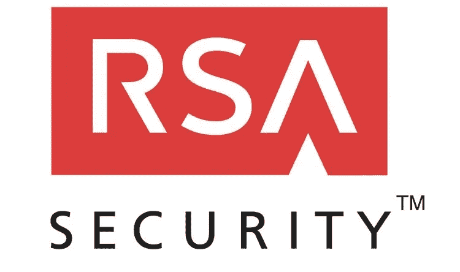
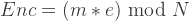
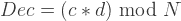
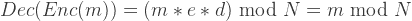
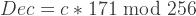
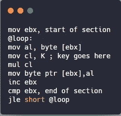

# 一个基本的 RSA 加密机

> 原文：<https://infosecwriteups.com/a-basic-rsa-encrypter-b4aa61d7dfab?source=collection_archive---------1----------------------->

这是一篇关于实现一个基本的 RSA 加密器来加密 exe 文件的小文章。我们可以用这个和人交换前任。我们将使用公钥加密该部分，用户必须使用他的私钥来解密 exe。这也可以应用于规避反病毒。

我将使用乘法而不是指数。因为它很容易用几行汇编代码实现。然而，这将允许轻易破解私钥，因此整个方案被破解。

这个方案的正确性取决于这样一个事实

对于这个例子，让我们把 3 作为公钥，把 171 作为私钥。

下面是一个简单的汇编实现。因为我们使用的是模数 256，所以第一个字节从值中删除。所以我们不需要在代码中再次实现一个模数。

我做了一个小视频演示。感谢检查我的疯狂想法:)

*关注* [*Infosec 报道*](https://medium.com/bugbountywriteup) *获取更多此类精彩报道。*

 [## 信息安全报道

### 收集了世界上最好的黑客的文章，主题从 bug 奖金和 CTF 到 vulnhub…

medium.com](https://medium.com/bugbountywriteup)