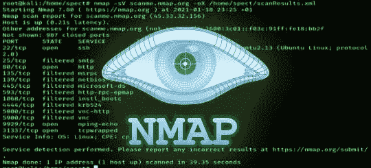

# Nmap 初学者指南

> 原文：<https://infosecwriteups.com/a-beginners-guide-to-nmap-91aaecf15056?source=collection_archive---------1----------------------->



Nmap 初学者指南

这个 GitHub repo 面向所有人，从网络安全初学者到网络安全专家。这是初学者友好的，所以不要担心，享受阅读。

# Nmap 简介

Nmap 是网络映射器的缩写，是一种开源工具，用于扫描机器或网络上的 IP 地址和端口。

Nmap 可用于以下目的-

*   创建完整的网络图
*   检测本地和远程系统上的开放端口
*   获取操作系统和软件详细信息
*   查找本地和远程主机上的漏洞
*   检测主机上安装的应用程序

现在，让我们了解一下 Nmap 的不同命令。

Ping 命令–用于测试主机在互联网上的可达性(检查系统是否在线)。

比如说-

```
ping google.com
```

或者

```
ping 8.8.8.8
```

Scan 命令—用于查找本地和远程系统上打开和关闭的端口以及在该端口上运行的服务

```
nmap google.com
```

注意-

1.  如果希望在扫描运行时查看详细信息或等待扫描完成，请在 nmap 后添加-v。
2.  如果您想要更改 Nmap 用来通过域名查找 IP 地址的 DNS 服务，请使用以下命令。nmap–DNS 服务器 1.1.1.1 mywebsite.com
3.  如果要扫描一系列端口，请使用以下命令 nmap-P1–30 mywebsite.com
4.  如果你想扫描一个特定的端口，那么使用下面的命令 nmap-p80 mywebsite.com

版本检测命令—用于远程操作系统检测

```
nmap -sV -v google.com
```

主动扫描命令—用于启用操作系统检测、版本检测、脚本扫描和跟踪路由(只需在命令中插入-A)

```
nmap -A google.com
```

注意——

1.  要识别本地网络中的活动主机，请使用以下命令。nmap.exe-sP 默认网关/24
2.  要查找本地网络上的所有活动主机，只需在 kali Linux 终端中输入 netdiscover。
3.  要扫描您选择的多个端口，请使用以下命令 nmap -p80，443，23 mywebsite.com

现在让我们来看看 Nmap 的一些很酷的例子

要扫描所有本地地址上的端口 80，请运行:

```
nmap -p80 192.168.7.1/24 -v
```

要扫描本地主机上的端口 80，请运行:

```
nmap -p80 localhost -v
```

或者

```
nmap -p80 127.0.0.1
```

要扫描一台主机上的多个端口，请运行:

```
nmap -p80,443,2000,4444 google.com
```

要扫描从 1 到 100 或任何给定范围的端口，请运行:

```
nmap -p1-100 google.com
```

要扫描所有可用端口，请运行:

```
nmap -p- scanme.nmap.org
```

例如，要扫描特定服务，可以运行 HTTP:

```
nmap -p http localhost
```

或者

```
nmap -p http 127.0.0.1
```

要扫描所有与 http 相关的服务，请运行:

```
nmap -p http* localhost
```

或者

```
nmap -p http* 127.0.0.1
```

要扫描 HTTPS 服务，请运行:

```
nmap -p https localhost
```

要扫描所有与 https 相关的服务，请运行:

```
nmap -p https* localhost
```

# Nmap 脚本引擎(NSE)

Nmap 脚本引擎(NSE)是 Nmap 最强大、最灵活的功能之一。它允许用户编写(和共享)简单的脚本(使用 Lua 编程语言)来自动化各种各样的网络任务。这些脚本以您期望从 Nmap 获得的速度和效率并行执行。

*   首先，nse 脚本运行以下示例:

> nmap -sV —脚本 http-标题 scanme.nmap.org

*   要在一次扫描中包含多个 nse 脚本:

> nmap -sV —脚本 http-标题，http-标题 scanme.nmap.org

*   要运行 NSE 漏洞类别中的所有脚本，请运行:

> nmap —脚本 vuln scanme.nmap.org

*   要运行多个 NSE 类别的所有脚本，请运行:

> nmap -sV — script= "版本，发现" scanme.nmap.org

*   要运行漏洞类别中的所有脚本，请运行:

> nmap -sV —脚本漏洞 scanme.nmap.org

*   要排除特定的 nse 类别(在本例中为漏洞类别),请运行:

> nmap -sV —脚本“不利用:scanme.nmap.org

*   要从 nse 类别中排除特定的 nse 脚本(在本例中，我们排除了 http-slowloris 和 http-brute ),请运行:

> nmap -sV —脚本“(http-*)而非(http-slowloris 或 http-brute)”scanme.nmap.org

dns 强制命令—用于强制 DNS 记录

```
nmap --script dns-brute google.com
```

操作系统识别命令—查找操作系统的详细信息

```
nmap -O scanme.nmap.org -v
```

# 常见问题解答

## Nmap 的替代方案是什么？

如今，GitHub 上有许多替代方案，但 Nmap 仍然是最受欢迎和使用最广泛的。一些著名的是

[https://github.com/angryip/ipscan](https://github.com/angryip/ipscan)https://github.com/robertdavidgraham/masscanT2

## Nmap 在 GUI 中可用吗？

Zenmap 是 nmap 的 gui 版本。Windows 用户可以安装它以方便使用。

[](https://nmap.org/zenmap/) [## 官方跨平台 nmap 安全扫描器 GUI

### Zenmap 是官方的 nmap 安全扫描器 GUI。它是多平台的(Linux，Windows，Mac OS X，BSD 等)。)免费和…

nmap.org](https://nmap.org/zenmap/) 

对于建议，请随意在 github repo 上创建一个 pull 请求，我也会在博客中更新。

[](https://github.com/dheerajydv19/A-Beginner-s-Guide-to-Nmap) [## GitHub-dheerajydv 19/A-Nmap 初学者指南

### 这个 github repo 面向所有人，从网络安全初学者到网络安全专家。这是一个初学者…

github.com](https://github.com/dheerajydv19/A-Beginner-s-Guide-to-Nmap) 

## 来自 Infosec 的报道:Infosec 每天都有很多内容，很难跟上。[加入我们的每周时事通讯](https://weekly.infosecwriteups.com/)以 5 篇文章、4 个线程、3 个视频、2 个 GitHub Repos 和工具以及 1 个工作提醒的形式免费获取所有最新的 Infosec 趋势！