# 劫持一个国家

> 原文：<https://infosecwriteups.com/a-country-hijacking-3180c24a14b5?source=collection_archive---------2----------------------->

## 在未披露的约定中发现的一些问题(姑且称之为 redacted.gov.lol)

所有人，

我是优素福·穆罕默德，又名**将军**

*信息安全分析师@* ***齐纳德&*** *赏金猎人* *@* ***黑客龙***

您可能已经知道，我是一名全职的 bug 赏金猎人，今年早些时候，我签署了一份合同，在我们中东和北非地区的一家安全服务提供商担任“信息安全分析师”。

所以，今天我要和大家分享一个非常激动人心的故事，是关于我最近在上述公司的一些发现。

**注意:这些问题是在一项未披露的合约中发现的，所以我们称之为 redacted.gov.lol**

# 旅程的开始:—

我像往常一样打开邮件开始了一天的工作，却发现我要负责为一个关键的外国客户做一个“黑盒 Web 应用程序测试”。

在每次约会前的启动会议和常规程序之后。我收到的作用域只有一个 URL，我想我可能会找到一个注册功能、重置密码功能或其他功能，以便更容易地访问应用程序来执行我的笔测试。

事实上，它只是一个带有验证码的登录页面，除了登录功能之外没有其他功能。

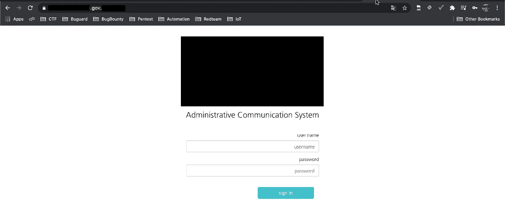

此外，由于点击“登录”后弹出的验证码(试图绕过它但失败了)，以及由于缺乏对用户名外观的了解(是否有特殊模式),你将无法暴力破解帐户。仅数字、仅字母……等等)。

我试图强行打开目录来检查是否还有其他东西要测试！

幸运的是，我找到了 tomcat 目录。

# 我们的第一个主角(和汤姆的猫玩):-

我首先想到的是尝试登录“/html/manager/”，但不幸的是，它受到基本身份验证的保护。

嗯，我为 Tomcat 获取了最著名的(用户/密码)单词表，并尝试使用 Metasploit 模块“tomcat_mgr_login”进行暴力破解，但也没有成功。

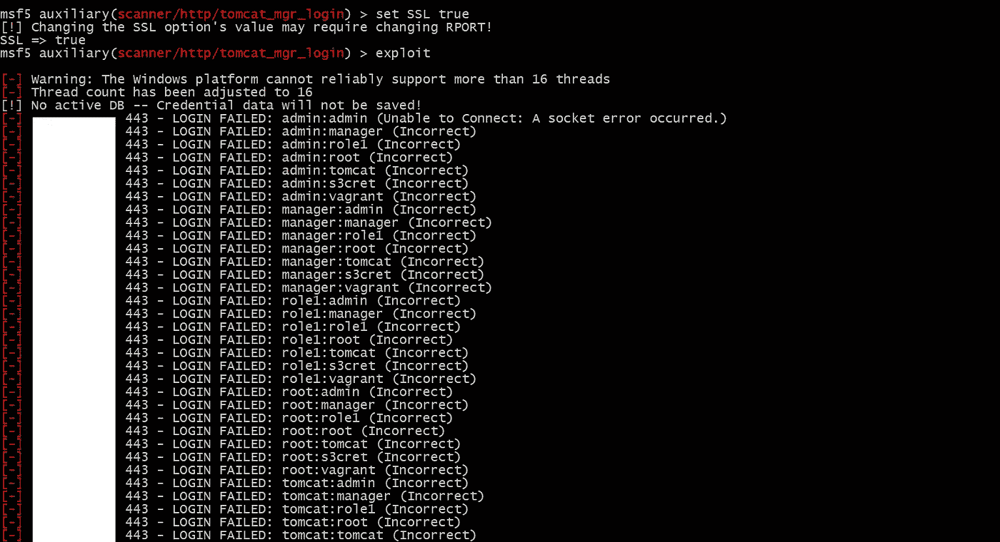

经过进一步的调查，我发现一个“错误处理不当”泄露了 Tomcat 的版本，我试图利用这个版本的一些 CVE，但遗憾的是也没有运气。

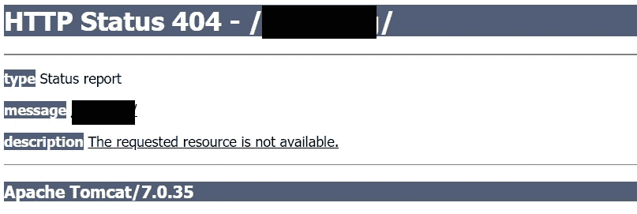

因此，我的下一个方法是尝试使用错误的凭据登录，以进一步调查他们是如何处理的，从该响应的 cookies 中，我能够判断出他们正在使用 F5 BigIP。

# 击掌阶段:-

毫无疑问，我开始用新披露的远程代码执行(RCE)来玩他们的 BigIP。

但它并不脆弱。*(运气不好哼，再想想？)*

在对 F5 BigIP 及其流行的错误配置进行了一些研究后…

我尝试了一些 BigIP 已知的错误配置，但所有我发现一些内部信息泄漏(池名称，负载平衡 cookies，后端 IP)。

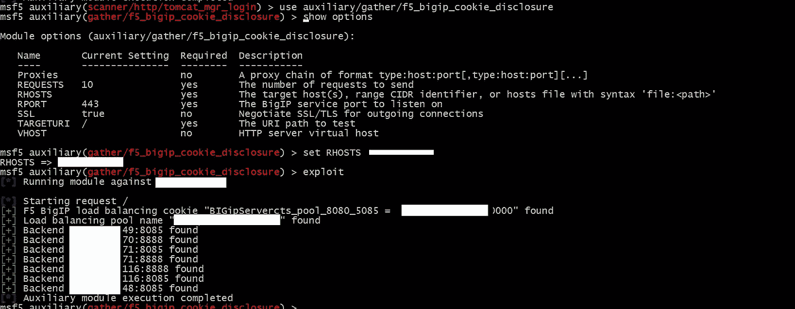

所以，这一刻我非常失望。我关掉我的笔记本电脑，去和我的伙伴们玩一些 VALORANT 比赛。

第二天，我喝了咖啡，决定用新的思维再看一眼。

# 全新的开始:-

我再次重复了我的侦察步骤，并再次开始强力搜索目录，但使用了更大的单词列表，这次我发现了 3 个新的 HTML 页面。

*   第一个是空白页。
*   第二页是一个无限的重定向循环，哎哟！
*   第三个是一个重复的登录页面。

我开始阅读所有这些页面的全部源代码，这令人印象深刻地引导我找到了第三个页面的线索，因为它比最初的登录页面有更多的行。

因此，我开始仔细查看这两行代码，令人惊讶的是，在后一行中有一些额外的 JS 文件。

# 深入研究 HTML/JS 代码:-

HTML、JS 文件包含几个端点，需要认证才能访问，以及诸如(请求方法、端点、内容类型等)的信息。

因此，我提取了它们，并从这些信息中为每个端点构建了一个完整的请求，并保存起来供以后使用。(记住这一点)

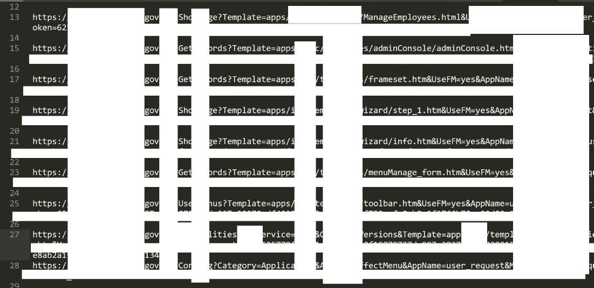

# 硬编码道路:-

我的幸运星开始照耀我，当我发现一个 JS 文件比其他文件更有价值的数据…

它包含一个指向 HTML 页面的链接，所以我查看了源代码，发现又有一个请求类似于之前发现的请求。

在这个请求的数据中有一个名为“User-Token”的参数，这个值就在那里！

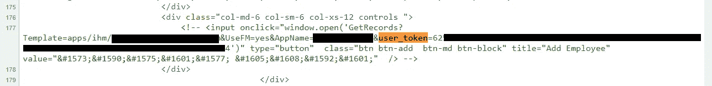

在那一刻，我几乎可以肯定，我将很快拥有这个应用程序。

# 滚动令牌:-

我试图将宝贵的“用户令牌”及其值添加到我之前保存的每个请求中…

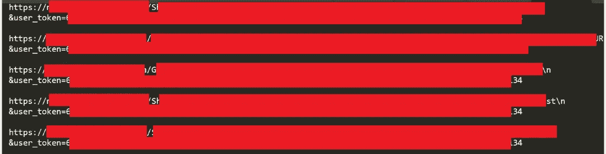

然后我处决了他们，瞧！我加入。

然而，我不能浏览整个应用程序，因为没有 GUI，只有 API 调用。

我抓取了我们保存的请求列表，用我们添加到每个请求中的令牌来执行它们，然后我检查了它们的每个响应，抓取了更多的 JS 文件并提取了更多的[端点&参数]

(重复这个操作大约+20 次)

最终…我发现了一个奇怪的 HTML 响应请求，它被设计成在一种菜单栏上添加一个图标(我不知道它是做什么的…tbh)

所以，我开始随波逐流。

从提供的列表中选择一个图标，然后点击“继续”并选择一个要编辑的菜单，然后完成整个流程并通过“返回主页”按钮到达最终页面。

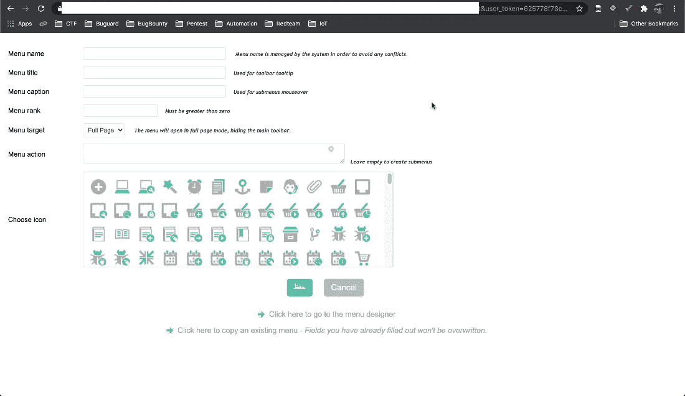

所以，我点击它，它把我重定向到登录页面(忘记添加用户令牌 lol)。

我重复了这个动作，这次又加了代币。

还有 Weeee！！

我到达了一个包含自定义“命令执行”功能的应用程序页面。好吗？我也这么认为

我尝试了所有我知道的命令，但它被封锁的道路，所以我想出这不是一个错误，这是一个功能。

我尝试了命令“tree”(之前在一个 JS 文件中注意到了这个词)。

瞧，x2！

应用程序打印了应用程序的所有端点及其描述。

所以，我看了看其中的一些，但是一点用都没有，所以我决定只搜索更多有趣的端点。

# 咚咚

经过一番探索，我收集了一些新的端点，描述为:“管理控制台”。
我试图用令牌访问它们，但面对“拒绝访问”的标志……这时我意识到我还不是管理员……所以再次查看整个端点。

我发现一个端点可以让你看到关于你的个人资料的信息，如(姓名，角色，创建日期等)，只发现我是一个低权限的用户。

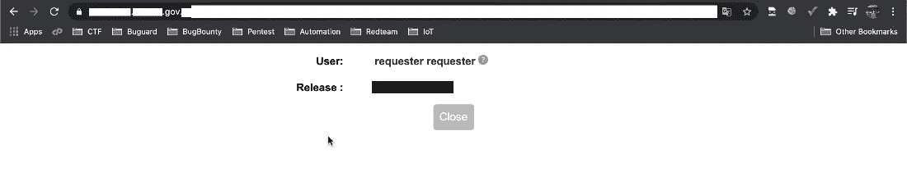

因此，我试图浏览所有管理员的端点，希望找到一个破坏的访问控制(BAC)或一些有趣的东西。

还有呀！！我发现整个列表中有一个端点允许我在不验证我的会话是否属于管理员的情况下进入。

这是给我的一份特别的礼物(Alhamdulillah ),它是“复制用户”页面。

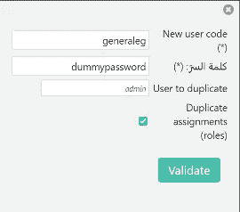

# 爬上特权的阶梯:-

因此，我试图发现该页面的所有参数及其值，我发现我有能力将数据库中的现有用户复制到一个新用户中，这太棒了！

我们还不知道任何用户名，但可以肯定的是，我一开始尝试了 admin，但失败了。然后我试了试管理员，成功地将管理员的“角色”复制到一个名为 **GeneralEG** 的新用户名中。

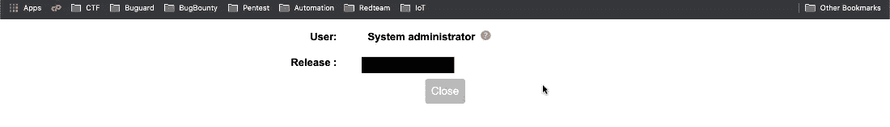

# 将军的时代

所以，我用我的新凭证登录了应用程序，最后我们看到了一些用户界面。

我再次检查了“管理控制台”,我可以浏览它和它的二级端点，如“创建用户”。

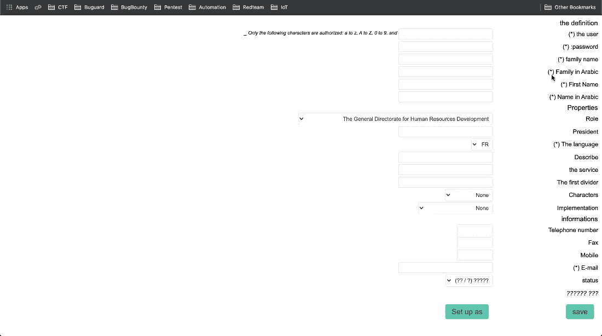

我导航到了后一个端点，我能够从零开始创建一个具有我想要的任何角色的用户…但令人惊讶的是，我能够选择用户的应用程序，所以我扩展了列表，我发现我可以将我的“邪恶管理员”插入到属于这个国家的+7000 个政府应用程序中的任何一个，包括(总统选举委员会、秘密国家办公室、总统行政委员会等),实际上我能够在这个国家做我想做的任何事情…

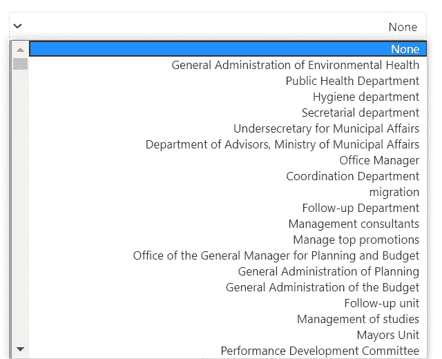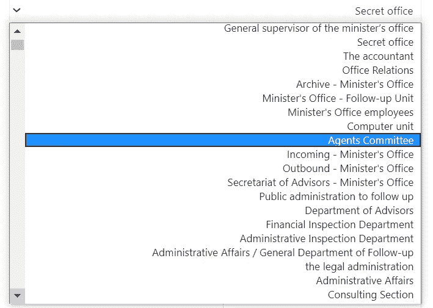

所以，当我得到我想要的和更多的东西后。

我决定就此停止测试，不再深入这些“高度机密的领域”。

*(我没那么喜欢监狱 LOL)*

他们后来告诉我，这个应用程序是一个政府电子系统链的头，它的主要作用是为其他应用程序创建用户。

根据记录，内部应用程序之前有很多渗透测试，所以它有少量的漏洞，但我可以捕捉到一个很好的“远程命令执行”，因为我后来升级了一些弱点，例如(**执行 SQL 命令**)直接到后端，并获得对这个“神圣服务器”的访问权，但我宁愿远离这个机密区域！

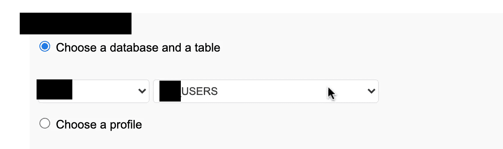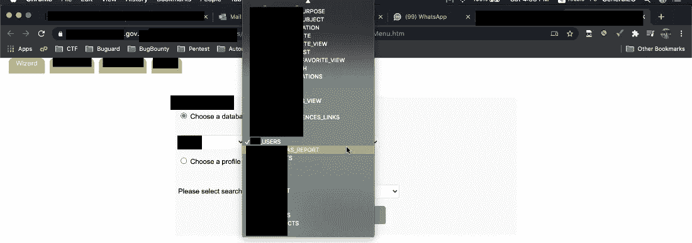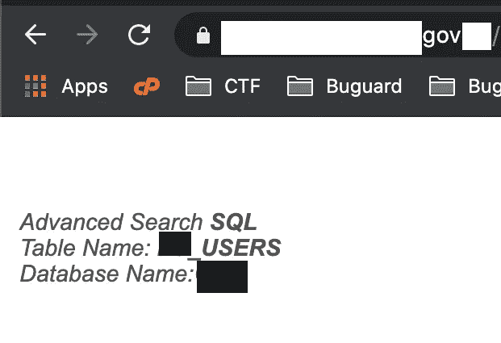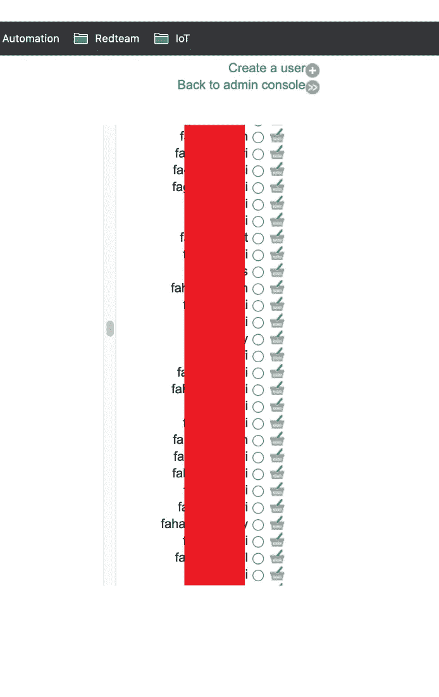

我敢肯定，我的好奇心会让我在这个国家蹲很长时间的监狱，哈哈！

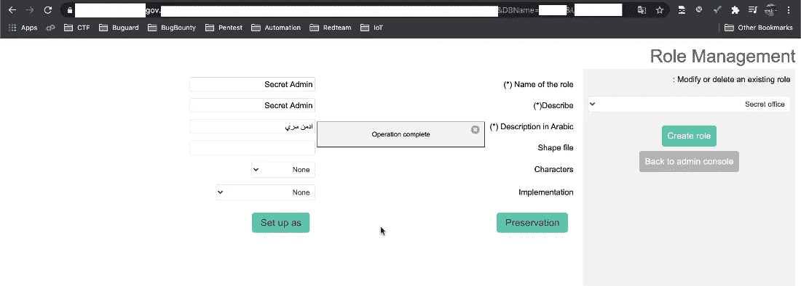

最后，我为这个项目写了一份详细的报告，并提交给了客户，最终各方都很满意。此外，我等待他们解决所有发现的问题，以便向 InfoSec 社区公开发布这篇文章。

## 外卖:

*   不要太早失望。
*   非常仔细地定义你的范围。
*   即使没有用，也要记下你在测试中发现的一切。
*   尽一切可能接近你的目标，不要错过任何一个！
*   如果你迷路了，休息一下。
*   做你的侦察，改进它并重复！

# 黑客快乐！

