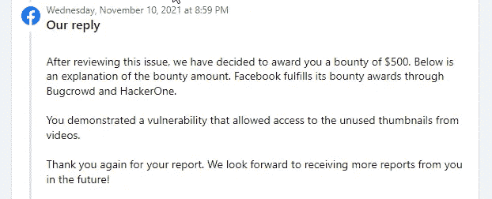

# 一个脸书的错误，泄露了任何脸书页面的公共视频未使用的自定义缩略图

> 原文：<https://infosecwriteups.com/a-facebook-bug-that-disclosed-unused-custom-thumbnails-of-any-facebook-pages-public-videos-6414dc1f7adb?source=collection_archive---------2----------------------->

去年九月，我做了一些研究来寻找脸书私人视频信息泄露的漏洞。不幸的是，我未能发现任何漏洞，但当时我正在浏览脸书创作者工作室，突然我发现了一个脆弱的*帖子请求。*

> **帖子/视频/作曲/编辑/缩略图/？video _ id = XXXXXX&av = YYYYYYY HTTP/2**

当我点击 Creator Studio 中的 ***编辑视频*** 时，这个帖子请求出现在我的眼前，之后，我将 **video_id** 替换为另一个测试帐户页面的公共 video_id。然后在那个 post-request-response 上，我发现那个视频所有未使用的自定义缩略图链接都在泄露。

例如，假设一个管理员不小心在他/她的脸书页面的草稿视频帖子上上传了一个自定义缩略图，但在发布该视频之前，页面管理员注意到了这一点，并再次上传了正确的缩略图。由于这个缺陷，攻击者可以访问所有这些未使用的自定义缩略图，这些缩略图在默认情况下应该是私有的。

**时间线:**

2021 年 9 月 15 日—提交报告

2021 年 9 月 18 日—标记为信息性

2021 年 9 月 18 日—要求重新评估更多细节。

2021 年 9 月 22 日—安全团队对重新评估不够满意。

2021 年 9 月 22 日—再次用详细信息阐明了影响。

2021 年 9 月 24 日—询问有关复制步骤的更多细节。

2021 年 9 月 24 日—提供

2021 年 9 月 28 日——成功繁殖。

2021 年 10 月 8 日—分庭审理

2021 年 11 月 8 日—已解决

2021 年 11 月 8 日——从我这边确认。

2021 年 11 月 10 日——悬赏

**我的社交句柄**

**推特:**https://twitter.com/sawravchy

**领英:**[**https://www.linkedin.com/in/sawrav-chowdhury**](https://www.linkedin.com/in/sawrav-chowdhury)