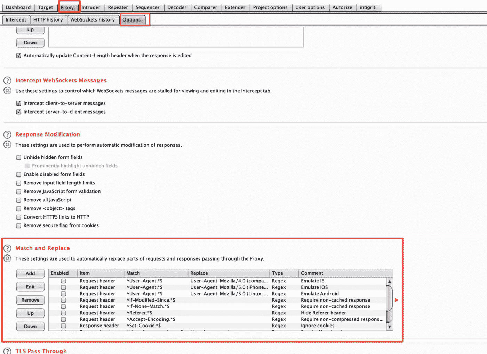
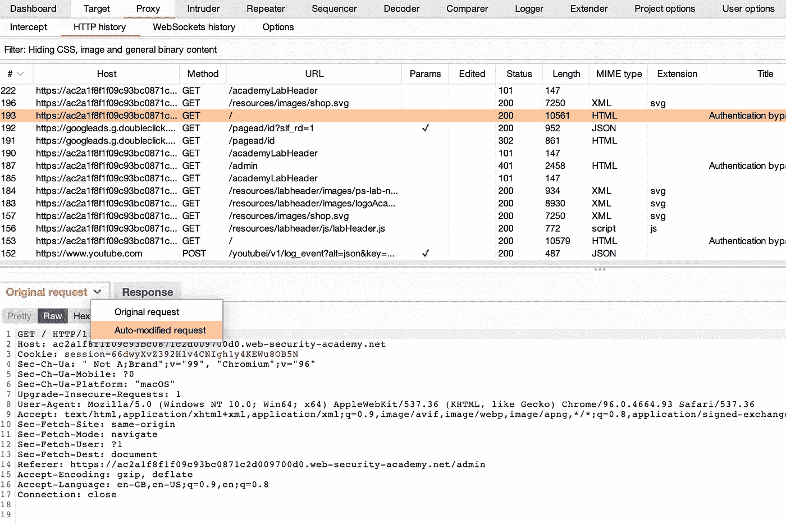

# 一个伟大的周末黑客(价值 8k 美元)

> 原文：<https://infosecwriteups.com/a-great-weekend-hack-worth-8k-9bfda8ab65b9?source=collection_archive---------0----------------------->

来源:谷歌图片

这篇文章是我最近在 Synack 上的发现的记录，这让我在一天内为 5 个 bug 赚了 8000 美元。

所以，我正在黑一个处于 QR 周期的程序(QR 周期是由 Synack 定义的一个特定时间，在这个时间里有最佳报告的研究人员会得到奖励)，当我看到它时，我还剩 7 个小时。我提交了 6 个 bug，其中 5 个得到了奖励，1 个被拒绝。我将说明我是如何找到它们的:)

这些是我发现的虫子

1.  2 次 SQL 注入
2.  2 个存储的 XSS
3.  1 IDOR(只读)

**SQL 注入:-** 这些 SQL 注入是基于错误的 SQL 注入，我是从**MATCH&REPLACE**functionality in Burp 中找到的。如果你不知道它是什么，它看起来像这样:-

来源:谷歌图片

在这里，你可以看到你可以定义参数值和许多其他的东西来匹配和替换你想要的输入。我为**参数值**添加了一个项目，在那里我必须为例如**测试>测试’**更改一个参数值，并从中获得一个结果。当“匹配和替换”为您找到它时，您将能够在打嗝本身上看到不同的响应。你可以在这里 了解更多 [**。它看起来像这样:-**](https://portswigger.net/burp/documentation/desktop/tutorials/using-match-and-replace)

来源:- Portswigger

你可以在请求之间切换，它应该会给你结果。后来，我将它发送到 SQLmap，并能够从中获取数据。我不需要告诉你它看起来怎么样，如果你正在读这篇文章，你可能已经知道了:)

第二个 SQL 注入以同样的方式出现，这次我只是添加了 **test ' '而不是 test'** ,它出现在另一个端点上，在那里我可以进一步升级它并转储数据。不过，为了这部电影，我不得不联系了很多超级天才的 SRT。感谢他们:)

**储存的 XSS:-** 我拿到了两个，都赢了！这些 XSS 非常简单，而且笔直。我只需要在输入字段中使用这个有效载荷两次。我试了几个，都没用，但是这个有用。我只需绕过几个过滤器就能看到 JS 输出，并且它得到了反映:)

**' > <输入自动对焦 onfocus=alert(1) >**

这种情况发生了两次，利用它们很有趣。我估计人们会用相同的有效载荷报告超过 30-35 个 XSS，因为这是一个著名的例子，你使用自动对焦属性来反映 JS。

**伊多尔:-**

我也提交了两个 IDORs，但不知何故支出并没有这样来。我可以看到其他人改变 id 的数据，非常简单。我在两个地方找到了它，但只有一份报告接受了它。我想知道为什么我没有赢得第二名。IDORs 很常见，你仍然可以在任何地方看到它们。我用了自动重复这个，这是一个打嗝扩展，它也有一个匹配和替换东西的选项:)

所以，总支出:-

SQL 注入:- $2900*2

XSS 注射液:$880*2

IDOR(在违反访问控制的情况下被接受):387 美元

提示:-使用匹配和替换功能来自动化你的游戏，最重要的是:- **写伟大的报告，真正伟大的报告。包括那里的一切。资源、视频概念验证等。此外，截图与每一个步骤在一个清晰的方式。**

正如你所看到的，这里真的没有什么新的东西，但是你可以从中得到的是，花时间检查一切:)基于错误的 SQL 仍然存在，你可能今天/今晚就会发现一个:)

直到下一次❤

推特:- @manasH4rsh

## 来自 Infosec 的报道:Infosec 每天都有很多内容，很难跟上。[加入我们的每周简讯](https://weekly.infosecwriteups.com/)以 5 篇文章、4 个线程、3 个视频、2 个 GitHub Repos 和工具以及 1 个工作提醒的形式免费获取所有最新的 Infosec 趋势！