# 保护你的 WordPress 的指南

> 原文：<https://infosecwriteups.com/a-guide-into-securing-your-wordpress-350d9ef5e5a2?source=collection_archive---------2----------------------->

让我们看看如何强化你的 WordPress 站点

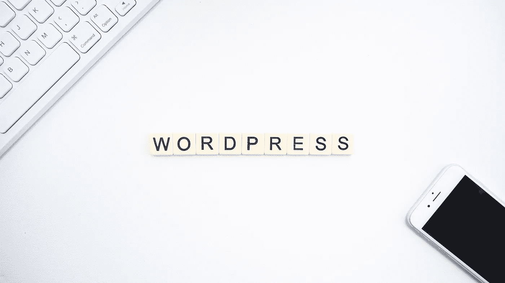

由 [Unsplash](https://unsplash.com/s/photos/wordpress?utm_source=unsplash&utm_medium=referral&utm_content=creditCopyText) 上的 [Launchpresso](https://unsplash.com/@launchpresso?utm_source=unsplash&utm_medium=referral&utm_content=creditCopyText) 拍摄的照片

大约 [20%的自主网站使用 WordPress](https://www.whoishostingthis.com/compare/wordpress/stats/#:~:text=Considering%20that%20the%20number%20of,WordPress%2C%20which%20is%20still%20huge.) 。如果你有博客，很可能你有 WordPress，如果你管理网站，你会有一些。由于它的流行，已经有很多关于 WordPress 的研究和漏洞，只需检查一下 [wpvulndb](https://wpvulndb.com/) 。

> WordPress 可能是最安全和稳定的软件之一。如果你不相信我的话，就去看看一些使用 WordPress 的著名网站，比如白宫、TechCrunch 和其他网站。

有人可能会认为 WordPress 有这么多的历史漏洞不是一个好的选择。我完全不同意这个想法，我发现 WordPress 是最安全和稳定的软件之一。如果你不相信我的话，就去查一些使用 WordPress 的著名网站，比如白宫、TechCrunch 和其他网站。

但是为了获得一个安全稳定的 WordPress，我们需要遵循一些建议并执行一个加固过程。以下是我在配置和保护 WordPress 网站时遵循的一些指南和建议。

# 1.保持你的网站更新

这似乎是显而易见的，但是你需要定期更新你的 WordPress 安装，以及他们的插件。最简单的方法之一就是安装 [Wordfence](https://es.wordpress.org/plugins/wordfence/) 。Wordfence 会在你的 WordPress 中执行大量的安全检查和提醒，并且会在需要更新的时候给你发送电子邮件和显示通知。

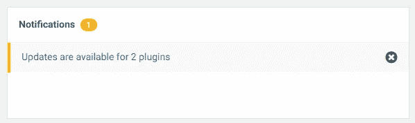

WordPress |图片由作者提供

# 2.没有安装很多插件

> 你应该只安装你需要和使用的插件

基于最小化网站攻击面的原则。你应该只安装你需要和使用的插件。WordPress 插件会在你的网站内部执行代码，它们也会带来严重的漏洞。利用这些漏洞，恶意参与者可以控制 WordPress 的安装。记住更新这些插件，只保留你使用的那些。

# 3.安装 WordPress

我已经提到了[WordPress](https://wordpress.org/plugins/wordfence/)，但这个 WordPress 插件是为你的网站提供安全功能的最好的插件之一。如前所述，WordPress 可以通知您 WordPress 上的任何可疑活动，例如来自新位置的管理员登录、攻击者的入侵防御系统或用户删除插件等。

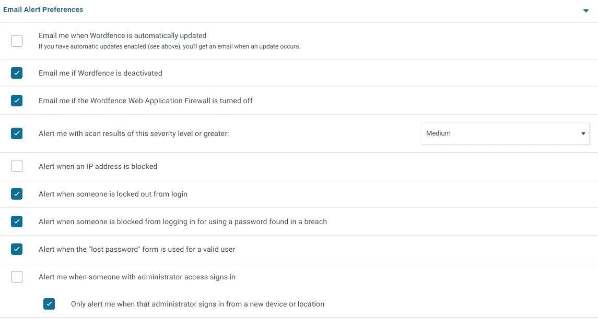

某些 WordPress 电子邮件提醒首选项|作者创建的图像

此外，WordPress 还将阻止可疑的攻击者，并定期扫描您的站点以查找漏洞、恶意活动和恶意软件安装。

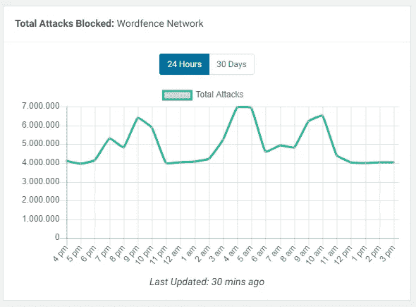

作者在我的一个网站| Image 中阻止了 WordPress 攻击

> WordPress 还可能要求所有管理员使用 2FA，迫使每个用户配置一个 TOTP 应用，比如[谷歌认证器](https://play.google.com/store/apps/details?id=com.google.android.apps.authenticator2&hl=es)或 [Latch](https://latch.elevenpaths.com/) 。

WordPress 的另一个必备特性是[双因素身份认证](https://en.wikipedia.org/wiki/Multi-factor_authentication)、2FA 能力。使用 WordPress，我们可以在所有用户中强制使用基于 TOTP 的 2FA。如果你的站点上的每个用户都配置了 2FA，你将会避免很多与窃取凭证相关的问题。

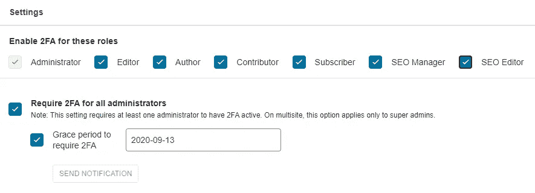

Wordfence 内部的 2FA 菜单|作者的图像

WordPress 还可能要求所有管理员使用 2FA，迫使每个用户配置一个 TOTP 应用，比如[谷歌认证器](https://play.google.com/store/apps/details?id=com.google.android.apps.authenticator2&hl=es)或 [Latch](https://latch.elevenpaths.com/) 。在我看来，你应该强制使用 2FA。

> 免费或授权选项您必须在 WordPress 中安装 WordPress

所有以前的功能都来自免费版本的 WordPress，如果你购买了他们的许可证，他们会提供更多的安全功能和支持。无论是免费还是授权选项，你都必须在你的 WordPress 中安装 WordPress。

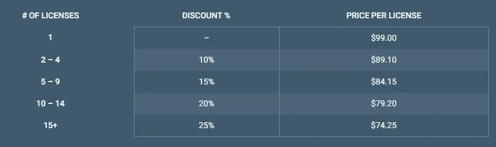

[www.wordfence.com](http://www.wordfence.com)单词栅栏价格

# 4.禁用 XML-RPC 调用身份验证

> XML-RPC 在 WordPress 中是默认启用的，如果你不打算使用，最好的方法是停用它。

XML-RPC 是 WordPress 的一个特性，可以通过 HTTP 调用控制你的站点。例如，您可以使用 XML-RPC 发布新的帖子。这是攻击者控制 WordPress 安装的另一种方式。攻击者通常会强制 XML-RCP 用户和密码。不幸的是，XML-RPC 在 WordPress 中是默认启用的，如果你不打算使用，最好的方法是停用它。

禁用 XML-RPC 最简单的方法之一是安装 [disable-xml-rpc](https://wordpress.org/plugins/disable-xml-rpc/) 插件。你只需要安装插件 XML-RPC 将被禁用。另一种方法是选中 Wordfence 插件中的禁用 XML-RPC 身份验证选项。Wordfence 也允许使用 2FA

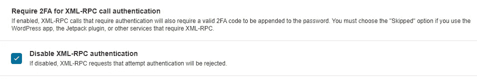

禁用 Wordfence | Image by author 中的 XML-RPC 选项

# 5.启用 Google reCAPTCHA

> 不要忘记 2FA 部分，已经有并将会有新的攻击能够绕过 google reCAPTCHA。

如前所述，利用 XML-RPC，攻击者可以通过暴力破解用户和密码来访问您的站点。因为有必要对/wp-admin 登录网页进行强化处理。为了对这些攻击提供某种保护，我通常会安装[登录-recaptcha](https://wordpress.org/plugins/login-recaptcha/) 插件。也不要忘记 2FA 的部分，已经有并将会有新的攻击能够绕过 google reCAPTCHA。

wp-admin 登录网页受谷歌 reCAPTCHA |作者图片保护

要使用 Login NoCaptcha，你需要在 G [oogle ReCaptcha 网站](https://www.google.com/recaptcha/about/)上注册，获取网站密钥并将其放入 [login-recaptcha](https://wordpress.org/plugins/login-recaptcha/) 。

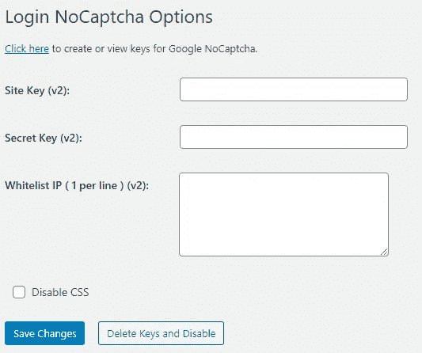

[登录-recaptcha](https://wordpress.org/plugins/login-recaptcha/) 配置页面|图片由作者提供

如果你喜欢 Google reCAPTHA v3 版本，这可以用 Wordfence 配置，并在登录和注册页面上启用。

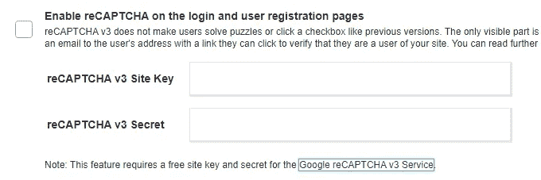

Wordfence 登录安全菜单中的 Google reCAPTCHA v3 配置菜单|作者图片

# 6.使用 Cloudflare

另一个免费推荐是使用 Cloudflare。Cloudflare 能够缓解和阻止 DDoS 攻击，为我们设置了一道防火墙。要在我们的站点中配置 Cloudflare，我们需要在 [Cloudflare](https://dash.cloudflare.com/sign-up) 中注册并添加我们的域。添加我们的域后，我们需要将域 DNS 记录指向 Cloudflare，一切都将准备就绪。请记住，由于 DNS 传播，您需要等待几个小时，直到一切准备就绪，所有新的请求都通过 Cloudflare 路由。

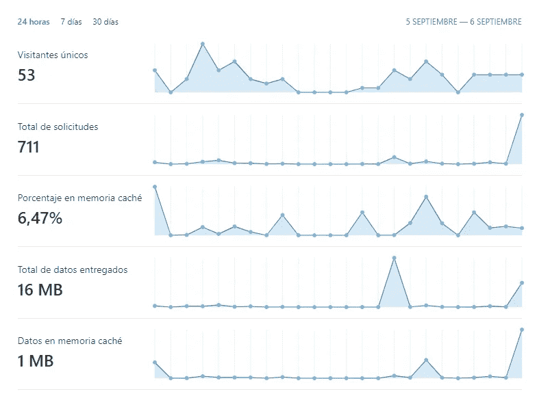

我的一个网站的 Cloudflare 统计|图片由作者提供

访问您的 [Cloudflare 管理面板](http://dash.cloudflare.com)，您可以从我们的网站检查不同的指标和信息，并启用受攻击模式。这种攻击模式会在每个针对你的站点的请求前提示一个 JavaScrip 挑战，这在你受到 DDOS 攻击时很有用。我还会推荐为 WordPress 安装 [Cloudflare 插件](https://wordpress.org/plugins/cloudflare/#installation)。

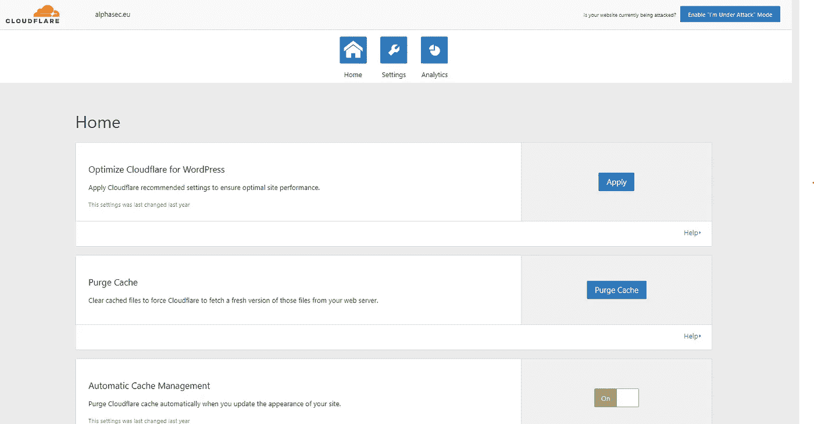

Cloudflare WordPress 插件|作者图片

为了工作，Cloudflare WordPress 插件会要求你的站点提供一个 API 密钥。您可以从您的 [Cloudflare 帐户](https://dash.cloudflare.com/profile/api-tokens)轻松获得一个。

如果所有这些还不够的话，Cloudflare 为我们的网站添加了 SSL 保护。如果你不喜欢 Cloudflare，你可以随时使用[让我们加密服务](https://letsencrypt.org/)，但是现在没有 SSL 的网站没有任何意义。

# 7.备份

尽管我们在服务器上执行了大量的安全配置，但错误或安全事故仍有可能发生。我们需要定期备份我们的 WordPress 网站。我最喜欢的执行备份的插件之一是[多合一 WP 迁移](https://wordpress.org/plugins/all-in-one-wp-migration/)。使用一体化的 WP 迁移，你可以创建备份，并将其导出到你的本地机器、Dropbox 或 AWS buckets 等等。

我推荐的另一种可能性是向你的 WordPress 主机提供商咨询，他们中的很多都提供了备份的可能性。我有一些部署了 EasyWP 的 WordPress 网站，你可以执行备份而不需要任何额外的费用。

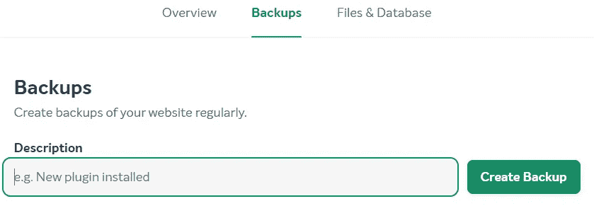

EasyWP 备份菜单|作者图片

# 讨论和结论

可能你们中的一些人会想，为什么我要用 Wordfence 的替代品来执行一些强化配置。最初 Wordfence 没有这些功能，当我准备这篇文章时，我看到了它。我倾向于保持两种可能性，然后你可以根据你的需要进行调整或选择。

另一个可以提出问题的是，为什么我没有包括一个 wp-admin 登录的变化。有些人喜欢将-wp admin 的默认 URL 从/wp-admin 更改为。这是因为在网络安全中，通过许多方式探索模糊的安全性都没有成功。这有助于限制自动攻击，但这些攻击不能提供真正的保护。一个真正的/wp-admin URL 保护，除了包含一个 captcha 之外，可以限制可以访问这个登录表单的 IP 或区域。但是改变默认路径并不安全，只要检查一下 [Whitehouse wp-admin](https://www.whitehouse.gov/wp-admin) 就可以了。

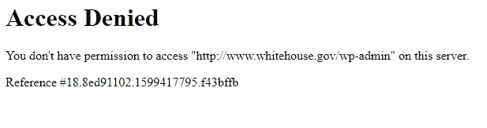

访问仅限于 whitehouse.gov 的 WP-admin |作者图片

无论哪种方式，记住这些都是加强你的 WordPress 安装的一些建议。如果你管理运行你的 WordPress 的服务器，你将能够做更多的安全加固。此外，如果你有另外的推荐或者你喜欢的 WordPress 安全插件，请不要犹豫联系我。