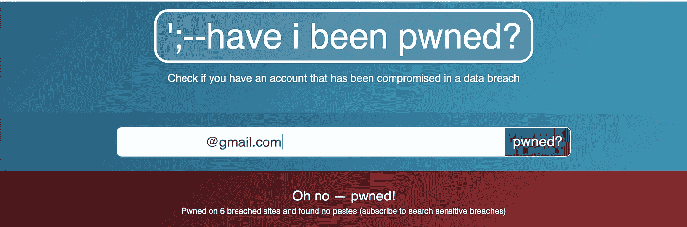
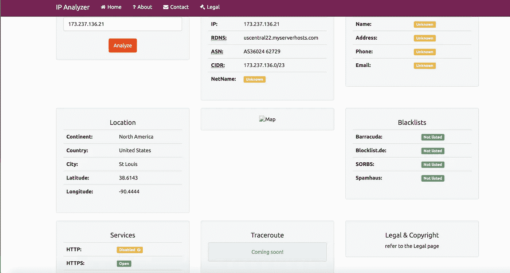
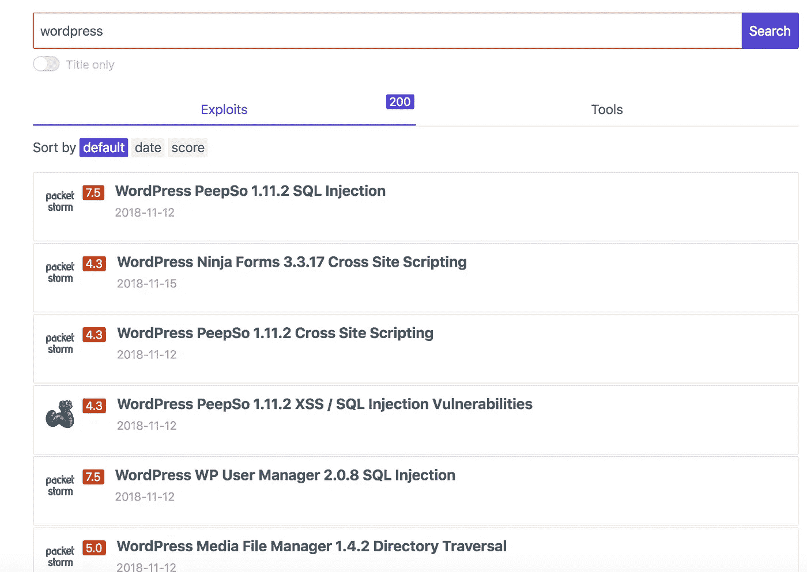

# 开源情报收集指南

> 原文：<https://infosecwriteups.com/a-guide-to-open-source-intelligence-gathering-osint-ca831e13f29c?source=collection_archive---------0----------------------->

嗨，伙计们，这篇文章是关于一个完美的侦察对于臭虫狩猎是多么重要。根据我的经验，我创造了一个清单，列出了一些我用来侦察的最好的工具和技术。

被动侦察或信息收集是利用公开信息来收集有关目标的信息。提取关于目标的相关信息总是有帮助的，并且在 bug 奖励期间起着重要的作用。侦察期间的主要任务包括:

> 识别可能增加我们攻击面的 IP 地址、子域、端口和服务。
> 
> 确定使用的技术、应用平台和其他基础设施细节
> 
> 识别敏感信息，例如 API 密钥、AWS S3 桶、泄露的凭证等。
> 
> 其他数据包括日志文件、备份文件、数据库文件、客户端代码、Javascript 库和配置文件的标识

通常，侦察过程中的一个主要步骤是识别与目标相关的网络范围和子域。像 [Shodan](https://www.shodan.io/) 和 [Censys](https://censys.io/) 这样的搜索引擎可以被大量用于查找 IP 地址、敏感文件、服务器信息、错误信息和其他暴露的服务。

whois 查找有助于找到管理员联系人和其他电子邮件地址。电子邮件地址可以通过数据库泄露或通过像 [HaveIBeenPwned](https://haveibeenpwned.com) 这样的搜索服务来搜索，它会告诉你你的电子邮件是否被发现是违规的一部分。

这个 whois 网站[https://ipalyzer.com/](https://ipalyzer.com/)非常有用。你可以获得大量关于目标的信息，如地理信息，供应商信息，并可以查询不同的垃圾邮件列表。

使用 [virustotal](https://www.virustotal.com/) 和[子列表 3r](https://github.com/aboul3la/Sublist3r/) 枚举子域。也可以使用一些其他工具，如 dnrecon、subbrute、knock.py。

Wappalyzer 也是发现网站上使用的技术的一个很好的工具。它可以检测内容管理系统、电子商务平台、web 框架、服务器软件、分析工具等等。使用 burp 分析 HTTP 状态代码和响应头是必须的。检查 CSP 头，因为它们包含域名和可能允许脚本加载的来源。

发布此分析，查看目标是否容易受到任何公开的攻击。对于漏洞和工具搜索，你可以使用 [Sploitus](https://sploitus.com/) ，它绝对是辉煌的！！

还必须检查与目标相关人员的记录。收集关于人名、电子邮件地址、社交档案、地址、电话号码等信息。

有关 OSINT 工具和资源的完整列表，请查看以下链接:

 [## jivoi/awesome-osint

### 尖叫:一个令人惊讶的令人敬畏的列表

github.com](https://github.com/jivoi/awesome-osint) 

您还应该使用 burp 检查应用程序的 html 源代码和请求/响应，并查看应用程序是否在云中托管任何内容。很少有应用程序会将图像和其他静态文件存储在 S3 存储桶中。使用 [S3 扫描仪](https://github.com/sa7mon/S3Scanner)扫描打开的 S3 桶。

检查以下测试 AWS S3 安全性的指南。

 [## 测试 Amazon Web Services 安全性的实用指南(第 1 部分:AWS S3)

### 很久以前，亚马逊这个词用来指地球上超过一半的雨林。虽然这仍然是真的，但它不是…

blog.mindedsecurity.com](https://blog.mindedsecurity.com/2018/09/a-practical-guide-to-testing-security.html) 

人们应该总是寻找代码托管服务，如 github、gitlab、bitbucket 等。Web 漏洞、配置问题、AWS 和其他秘密密钥有时可以在这些服务中找到。在提交时，开发人员会留下凭证或唯一的“访问令牌”。攻击者很容易通过使用提交日志和检查特定提交来检索这些敏感信息，并在目标基础架构上发起攻击。

像 [Github Dorks](https://github.com/techgaun/github-dorks) 这样的工具可以用来搜索 Github 存储库中的敏感数据，如私钥、证书、认证令牌等。

Google Dorking 或高级搜索也非常有用。Exploit db 给出了谷歌呆子的综合名单[https://www.exploit-db.com/google-hacking-database/](https://www.exploit-db.com/google-hacking-database/)

在网络安全领域，如果你将正确的工具与批判性思维相结合，并有一个明确的 OSINT 策略，那么使用正确的工具进行 OSINT 调查会非常有效。无论您是在对一家公司/个人进行网络安全调查，还是在另一方努力识别和减轻未来的威胁，拥有预定义的 OSINT 技术和明确的目标都可以为您节省大量时间。每个组织都应该将 OSINT 作为网络安全防御措施之一，以识别和检测应用程序、服务和/或服务器威胁。

感谢您阅读这篇文章。如果您想到任何其他有用的技术可以添加，请随时在下面留下评论:

[*米纳利·阿罗拉*](https://www.linkedin.com/in/minali-arora-oscp-5b845a3b/)

[@AroraMinali](https://twitter.com/AroraMinali)