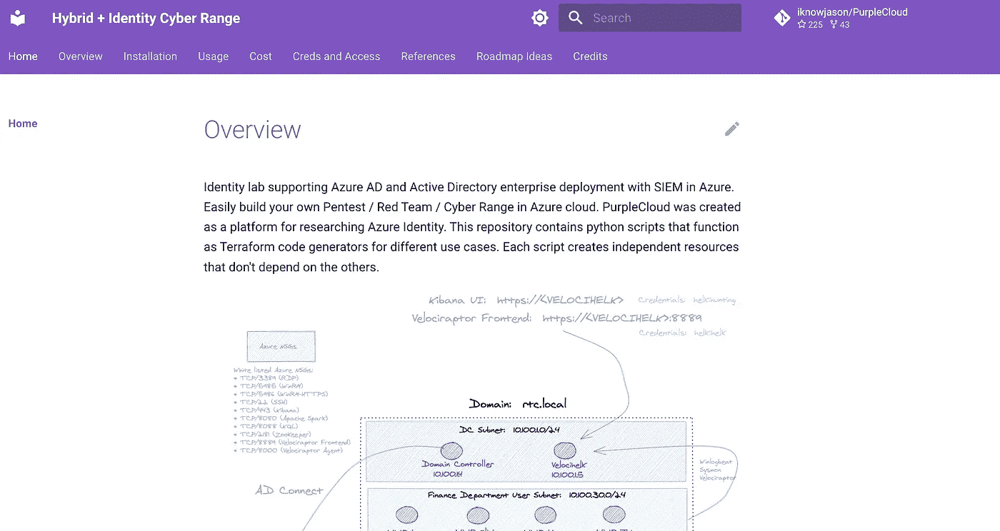

# 练习 Azure 服务主体滥用的实验室

> 原文：<https://infosecwriteups.com/a-lab-for-practicing-azure-service-principal-abuse-bd000e6c48eb?source=collection_archive---------3----------------------->

## 介绍

[PurpleCloud](https://www.purplecloud.network) 是一个开源的 Azure Cyber Range，可以用来快速建立一个充满 Azure 资源的 Azure AD 安全实验室。这些资源提供了一种快速、安全的方法来测试、评估和理解服务主体滥用攻击原语。像这样运行:

`$ python3 azure_ad.py -c 25 --upn <domain> --apps 7 -aa -ga -pra`

上面的这个命令生成了您需要构建、管理和销毁范围的所有声明性 terraform 文件。

## 创建的资源

PurpleCloud 是一个 terraform 代码生成器。它创建 HCL 格式的 terraform 文件，为各种用例快速创建模拟实验室。你可以在这里查看所有的新发电机[。上面这个是 Azure 广告安全模拟。以上示例中创建的资源:](https://www.purplecloud.network/overview/)

*   25 个 Azure AD 用户使用随机生成的密码
*   7 款 Azure 广告应用
*   1 个应用程序管理员角色随机分配给 25 个用户中的一个
*   随机分配给 7 个应用程序之一的全局管理员角色
*   一个特权角色管理员(PRA)角色被随机分配给 7 个应用程序中的一个

## 攻击概述和前期工作

Andy Robbins [1]和 Dirk-jan Mollema [2]在过去已经记录了这种权限提升攻击场景设置的服务主体滥用攻击原语。阅读他们的两个博客以了解详情。攻击原语允许应用程序管理员将任何用户的权限或角色提升为全局管理员。它是这样工作的:

*   租户中存在分配给应用程序管理员的 AAD 用户
*   应用程序管理员拥有强大的权限，可以完全管理应用程序注册。他们可以给应用程序添加新的秘密。
*   租户中存在分配了特权角色管理员(PRA)角色的应用程序。PRA 角色允许添加任何特权角色分配，包括向全局管理员添加角色。
*   应用程序管理员向 PRA 应用程序添加一个秘密，允许他们使用 PRA 的服务主体登录 Azure。
*   普通用户可以在生成应用程序密码后作为服务主体登录。
*   作为 PRA 服务主体登录后，应用程序管理员将任何 Azure AD 用户(包括他们自己的用户名)提升为全局管理员。

这里的重要想法和总结是，您不能使用位于[https://portal.azure.com](https://portal.azure.com)的前端门户为相同的用户重置密码。但是通过后端，使用服务原则，这是一种有效的技术。

## 攻击脚本

PurpleCloud 包括两个攻击脚本，可以自动执行这种权限提升场景。第一个脚本执行侦察。第二个脚本利用设置，将任何 Azure AD 用户提升为全局管理员。这两个脚本可以在[这里](https://github.com/iknowjason/PurpleCloud/tree/master/attack_scripts)找到。

## 演示视频

## 参考

[1]安迪·罗宾斯，SpectreOps:

 [## 通过服务主体滥用进行 Azure 权限提升

### 介绍和前期工作

post . specter ops . io](https://posts.specterops.io/azure-privilege-escalation-via-service-principal-abuse-210ae2be2a5) 

[2]德克-扬·莫莱马

[https://dirkjanm . io/azure-ad-privilege-escalation-application-admin/](https://dirkjanm.io/azure-ad-privilege-escalation-application-admin/)

*来自 Infosec 的报道:Infosec 上每天都有很多事情发生，很难跟上。加入我们的每周简讯，以 5 篇文章、4 个线程、3 个视频、2 个 Github Repos 和工具以及 1 个工作提醒的形式免费获取所有最新的 Infosec 趋势！*[*https://weekly.infosecwriteups.com/*](https://weekly.infosecwriteups.com/)