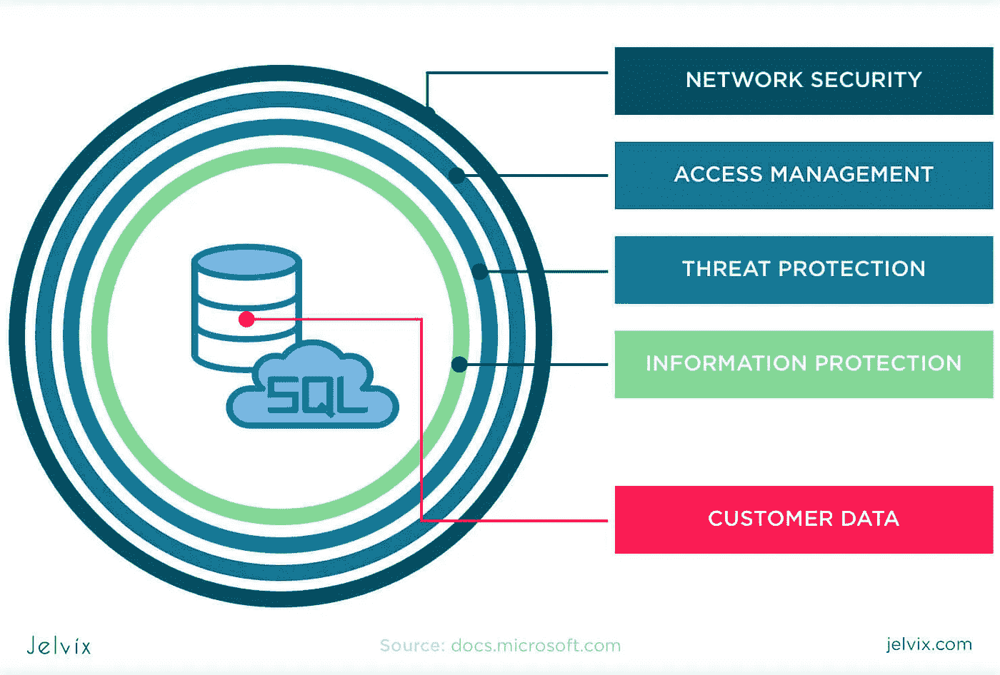
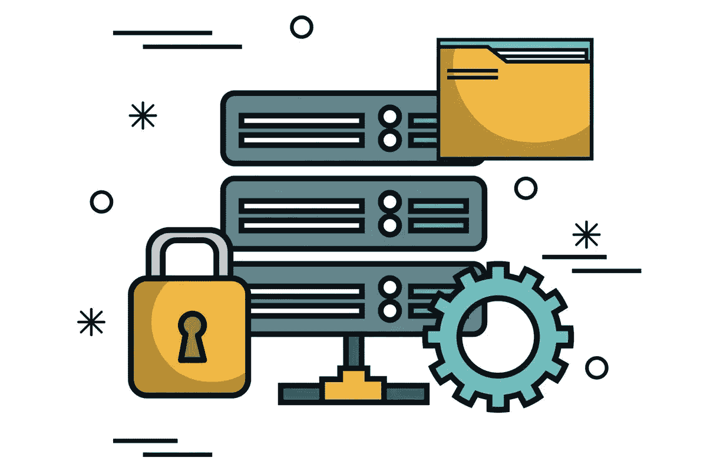

# 您想保护您的数据库吗？使用多层安全架构

> 原文：<https://infosecwriteups.com/a-multi-layered-security-architecture-for-databases-3d2b3a60070f?source=collection_archive---------2----------------------->

随着公司越来越依赖信息技术，保护数据库的问题仍然存在。数据库系统适合存储公司文档和信息。企业将客户和员工信息、产品和销售数据、财务统计数据等委托给 it 部门。与此同时，管理人员担心如何保护敏感信息免受故障和黑客攻击。让我们来谈谈通过构建多级架构来保护数据库的有效方法。

# 网络防御的四大法则

451 名研究调查参与者中有 70%的人[表示](https://info.enterprisedb.com/rs/069-ALB-339/images/wp-advisory-451-security.pdf)对数据库安全性的需求是企业的首要任务之一。系统故障或信息泄露会带来致命的商业后果。例如，一个组织可能会失去客户和业务合作伙伴的信任，受到罚款，或者遇到法律问题。

数据需求发生了结构性变化。数据的位置正在发生变化:它们不在单独的数据中心，而是分布在不同位置的公司中。分组处理正被实时数据处理所取代，这对商业是有益的。对数据库的访问变得集中，这允许在组织通用的角色模型中管理信息。数据结构不再是关系型的，而是组合型的，因为对于特定情况(文档数据库、图形数据库、内存)有一整套解决方案。考虑到全球变化，有必要改进数据保护策略。

来自同一调查的研究人员给出了关于数据库安全性的好建议:

–配置关键数据的保护。今天，为了安全，仅仅保护周边是不够的。必须确保行和表级别的安全性，并为某些类型的命令提供详细的访问权限。行级安全性有助于限制对数据行的访问。例如，您可以只允许员工访问与其部门工作相关的数据行。另一个例子是只允许客户访问与其公司相关的数据。

–实施高安全性级别(B1-A1) —高级访问控制体系结构和安全验证系统，提供对数据的即时安全访问，而无需物理存储数据。在过去的 20 年里，网络安全出现了数据碎片化的问题。数据无处不在:存储、湖泊和云中。因此，这些技术的每一个要素都必须通过一切可能的手段加以保护。即使数据的 9 个拷贝在专有系统中受到很好的保护，而第 10 个受到很差的保护，那么数据库受到的保护与最易受攻击的拷贝一样多。关注数据库的每个细节至关重要。

–安全工具应符合要求，并具有用户友好的用户界面，用于管理访问策略、监控和设置、故障转移、备份和恢复。

–分配专门的[网络安全专家](https://andersenlab.com/blueprint/cyber-security-essentials-for-smes)来管理数据库。在组织中，信息存储在数据仓库和湖泊中，部分存储在云中。例如，当数据无法合法地移动到云中时，就会发生这种情况。或者组织有禁止在防火墙外存储机密信息的规则。数据位于不同的位置，由不同的技术管理，必须集中处理。因此，每个收集信息的部门都需要一名有经验的数据库管理员。

让我们以开源 Postgres 为例，看看公司如何通过多层数据库结构来最小化安全风险。

资料来源:Jelvix

# 如何为数据库建立 11 级保护

多层架构意味着在网络、传输和数据库级别提供安全性。有必要提供这样的安全性，使数据库像银行保险库一样受到保护。在这种情况下，要打开一扇“门”，就必须打开另一扇，由秘密钥匙保护。为了保护数据，只要理论上可以访问数据，就需要采取安全措施。

多层安全体系结构包括对主机(物理)、公司网络、数据库主机、数据库应用程序和数据的安全有限访问。

大多数组织在 AAA 模型(认证-授权-审计)下运作，其中参与者访问数据的权利被跟踪。身份验证允许您了解某个用户就是声称该身份的人。授权确保用户被允许访问。审计意味着记录数据库活动。这个经过验证的模型可以用作监控数据库保护方法的基础。

组织可以通过使用 11 层安全方法来利用 AAA 安全模型:

1.  物理安全的数据中心。如果一个数据中心的门上没有锁，那么所有其他的努力在很大程度上都变得毫无意义。
2.  通过授权和身份验证机制控制用户权限，保护对主机的访问。这些工具确保用户不会未经授权就进入数据库。
    PostgreSQL 具有基于角色的详细用户权限系统。因此，任何数据库帐户名都是一个具有登录属性的角色，用户通过它连接到数据库。角色还可以具有其他属性，这些属性允许他们绕过访问检查、创建数据库以及创建其他角色和功能。用户被赋予对数据库对象具有特定特权的组成员资格。
3.  使用 Vormetric 或 VeraCrypt 加密磁盘上的文件系统。以加密的形式存储数据将保护它们不被盗窃和没收。
4.  通过“hba.conf”配置文件保护与数据库服务器的连接。该文档包括关于连接类型、客户机 IP 地址、数据库名称、用户名和用户验证方法的条目。还可以通过阻止对运行数据库的节点的访问来保护服务器(在端口级别使用防火墙)。默认情况下，PostgreSQL 监听 TCP 端口 5432。您可以使用 iptables 实用程序(Linux)或通过创建传入连接规则(Windows)来阻止其他端口。
5.  使用 SSL 证书加密网络上的信息，以提供到数据库主机的安全连接，并防止中间人攻击。PostgreSQL 实现了对 SSL 连接的本机支持，以加密客户端-服务器通信。
6.  检查 DBMS 的功能以防止 SQL 注入。确保数据库管理系统阻止这种入侵。
7.  通过密码、证书、操作系统凭据、LDAP 和其他方法设置用户验证过程。身份验证应该与一般用户管理相关联。这将有助于将来当用户转移到其他项目、离开或停止使用数据库时撤销访问凭证。
8.  授予用户使用数据库的权限，但特权较少。
9.  通过定义访问控制策略，在列和行级别加密数据。例如，只允许用户更改或删除表格中的某些元素。
10.  设置数据库审计来跟踪其中的过程。这种措施将允许根据特权来监控用户动作。您应该分析用户连接、DDL 变化、数据变化和数据表示。
11.  为一组用户实现信息屏蔽功能。使用内置或自定义屏蔽功能，用虚拟或任意字符集替换原始数据。这不会改变存储在磁盘上的信息。DDM 使用 T-SQL 命令，按字段查找受保护的数据，设置适当的屏蔽函数，并对查询隐藏数据。为此，您不需要编码、加密或更改实际信息。

来源:Cssonline

# 结论

正如您在 Postgres 中看到的，数据库的多层安全架构使公司能够更好地控制数据，并降低故障和被盗的风险。然而，在选择数据库安全解决方案时，您应该关注基础设施、公司的 IT 政策和当前的安全场景。正如 ICIT 高级研究员詹姆斯·斯科特所说，网络安全没有放之四海而皆准的解决方案，多层防御是唯一可行的防御方式。因此，在每个级别保护数据非常重要:外部级别(VPN、防病毒、防火墙)、中间级别(权限分配和访问控制)和内部级别(直接在数据库本身)。

来自 Infosec 的报道:Infosec 上每天都会出现很多难以跟上的内容。 [***加入我们的每周简讯***](https://weekly.infosecwriteups.com/) *以 5 篇文章、4 个线程、3 个视频、2 个 Github Repos 和工具以及 1 个工作提醒的形式免费获取所有最新的 Infosec 趋势！*