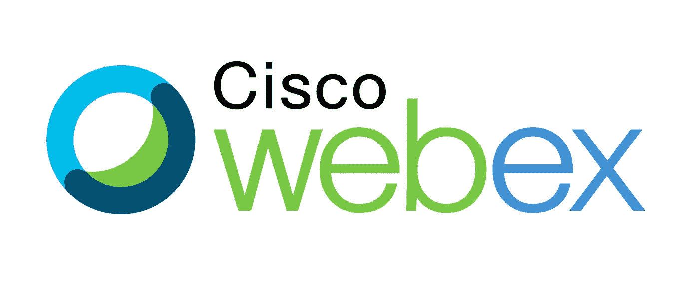
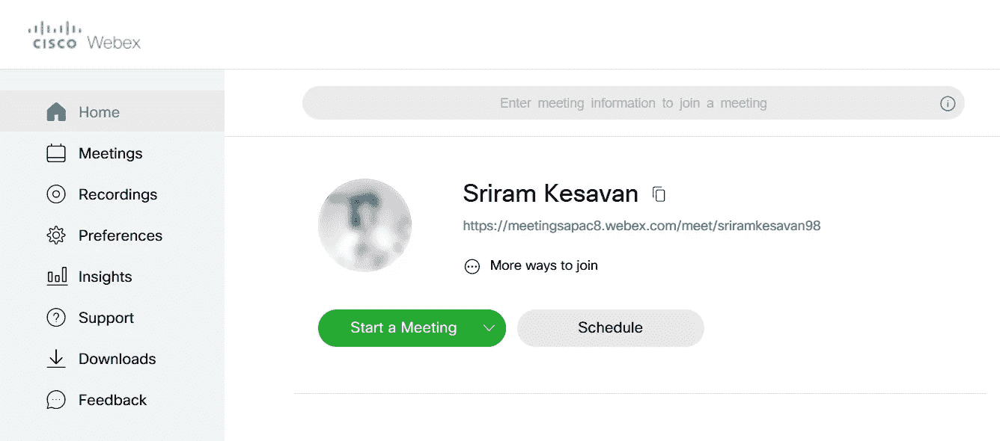
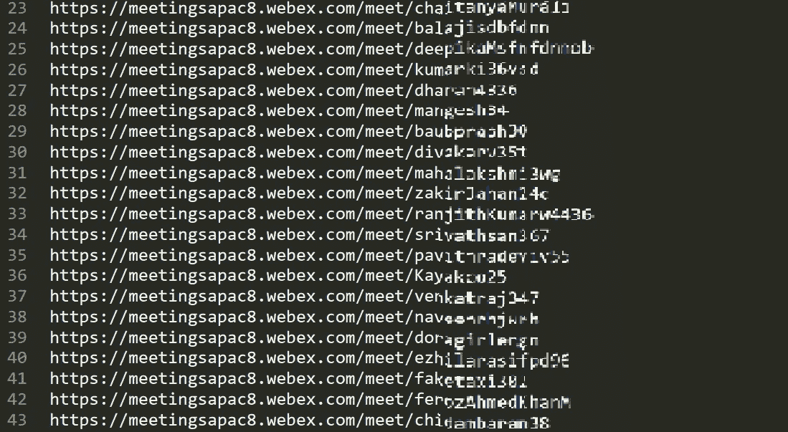
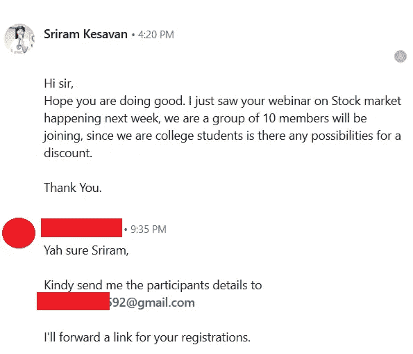

# 闯入 Cisco Webex 会议室的简单方法！！

> 原文：<https://infosecwriteups.com/a-new-simple-way-to-break-into-cisco-webex-meeting-rooms-cad86e65c78f?source=collection_archive---------0----------------------->

思科 Webex

我收到了许多大学和组织的邀请，要我做一个关于网络安全的网上研讨会。我决定接受一切，因为这种网络研讨会可能会帮助学生学习新的东西，学习如何破坏应用程序，而不是开发这些应用程序。我收到了 IEEE Jeppiaar 大学生分会的邀请，他们使用了思科 Webex 进行网上研讨会，我从未使用过。自从，我是一个[变焦](https://zoom.us/)的家伙。我在 4 月 17 日下午 4 点进行了治疗。

> 不熟悉 Cisco Webex 的人，它是 Cisco 的视频会议应用程序，类似于 Zoom 或 Microsoft teams。

4 月 16 日，我准备好了我的幻灯片，并决定在 Webex 上进行一次测试，以便在此之前做好准备。我注册了一个账户，然后走到仪表板前开始了一个测试会议。但是，我觉得我的仪表板上的会议链接有些可疑。

Cisco Webex 仪表板

*用户名:* sriramkesavan98

> [https://meetingsapac8.webex.com/meet/sriramkesavan98](https://meetingsapac8.webex.com/meet/sriramkesavan98)

我还记得我注册了一个 gmail 账户，名为“sriramkesavan98@gmail.com ”,接下来网络应用程序问我的是我的名字、姓氏和密码，其他什么都没有。但是在仪表板上，我看到的是一个用户名和一个会议链接，它们是使用我提供的邮件 ID 的前缀自动生成的。

因此，如果这个会议链接在社交媒体上被分享，甚至作为邀请发送给某人，他/她可以通过在会议链接的末尾添加后缀来轻松猜出我的邮件 ID，后缀可以是:

**|**|***@gmail.com | *@yahoo.com | *@outlook.com**|**|**

另一方面，如果某人知道我的邮件 ID，他/她可以进入会议，如果会议没有密码保护或者主持人没有在每个人加入后上锁。但是大多数人都不这么做。

我知道，这不是 RCE 或 XSS，但它仍然是一种信息泄漏，暴露邮件 ID 的主机如此容易。我将此事报告给了思科安全团队，我知道回复会是重复的。但得到的回应是，

> “一般来说，你的担心是有道理的，但是，这就是应用程序的工作方式，我们希望用户进入正确的房间，所以我们决定提供一个静态链接，我们现在没有任何改变它们的计划，但我仍然会将它转发给产品团队进行研究”。

这是我无法消化的，我决定不放弃。

我试图增强它，所以我决定去侦察一下，用 python 编写了一个程序来收集各种社交媒体平台上发布的所有思科 webex 会议链接，因为它们不允许被搜索引擎索引。令我惊讶的是，我能够收集到 200 多个链接，而且大多数链接来自 LinkedIn 和 twitter。

使用 python 脚本提取的 Webex 会议链接。

现在我需要等到这些链接所有者发起一个会议。我需要检查每一个链接，而且在会议开始时，我应该同时在线，这是不可能的！！

因此，我决定搜索任何可能在 Cisco Webex 和 Ifound one 上发生的即将到来的网络研讨会，其中一个关于股票市场的网络研讨会有一个小册子，提到用户必须安装 Cisco Webex 才能访问，它甚至不是免费的网络研讨会。但我决定闯进会议，而不是付钱。

我在 LinkedIn 上联系了导师，展示了我的[社会工程](https://www.imperva.com/learn/application-security/social-engineering-attack/)技能。我说我们有 10 个成员，所以我们想有一个折扣，他决定给我们一个折扣，突然他发送了他的电子邮件 id 来分享所有参与者的详细信息。

哦，他多可爱啊！！😂我决定等待制作好链接的网上研讨会。是时候加入网上研讨会了，但链接不起作用。我意识到我错过了一些东西。因此，我创建了一个新帐户，与旧帐户相比，会议链接几乎没有什么不同。

> https://meetingsapac7.webex.com/meet/{Username}
> 
> https://meetingsapac8.webex.com/meet/sriramkesavan98

我意识到这些是子域，它们是不一样的。所以我开始用 1- 99 来代替数字值，感谢上帝，我可以用值 9 来参加会议，这意味着讲师使用的链接是

> [https://meeting APAC 9 . webex . com/meet/{ instructor username/mailID 的前缀}](https://meetingsapac9.webex.com/meet/{Instructor_Username})

拍手！拍手！

我和 82 名参与者一起参加了关于股票市场的整个会议，甚至在聊天框上解决了我的疑问！！后来我发现，如果会议已经在 Cisco Webex dashboard 中安排好了，感谢上帝他没有安排会议，这种方法就行不通了。

# 吸取教训！

我知道思科是一个非常大的组织，我相信他们会在这方面进一步努力，以确保❤的产品安全。因此，如果您计划在思科 Webex 上召开会议/网络研讨会，最好在 Webex dashboard 上安排一次会议，以防止像我这样的入侵者进入房间，或者在每个参与者直播后立即锁定房间。

> **免责声明:我认为这只是出于教育目的，“我提到这一点是为了让我自己在将来出现问题时感到安全”** *😂* **。**

如果你喜欢这个，写下来鼓掌👏(50X)，那我们来连线:

**推特:**https://www.twitter.com/sriramoffcl

**insta gram:**[https://www.instagram.com/sriram_offcl](https://www.instagram.com/sriram_offcl/)

**领英:**[https://www.linkedin.com/in/sriramkesavan](https://www.linkedin.com/in/sriramkesavan/)

[**邮箱:**](https://medium.com/@sriram_offcl/paypal.me/sri123)sriramkesavan98@gmail.com |**捐款:**[https://paypal.me/sri123](https://www.paypal.me/sri123)

**和平** ✌️ **！！！**