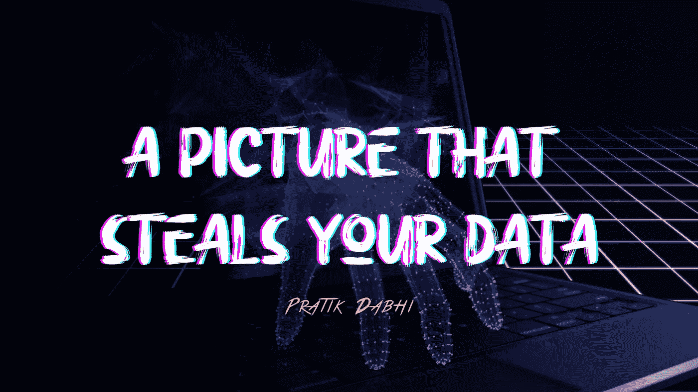
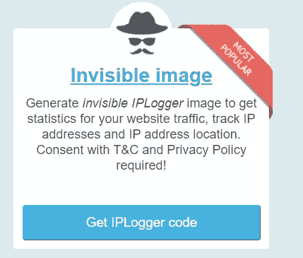
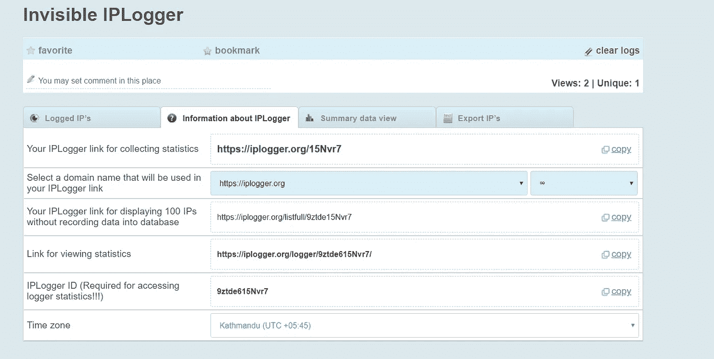
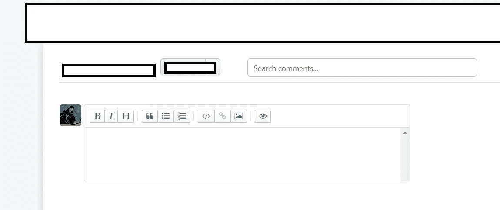
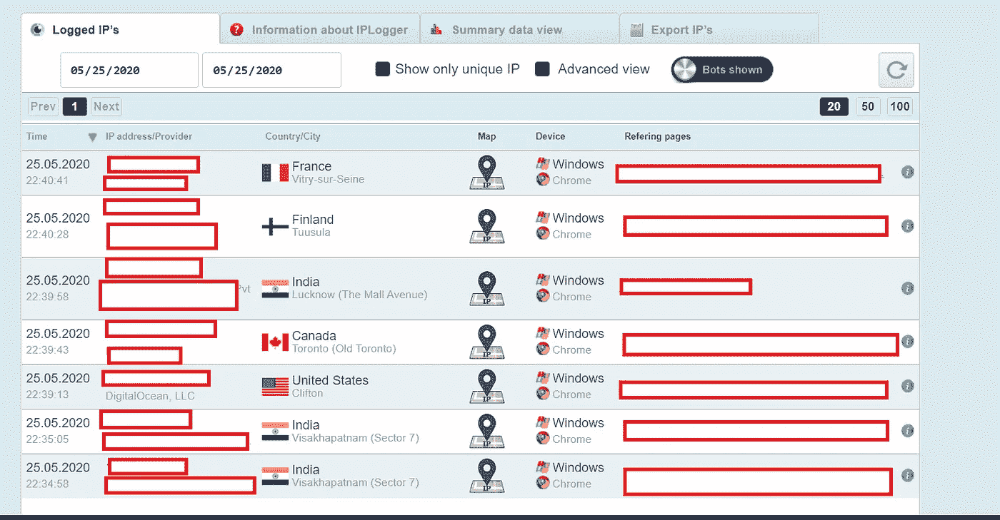
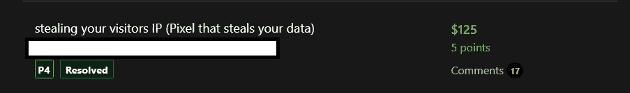
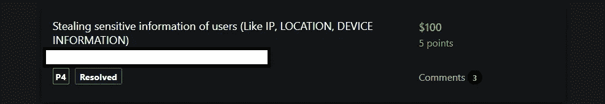

# 一张窃取您数据的图片——一个知识产权盗窃的故事。

> 原文：<https://infosecwriteups.com/a-picture-that-steals-your-data-a-tale-to-ip-theft-a9a2058d1392?source=collection_archive---------0----------------------->

嘿，朋友们，在这个博客中，我将分享我是如何发现一个借助图片窃取你的数据的漏洞的。让我们开始吧。

**概要:**

这个漏洞允许攻击者获取用户的 IP 地址，他们居住的国家，地区，他们使用的 ISP。

在您可以选择使用标签或 URL 上传照片的地方，例如论坛、讨论页面，都会发现此漏洞。或者你可以简单地使用。

# 复制的步骤

1.  访问[https://iplogger.org](https://iplogger.org)并在那里登录，然后在不可见图像部分点击获取 _ip_logger_code

2.复制链接并转到你目标网站。

3)去评论区。添加主题，并在正文部分输入

并发表评论。

4)刷新页面并检查您的 IP 日志，您将获得您的 IP 和当前位置。无论何时任何人访问这个页面，你都会在你的 Iplogger 中得到他们的 IP。

# 影响

如您所见，攻击者能够获取用户的敏感信息。攻击者还可以跟踪谁访问了您的网站的记录，并形成您的用户所属的位置。

# 减轻

用户在公开发表评论时需要管理员的批准。或者仅由公司 IP 请求的图像加载，而不使用用户 IP。

# 有了这个漏洞，我就能赚很多钱，我会给你看一些我的报告。

感谢大家的阅读:)

快乐黑客；)

喜欢我的作品就支持我吧！请给我买一杯咖啡，在推特上关注我。

 [## impratikdabhi

### 嘿👋我刚刚在这里创建了一个页面。你现在可以给我买杯咖啡了！

www.buymeacoffee.com](https://www.buymeacoffee.com/impratikdabhi) 

网址:-[https://www.pratikdabhi.com/](https://www.pratikdabhi.com/)

insta gram:-[https://www.instagram.com/i.m.pratikdabhi](https://www.instagram.com/i.m.pratikdabhi/?hl=en)

推特:-[https://twitter.com/impratikdabhi](https://twitter.com/impratikdabhi?lang=en)

YouTube:-[https://www.youtube.com/impratikdabhi](https://www.youtube.com/impratikdabhi)