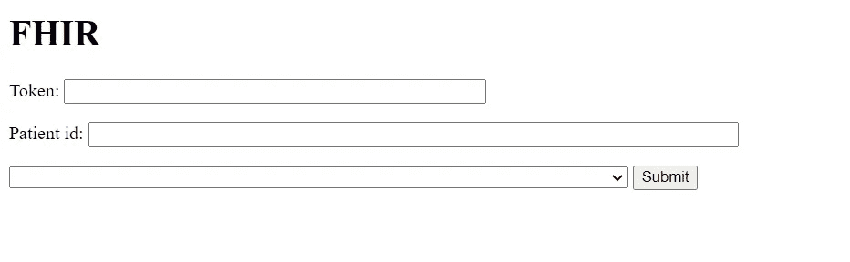
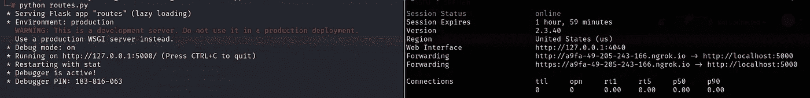
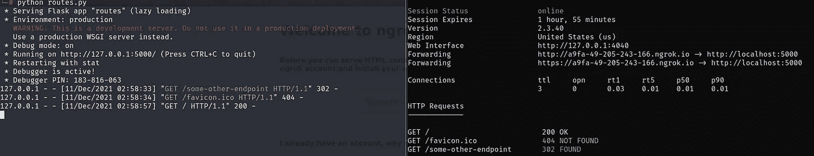

# 一个关于不太直接的 SSRF 的故事

> 原文：<https://infosecwriteups.com/a-story-about-a-not-so-direct-ssrf-b2b98e128af0?source=collection_archive---------2----------------------->

## 大家好，希望你们一切都好，保持安全。这个博客是关于我最近在 SSRF 的发现。

## 介绍和侦察

我在测试一个有合适范围的目标。在做了一些基本的 google dorking 来查找关于目标的域/子域后，我最终找到了一个子域，这是一个与一些智能认证相关的“演示测试”站点。

对你们感兴趣的人来说，这是我用过的呆子。

> 站点:target . com-inurl:" https://target . com "

马上，我们有了一个包含三个字段的基本页面，其中一个是 URL。我们有一个下拉菜单来选择一个 URL，通过它进行身份验证(记住 smart-auth)。

在提供了虚拟数据并拦截了请求之后，我们看到应用程序正在尝试借助所提供的“token”值进行身份验证。由于令牌无效(虚拟值)，终端服务器返回 401 错误。

有趣的是，应用程序正在向端点服务器请求“/某个其他端点”。

## 剥削

注意到 URL 参数并提供 burp collaborator 位置，我们得到 DNS 和 HTTP 请求，并且 burp collab 服务器的响应也反映在 HTTP 响应中。

即使在这里，也是同样的情况，应用程序向 burp collab 服务器请求“/某个其他端点”。

经查明，该知识产权属于谷歌，托管在 GCP。通过提供[云元数据端点](https://github.com/cujanovic/SSRF-Testing/blob/master/cloud-metadata.txt),我们要么得到 403 禁止错误，要么得到 404 未找到(记住服务器将“/某个其他端点”附加到所有请求上)。

为了利用这个缺陷，我们需要运行一个服务器，在访问“/some-other-endpoint”时将应用程序重定向到云元数据端点或其他任意位置，如 localhost:22。

我在 https://github.com/macloo/basic-flask-app[的](https://github.com/macloo/basic-flask-app/)用了一个 flask app，对 [routes.py](https://github.com/macloo/basic-flask-app/blob/master/routes.py) 文件做了修改。下面突出显示了这一变化。

> [@app](http://twitter.com/app) 。route('/some-other-endpoint ')
> def metadata():
> return flask . redirect("[http://169 . 254 . 169 . 254/](http://169.254.169.254/)")

通过使用 ngrok HTTP 隧道，向 ngrok 服务器发出的请求将被重定向到运行在 5000 端口上的 flask 服务器。

现在，通过在 URL 字段中提供 ngrok 服务器，向 ngrok 服务器发出带有“***/some-other-endpoint”***的请求，并且由于 flask 应用重定向到云元数据，所以我们从元数据服务器获得响应。请看下面的截图，以供参考。

使用这种方法，我能够通过相应地更改 [routes.py](https://github.com/macloo/basic-flask-app/blob/master/routes.py) 文件来枚举本地文件并执行内部主机/端口扫描。

最后是一些反馈。

## 失败

在确认了 SSRF 之后，我尝试使用一个简单的 PHP 文件重定向到云元数据服务器。但是挑战或者说我无能为力的地方在于，在点击***"/some-other-endpoint "***时，必须发生重定向。

我试着部署一个 azure PHP web 应用程序，但是失败了，因为我不能让逻辑工作。我知道我必须利用路线，但部署一个应用程序是一个麻烦，因为它需要一些框架或其他依赖我认为(我可能是错的)。

一个简单的 python flask 服务器是最简单的选择，因为它不需要太多的依赖，但是部署到云或其他服务对我来说是新事物。因此，我想到了在本地运行服务器并使用 ngrok HTTP 隧道的想法，所需的需求得到了满足。

请让我知道你会如何实现重定向或您的反馈。

直到下一次…

黑客快乐！

普雷瑟姆