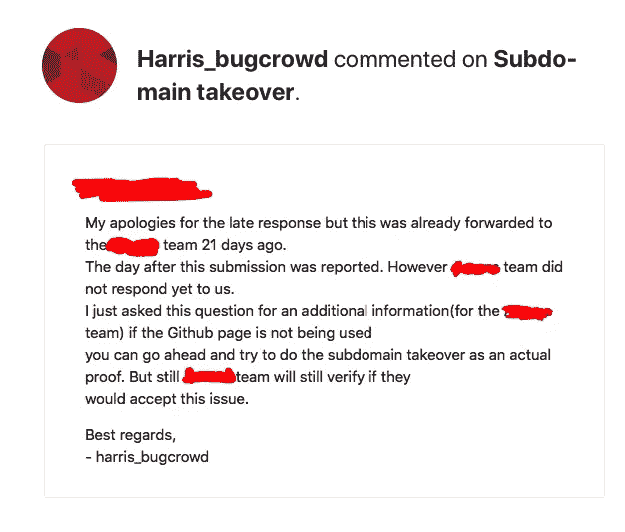
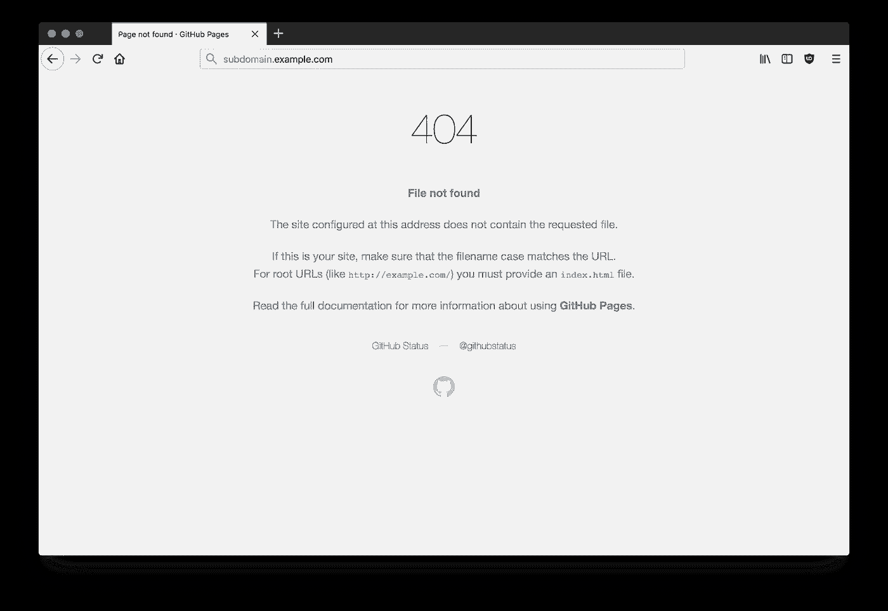
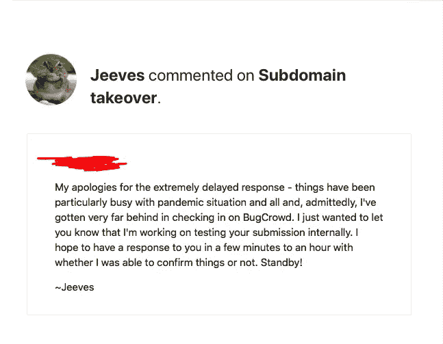
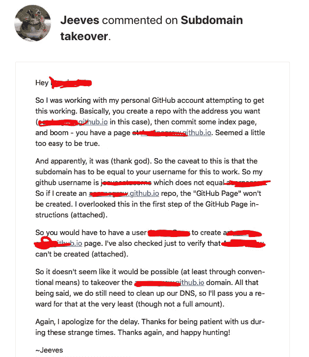
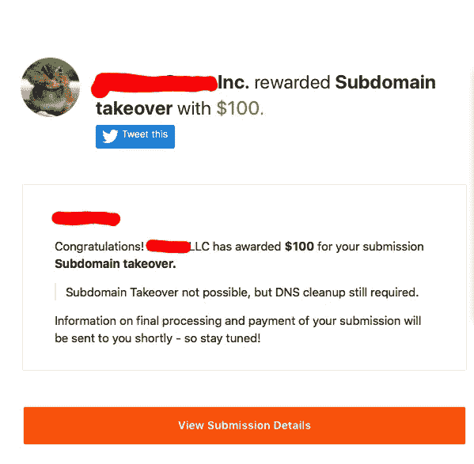

# 一个子域价值三位数美元

> 原文：<https://infosecwriteups.com/a-subdomain-take-over-worth-three-figure-92625d3dfda8?source=collection_archive---------0----------------------->

## 当良好的道德与好运和正确的元素相遇时，这种结合会带来好的结果。

Photo by [金 运](https://unsplash.com/@jinyun?utm_source=medium&utm_medium=referral) on [Unsplash](https://unsplash.com?utm_source=medium&utm_medium=referral)

> ***子域** **接管***发生在攻击者获得目标域的子域控制权时。通常，当子域在域名系统(*[*【DNS*](https://developer.mozilla.org/en-US/docs/Glossary/DNS)*)中有规范名称(**【CNAME**)但没有主机为其提供内容时，会发生这种情况。这可能是因为虚拟主机尚未发布或者虚拟主机已被删除。攻击者可以通过提供他们自己的虚拟主机，然后托管他们自己的内容来接管那个子域**

# *子域接管(STO)*

*当我开始做 Bug Bounty 的时候，子域接管是我最避免的那种漏洞。读到这里，你可能会问自己，为什么？嗯——老实说，为了让你完成这件事，你需要一些好运气。事实上，这不是你在网上读到的典型的 STO。这只是纯粹的运气，并有适当的元素，以获得支付这个漏洞。*

# *讲故事，Thesenuts.org 和结果。*

*你可以从下面链接的照片中看到，经过一个月零几天的等待，我终于得到了回应。这是一个子域接管了**thesenuts.org**(假名字)。这个网站链接到了 github.com。*

> *我现在记不起确切的细节，但我会尽力解释这份报告的真实情况。*

**

*为了让你报告一个**子域接管**，你需要这样做。接管那个子域。试了很多次，凌晨 4 点累了，没接手就报了。阅读电子邮件，你可以看到这个行动回来追捕我。在报告被转发给螺母团队后，由于一些未知的和奇怪的原因，triager 要求我继续接管这个子域。*

# *操作方法*

*为了接管子域，我需要创建一个**github.com**账户，并将 **thesenuts.io** 链接到这个账户。*

> *这是不可能的，你会在这里看到原因。*

# *为什么我报告 Thesenuts.org 1.0*

*注意到页面给了我一个类似下面的错误，我知道这可能是一个可能的帐户接管。**Thesenuts.org**的**没有使用这些 nuts.io** 。删除这些页面的 **DNS** 是大多数组织停止使用它们时做的第一件事，这是避免这种攻击的好方法。在这种情况下，他们没有这样做。*

**

# *Thesenuts.org 2.0*

*自从 triager 要求我接管这个子域名的最初回复以来，又过了 15 天，由于显而易见的原因，我忽略了它。我就是做不到他让我做的事。经过多次尝试和一些社会工程，我决定等待公司对此的裁决。终于，两个星期后，有人从 Thesenuts.org 回复了我。正如他在这里所说的，他们正忙于疫情。因此，他们推迟了为组织接受报告的时间。*

**

# *结果*

*我无法更好地描述它。正如这里看到的，来自**Thesenuts.org**的家伙用非常清晰的细节解释了一切。告诉我 **Thesenuts.github.io** 有什么问题，以及为什么我不能认领。*

**

# *奖励*

*这是整个故事中最精彩的部分。这个人很慷慨地为此买单。*

**

*正如这里看到的，该帐户不容易被子域接管，但仍然需要 **DNS** 清理。*

# *时间线:*

*2020 年 3 月 29 日凌晨 4 点 30 分—报告了问题。*

*2020 年 3 月 30 日—报告由 triager 打开并发送至**Thesenuts.org***

*2020 年 4 月 20 日——triage 告诉我他在 21 天前将它转发给了 Thesenuts.org 的团队进行检查*

*2020 年 5 月 6 日—**Thesenuts.org**团队成员回复我。我拿到工资的同一天，问题就解决了。*

*这值得等待吗？是的。*

# *结论*

*如您所见，这是一个我比较幸运的情况，而不是一个漏洞本身。虽然我忽略了 triager 的请求，但我很幸运他没有马上关闭报告。相反，我决定等待公司。即使在那里，我也很幸运地找到了处理这份报告的合适人选，并为我的努力付了钱。*

*永远不要让怀疑控制你。当我收到第一封来自 triager 的电子邮件，告诉我利用这个漏洞时，我知道如果没有这个步骤，我将很难从这个报告中获得奖励。但这并没有打击我的精神，我非常积极。相反，我等待着我最后的资源——公司的决定。*

*我没有回复这封电子邮件，而是给了 Thesenuts.org 回复我并给我他们自己的结果的时间。为什么？因为在大多数情况下，公司的行为会与面试官告诉你的大相径庭。如果你足够幸运，能让三人组把你的报告发给公司，你获得奖励的几率至少会上升到 90%。*

*永不放弃！*