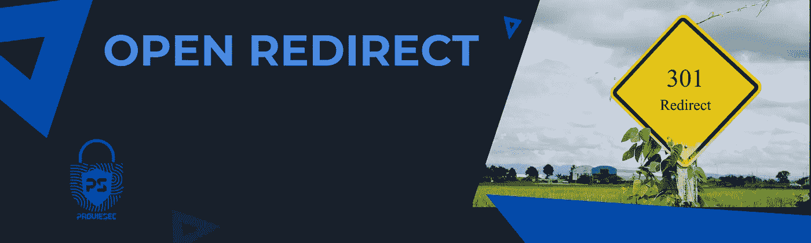

# 一份公开重定向的奖品——谷歌呆子——Bug 赏金

> 原文：<https://infosecwriteups.com/a-swag-for-a-open-redirect-google-dork-bug-bounty-2143b943f34e?source=collection_archive---------0----------------------->



大家好👋，我发现了一个很好的开放重定向与我的参数扫描仪。我会在这里告诉你我是如何找到它的，我得到了什么样的赃物。我目前也在修改我的扫描器 PSFuzz，这样它也可以扫描 OpenRedirects，并会随着时间的推移对它进行改进。[https://github.com/Proviesec/PSFuzz](https://github.com/Proviesec/PSFuzz)

**这是我的故事:**

我被邀请参加一个新的私人 BugBounty 项目，我想，好吧，我先找容易的东西。由于我使用 Burp，我记录了所有重定向和链接的历史，这使得搜索 bug 变得更加容易。在调查了一些简单的安全漏洞后，我实际上想尝试找到一些 XSS 的东西。我也喜欢使用谷歌呆子，例如我用

```
site:*redacted.com inurl:target 
```

有了一个结果，所以我想看看它是否适合开放式重定向。

# 复制步骤:

1.  谷歌搜索结果的后面是该网站的登录页面。我总是喜欢测试这些。而且这次我注意到参数 target 包含了一个完整的 URL，非常诱惑人去测试。
    网址是这样的:https://my.redacted.com/forgetUsername?target = https:% 2F % 2 fwww . redated . com
    因此，你可能已经看到链接不再跳转到“我的”子域，而是跳转到“www”子域。
2.  所以我测试了一下，替换了网址:https://my.redacted.com/forgetUsername?target = https:% 2F % 2fwww . hacker one . com
3.  现在你只需点击提交或取消，你将被重定向。


当你注入这个有效载荷:`target=https:%2F%2Fwww.hackerone.com`->[www.hackerone.com](http://www.hackerone.com)
时，你可以看到它重定向到那个网站，所以我很快找到了一个很好的打开重定向。


## 什么是开放重定向？

当 web 应用程序或服务器使用未经身份验证的用户提交的链接将用户重定向到特定网站或页面时，这称为开放重定向。

## 影响

当应用程序不安全地将用户可控制的数据注入重定向目标时，就会出现开放重定向漏洞。攻击者可以在应用程序中构建一个 URL，导致重定向到任何外部域。这种行为可被用来方便针对应用程序用户的网络钓鱼攻击。使用真正的应用程序 URL、定位正确的域和有效的 SSL 证书(如果使用 SSL)的能力增加了网络钓鱼攻击的可信度，因为许多用户即使验证了这些特征，也不会注意到随后重定向到不同的域。

## 时间线:

*提交*:2021 年 5 月 18 日

*受理*:2021 年 5 月 18 日

*分判*:2021 年 5 月 19 日

*已解决*:2021 年 5 月 20 日

*关闭+奖品奖励*:2021 年 6 月 3 日


# 赃物

我已经不再相信赃物，但 6 个月后，我收到了一个包裹，是我寄这份报告的公司寄来的。因为这是一个私人项目，而且公司的标志到处都是，我将向你描述一下这些东西。我收到了一件衣服、一枚赏金硬币和一件徒步旅行用具。总共价值 60 美元。盒子包装得很漂亮，我对此非常满意。

# 工具/报告

如何找到 openredirect？

Google Dorks for open redirect:
[https://github . com/provie sec/Google-Dorks/blob/main/Google-Dorks-open-redirect . txt](https://github.com/Proviesec/google-dorks/blob/main/google-dorks-open-redirect.txt)

## Openredirect 有效负载:

[](https://github.com/Proviesec/openredirect-payloads) [## GitHub-provie sec/open redirect-payloads

### 通过在 GitHub 上创建一个帐户，为 prove sec/open redirect-payloads 的开发做出贡献。

github.com](https://github.com/Proviesec/openredirect-payloads) 

其他工具:
【https://github.com/payloadbox/open-redirect-payload-list】T4

[https://portswigger . net/support/using-burp-to-test-for-open-redirections](https://portswigger.net/support/using-burp-to-test-for-open-redirections)

# 报告

[](https://hackerone.com/reports/469803) [## HackerOne 上披露的 upserve:Open redirect 位于...

### 以下 URL 容易受到开放重定向的攻击(它将重定向到 stanko.sh)…

hackerone.com](https://hackerone.com/reports/469803) [](https://hackerone.com/reports/55525) [## HackerOne 上披露的 shopify:OAuth 中的开放重定向

### 你好，当我们指定一个“无效”范围时，授权 url 将重定向到“redirect_uri”中提到的站点。所以…

hackerone.com](https://hackerone.com/reports/55525) [](https://hackerone.com/reports/26962) [## HackerOne 上披露的互联网漏洞赏金:rfc6749 中的打开重定向

### 严格遵循 rfc6749 的 OAuth 提供者(服务器)容易受到开放重定向的攻击。让我解释一下，阅读[0]如果…

hackerone.com](https://hackerone.com/reports/26962) 

# 摘要

也在网站上寻找 OpenRedirects。这种漏洞也能让你赚到一大笔钱，但却经常被忽视，还会给公司带来一些后果。

开放的重定向并不总是等于安全漏洞，有时他们是故意的，所以很难获得奖金。随意看一下这个视频吧:[https://www.youtube.com/watch?v=tE47rd2sf3M](https://www.youtube.com/watch?v=tE47rd2sf3M)

请随时问我，并建议我下次应该考虑的任何变化。不管怎样，谢谢你的阅读。👋