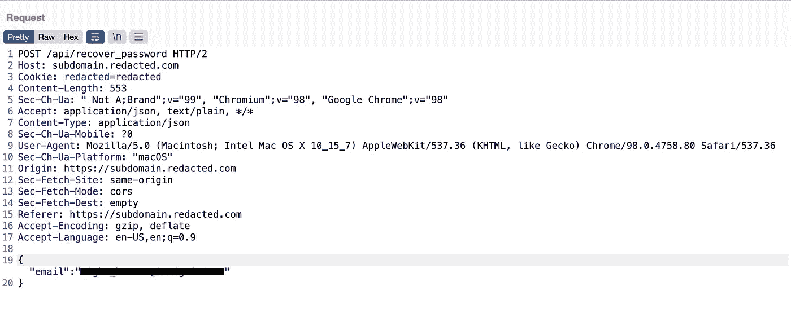
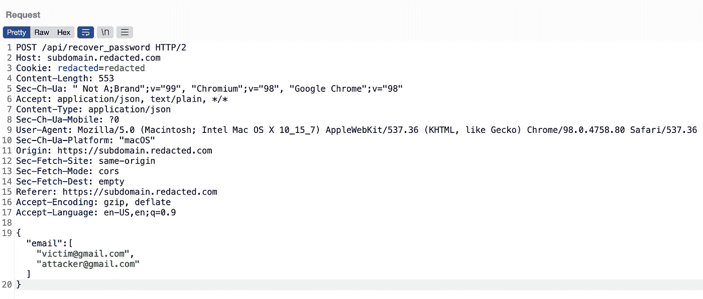
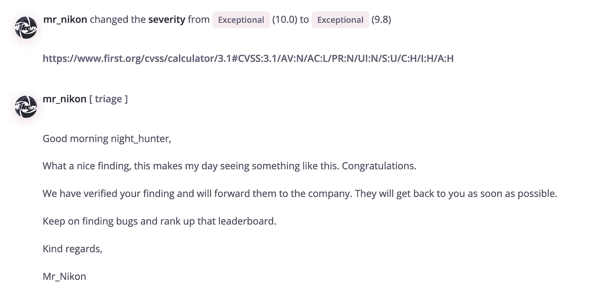
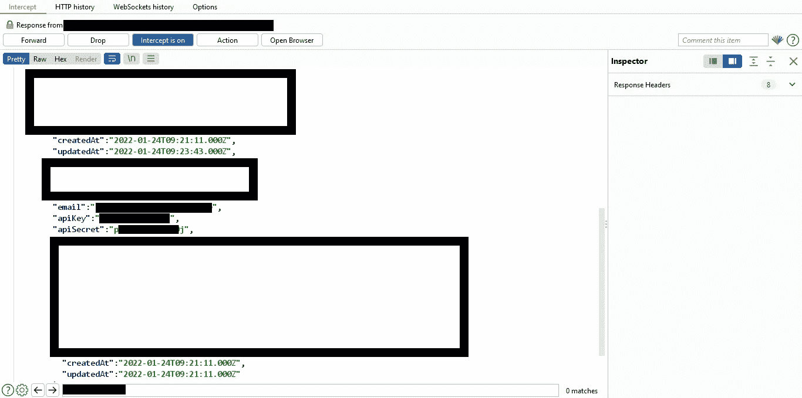

# 一个 0-Click 账户接管和 2FA 旁路的故事。

> 原文：<https://infosecwriteups.com/a-tale-of-0-click-account-takeover-and-2fa-bypass-b369cd70e42f?source=collection_archive---------0----------------------->

***哎，好久没发表 bug 赏金特写了。我当时在实习期。所以，我有很多空闲时间。不管怎样，这篇文章是关于 0 点击账户接管和 2FA 旁路的。让我们开始吧。为了 NDA 我们假设*******是目标。****

***帐户接管:**
-我开始测试做一些基本的事情，比如改变主机头，看看我是否可以暴力破解令牌，但似乎没有什么工作……(我不久前写了一篇文章，介绍了我测试密码重置功能的方法:[https://medium . com/@ fatnassifaris 45/how-I-was-able-to-take-over-any-Account-via-the-password-reset-functional-ef 1659 F8 b481](https://medium.com/@fatnassifiras45/how-i-was-able-to-take-over-any-account-via-the-password-reset-functionality-ef1659f8b481))。
-获取密码重置链接的请求如下所示:*

**

*密码重置请求。*

*   *正如你所看到的， ***电子邮件*** 在一个名为 ***电子邮件*** 的参数中使用 JSON 格式被发送到服务器，所以，我想如果我把那个参数的类型从**字符串**改为**数组**会怎么样。所以就会是这样:**《电子邮件》:【】**[**my1stEmail1@gmail.com**](mailto:my1stEmail1@gmail.com)**，**[**my2ndEmail@gmail.com**](mailto:my2ndEmail@gmail.com)**。将请求主体更改为有效负载，发送请求，检查我的电子邮件，幸运的是，我收到了两个帐户的密码重置链接。***

******

***将电子邮件从字符串改为数组。***

******攻击场景:******

*   ***攻击者请求密码重置链接，拦截该请求，并将电子邮件参数值更改为["[victim@gmail.com](mailto:victim@gmail.com)"，"[attacker@gmail.com](mailto:attacker@gmail.com)"]***
*   ***密码重置链接将被发送到受害者和攻击者的电子邮件帐户，因此攻击者可以使用它并更改受害者的密码。***

***我做了一个概念验证，报告了这个问题，看到来自 triager 的这样一条消息让我高兴不已:***

******

*****2FA 旁路:**
——现在，转到 2FA 机构。在这里，我使用 google authenticator 应用程序在我的帐户上启用了 2FA。是的，谷歌认证应用程序，所以代码将是 **6 位数** *(一百万种可能性)*这将需要相当长的时间来蛮力。此外，不要忘记速率限制，谷歌认证每 60 秒左右改变代码。我放弃了暴力，因为这在逻辑上是不可能的。并进入**登录**页面，放入我的**凭证**并拦截登录请求，以正确理解**2FA**机制并测试几项内容，包括:***

*   ***响应操作(例如，将参数值从假更改为真→“成功”:“真”。***
*   ***强制浏览(身份验证后直接进入新选项卡中的仪表板页面。)***
*   ***代码泄漏响应。***
*   ***搜索像“2FA_Enabled”这样的参数，所以如果我将它们更改为 false，服务器会直接将我重定向到仪表板。***

***以上都不起作用。因此，我简单地截取了对登录请求的响应，令人惊讶的是有一些密钥泄露了，包括 API 密钥。***

******

***API 密钥/机密在响应中泄露。***

***并且已经阅读了目标的 API 文档，我知道如何使用这些键。因此，在这里，如果攻击者拥有受害者凭据，那么 ***2FA 机制*** 将毫无用处，因为攻击者可以获得受害者的 ***API 密钥*** ，这将使他能够使用各种 *API 端点执行许多操作。****

***有时候，你只需要仔细看看服务器返回给你的是什么:)。其他 bug 猎人对该程序进行了大量测试，但他们忽略了上述问题。所以，永远不要退出已经测试过的程序，因为每个人都有自己的 ***方法论*** 和 ***思维方式*** ！***

*****绕过 2FA** 的额外提示:如果目标允许 ***API 认证*** 通过 ***电子邮件******密码*** 或 ***基本*** 认证(base64Encode(用户名:密码))，尝试设置 2FA，看看是否仍能使用 ***API*** 进行认证如果是这样的话，那么你已经 ***绕过了***2FA，因为大多数***API***将允许你在 web 应用程序上执行相同的操作。***

***为开发团队的专业精神欢呼吧，他们在不到两个小时的时间内高效地解决了上述问题，还有奖金:-)！***

***这是我的推特:[https://twitter.com/Fatnass1F1ras](https://twitter.com/Fatnass1F1ras)，如果你有任何问题，请联系我。***

***黑客快乐！***

# ***🔈 🔈Infosec Writeups 正在组织其首次虚拟会议和网络活动。如果你对信息安全感兴趣，这是最酷的地方，有 16 个令人难以置信的演讲者和 10 多个小时充满力量的讨论会议。[查看更多详情并在此注册。](https://iwcon.live/)***

*** [## IWCon2022 - Infosec 书面报告虚拟会议

### 与世界上最优秀的信息安全专家建立联系。了解网络安全专家如何取得成功。将新技能添加到您的…

iwcon.live](https://iwcon.live/)***