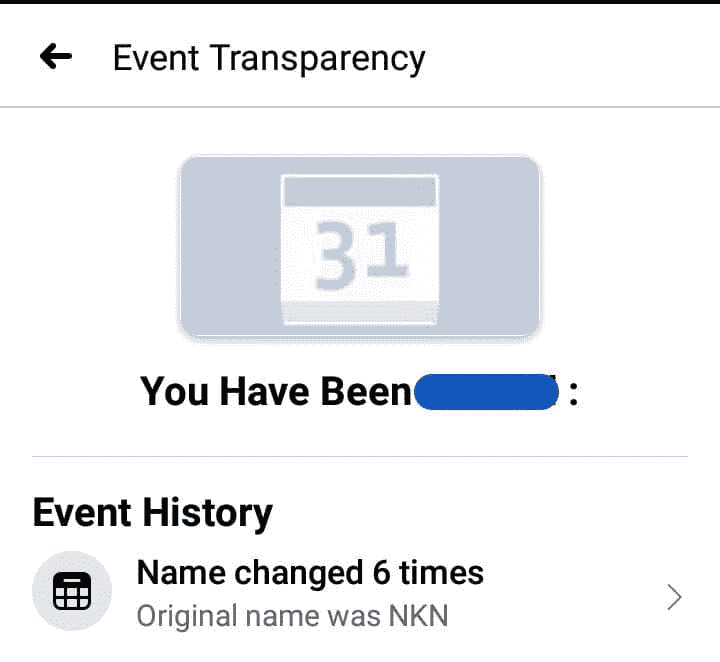
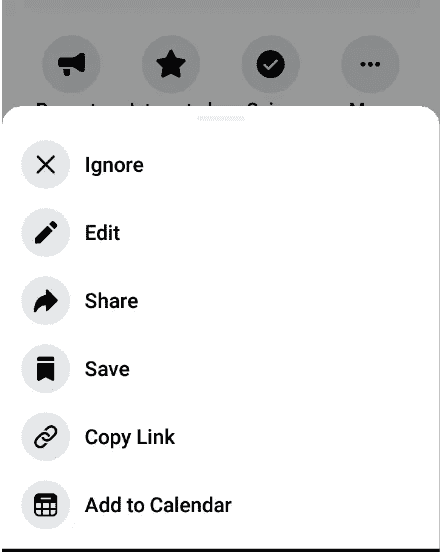
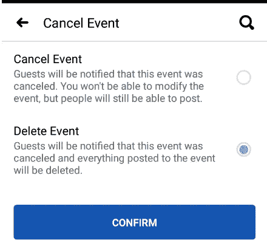
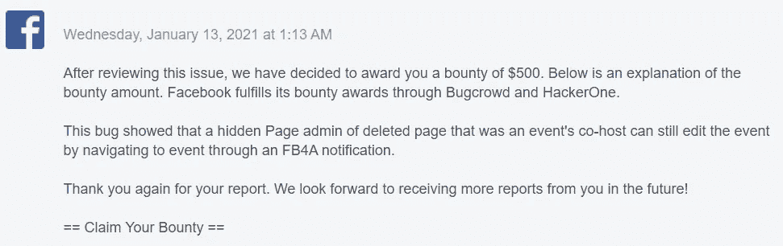

# 来自脸书的第二笔$xxx 赏金的故事

> 原文：<https://infosecwriteups.com/a-tale-of-2nd-xxx-bounty-ability-to-gain-persistence-on-facebook-events-as-an-unremovable-9408338ccf8f?source=collection_archive---------1----------------------->

## 作为不可移除的联合主办方，能够在脸书活动中获得持久性。

T*his****write up****描述了关于* ***脸书*** *的一个 bug/安全问题，其中脸书页面的一个****Admin****在他的页面上创建了一个事件，但是管理员(事件的主持人)无法删除一个恶意用户，该用户有权对该事件执行所有共同主持人操作编辑/删除。然而，这个问题已经解决，并根据负责任的披露政策予以公布。*

大家好，

我是来自尼泊尔的 Kunjan Nayak，我是昆虫赏金领域的新手。今天我将描述我的第 14 份，即第 2 份有效报告，这是一个逻辑错误，作为初学者，我们必须尝试寻找逻辑错误。我只是在对 FB 事件进行一些基本的测试，并意外地发现了一个不寻常的行为，当我注意到我不在共同主持人名单中，但我仍然拥有所有共同主持人的权限。这份报告得到了 FB 的积极回应，并导致了奖金的决定。

# **场景**

当脸书页面的管理员在页面上创建一个事件时，他将成为该事件的主要主持人。主持人可以为该事件添加多个共同主持人(即页面和简档)。当主机添加一个页面作为合作主机(页面在接受邀请后自动成为该事件的管理员)时。

但问题是，一个恶意的共同主机页面可以创建一个场景，其中他能够成为不可删除的共同主机，并永久获得该事件的持久性，因为脸书没有在共同主机页面被删除时从事件中删除共同主机页面的管理员，并且仍然在 FB4A 和移动版本的脸书上假设被删除页面的管理员为内部共同主机。

# **影响**

此错误允许已删除的共同主持人页面的管理员在没有共同主持人角色的情况下编辑事件，并阻止所有者/管理员删除它们。

## ***为什么会被认为是安全问题？***

*创建事件的管理员有权修改/删除和移除任何用户，包括联合主机，如果联合主机变得不可移除，他可以执行恶意活动，而不会被管理员移除，因为联合主机通过利用该漏洞变得隐藏，这导致了安全问题。*

利用漏洞攻击者改变了事件名称

**设置**

第一页的用户管理员(受害者)

第二页的用户二管理员(攻击者使用 FB4A 应用程序执行攻击)

## **再现步骤**

1.  userOne (admin)在他的 pageOne 上创建了一个事件，并将 pageTwo 添加为该事件的共同主持人。
2.  以用户二的身份登录，收到联合主持人角色的邀请，显示为“第一页被邀请参加第二页的事件一”打开通知。
3.  userTwo 将保存 eventOne，然后接受邀请。现在，为了成为隐藏的共同主持人，用户 2 删除了他的整个页面 2，成为永久不可删除的。

(*这是一个测试页面，所以我们可以很容易地删除该页面，但在实践中，攻击者联合主机不会删除他的整个页面，因为这使得攻击非常有限，攻击者有联合主机的角色，他可以简单地创建一个假页面，并将该假页面作为联合主机添加到隐藏页面中，这样更实用。*)

4.由于 pageTwo 不再是联合主持人，而是用户 2，因此在从 FB4A 导航 eventOne(在步骤 3 中保存)时，他仍然可以看到事件“编辑”按钮，并且他可以删除包括 eventOne 在内的任何讨论帖子。

恶意管理员拥有编辑/删除权限。

*实际上，从事件中删除已删除的联合主机页面是不可能的，FB4A 仍然认为已删除页面的管理员是内部联合主机，因此用户二是不朽的，仍然可以调节事件一。*

# **时间线**

2020 年 9 月 2 日:发送报告

2020 年 9 月 15 日:进一步解释后预判。

2020 年 10 月 2 日:分庭

2020 年 10 月 15 日:通过给出无效原因，作为信息性关闭。

2020 年 10 月 15 日:反对该决定，称这不是关闭报告的有效理由。

2020 年 11 月 13 日:再次显示进一步的影响。

2020 年 1 月 8 日:由脸书确定。

2021 年 1 月 13 日:悬赏。

这个问题需要大约 4 个月的时间来完成整个过程，在这个过程中交换了近 35 封电子邮件。即使在报告被多次关闭后，我仍然设法使其成为有效问题，并且 FB 获得了 **$xxx** 奖金:)。但是，再现该问题需要共同主持人角色，因此，该问题的影响有限。

赏金奖励通知

## 这是我的第一篇 Bug Bounty 文章，很抱歉出现了语法错误。感谢您花时间阅读关于 FB 上一个基本漏洞的文章。

一会儿见；)在下一篇文章中，我在脸书的第一个有效的 bug 和我在脸书的第一个有效的 bug |在同一份报告中产生了$xxx+$xxx+$xxxx" 三笔奖金。

你可以在****与 [t **witter**](https://twitter.com/kunjannayak5) 联系我，分享相关东西的更新。****