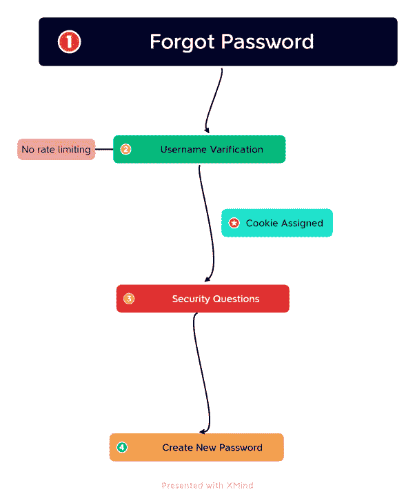
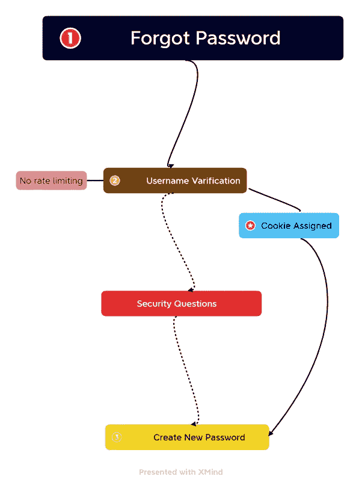

# 账户接管的故事

> 原文：<https://infosecwriteups.com/a-tale-of-account-takeover-fcae914f067b?source=collection_archive---------2----------------------->

图 1 密码重置问题

重置或忘记密码是最重要的功能之一，当谈到应用程序的安全性。如果攻击者可以通过任何手段绕过密码重置/更改功能。在这种情况下，可能会执行特权操作、列举敏感信息，甚至完全接管帐户，从而导致混乱，对技术、业务和声誉造成影响。

经常观察到，大多数现代应用程序允许用户以两种不同的方式重置/更改他们的帐户密码，要么在登录后(密码更改)，要么在登录前(忘记密码)。这两种实现是不同的。在第一种情况下，您已经有了经过身份验证的用户，但是在第二种情况下，您不知道谁将访问该功能，因此您必须应用一些检查来确认用户的身份。

在忘记密码功能中，任何人都可以访问该页面并请求更改密码，因此必须执行的检查很少，但是由于逻辑原因，许多开发人员仍然无法写出完美的代码。因此，攻击者绕过逻辑并利用功能。在这篇博客中，我们将讨论一个相关的场景，在这个场景中，我利用了一个逻辑流，因为缺少适当的检查，导致帐户接管了整个数据库帐户。即**多步功能旁路导致账户接管**。

顾名思义，我们已经绕过了忘记密码功能中的多步骤功能来危害帐户。在这里，我们将两个漏洞串联起来，以产生对下一个级别的影响。让我们将这种攻击分解成几个小部分，并了解如何成功利用漏洞。

这里我结合了**无速率限制**和**破坏访问控制**漏洞来执行这次攻击。在最初的约定中，我们发现应用程序没有针对速率限制实施任何保护，并且这在整个应用程序中都存在。我发现了 3-4 个我能够执行无速率限制攻击的场景，其中之一是忘记密码。

图 2 预期功能流程

这是忘记密码功能的第一步，没有速率限制。在这里，我们输入我们的用户名，然后系统检查它，如果它是有效的，它移动到另一个步骤。为了利用这一步，我在 burp suite 中捕获了请求，从 **SECLIST** 中触发了一个公共用户名列表，并根据收到的响应过滤输出。

使用这个，我从大约 500 个用户名的单词列表中找到了大约 10 个有效的用户名。

现在让我们来了解一下忘记密码功能的流程，在测试忘记密码功能的过程中，我发现应用程序首先检查用户名，然后检查机密问题，最后输入新密码。经过两三次尝试后，我发现应用程序在第一步中检查用户名并分配 cookie，在第二步中，它只是使用第一步中分配的 cookie 检查有效的机密问题答案，在输入正确的信息后，它重定向到第三步，而没有分配 cookie，这里第三步使用的是第一步中分配的相同 cookie。

不用花太多时间，我就知道我可以绕过第二步，这是验证的主要步骤。在比较了第二步和第三步的请求后，我知道只有 **U** RI 和**referer header**在变化，这意味着他们实现的唯一验证是 referer header，我通过检查确认了我的声明。

图 3 攻击流程

在声称成功之后，我合并了所有三个步骤，并检查它是否正常工作，是的，它工作了。我向 Bugcrowd 报告了该漏洞，两天后它在 p1 中被筛选为有效提交，这是一个积分计划，因此我被 Bugcrowd 奖励了 40 分和名人堂。这是我最喜欢的发现之一，我使用速率限制来接管应用程序数据库中的帐户。

**结论:**

不要急于报告小的漏洞，总是检查你是否可以将它们与任何其他漏洞合并，利用这些漏洞，你可以很容易地将你的漏洞的严重性从甚至低升级到严重。

## 来自 Infosec 的报道:Infosec 每天都有很多内容，很难跟上。[加入我们的每周简讯](https://weekly.infosecwriteups.com/)以 5 篇文章、4 个线程、3 个视频、2 个 GitHub Repos 和工具以及 1 个工作提醒的形式免费获取所有最新的 Infosec 趋势！