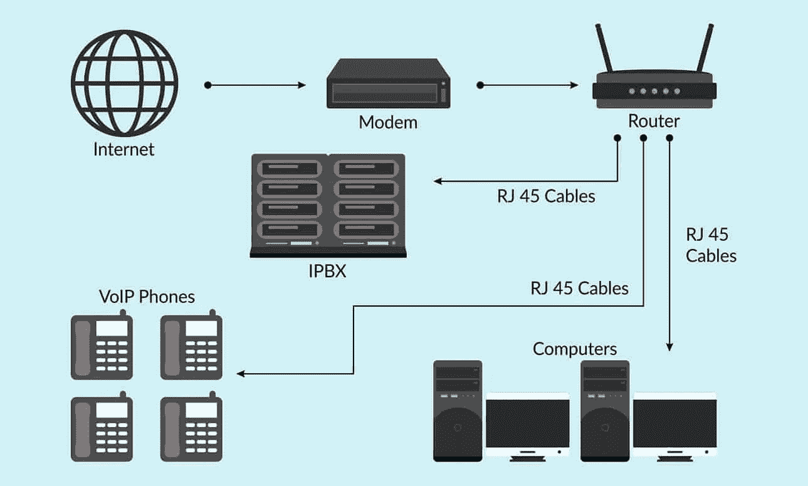
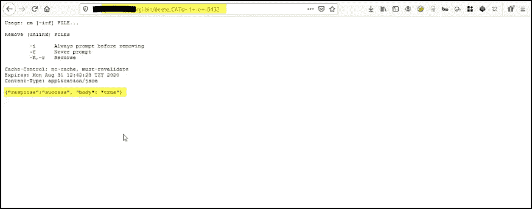
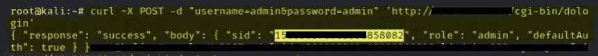
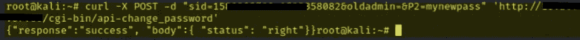
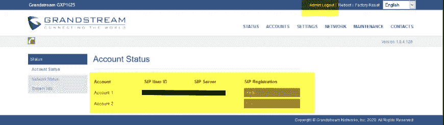
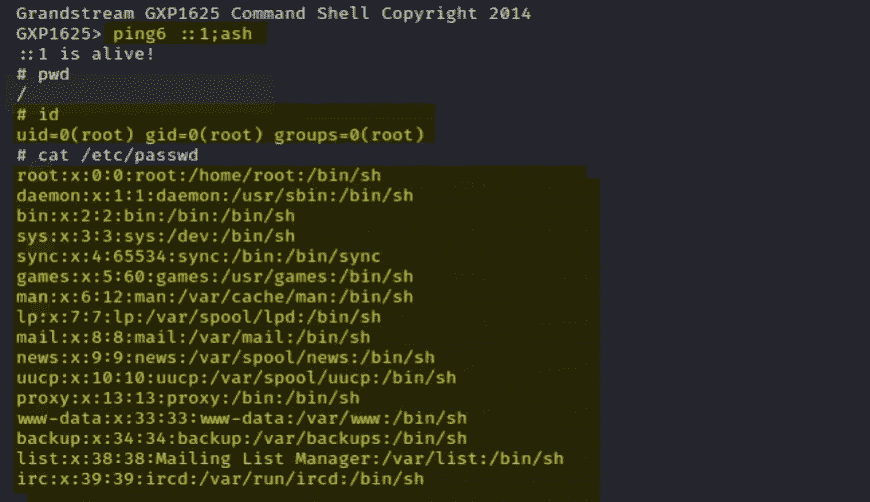
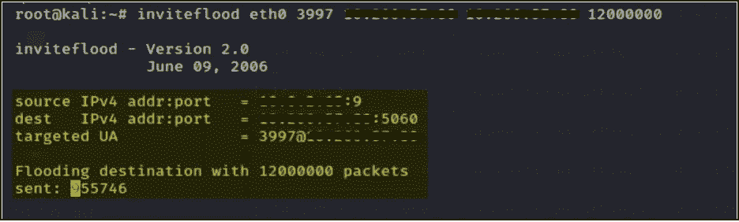
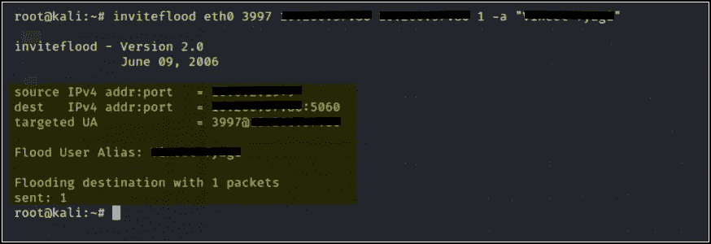
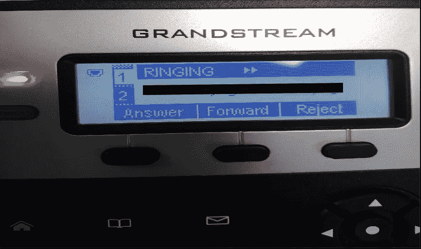

# VoIP 安全测试的故事

> 原文：<https://infosecwriteups.com/a-tale-of-voip-security-testing-39937fe8c6fd?source=collection_archive---------2----------------------->

大多数企业并不关注他们的内部安全。他们认为他们是安全的，因为他们的内部资产可以从内部访问。但是红队成员非常清楚攻击者如何利用内部基础设施。

在过去的几年中，基于互联网协议的语音(VoIP)得到了快速的实现。大多数已经实施 VoIP 的组织要么没有意识到，要么忽略了 VoIP 及其实施的安全问题。像其他网络一样，VoIP 网络也容易被滥用。

你可以在这里 & SIP [这里](https://en.wikipedia.org/wiki/Session_Initiation_Protocol)阅读更多关于 VoIP 的内容。

**针对 VoIP 的可能攻击:**

1.  拒绝服务(DoS)攻击
2.  注册操纵和劫持
3.  认证攻击
4.  来电显示欺骗
5.  中间人攻击
6.  VLAN 跳跃
7.  被动和主动窃听
8.  通过互联网电话发送垃圾邮件(SPIT)
9.  VoIP 网络钓鱼(伪装)

一家公司给了我 IP 电话的 IP 范围。比如说 192.168.71.1/24

首先，我检查了哪些客户端处于运行状态(75 台主机处于运行状态)，并对它们启动了 NMAP。

我用 [Viproy 框架](https://github.com/fozavci/viproy-voipkit)，[sip vice](https://github.com/enablesecurity/sipvicious)开始枚举。我找到了客户端的 IP&SIP 服务器的 IP。

我收集了用于开发的信息，如固件版本、运行的服务等。

我发现了一些漏洞，所以现在我要谈谈它们。

1.  **管理员密码重置**

此漏洞是由于 Grandstream GXP 1625 版本(即版本 1.0.4.128)造成的。它有一个安全问题，帮助攻击者重置管理员的密码。之后，攻击者就可以访问仪表板。

CVE 参考文献:CVE-2018–17564

影响:

*   攻击者可以更改配置。
*   攻击者可以将自己伪装成另一个用户。假设，攻击者将其电话分机更改为 CTO 的电话分机，反之亦然。
*   攻击者可以代表其他用户进行呼叫。

2.**权限提升**

**权限提升**是指利用操作系统或软件应用程序中的错误、设计缺陷或配置疏忽来获得对资源的提升访问权限的行为，这些资源通常受到应用程序或用户的保护。

CVE 参考文献:CVE-2018–17565

影响:

*   攻击者可以根用户身份运行恶意/任意命令。
*   攻击者可以更改配置。

3.**拒绝服务**

DoS 攻击会造成损害，例如阻止拨出和拨入电话。执行拒绝服务攻击时，一定要咨询您的客户，因为它们本质上是破坏性的。

4.**来电显示欺骗**

欺骗是将来自未知来源的通信伪装成来自已知可信来源的行为。欺骗可以应用于电子邮件、电话和网站，也可以更具技术性，例如计算机欺骗 IP 地址、地址解析协议(ARP)或域名系统(DNS)服务器。

**注意:**由于未加密的通信允许我们操纵邀请请求中的参数来冒充我们喜欢的任何人，因此语音邮件欺骗是可能的。

其他攻击包括拦截语音呼叫&注册操纵和劫持。

注意:您可以在 ARP 欺骗后使用 wireshark 拦截语音呼叫。

**结论**

存在许多与 VoIP 相关的安全威胁。使用枚举，可以获得关于 VoIP 网络、用户 id/分机、电话类型等重要信息。通过使用特定工具，有可能攻击身份验证、劫持 VoIP 呼叫、窃听和呼叫操纵、VoIP 垃圾邮件、VoIP 网络钓鱼和 IP-PBX 服务器受损。

**资源**

 [## 圣灵降临节/圣灵降临节

### VoIPShark 是一个开源的 VoIP 分析平台，允许人们分析实时或存储的 VoIP 流量…

github.com](https://github.com/pentesteracademy/voipshark)  [## 大河流-伊里迪姆索

### 在第一篇文章中，我解释了我在 Grandstream GXP1625 上发现的三个(简单的)畸形输入漏洞…

iridiumxor.wordpress.com](https://iridiumxor.wordpress.com/tag/grandstream/)  [## 福扎维奇/维普罗伊-沃普基特

### Viproy Voip 笔测试套件为 Voip 网络提供渗透测试模块。它支持信令分析…

github.com](https://github.com/fozavci/viproy-voipkit)  [## Viproy -渗透测试实验室

### 在对 PBX(专用小交换机)进行 VoIP 安全评估时，执行测试非常重要…

pentestlab.blog](https://pentestlab.blog/tag/viproy/) 

[https://media . black hat . com/us-13/阿森纳/us-13-Ozavci-VIP ray-VoIP-Pen-Test-Kit-slides . pdf](https://media.blackhat.com/us-13/Arsenal/us-13-Ozavci-Vipray-VoIP-Pen-Test-Kit-Slides.pdf)

 [## 渗透测试人员的 VoIP 清单

### 每次 VoIP 评估都应遵循一系列具体的检查，以便为客户提供必要的安全性…

pentestlab.blog](https://pentestlab.blog/2016/09/18/voip-checklist-for-penetration-testers/)  [## VoIP 渗透测试

### 在世界各地的任何环境中，沟通都是关键。以前全世界都用电话网络作为…

www.essentialinfosec.com](https://www.essentialinfosec.com/services/voip-penetration-testing/)  [## 实用 VoIP 渗透测试

### 在本帖中，我们将探索在 IP 语音(VoIP)环境中执行渗透测试的世界。我们…

medium.com](https://medium.com/vartai-security/practical-voip-penetration-testing-a1791602e1b4) 

[https://sourceforge.net/projects/vgiphopper/files/](https://sourceforge.net/projects/vgiphopper/files/)

 [## 道德黑客- ARP 中毒

### 地址解析协议(ARP)是一种无状态协议，用于将 IP 地址解析为机器 MAC 地址。所有…

www.tutorialspoint.com](https://www.tutorialspoint.com/ethical_hacking/ethical_hacking_arp_poisoning.htm)  [## 以下是 VoIP 如何让网络钓鱼变得前所未有的简单

### 网络钓鱼是一种针对数据隐私的攻击，受害者在咬了…

www.lifewire.com](https://www.lifewire.com/voip-phishing-3426534)  [## 梅利特 SIP 先生

### SIP 先生是一个简单的基于控制台的基于 SIP 的审计和攻击工具。最初它被开发用于学术…

github.com](https://github.com/meliht/Mr.SIP)  [## scarvell/grandstream_exploits

### 通过在 GitHub 上创建帐户，为 scarvell/grandstream_exploits 开发做出贡献。

github.com](https://github.com/scarvell/grandstream_exploits)  [## 一部好的 VoIP 电话的三个简单条件

### 在第一篇文章中，我解释了我在 Grandstream GXP1625 上发现的三个(简单的)畸形输入漏洞…

iridiumxor.wordpress.com](https://iridiumxor.wordpress.com/2019/01/03/three-simple-cves-for-a-good-voip-phone/)  [## rundekugel/callsip.py

### 拨打 sip 电话。在 GitHub 上创建一个帐户，为 rundekugel/callsip.py 开发做贡献。

github.com](https://github.com/rundekugel/callsip.py)  [## onmyway133/awesome-voip

### 在使用 Windows Phone 和 iOS 之前，我的生活涉及研究 VoIP。那就是为语音建立一个 C 库…

github.com](https://github.com/onmyway133/awesome-voip) 

[https://github.com/alyssaong1/VolPBot](https://github.com/alyssaong1/VolPBot)

 [## 福扎维奇/维普罗伊-沃普基特

### Viproy Voip 笔测试套件为 Voip 网络提供渗透测试模块。它支持信令分析…

github.com](https://github.com/fozavci/viproy-voipkit)  [## Pepe lux/sipts

### Sippts 是一套使用 SIP 协议审计 VoIP 服务器和设备的工具。Sippts 是用 Perl 脚本编程的，并且…

github.com](https://github.com/Pepelux/sippts)  [## enable security/sip vious

### SIPVicious OSS 工具集由以下工具组成:这是一个 sip 扫描器。根据 ip 范围启动时…

github.com](https://github.com/enablesecurity/sipvicious)  [## 对您的 VoIP(IP 语音)和 IP 电话系统进行渗透测试

### 网络电话和统一通信经常被安全专业人员忽视。网络罪犯和其他…

www.enablesecurity.com](https://www.enablesecurity.com/security-assessment/voip-pentest/) 

霍普，你喜欢它。

如果你喜欢，那就鼓掌分享吧。你可以在[推特](https://www.twitter.com/sengarharshit1)上找到我。