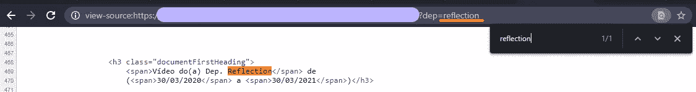
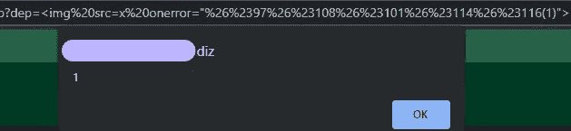

# 怪异的 XSS

> 原文：<https://infosecwriteups.com/a-weird-xss-77c13d135c9f?source=collection_archive---------1----------------------->

嗨，朋友们，你们好吗？今天我来写我的第一篇文章，告诉你我是如何以一种稍微不同的方式停止在 XSS 的探索的，所以我们开始吧。

简单介绍一下，我的“黑客名字”gato (gato 在巴西葡萄牙语中是猫，因为我想证明好奇心只会增强猫的力量)，我 19 岁，我热爱技术，最近开始从事信息安全领域的工作。

所以加油吧！

由于错误没有被修复，出于道德原因，我将该网站命名为 redacted.xxx.br！

# 第 1 部分:搜索

这一切都是从一个简单的愿望开始的，那就是在某个网站上找到一个漏洞，赚点外快，这种情况在巴西并不容易…所以我在网上冲浪，直到它落到了一个. xxx.br 网站上，我知道政府网站有非常糟糕的安全历史，我想我应该检查一下应用程序，看看是否有所发现。我开始在最简单的输入中注入恶意软件，但一切似乎都被很好地净化了，所以我决定增加一点。

# 第 2 部分:工具

我开始用 [Sublist3r](https://github.com/aboul3la/Sublist3r) 工具枚举子域，但是没什么奇怪的，于是我去用 [ParamSpider](https://github.com/devanshbatham/ParamSpider) 工具分析找到的主机的参数。这个列表很大，特别是当我挑选了两个有 200 回报的喜欢和那些有 404 的(总是很好地看到一些东西反映在糟糕的 404 页面上)。

由于我还没有尝试自动化这个过程，所以我打开了列表中的所有链接，看看它是否有反射(你可以使用 [Httpx](https://github.com/projectdiscovery/httpx) 工具，使用参数-match-string 和-match-regex，你可以搜索你的反射)，直到我找到下面的页面:

正如您所看到的，虽然参数都是小写的，但是它被反映为第一个字母是大写的，其余的是小写的，这是对专有名称的简单处理！

我试图注入一个有效负载来查看它是否会被执行，但是行为被应用在我的警报(1)中，并且方法没有被执行。

# 第三部分:注射

当我失去耐心时，我做了每个小孩都会做的事情，我开始 Ctrl + C 和 Ctrl + V 我在互联网上找到的所有有效载荷。成功了吗？当然不是哈哈哈哈哈。

我决定给我的头一些时间，我去喝点水，呼吸一下。正是在那里，我想起了我小时候学习下棋时，老师会设置挑战，棋子以特定的方式放在棋盘上，在一定数量的移动中，我必须将死(赢得比赛)。所以我回到电脑前，带着挑战国际象棋的心态，我开始用同样的方式看待 XSS。我做的每一个动作，应用程序都可以以某种方式保护自己，如果我的动作没有积极的效果，我就撤销它，重新开始。

我开始研究一些执行 HTML 注入的方法，因为一开始它是有效的。在我到达 [HTML Charset](https://www.w3schools.com/html/html_charset.asp) 表之前，使用字符的数值，前面加上“&和“#”，可以在屏幕上显示字符。

& #字符编码在 URL 中(分别为%26 和%23)，因此它们不会被视为 URL 构造符号

当我点击回车，看到我的字符没有被改为大写，我爆发出一个巨大的微笑。

做完测试，我最终得到了如下的有效载荷:*。*在该警报中，它以 HTML 编码发送。

我给你的建议是:

*   工具是伟大的，但是是你使用它们的方式让它们变得伟大！
*   耐心点，如果我需要离开电脑一会儿，扔点东西，然后头脑清醒的回来！
*   保持好奇！

就是这样！我希望你喜欢！

[给我买杯咖啡！](https://www.buymeacoffee.com/gatothehacker)(请思考！美元价值是巴西雷亚尔的五倍)