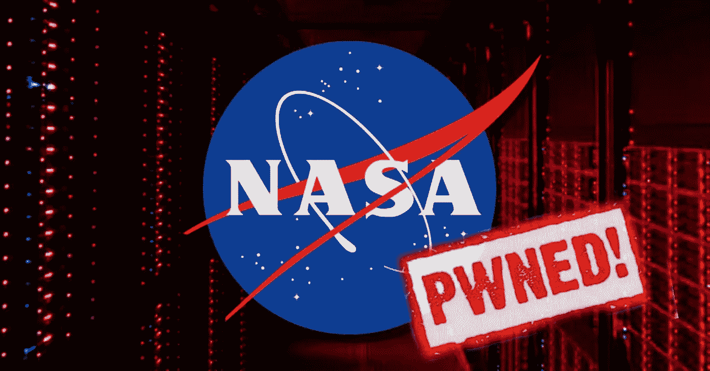
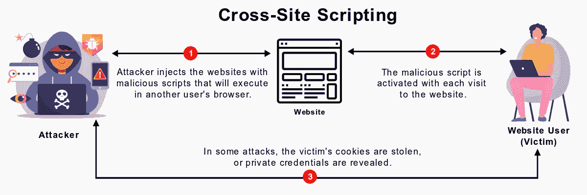
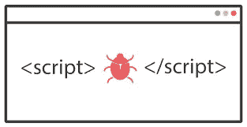
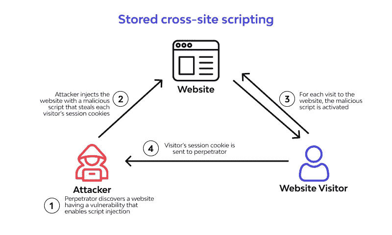
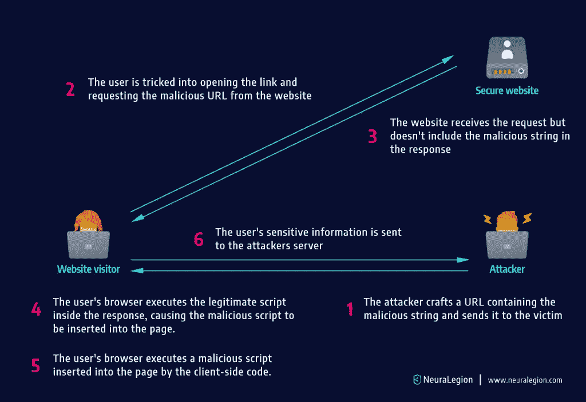
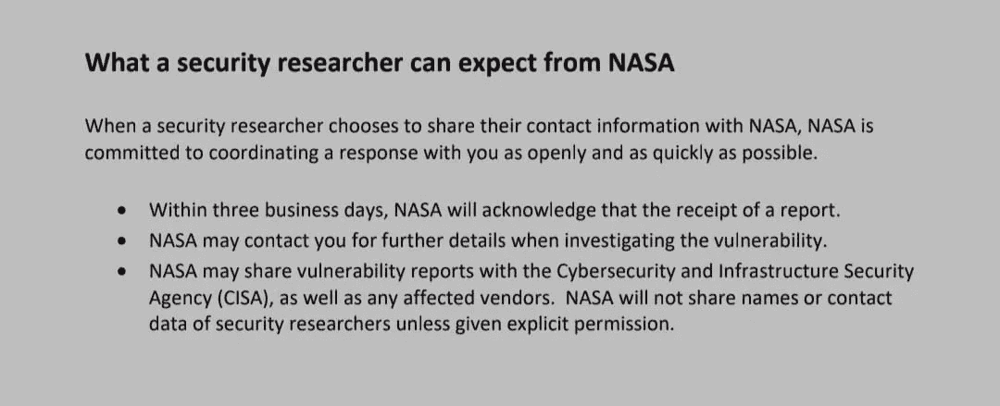

# 关于美国宇航局发现的另一个安全漏洞

> 原文：<https://infosecwriteups.com/about-the-discovery-of-another-security-vulnerability-in-nasa-427ea194f537?source=collection_archive---------2----------------------->

- 7h3h4ckv157



这篇文章大概是我在 NASA 的“第 n 次披露”。如果你们中有人不知道美国国家航空航天局，我会解释⬇

**国家航空航天局** ( **NASA** )是美国联邦政府的独立机构，负责民用太空计划、航空学研究和太空研究。NASA 的科学致力于通过地球观测系统更好地了解地球；通过科学任务理事会的太阳物理学研究计划的努力推进太阳物理学，用先进的机器人航天器如*新视野、*探索整个太阳系的天体，并通过大型天文台和相关计划研究天体物理学主题，如大爆炸([Credit:*Wikipedia*](https://en.wikipedia.org/wiki/NASA)*)。*

# **对于业余爱好者** ⬇

*   什么是 XSS？



XSS:跨站点脚本

跨站点脚本(XSS)是一个安全漏洞，通常存在于接受客户端输入的网站和 web 应用程序中。插图包括:搜索引擎登录表格，信息表，评论部分等。

**3 种 XSS 定义如下:**

*   1.反映了 XSS
*   2.存储的 XSS
*   3.基于 DOM 的 XSS

## 1.反映了 XSS



当应用程序从 HTTP GET 请求中获取信息，并以一种危险的方式将该信息合并到即时响应中时，反射跨站点脚本(R-XSS)就出现了。当有害脚本从 web 应用程序反射到受害者的浏览器时，就会发生反射 XSS 攻击。

**影响**

如果攻击者可以控制在受害者浏览器中执行的脚本，那么他们就可以像客户端一样在应用程序中执行任何活动:查看只有客户端才能看到的信息(影响保密性)，更改客户端可以调整的任何数据(影响完整性)等。

## 2.存储的 XSS



(SXSS 的随机图片:谷歌搜索)

这是最危险的 XSS 漏洞，攻击者提供输入，并由应用程序存储。存储的输入以危险的方式嵌入到随后的响应中，并在页面中呈现。然后，攻击者提供的脚本将在受害者的浏览器中，在他们与应用程序的会话上下文中执行。对于利用，所有受害者都应该访问存储恶意脚本的页面。

**影响**

*   账户接管(ATO)
*   攻击者可以窃取数据，包括批量窃取会话 cookies(多个用户访问页面)，可以运行 JS 代码
*   以受害者的名义或针对网络钓鱼攻击执行请求
*   等等

## 1.基于 DOM 的 XSS

第 0 类 XSS 攻击，攻击有效负载的执行是调整受害者浏览器中 DOM 环境的结果。当网站包含接受攻击者可控制的值并将其传递给危险函数的 JavaScript 时。所以客户端代码以惊人的方式运行。



(基于 XSS DOM 的随机图片:谷歌搜索)

> #!业余的部分结束了

# 美国宇航局的 XSS

NASA 认识到外部漏洞可能会被任何人在任何时候发现，并发布了一项政策，以便为安全研究人员提供明确的指导方针，使他们能够放心地善意报告他们发现的漏洞。美国宇航局认为，在缺乏现成的缓解措施的情况下公开披露将增加美国宇航局任务的风险。因此，美国宇航局要求研究人员在 90 天内不要与他人分享漏洞报告。



根据他们的政策

他们的政策可以在这里找到:[美国宇航局 VDP](https://www.nasa.gov/sites/default/files/atoms/files/nasa_vdp_external_policy_final.pdf)

我原以为 NASA 的安全级别会很高，但我错了，他们的系统/产品和其他系统一样容易受到攻击。他们的 VDP 没有任何领导委员会，他们不提供任何奖励，安全研究人员的唯一动机是参与调查过程的可能性。做报告的人，尤其是在没有奖励的情况下，真的很奇怪。在报告了我过去的多个报告后，他们在一周内修复了所有的漏洞，甚至没有发送任何确认函。


我从来不记得我以前发现了多少漏洞。下面详细介绍了过去的一些概念验证:

1.  **我在 NASA 的第一个 XSS**

**2。第 n 次 XSS 概念验证在推特上发布**

**3。操作系统命令注入**

[](https://github.com/nasa/fprime/issues/1534) [## 发现一个可能的安全问题#1534 nasa/fprime

### 你好👋我经营一个安全社区，寻找并修复操作系统中的漏洞。一位研究人员(@7h3h4ckv157)发现…

github.com](https://github.com/nasa/fprime/issues/1534) 

**最新的概念验证**

这个 bug 不依赖于" **.nasa.gov** "但是我不会让你失望的。我在这里发布的不是理论演示，而是一个简洁的概念验证视频(也可以在我的频道查看: [7h3h4ckv157](https://www.youtube.com/channel/UCkk6qo1K8_1m16LEsYPUqWg) )

> ***直白攻略***
> 1。子域枚举(用你的方法学)
> 2。客户端代码审查(检查可疑链接)
> 3。手动检查参数通过 URL 接受用户输入(对于 PoC，我直接在搜索框中执行)

```
1\. The subdomain: [https://pds.nasa.gov](https://pds.nasa.gov)2\. suspicious link on code: <a href="[https://pds-atmospheres.nmsu.edu/](https://pds-atmospheres.nmsu.edu/)">Atmospheres&nbsp;(ATM)</a> 3\. XSS 4\. Done
```

## 最后的想法

*   我喜欢分享一个有趣的事实，我的一个朋友 Joshua P .这个月在 NASA 发现了将近 100 个 XSS。你可以在这里看到: [(XSS) — x100](https://joshuaprovoste.com/nasa-100-xss/)
*   我希望你喜欢我的文章。请随时与我联系并分享您的观点。你可以在这里找到我@

*来自 Infosec 的报道:Infosec 上每天都会出现很多难以跟上的内容。* [***加入我们的每周简讯***](https://weekly.infosecwriteups.com/) *以 5 篇文章、4 个线程、3 个视频、2 个 Github Repos 和工具以及 1 个工作提醒的形式免费获取所有最新的 Infosec 趋势！*